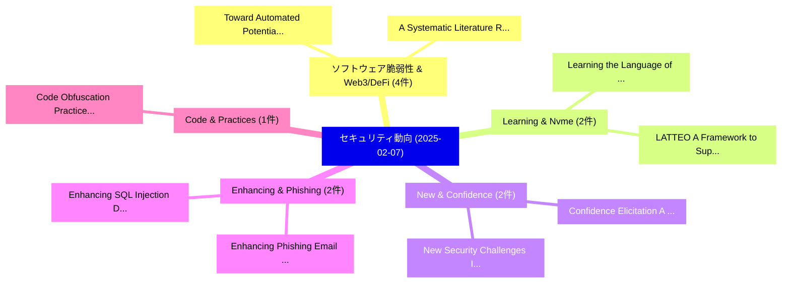

# 📅 02_daily: 日次エグゼクティブサマリー報告書 (2025-02-07)

**集計日時**: 2026-10-02 23:05:16 UTC  
**対象日付**: 2025-02-07  
**本日収集論文数**: 25 件  

---

## 💡 主要セキュリティ動向・脅威インサイト (Executive Insights)

本日の収集論文（計 25 件）において、以下の重点セキュリティ領域で活発な研究動向が確認されました：
- **ソフトウェア脆弱性 & Web3/DeFi** (4 件): 注目論文として 「Toward Automated Potential Pri...」、「A Systematic Literature Review...」 等が発表され、実務防御および攻撃検証の進展が見られます。
- **Learning & Nvme** (2 件): 注目論文として 「LATTEO: A Framework to Support...」、「Learning the Language of NVMe ...」 等が発表され、実務防御および攻撃検証の進展が見られます。
- **New & Confidence** (2 件): 注目論文として 「Confidence Elicitation: A New ...」、「New Security Challenges In-Sen...」 等が発表され、実務防御および攻撃検証の進展が見られます。
- **Enhancing & Phishing** (2 件): 注目論文として 「Enhancing Phishing Email Ident...」、「Enhancing SQL Injection Detect...」 等が発表され、実務防御および攻撃検証の進展が見られます。
- **Code & Practices** (1 件): 注目論文として 「Code Obfuscation Practices in ...」 等が発表され、実務防御および攻撃検証の進展が見られます。

### 🗺️ 技術・脅威トピックマインドマップ

---

## 📌 日次セキュリティ論文一覧 (日本語表形式)

| No | arXiv ID | 論文タイトル (日本語訳) | 重要キーワード | 構造化エグゼクティブ要約 (背景・提案・影響) | 脅威分類 | 詳細リンク |
|---|---|---|---|---|---|---|
| 1 | `2502.04601v1` | [LATTEO: A Framework to Support Learning Asynchronously Tempered with Trusted Execution and Obfuscation（セキュリティ分析論文）](../../okf/papers/2025-02-07/2502.04601.md) | `Support Learning Asynchronously Tempered`, `Trusted Execution`, `Abhinav Kumar` | 【提案】概要 (Overview & Key Finding) 本論文「LATTEO: A Framework to Support Learning Asynchronously ...。実証評価により経営層・セキュリティ管理者向け推奨アクション (E... | `cs.CR` | [arXiv](https://arxiv.org/abs/2502.04601v1) &#124; [OKF](../../okf/papers/2025-02-07/2502.04601.md) |
| 2 | `2502.04636v1` | [Code Obfuscation Practices in the Google Play Storeの実証研究](../../okf/papers/2025-02-07/2502.04636.md) | `Code Obfuscation Practices`, `Google Play Store`, `Google Play` | 【提案】概要 (Overview & Key Finding) 本論文「Code Obfuscation Practices in the Google Play Storeの実証研...。実証評価により経営層・セキュリティ管理者向け推奨アクション (E... | `cs.CR` | [arXiv](https://arxiv.org/abs/2502.04636v1) &#124; [OKF](../../okf/papers/2025-02-07/2502.04636.md) |
| 3 | `2502.04643v2` | [Confidence Elicitation: A New Attack Vector for 大規模言語モデル](../../okf/papers/2025-02-07/2502.04643.md) | `New Attack Vector`, `Confidence Elicitation`, `Large Language Models` | 【提案】概要 (Overview & Key Finding) 本論文「Confidence Elicitation: A New Attack Vector for 大規模言語モデ...。実証評価により経営層・セキュリティ管理者向け推奨アクション (E... | `cs.CR` | [arXiv](https://arxiv.org/abs/2502.04643v2) &#124; [OKF](../../okf/papers/2025-02-07/2502.04643.md) |
| 4 | `2502.04648v1` | [Toward Automated Potential Primary Asset Identification in Verilog Designs（セキュリティ分析論文）](../../okf/papers/2025-02-07/2502.04648.md) | `Toward Automated Potential Primary Asset Identification`, `Verilog Designs`, `Subroto Kumer Deb Nath` | 【提案】概要 (Overview & Key Finding) 本論文「Toward Automated Potential Primary Asset Identification...。実証評価により経営層・セキュリティ管理者向け推奨アクション (E... | `cs.CR` | [arXiv](https://arxiv.org/abs/2502.04648v1) &#124; [OKF](../../okf/papers/2025-02-07/2502.04648.md) |
| 5 | `2502.04659v1` | [$\mathsf{CRATE}$: Cross-Rollup Atomic Transaction Execution（セキュリティ分析論文）](../../okf/papers/2025-02-07/2502.04659.md) | `Rollup Atomic Transaction Execution`, `Cross-Rollup Atomic`, `Ioannis Kaklamanis` | 【提案】概要 (Overview & Key Finding) 本論文「$\mathsf{CRATE}$: Cross-Rollup Atomic Transaction Execu...。実証評価により経営層・セキュリティ管理者向け推奨アクション (E... | `cs.CR` | [arXiv](https://arxiv.org/abs/2502.04659v1) &#124; [OKF](../../okf/papers/2025-02-07/2502.04659.md) |
| 6 | `2502.04753v1` | [Assessing the Aftermath: the Effects of a Global Takedown against DDoS-for-hire Services（セキュリティ分析論文）](../../okf/papers/2025-02-07/2502.04753.md) | `Global Takedown`, `Ben Collier`, `John Kristoff` | 【提案】概要 (Overview & Key Finding) 本論文「Assessing the Aftermath: the Effects of a Global Takedo...。実証評価により経営層・セキュリティ管理者向け推奨アクション (E... | `cs.CR` | [arXiv](https://arxiv.org/abs/2502.04753v1) &#124; [OKF](../../okf/papers/2025-02-07/2502.04753.md) |
| 7 | `2502.04758v2` | [Differential Privacy of Quantum and Quantum-Inspired Classical Recommendation Algorithms（セキュリティ分析論文）](../../okf/papers/2025-02-07/2502.04758.md) | `Inspired Classical Recommendation Algorithms`, `Differential Privacy`, `Quantum-Inspired Classical` | 【提案】概要 (Overview & Key Finding) 本論文「差分プライバシー of 量子 and 量子-Inspired Classical Recommendation...。実証評価により経営層・セキュリティ管理者向け推奨アクション (E... | `cs.CR` | [arXiv](https://arxiv.org/abs/2502.04758v2) &#124; [OKF](../../okf/papers/2025-02-07/2502.04758.md) |
| 8 | `2502.04759v1` | [Enhancing Phishing Email Identification with 大規模言語モデル](../../okf/papers/2025-02-07/2502.04759.md) | `Enhancing Phishing Email Identification`, `Large Language Models`, `Catherine Lee` | 【提案】概要 (Overview & Key Finding) 本論文「Enhancing Phishing Email Identification with 大規模言語モデル」（...。実証評価により経営層・セキュリティ管理者向け推奨アクション (E... | `cs.CR` | [arXiv](https://arxiv.org/abs/2502.04759v1) &#124; [OKF](../../okf/papers/2025-02-07/2502.04759.md) |
| 9 | `2502.04786v1` | [Enhancing SQL Injection Detection and Prevention Using Generative Models（セキュリティ分析論文）](../../okf/papers/2025-02-07/2502.04786.md) | `Prevention Using Generative Models`, `Injection Detection`, `Naga Sai Dasari` | 【提案】概要 (Overview & Key Finding) 本論文「Enhancing SQL Injection Detection and Prevention Using ...。実証評価により経営層・セキュリティ管理者向け推奨アクション (E... | `cs.CR` | [arXiv](https://arxiv.org/abs/2502.04786v1) &#124; [OKF](../../okf/papers/2025-02-07/2502.04786.md) |
| 10 | `2502.04901v2` | [On the Difficulty of Constructing a Robust and Publicly-Detectable Watermark（セキュリティ分析論文）](../../okf/papers/2025-02-07/2502.04901.md) | `Detectable Watermark`, `Publicly-Detectable Watermark`, `Jaiden Fairoze` | 【提案】概要 (Overview & Key Finding) 本論文「On the Difficulty of Constructing a Robust and Publicly...。実証評価により経営層・セキュリティ管理者向け推奨アクション (E... | `cs.CR` | [arXiv](https://arxiv.org/abs/2502.04901v2) &#124; [OKF](../../okf/papers/2025-02-07/2502.04901.md) |
| 11 | `2502.04915v1` | [5G Bootstrapping: A Two-Layer IBS Authentication Protocolのセキュリティ強化](../../okf/papers/2025-02-07/2502.04915.md) | `Two-Layer IBS`, `Authentication Protocol`, `Syed Rafiul Hussain` | 【提案】概要 (Overview & Key Finding) 本論文「5G Bootstrapping: A Two-Layer IBS Authentication Protoc...。実証評価によりYavuz, Syed Rafiul Hussai... | `cs.CR` | [arXiv](https://arxiv.org/abs/2502.04915v1) &#124; [OKF](../../okf/papers/2025-02-07/2502.04915.md) |
| 12 | `2502.04951v3` | [Unsafe LLM-Based Search: Quantitative Analysis and Mitigation of Safety Risks in AI Web Search（セキュリティ分析論文）](../../okf/papers/2025-02-07/2502.04951.md) | `Based Search`, `LLM-Based Search`, `Safety Risks` | 【提案】概要 (Overview & Key Finding) 本論文「Unsafe LLM-Based Search: Quantitative Analysis and Miti...。実証評価により経営層・セキュリティ管理者向け推奨アクション (E... | `cs.CR` | [arXiv](https://arxiv.org/abs/2502.04951v3) &#124; [OKF](../../okf/papers/2025-02-07/2502.04951.md) |
| 13 | `2502.04953v1` | [A Systematic Literature Review on Automated Exploit and Security Test Generation（セキュリティ分析論文）](../../okf/papers/2025-02-07/2502.04953.md) | `Systematic Literature Review`, `Security Test Generation`, `Automated Exploit` | 【提案】概要 (Overview & Key Finding) 本論文「A Systematic Literature Review on Automated エクスプロイト and...。実証評価により経営層・セキュリティ管理者向け推奨アクション (E... | `cs.CR` | [arXiv](https://arxiv.org/abs/2502.04953v1) &#124; [OKF](../../okf/papers/2025-02-07/2502.04953.md) |
| 14 | `2502.05011v1` | [Learning the Language of NVMe Streams for Ransomware Detection（セキュリティ分析論文）](../../okf/papers/2025-02-07/2502.05011.md) | `Ransomware Detection`, `Barak Bringoltz`, `Elisha Halperin` | 【提案】概要 (Overview & Key Finding) 本論文「Learning the Language of NVMe Streams for ランサムウェア Detec...。実証評価により経営層・セキュリティ管理者向け推奨アクション (E... | `cs.CR` | [arXiv](https://arxiv.org/abs/2502.05011v1) &#124; [OKF](../../okf/papers/2025-02-07/2502.05011.md) |
| 15 | `2502.05046v1` | [New Security Challenges In-Sensor Computing Systemsに向けて](../../okf/papers/2025-02-07/2502.05046.md) | `In-Sensor Computing`, `Sensor Computing Systems`, `Sensor Computing` | 【提案】概要 (Overview & Key Finding) 本論文「New Security Challenges In-Sensor Computing Systemsに向けて...。実証評価により経営層・セキュリティ管理者向け推奨アクション (E... | `cs.CR` | [arXiv](https://arxiv.org/abs/2502.05046v1) &#124; [OKF](../../okf/papers/2025-02-07/2502.05046.md) |
| 16 | `2502.05098v3` | [TIF: Learning Temporal Invariance in Android Malware Detectors（セキュリティ分析論文）](../../okf/papers/2025-02-07/2502.05098.md) | `Learning Temporal Invariance`, `Android Malware Detectors`, `Xinran Zheng` | 【提案】概要 (Overview & Key Finding) 本論文「TIF: Learning Temporal Invariance in Android マルウェア Dete...。実証評価によりNgai, Suman Jana, Lorenz。 | `cs.CR` | [arXiv](https://arxiv.org/abs/2502.05098v3) &#124; [OKF](../../okf/papers/2025-02-07/2502.05098.md) |
| 17 | `2502.05160v1` | [A parameter study for LLL and BKZ with application to shortest vector problems（セキュリティ分析論文）](../../okf/papers/2025-02-07/2502.05160.md) | `Louis Henkel`, `Nikolay Tcholtchev`, `Raw Meta` | 【提案】概要 (Overview & Key Finding) 本論文「A parameter study for LLL and BKZ with application to s...。実証評価により経営層・セキュリティ管理者向け推奨アクション (E... | `cs.CR` | [arXiv](https://arxiv.org/abs/2502.05160v1) &#124; [OKF](../../okf/papers/2025-02-07/2502.05160.md) |
| 18 | `2502.05174v4` | [MELON: Provable Defense Against Indirect Prompt Injection Attacks in AI Agents（セキュリティ分析論文）](../../okf/papers/2025-02-07/2502.05174.md) | `William Yang Wang`, `Kaijie Zhu`, `Xianjun Yang` | 【提案】概要 (Overview & Key Finding) 本論文「MELON: Provable Defense Against Indirect プロンプトインジェクション ...。実証評価により経営層・セキュリティ管理者向け推奨アクション (E... | `cs.CR` | [arXiv](https://arxiv.org/abs/2502.05174v4) &#124; [OKF](../../okf/papers/2025-02-07/2502.05174.md) |
| 19 | `2502.05307v4` | [Training Set Reconstruction from Differentially Private Forests: How Effective is DP?（セキュリティ分析論文）](../../okf/papers/2025-02-07/2502.05307.md) | `Training Set Reconstruction`, `Differentially Private Forests`, `Julien Ferry` | 【提案】### (日本語題名: Training Set Reconstruction from Differentially Private Forests: How Effect...。実証評価により経営層・セキュリティ管理者向け推奨アクション (E... | `cs.CR` | [arXiv](https://arxiv.org/abs/2502.05307v4) &#124; [OKF](../../okf/papers/2025-02-07/2502.05307.md) |
| 20 | `2502.05325v3` | [From Counterfactuals to Trees: Competitive Model Extraction Attacksの分析](../../okf/papers/2025-02-07/2502.05325.md) | `Model Extraction Attacks`, `Competitive Model Extraction`, `Awa Khouna` | 【提案】概要 (Overview & Key Finding) 本論文「From Counterfactuals to Trees: Competitive Model Extrac...。実証評価により経営層・セキュリティ管理者向け推奨アクション (E... | `cs.CR` | [arXiv](https://arxiv.org/abs/2502.05325v3) &#124; [OKF](../../okf/papers/2025-02-07/2502.05325.md) |
| 21 | `2502.05338v1` | [TNIC: A Trusted NIC Architecture（セキュリティ分析論文）](../../okf/papers/2025-02-07/2502.05338.md) | `Dimitra Giantsidi`, `Julian Pritzi`, `Felix Gust` | 【提案】概要 (Overview & Key Finding) 本論文「TNIC: A Trusted NIC Architecture（セキュリティ分析論文）」（原題: TNIC:...。実証評価により経営層・セキュリティ管理者向け推奨アクション (E... | `cs.CR` | [arXiv](https://arxiv.org/abs/2502.05338v1) &#124; [OKF](../../okf/papers/2025-02-07/2502.05338.md) |
| 22 | `2502.05341v2` | [Neural Encrypted State Transduction for Ransomware Classification: A Novel Approach Using Cryptographic Flow Residuals（セキュリティ分析論文）](../../okf/papers/2025-02-07/2502.05341.md) | `Neural Encrypted State Transduction`, `Ransomware Classification`, `Barnaby Fortescue` | 【提案】概要 (Overview & Key Finding) 本論文「Neural Encrypted State Transduction for ランサムウェア Classif...。実証評価により経営層・セキュリティ管理者向け推奨アクション (E... | `cs.CR` | [arXiv](https://arxiv.org/abs/2502.05341v2) &#124; [OKF](../../okf/papers/2025-02-07/2502.05341.md) |
| 23 | `2502.05367v1` | [Detecting APT Malware Command and Control over HTTP(S) Using Contextual Summaries（セキュリティ分析論文）](../../okf/papers/2025-02-07/2502.05367.md) | `Using Contextual Summaries`, `Malware Command`, `Imperial College London` | 【提案】概要 (Overview & Key Finding) 本論文「Detecting APT マルウェア Command and Control over HTTP(S) Us...。実証評価により経営層・セキュリティ管理者向け推奨アクション (E... | `cs.CR` | [arXiv](https://arxiv.org/abs/2502.05367v1) &#124; [OKF](../../okf/papers/2025-02-07/2502.05367.md) |
| 24 | `2502.07807v1` | [CP-Guard+: A New Paradigm for Malicious Agent Detection and Defense in Collaborative Perception（セキュリティ分析論文）](../../okf/papers/2025-02-07/2502.07807.md) | `Malicious Agent Detection`, `New Paradigm`, `Collaborative Perception` | 【提案】概要 (Overview & Key Finding) 本論文「CP-Guard+: A New Paradigm for Malicious Agent Detection...。実証評価により経営層・セキュリティ管理者向け推奨アクション (E... | `cs.CR` | [arXiv](https://arxiv.org/abs/2502.07807v1) &#124; [OKF](../../okf/papers/2025-02-07/2502.07807.md) |
| 25 | `2503.11659v2` | [Zero Trust Architecture: A Systematic Literature Review（セキュリティ分析論文）](../../okf/papers/2025-02-07/2503.11659.md) | `Zero Trust Architecture`, `Systematic Literature Review`, `Muhammad Liman Gambo` | 【提案】概要 (Overview & Key Finding) 本論文「ゼロトラスト Architecture: A Systematic Literature Review（セキュ...。実証評価により経営層・セキュリティ管理者向け推奨アクション (E... | `cs.CR` | [arXiv](https://arxiv.org/abs/2503.11659v2) &#124; [OKF](../../okf/papers/2025-02-07/2503.11659.md) |

