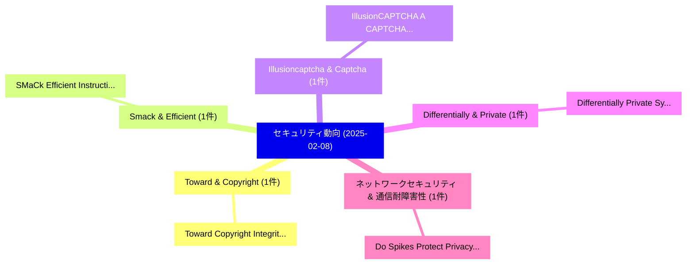

# 📅 02_daily: 日次エグゼクティブサマリー報告書 (2025-02-08)

**集計日時**: 2026-10-02 23:05:16 UTC  
**対象日付**: 2025-02-08  
**本日収集論文数**: 11 件  

---

## 💡 主要セキュリティ動向・脅威インサイト (Executive Insights)

本日の収集論文（計 11 件）において、以下の重点セキュリティ領域で活発な研究動向が確認されました：
- **Toward & Copyright** (1 件): 注目論文として 「Toward Copyright Integrity and...」 等が発表され、実務防御および攻撃検証の進展が見られます。
- **Smack & Efficient** (1 件): 注目論文として 「SMaCk: Efficient Instruction C...」 等が発表され、実務防御および攻撃検証の進展が見られます。
- **Illusioncaptcha & Captcha** (1 件): 注目論文として 「IllusionCAPTCHA: A CAPTCHA bas...」 等が発表され、実務防御および攻撃検証の進展が見られます。
- **Differentially & Private** (1 件): 注目論文として 「Differentially Private Synthet...」 等が発表され、実務防御および攻撃検証の進展が見られます。
- **ネットワークセキュリティ & 通信耐障害性** (1 件): 注目論文として 「Do Spikes Protect Privacy? Inv...」 等が発表され、実務防御および攻撃検証の進展が見られます。

### 🗺️ 技術・脅威トピックマインドマップ

---

## 📌 日次セキュリティ論文一覧 (日本語表形式)

| No | arXiv ID | 論文タイトル (日本語訳) | 重要キーワード | 構造化エグゼクティブ要約 (背景・提案・影響) | 脅威分類 | 詳細リンク |
|---|---|---|---|---|---|---|
| 1 | `2502.05425v1` | [Toward Copyright Integrity and Verifiability via Multi-Bit Watermarking for Intelligent Transportation Systems（セキュリティ分析論文）](../../okf/papers/2025-02-08/2502.05425.md) | `Toward Copyright Integrity`, `Intelligent Transportation Systems`, `Bit Watermarking` | 【提案】概要 (Overview & Key Finding) 本論文「Toward Copyright Integrity and Verifiability via Multi-...。実証評価により経営層・セキュリティ管理者向け推奨アクション (E... | `cs.CR` | [arXiv](https://arxiv.org/abs/2502.05425v1) &#124; [OKF](../../okf/papers/2025-02-08/2502.05425.md) |
| 2 | `2502.05429v1` | [SMaCk: Efficient Instruction Cache Attacks via Self-Modifying Code Conflicts（セキュリティ分析論文）](../../okf/papers/2025-02-08/2502.05429.md) | `Efficient Instruction Cache Attacks`, `Modifying Code Conflicts`, `Self-Modifying Code` | 【提案】概要 (Overview & Key Finding) 本論文「SMaCk: Efficient Instruction Cache Attacks via Self-Mod...。実証評価により経営層・セキュリティ管理者向け推奨アクション (E... | `cs.CR` | [arXiv](https://arxiv.org/abs/2502.05429v1) &#124; [OKF](../../okf/papers/2025-02-08/2502.05429.md) |
| 3 | `2502.05461v2` | [IllusionCAPTCHA: A CAPTCHA based on Visual Illusion（セキュリティ分析論文）](../../okf/papers/2025-02-08/2502.05461.md) | `Visual Illusion`, `Ziqi Ding`, `Gelei Deng` | 【提案】概要 (Overview & Key Finding) 本論文「IllusionCAPTCHA: A CAPTCHA based on Visual Illusion（セキュ...。実証評価により経営層・セキュリティ管理者向け推奨アクション (E... | `cs.CR` | [arXiv](https://arxiv.org/abs/2502.05461v2) &#124; [OKF](../../okf/papers/2025-02-08/2502.05461.md) |
| 4 | `2502.05505v3` | [Differentially Private Synthetic Data via APIs 3: Using Simulators Instead of Foundation Model（セキュリティ分析論文）](../../okf/papers/2025-02-08/2502.05505.md) | `Differentially Private Synthetic Data`, `Using Simulators Instead`, `Foundation Model` | 【提案】概要 (Overview & Key Finding) 本論文「Differentially Private Synthetic Data via APIs 3: Using...。実証評価により経営層・セキュリティ管理者向け推奨アクション (E... | `cs.CR` | [arXiv](https://arxiv.org/abs/2502.05505v3) &#124; [OKF](../../okf/papers/2025-02-08/2502.05505.md) |
| 5 | `2502.05509v2` | [Do Spikes Protect Privacy? Investigating Black-Box Model Inversion Attacks in Spiking Neural Networks（セキュリティ分析論文）](../../okf/papers/2025-02-08/2502.05509.md) | `Box Model Inversion Attacks`, `Spiking Neural Networks`, `Investigating Black` | 【提案】Investigating Black-Box モデル反転攻撃 Attacks in Spiking Neural Networks ### (日本語題名: Do Spike...。実証評価により経営層・セキュリティ管理者向け推奨アクション (E... | `cs.CR` | [arXiv](https://arxiv.org/abs/2502.05509v2) &#124; [OKF](../../okf/papers/2025-02-08/2502.05509.md) |
| 6 | `2502.05516v1` | [Evaluating Differential Privacy on Correlated Datasets Using Pointwise Maximal Leakage（セキュリティ分析論文）](../../okf/papers/2025-02-08/2502.05516.md) | `Correlated Datasets Using Pointwise Maximal Leakage`, `Evaluating Differential Privacy`, `Correlated Datasets Using Pointwis` | 【提案】概要 (Overview & Key Finding) 本論文「Evaluating 差分プライバシー on Correlated Datasets Using Pointw...。実証評価により経営層・セキュリティ管理者向け推奨アクション (E... | `cs.CR` | [arXiv](https://arxiv.org/abs/2502.05516v1) &#124; [OKF](../../okf/papers/2025-02-08/2502.05516.md) |
| 7 | `2502.05530v1` | [User Identification Procedures with Human Mutations: Formal Analysis and Pilot Study (Extended Version)（セキュリティ分析論文）](../../okf/papers/2025-02-08/2502.05530.md) | `User Identification Procedures`, `Human Mutations`, `Extended Version` | 【提案】概要 (Overview & Key Finding) 本論文「User Identification Procedures with Human Mutations: Fo...。実証評価により経営層・セキュリティ管理者向け推奨アクション (E... | `cs.CR` | [arXiv](https://arxiv.org/abs/2502.05530v1) &#124; [OKF](../../okf/papers/2025-02-08/2502.05530.md) |
| 8 | `2502.05547v1` | [Dual Defense: Enhancing Privacy and Mitigating Poisoning Attacks in 連合学習](../../okf/papers/2025-02-08/2502.05547.md) | `Mitigating Poisoning Attacks`, `Dual Defense`, `Enhancing Privacy` | 【提案】概要 (Overview & Key Finding) 本論文「Dual Defense: Enhancing Privacy and Mitigating Poisonin...。実証評価により経営層・セキュリティ管理者向け推奨アクション (E... | `cs.CR` | [arXiv](https://arxiv.org/abs/2502.05547v1) &#124; [OKF](../../okf/papers/2025-02-08/2502.05547.md) |
| 9 | `2502.05637v1` | [Adversarial Machine Learning: Attacks, Defenses, and Open Challenges（セキュリティ分析論文）](../../okf/papers/2025-02-08/2502.05637.md) | `Adversarial Machine Learning`, `Open Challenges`, `Raw Meta` | 【提案】概要 (Overview & Key Finding) 本論文「Adversarial Machine Learning: Attacks, Defenses, and Op...。実証評価により経営層・セキュリティ管理者向け推奨アクション (E... | `cs.CR` | [arXiv](https://arxiv.org/abs/2502.05637v1) &#124; [OKF](../../okf/papers/2025-02-08/2502.05637.md) |
| 10 | `2502.05685v1` | [Mobile Application Threats and Security（セキュリティ分析論文）](../../okf/papers/2025-02-08/2502.05685.md) | `Mobile Application Threats`, `Timur Mirzoev`, `Mark Miller` | 【提案】概要 (Overview & Key Finding) 本論文「Mobile Application Threats and Security（セキュリティ分析論文）」（原題...。実証評価により経営層・セキュリティ管理者向け推奨アクション (E... | `cs.CR` | [arXiv](https://arxiv.org/abs/2502.05685v1) &#124; [OKF](../../okf/papers/2025-02-08/2502.05685.md) |
| 11 | `2502.07813v2` | [CryptoX : Compositional Reasoning Evaluation of 大規模言語モデル](../../okf/papers/2025-02-08/2502.07813.md) | `Large Language Models`, `Zekun Moore Wang`, `Jiajun Shi` | 【提案】概要 (Overview & Key Finding) 本論文「CryptoX : Compositional Reasoning Evaluation of 大規模言語モデ...。実証評価により経営層・セキュリティ管理者向け推奨アクション (E... | `cs.CR` | [arXiv](https://arxiv.org/abs/2502.07813v2) &#124; [OKF](../../okf/papers/2025-02-08/2502.07813.md) |

