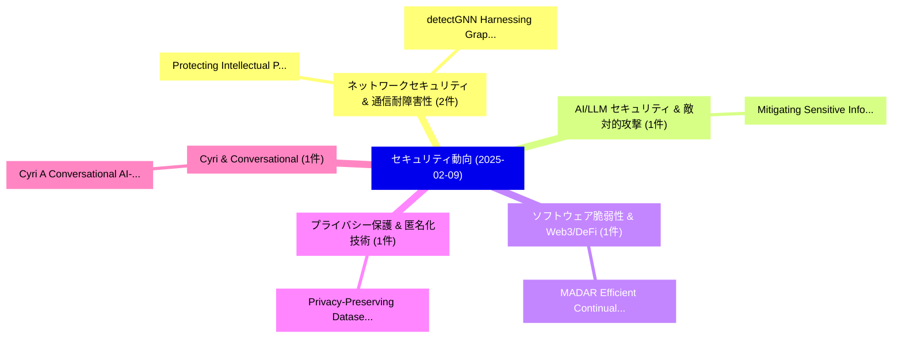

# 📅 02_daily: 日次エグゼクティブサマリー報告書 (2025-02-09)

**集計日時**: 2026-10-02 23:05:16 UTC  
**対象日付**: 2025-02-09  
**本日収集論文数**: 15 件  

---

## 💡 主要セキュリティ動向・脅威インサイト (Executive Insights)

本日の収集論文（計 15 件）において、以下の重点セキュリティ領域で活発な研究動向が確認されました：
- **ネットワークセキュリティ & 通信耐障害性** (2 件): 注目論文として 「Protecting Intellectual Proper...」、「detectGNN: Harnessing Graph Ne...」 等が発表され、実務防御および攻撃検証の進展が見られます。
- **AI/LLM セキュリティ & 敵対的攻撃** (1 件): 注目論文として 「Mitigating Sensitive Informati...」 等が発表され、実務防御および攻撃検証の進展が見られます。
- **ソフトウェア脆弱性 & Web3/DeFi** (1 件): 注目論文として 「MADAR: Efficient Continual Lea...」 等が発表され、実務防御および攻撃検証の進展が見られます。
- **プライバシー保護 & 匿名化技術** (1 件): 注目論文として 「Privacy-Preserving Dataset Com...」 等が発表され、実務防御および攻撃検証の進展が見られます。
- **Cyri & Conversational** (1 件): 注目論文として 「Cyri: A Conversational AI-base...」 等が発表され、実務防御および攻撃検証の進展が見られます。

### 🗺️ 技術・脅威トピックマインドマップ

---

## 📌 日次セキュリティ論文一覧 (日本語表形式)

| No | arXiv ID | 論文タイトル (日本語訳) | 重要キーワード | 構造化エグゼクティブ要約 (背景・提案・影響) | 脅威分類 | 詳細リンク |
|---|---|---|---|---|---|---|
| 1 | `2502.05739v2` | [Mitigating Sensitive Information Leakage in LLMs4Code through Machine Unlearning（セキュリティ分析論文）](../../okf/papers/2025-02-09/2502.05739.md) | `Mitigating Sensitive Information Leakage`, `Machine Unlearning`, `Shanzhi Gu` | 【提案】概要 (Overview & Key Finding) 本論文「Mitigating Sensitive Information Leakage in LLMs4Code t...。実証評価により経営層・セキュリティ管理者向け推奨アクション (E... | `cs.CR` | [arXiv](https://arxiv.org/abs/2502.05739v2) &#124; [OKF](../../okf/papers/2025-02-09/2502.05739.md) |
| 2 | `2502.05760v2` | [MADAR: Efficient Continual Learning for Malware Analysis with Distribution-Aware Replay（セキュリティ分析論文）](../../okf/papers/2025-02-09/2502.05760.md) | `Efficient Continual Learning`, `Aware Replay`, `Distribution-Aware Replay` | 【提案】概要 (Overview & Key Finding) 本論文「MADAR: Efficient Continual Learning for マルウェア Analysis ...。実証評価により経営層・セキュリティ管理者向け推奨アクション (E... | `cs.CR` | [arXiv](https://arxiv.org/abs/2502.05760v2) &#124; [OKF](../../okf/papers/2025-02-09/2502.05760.md) |
| 3 | `2502.05765v3` | [Privacy-Preserving Dataset Combination（セキュリティ分析論文）](../../okf/papers/2025-02-09/2502.05765.md) | `Preserving Dataset Combination`, `Privacy-Preserving Dataset`, `Keren Fuentes` | 【提案】概要 (Overview & Key Finding) 本論文「Privacy-Preserving Dataset Combination（セキュリティ分析論文）」（原題:...。実証評価により経営層・セキュリティ管理者向け推奨アクション (E... | `cs.CR` | [arXiv](https://arxiv.org/abs/2502.05765v3) &#124; [OKF](../../okf/papers/2025-02-09/2502.05765.md) |
| 4 | `2502.05931v1` | [Protecting Intellectual Property of EEG-based Neural Networks with Watermarking（セキュリティ分析論文）](../../okf/papers/2025-02-09/2502.05931.md) | `Protecting Intellectual Property`, `Neural Networks`, `EEG-based Neural` | 【提案】概要 (Overview & Key Finding) 本論文「Protecting Intellectual Property of EEG-based Neural Ne...。実証評価により経営層・セキュリティ管理者向け推奨アクション (E... | `cs.CR` | [arXiv](https://arxiv.org/abs/2502.05931v1) &#124; [OKF](../../okf/papers/2025-02-09/2502.05931.md) |
| 5 | `2502.05951v1` | [Cyri: A Conversational AI-based Assistant for Supporting the Human User in Detecting and Responding to Phishing Attacks（セキュリティ分析論文）](../../okf/papers/2025-02-09/2502.05951.md) | `Human User`, `Phishing Attacks`, `AI-based Assistant` | 【提案】概要 (Overview & Key Finding) 本論文「Cyri: A Conversational AI-based Assistant for Supportin...。実証評価により経営層・セキュリティ管理者向け推奨アクション (E... | `cs.CR` | [arXiv](https://arxiv.org/abs/2502.05951v1) &#124; [OKF](../../okf/papers/2025-02-09/2502.05951.md) |
| 6 | `2502.05987v2` | [Simulating Virtual Players for UNO without Computers（セキュリティ分析論文）](../../okf/papers/2025-02-09/2502.05987.md) | `Simulating Virtual Players`, `Suthee Ruangwises`, `Kazumasa Shinagawa` | 【提案】背景とセキュリティ上の課題 (Background & Problem) 本研究はサイバー脅威環境におけるセキュリティ構造・脆弱性の検証を目的としています。(主要検出項目: ...。実証評価により経営層・セキュリティ管理者向け推奨アクション (E... | `cs.CR` | [arXiv](https://arxiv.org/abs/2502.05987v2) &#124; [OKF](../../okf/papers/2025-02-09/2502.05987.md) |
| 7 | `2502.06000v1` | [The AI Security Zugzwang（セキュリティ分析論文）](../../okf/papers/2025-02-09/2502.06000.md) | `Security Zugzwang`, `Lampis Alevizos`, `Raw Meta` | 【提案】概要 (Overview & Key Finding) 本論文「The AI Security Zugzwang（セキュリティ分析論文）」（原題: The AI Securi...。実証評価により経営層・セキュリティ管理者向け推奨アクション (E... | `cs.CR` | [arXiv](https://arxiv.org/abs/2502.06000v1) &#124; [OKF](../../okf/papers/2025-02-09/2502.06000.md) |
| 8 | `2502.06031v1` | [A Conditional Tabular GAN-Enhanced Intrusion Detection System for Rare Attacks in IoT Networks（セキュリティ分析論文）](../../okf/papers/2025-02-09/2502.06031.md) | `Enhanced Intrusion Detection System`, `Conditional Tabular`, `GAN-Enhanced Intrusion` | 【提案】概要 (Overview & Key Finding) 本論文「A Conditional Tabular GAN-Enhanced Intrusion Detection ...。実証評価により経営層・セキュリティ管理者向け推奨アクション (E... | `cs.CR` | [arXiv](https://arxiv.org/abs/2502.06031v1) &#124; [OKF](../../okf/papers/2025-02-09/2502.06031.md) |
| 9 | `2502.06033v1` | [Stateful Hash-Based Signature (SHBS) Benchmark Data for XMSS and LMS（セキュリティ分析論文）](../../okf/papers/2025-02-09/2502.06033.md) | `Stateful Hash`, `Based Signature`, `Benchmark Data` | 【提案】概要 (Overview & Key Finding) 本論文「Stateful Hash-Based Signature (SHBS) Benchmark Data for...。実証評価により経営層・セキュリティ管理者向け推奨アクション (E... | `cs.CR` | [arXiv](https://arxiv.org/abs/2502.06033v1) &#124; [OKF](../../okf/papers/2025-02-09/2502.06033.md) |
| 10 | `2502.06039v1` | [Prompt Engineering Techniques for Secure Code Generation with GPT Modelsのベンチマーク評価](../../okf/papers/2025-02-09/2502.06039.md) | `Secure Code Generation`, `Benchmarking Prompt Engineering Techniques`, `Prompt Engineering Techniques` | 【提案】概要 (Overview & Key Finding) 本論文「Prompt Engineering Techniques for Secure Code Generatio...。実証評価により経営層・セキュリティ管理者向け推奨アクション (E... | `cs.CR` | [arXiv](https://arxiv.org/abs/2502.06039v1) &#124; [OKF](../../okf/papers/2025-02-09/2502.06039.md) |
| 11 | `2502.06043v2` | [Hierarchical Polysemantic Feature Embedding for Autonomous Ransomware Detection（セキュリティ分析論文）](../../okf/papers/2025-02-09/2502.06043.md) | `Hierarchical Polysemantic Feature Embedding`, `Autonomous Ransomware Detection`, `Sergei Nikitka` | 【提案】概要 (Overview & Key Finding) 本論文「Hierarchical Polysemantic Feature Embedding for Autonom...。実証評価により経営層・セキュリティ管理者向け推奨アクション (E... | `cs.CR` | [arXiv](https://arxiv.org/abs/2502.06043v2) &#124; [OKF](../../okf/papers/2025-02-09/2502.06043.md) |
| 12 | `2502.07815v1` | [Decoding Complexity: Intelligent Pattern Exploration with CHPDA (Context Aware Hybrid Pattern Detection Algorithm)（セキュリティ分析論文）](../../okf/papers/2025-02-09/2502.07815.md) | `Context Aware Hybrid Pattern Detection Algorithm`, `Intelligent Pattern Exploration`, `Decoding Complexity` | 【提案】概要 (Overview & Key Finding) 本論文「Decoding Complexity: Intelligent Pattern Exploration wi...。実証評価により経営層・セキュリティ管理者向け推奨アクション (E... | `cs.CR` | [arXiv](https://arxiv.org/abs/2502.07815v1) &#124; [OKF](../../okf/papers/2025-02-09/2502.07815.md) |
| 13 | `2502.10438v1` | [Injecting Universal Jailbreak Backdoors into LLMs in Minutes（セキュリティ分析論文）](../../okf/papers/2025-02-09/2502.10438.md) | `Injecting Universal Jailbreak Backdoors`, `Zhuowei Chen`, `Qiannan Zhang` | 【提案】概要 (Overview & Key Finding) 本論文「Injecting Universal ジェイルブレイク Backdoors into LLMs in Min...。実証評価により経営層・セキュリティ管理者向け推奨アクション (E... | `cs.CR` | [arXiv](https://arxiv.org/abs/2502.10438v1) &#124; [OKF](../../okf/papers/2025-02-09/2502.10438.md) |
| 14 | `2502.10439v1` | [Crypto Miner Attack: GPU Remote Code Execution Attacks（セキュリティ分析論文）](../../okf/papers/2025-02-09/2502.10439.md) | `Remote Code Execution Attacks`, `Crypto Miner Attack`, `Ariel Szabo` | 【提案】概要 (Overview & Key Finding) 本論文「Crypto Miner Attack: GPU リモートコード実行 Attacks（セキュリティ分析論文）」...。実証評価により経営層・セキュリティ管理者向け推奨アクション (E... | `cs.CR` | [arXiv](https://arxiv.org/abs/2502.10439v1) &#124; [OKF](../../okf/papers/2025-02-09/2502.10439.md) |
| 15 | `2503.22681v1` | [detectGNN: Harnessing Graph Neural Networks for Enhanced Fraud Detection in Credit Card Transactions（セキュリティ分析論文）](../../okf/papers/2025-02-09/2503.22681.md) | `Harnessing Graph Neural Networks`, `Enhanced Fraud Detection`, `Credit Card Transactions` | 【提案】概要 (Overview & Key Finding) 本論文「detectGNN: Harnessing Graph Neural Networks for Enhance...。実証評価により経営層・セキュリティ管理者向け推奨アクション (E... | `cs.CR` | [arXiv](https://arxiv.org/abs/2503.22681v1) &#124; [OKF](../../okf/papers/2025-02-09/2503.22681.md) |

