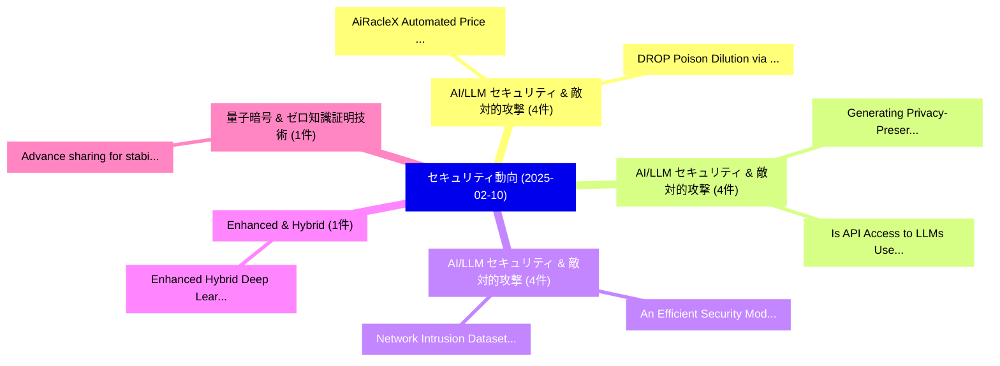

# 📅 02_daily: 日次エグゼクティブサマリー報告書 (2025-02-10)

**集計日時**: 2026-10-02 23:05:16 UTC  
**対象日付**: 2025-02-10  
**本日収集論文数**: 27 件  

---

## 💡 主要セキュリティ動向・脅威インサイト (Executive Insights)

本日の収集論文（計 27 件）において、以下の重点セキュリティ領域で活発な研究動向が確認されました：
- **AI/LLM セキュリティ & 敵対的攻撃** (4 件): 注目論文として 「AiRacleX: Automated Price Orac...」、「DROP: Poison Dilution via Know...」 等が発表され、実務防御および攻撃検証の進展が見られます。
- **AI/LLM セキュリティ & 敵対的攻撃** (4 件): 注目論文として 「Generating Privacy-Preserving ...」、「Is API Access to LLMs Useful f...」 等が発表され、実務防御および攻撃検証の進展が見られます。
- **AI/LLM セキュリティ & 敵対的攻撃** (4 件): 注目論文として 「An Efficient Security Model fo...」、「Network Intrusion Datasets: A ...」 等が発表され、実務防御および攻撃検証の進展が見られます。
- **Enhanced & Hybrid** (1 件): 注目論文として 「Enhanced Hybrid Deep Learning ...」 等が発表され、実務防御および攻撃検証の進展が見られます。
- **量子暗号 & ゼロ知識証明技術** (1 件): 注目論文として 「Advance sharing for stabilizer...」 等が発表され、実務防御および攻撃検証の進展が見られます。

### 🗺️ 技術・脅威トピックマインドマップ

---

## 📌 日次セキュリティ論文一覧 (日本語表形式)

| No | arXiv ID | 論文タイトル (日本語訳) | 重要キーワード | 構造化エグゼクティブ要約 (背景・提案・影響) | 脅威分類 | 詳細リンク |
|---|---|---|---|---|---|---|
| 1 | `2502.06138v1` | [Enhanced Hybrid Deep Learning Approach for Botnet Attacks Detection in IoT Environment（セキュリティ分析論文）](../../okf/papers/2025-02-10/2502.06138.md) | `Botnet Attacks Detection`, `Alavikunhu Panthakkan`, `Shadi Atalla` | 【提案】概要 (Overview & Key Finding) 本論文「Enhanced Hybrid Deep Learning Approach for Botnet Attac...。実証評価により経営層・セキュリティ管理者向け推奨アクション (E... | `cs.CR` | [arXiv](https://arxiv.org/abs/2502.06138v1) &#124; [OKF](../../okf/papers/2025-02-10/2502.06138.md) |
| 2 | `2502.06247v1` | [Advance sharing for stabilizer-based quantum secret sharing schemes（セキュリティ分析論文）](../../okf/papers/2025-02-10/2502.06247.md) | `stabilizer-based quantum`, `Mamoru Shibata`, `Raw Meta` | 【提案】概要 (Overview & Key Finding) 本論文「Advance sharing for stabilizer-based 量子 secret sharing ...。実証評価により経営層・セキュリティ管理者向け推奨アクション (E... | `cs.CR` | [arXiv](https://arxiv.org/abs/2502.06247v1) &#124; [OKF](../../okf/papers/2025-02-10/2502.06247.md) |
| 3 | `2502.06293v1` | [RustMC: Extending the GenMC stateless model checker to Rust（セキュリティ分析論文）](../../okf/papers/2025-02-10/2502.06293.md) | `Oliver Pearce`, `Julien Lange`, `Raw Meta` | 【提案】概要 (Overview & Key Finding) 本論文「RustMC: Extending the GenMC stateless model checker to ...。実証評価により経営層・セキュリティ管理者向け推奨アクション (E... | `cs.CR` | [arXiv](https://arxiv.org/abs/2502.06293v1) &#124; [OKF](../../okf/papers/2025-02-10/2502.06293.md) |
| 4 | `2502.06348v2` | [AiRacleX: Automated Price Oracle Manipulations via LLM-Driven Knowledge Mining and Prompt Generationの検出](../../okf/papers/2025-02-10/2502.06348.md) | `Driven Knowledge Mining`, `LLM-Driven Knowledge`, `Automated Price Oracle Manipulations` | 【提案】概要 (Overview & Key Finding) 本論文「AiRacleX: Automated Price Oracle Manipulations via LLM-...。実証評価により経営層・セキュリティ管理者向け推奨アクション (E... | `cs.CR` | [arXiv](https://arxiv.org/abs/2502.06348v2) &#124; [OKF](../../okf/papers/2025-02-10/2502.06348.md) |
| 5 | `2502.06385v2` | [Recommendations to OSCE/ODIHR (on how to give better recommendations for Internet voting)（セキュリティ分析論文）](../../okf/papers/2025-02-10/2502.06385.md) | `Jan Willemson`, `Raw Meta`, `Executive Summary` | 【提案】概要 (Overview & Key Finding) 本論文「Recommendations to OSCE/ODIHR (on how to give better re...。実証評価により経営層・セキュリティ管理者向け推奨アクション (E... | `cs.CR` | [arXiv](https://arxiv.org/abs/2502.06385v2) &#124; [OKF](../../okf/papers/2025-02-10/2502.06385.md) |
| 6 | `2502.06418v1` | [Robust Watermarks Leak: Channel-Aware Feature Extraction Enables Adversarial Watermark Manipulation（セキュリティ分析論文）](../../okf/papers/2025-02-10/2502.06418.md) | `Aware Feature Extraction Enables Adversarial Watermark Manipulation`, `Robust Watermarks Leak`, `Channel-Aware Feature` | 【提案】概要 (Overview & Key Finding) 本論文「Robust Watermarks Leak: Channel-Aware Feature Extractio...。実証評価により経営層・セキュリティ管理者向け推奨アクション (E... | `cs.CR` | [arXiv](https://arxiv.org/abs/2502.06418v1) &#124; [OKF](../../okf/papers/2025-02-10/2502.06418.md) |
| 7 | `2502.06425v2` | [Generating Privacy-Preserving Personalized Advice with Zero-Knowledge Proofs and LLMs（セキュリティ分析論文）](../../okf/papers/2025-02-10/2502.06425.md) | `Preserving Personalized Advice`, `Generating Privacy`, `Knowledge Proofs` | 【提案】概要 (Overview & Key Finding) 本論文「Generating Privacy-Preserving Personalized Advice with ...。実証評価により経営層・セキュリティ管理者向け推奨アクション (E... | `cs.CR` | [arXiv](https://arxiv.org/abs/2502.06425v2) &#124; [OKF](../../okf/papers/2025-02-10/2502.06425.md) |
| 8 | `2502.06502v1` | [An Efficient Security Model for Industrial Internet of Things (IIoT) System Based on Machine Learning Principles（セキュリティ分析論文）](../../okf/papers/2025-02-10/2502.06502.md) | `Machine Learning Principles`, `Industrial Internet`, `System Based` | 【提案】概要 (Overview & Key Finding) 本論文「An Efficient Security Model for Industrial Internet of ...。実証評価により経営層・セキュリティ管理者向け推奨アクション (E... | `cs.CR` | [arXiv](https://arxiv.org/abs/2502.06502v1) &#124; [OKF](../../okf/papers/2025-02-10/2502.06502.md) |
| 9 | `2502.06521v2` | [Sentient: Detecting APTs Via Capturing Indirect Dependencies and Behavioral Logic（セキュリティ分析論文）](../../okf/papers/2025-02-10/2502.06521.md) | `Via Capturing Indirect Dependencies`, `Behavioral Logic`, `Wenhao Yan` | 【提案】概要 (Overview & Key Finding) 本論文「Sentient: Detecting APTs Via Capturing Indirect Depende...。実証評価により経営層・セキュリティ管理者向け推奨アクション (E... | `cs.CR` | [arXiv](https://arxiv.org/abs/2502.06521v2) &#124; [OKF](../../okf/papers/2025-02-10/2502.06521.md) |
| 10 | `2502.06555v1` | [Is API Access to LLMs Useful for Generating Private Synthetic Tabular Data?（セキュリティ分析論文）](../../okf/papers/2025-02-10/2502.06555.md) | `Generating Private Synthetic Tabular Data`, `Marika Swanberg`, `Edo Roth` | 【提案】### (日本語題名: Is API Access to LLMs Useful for Generating Private Synthetic Tabular Data?...。実証評価により経営層・セキュリティ管理者向け推奨アクション (E... | `cs.CR` | [arXiv](https://arxiv.org/abs/2502.06555v1) &#124; [OKF](../../okf/papers/2025-02-10/2502.06555.md) |
| 11 | `2502.06609v1` | [Automatic ISA analysis for Secure Context Switching（セキュリティ分析論文）](../../okf/papers/2025-02-10/2502.06609.md) | `Secure Context Switching`, `Thomas Bourgeat`, `Wojciech Ozga` | 【提案】概要 (Overview & Key Finding) 本論文「Automatic ISA analysis for Secure Context Switching（セキュ...。実証評価によりHunt, Wojciech Ozga - **公... | `cs.CR` | [arXiv](https://arxiv.org/abs/2502.06609v1) &#124; [OKF](../../okf/papers/2025-02-10/2502.06609.md) |
| 12 | `2502.06651v1` | [Differentially Private Empirical Cumulative Distribution Functions（セキュリティ分析論文）](../../okf/papers/2025-02-10/2502.06651.md) | `Differentially Private Empirical Cumulative Distribution Functions`, `Antoine Barczewski`, `Amal Mawass` | 【提案】概要 (Overview & Key Finding) 本論文「Differentially Private Empirical Cumulative Distributio...。実証評価により経営層・セキュリティ管理者向け推奨アクション (E... | `cs.CR` | [arXiv](https://arxiv.org/abs/2502.06651v1) &#124; [OKF](../../okf/papers/2025-02-10/2502.06651.md) |
| 13 | `2502.06657v3` | [Onion Routing Key Distribution for QKDN（セキュリティ分析論文）](../../okf/papers/2025-02-10/2502.06657.md) | `Onion Routing Key Distribution`, `Pedro Otero`, `Javier Blanco` | 【提案】概要 (Overview & Key Finding) 本論文「Onion Routing Key Distribution for QKDN（セキュリティ分析論文）」（原題...。実証評価により経営層・セキュリティ管理者向け推奨アクション (E... | `cs.CR` | [arXiv](https://arxiv.org/abs/2502.06657v3) &#124; [OKF](../../okf/papers/2025-02-10/2502.06657.md) |
| 14 | `2502.06662v1` | [Pinning Is Futile: You Need More Than Local Dependency Versioning to Defend against Supply Chain Attacks（セキュリティ分析論文）](../../okf/papers/2025-02-10/2502.06662.md) | `Supply Chain Attacks`, `Bogdan Vasilescu`, `Raw Meta` | 【提案】概要 (Overview & Key Finding) 本論文「Pinning Is Futile: You Need More Than Local Dependency ...。実証評価により経営層・セキュリティ管理者向け推奨アクション (E... | `cs.CR` | [arXiv](https://arxiv.org/abs/2502.06662v1) &#124; [OKF](../../okf/papers/2025-02-10/2502.06662.md) |
| 15 | `2502.06688v3` | [Network Intrusion Datasets: A Survey, Limitations, and Recommendations（セキュリティ分析論文）](../../okf/papers/2025-02-10/2502.06688.md) | `Network Intrusion Datasets`, `Patrik Goldschmidt`, `Raw Meta` | 【提案】概要 (Overview & Key Finding) 本論文「Network Intrusion Datasets: A Survey, Limitations, and ...。実証評価により経営層・セキュリティ管理者向け推奨アクション (E... | `cs.CR` | [arXiv](https://arxiv.org/abs/2502.06688v3) &#124; [OKF](../../okf/papers/2025-02-10/2502.06688.md) |
| 16 | `2502.06706v1` | [A Case Study in Gamification for a サイバーセキュリティ Education Program: A Game for Cryptography](../../okf/papers/2025-02-10/2502.06706.md) | `Cybersecurity Education Program`, `Education Program`, `Dylan Huitema` | 【提案】概要 (Overview & Key Finding) 本論文「A Case Study in Gamification for a サイバーセキュリティ Education...。実証評価により経営層・セキュリティ管理者向け推奨アクション (E... | `cs.CR` | [arXiv](https://arxiv.org/abs/2502.06706v1) &#124; [OKF](../../okf/papers/2025-02-10/2502.06706.md) |
| 17 | `2502.06752v1` | [Blockchain-Powered Asset Tokenization Platform（セキュリティ分析論文）](../../okf/papers/2025-02-10/2502.06752.md) | `Powered Asset Tokenization Platform`, `Blockchain-Powered Asset`, `Aaryan Sinha` | 【提案】概要 (Overview & Key Finding) 本論文「Blockchain-Powered Asset Tokenization Platform（セキュリティ分析...。実証評価により経営層・セキュリティ管理者向け推奨アクション (E... | `cs.CR` | [arXiv](https://arxiv.org/abs/2502.06752v1) &#124; [OKF](../../okf/papers/2025-02-10/2502.06752.md) |
| 18 | `2502.07011v2` | [DROP: Poison Dilution via Knowledge Distillation for 連合学習](../../okf/papers/2025-02-10/2502.07011.md) | `Poison Dilution`, `Knowledge Distillation`, `Federated Learning` | 【提案】概要 (Overview & Key Finding) 本論文「DROP: Poison Dilution via Knowledge Distillation for 連合...。実証評価により経営層・セキュリティ管理者向け推奨アクション (E... | `cs.CR` | [arXiv](https://arxiv.org/abs/2502.07011v2) &#124; [OKF](../../okf/papers/2025-02-10/2502.07011.md) |
| 19 | `2502.07036v2` | [Automated Consistency LLMsの分析](../../okf/papers/2025-02-10/2502.07036.md) | `Automated Consistency`, `Aditya Patwardhan`, `Vivek Vaidya` | 【提案】概要 (Overview & Key Finding) 本論文「Automated Consistency LLMsの分析」（原題: Automated Consistenc...。実証評価により経営層・セキュリティ管理者向け推奨アクション (E... | `cs.CR` | [arXiv](https://arxiv.org/abs/2502.07036v2) &#124; [OKF](../../okf/papers/2025-02-10/2502.07036.md) |
| 20 | `2502.07045v2` | [Scalable and Ethical Insider Threat Detection through Data Synthesis and Analysis by LLMs（セキュリティ分析論文）](../../okf/papers/2025-02-10/2502.07045.md) | `Ethical Insider Threat Detection`, `Data Synthesis`, `Haywood Gelman` | 【提案】概要 (Overview & Key Finding) 本論文「Scalable and Ethical Insider 脅威 Detection through Data ...。実証評価により経営層・セキュリティ管理者向け推奨アクション (E... | `cs.CR` | [arXiv](https://arxiv.org/abs/2502.07045v2) &#124; [OKF](../../okf/papers/2025-02-10/2502.07045.md) |
| 21 | `2502.07049v2` | [LLMs in Software Security: A Survey of 脆弱性検出 Techniques and Insights](../../okf/papers/2025-02-10/2502.07049.md) | `Software Security`, `Vulnerability Detection Techniques`, `Ze Sheng` | 【提案】概要 (Overview & Key Finding) 本論文「LLMs in Software Security: A Survey of 脆弱性検出 Techniques...。実証評価により経営層・セキュリティ管理者向け推奨アクション (E... | `cs.CR` | [arXiv](https://arxiv.org/abs/2502.07049v2) &#124; [OKF](../../okf/papers/2025-02-10/2502.07049.md) |
| 22 | `2502.07053v2` | [TOCTOU Resilient Attestation for IoT Networks (Full Version)（セキュリティ分析論文）](../../okf/papers/2025-02-10/2502.07053.md) | `Resilient Attestation`, `Full Version`, `Renascence Tarafder Prapty` | 【提案】概要 (Overview & Key Finding) 本論文「TOCTOU Resilient Attestation for IoT Networks (Full Ver...。実証評価により経営層・セキュリティ管理者向け推奨アクション (E... | `cs.CR` | [arXiv](https://arxiv.org/abs/2502.07053v2) &#124; [OKF](../../okf/papers/2025-02-10/2502.07053.md) |
| 23 | `2502.07063v3` | [Zero-Knowledge Proof Frameworks: A Systematic Survey（セキュリティ分析論文）](../../okf/papers/2025-02-10/2502.07063.md) | `Knowledge Proof Frameworks`, `Systematic Survey`, `Zero-Knowledge Proof` | 【提案】概要 (Overview & Key Finding) 本論文「ゼロ知識証明 Frameworks: A Systematic Survey（セキュリティ分析論文）」（原題:...。実証評価により経営層・セキュリティ管理者向け推奨アクション (E... | `cs.CR` | [arXiv](https://arxiv.org/abs/2502.07063v3) &#124; [OKF](../../okf/papers/2025-02-10/2502.07063.md) |
| 24 | `2502.07066v2` | [General-Purpose $f$-DP Estimation and Auditing in a Black-Box Setting（セキュリティ分析論文）](../../okf/papers/2025-02-10/2502.07066.md) | `Box Setting`, `Black-Box Setting`, `Holger Dette` | 【提案】概要 (Overview & Key Finding) 本論文「General-Purpose $f$-DP Estimation and Auditing in a Bla...。実証評価により経営層・セキュリティ管理者向け推奨アクション (E... | `cs.CR` | [arXiv](https://arxiv.org/abs/2502.07066v2) &#124; [OKF](../../okf/papers/2025-02-10/2502.07066.md) |
| 25 | `2502.07116v2` | [Threat Me Right: A Human HARMS Threat Model for Technical Systems（セキュリティ分析論文）](../../okf/papers/2025-02-10/2502.07116.md) | `Threat Model`, `Technical Systems`, `Kieron Ivy Turk` | 【提案】概要 (Overview & Key Finding) 本論文「脅威 Me Right: A Human HARMS 脅威 Model for Technical Syste...。実証評価により経営層・セキュリティ管理者向け推奨アクション (E... | `cs.CR` | [arXiv](https://arxiv.org/abs/2502.07116v2) &#124; [OKF](../../okf/papers/2025-02-10/2502.07116.md) |
| 26 | `2502.07119v1` | [SAFE: Self-Supervised Anomaly Detection Framework for Intrusion Detection（セキュリティ分析論文）](../../okf/papers/2025-02-10/2502.07119.md) | `Intrusion Detection`, `Self-Supervised Anomaly`, `Elvin Li` | 【提案】概要 (Overview & Key Finding) 本論文「SAFE: Self-Supervised Anomaly Detection Framework for I...。実証評価により経営層・セキュリティ管理者向け推奨アクション (E... | `cs.CR` | [arXiv](https://arxiv.org/abs/2502.07119v1) &#124; [OKF](../../okf/papers/2025-02-10/2502.07119.md) |
| 27 | `2502.10440v2` | [Copyright Protection for Knowledge Bases of Retrieval-augmented Language Models via Reasoningに向けて](../../okf/papers/2025-02-10/2502.10440.md) | `Knowledge Bases`, `Language Models`, `Retrieval-augmented Language` | 【提案】概要 (Overview & Key Finding) 本論文「Copyright Protection for Knowledge Bases of Retrieval-a...。実証評価により経営層・セキュリティ管理者向け推奨アクション (E... | `cs.CR` | [arXiv](https://arxiv.org/abs/2502.10440v2) &#124; [OKF](../../okf/papers/2025-02-10/2502.10440.md) |

