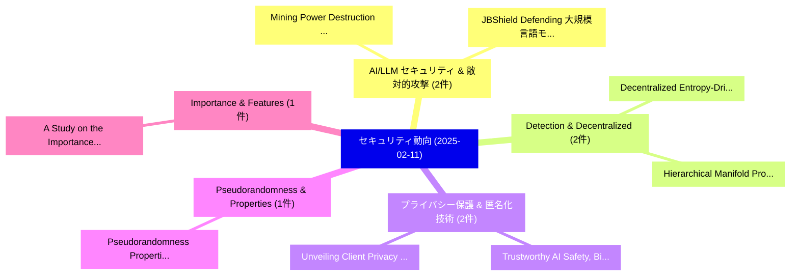

# 📅 02_daily: 日次エグゼクティブサマリー報告書 (2025-02-11)

**集計日時**: 2026-10-02 23:05:16 UTC  
**対象日付**: 2025-02-11  
**本日収集論文数**: 19 件  

---

## 💡 主要セキュリティ動向・脅威インサイト (Executive Insights)

本日の収集論文（計 19 件）において、以下の重点セキュリティ領域で活発な研究動向が確認されました：
- **AI/LLM セキュリティ & 敵対的攻撃** (2 件): 注目論文として 「Mining Power Destruction Attac...」、「JBShield: Defending 大規模言語モデル f...」 等が発表され、実務防御および攻撃検証の進展が見られます。
- **Detection & Decentralized** (2 件): 注目論文として 「Decentralized Entropy-Driven R...」、「Hierarchical Manifold Projecti...」 等が発表され、実務防御および攻撃検証の進展が見られます。
- **プライバシー保護 & 匿名化技術** (2 件): 注目論文として 「Unveiling Client Privacy Leaka...」、「Trustworthy AI: Safety, Bias, ...」 等が発表され、実務防御および攻撃検証の進展が見られます。
- **Pseudorandomness & Properties** (1 件): 注目論文として 「Pseudorandomness Properties of...」 等が発表され、実務防御および攻撃検証の進展が見られます。
- **Importance & Features** (1 件): 注目論文として 「A Study on the Importance of F...」 等が発表され、実務防御および攻撃検証の進展が見られます。

### 🗺️ 技術・脅威トピックマインドマップ

---

## 📌 日次セキュリティ論文一覧 (日本語表形式)

| No | arXiv ID | 論文タイトル (日本語訳) | 重要キーワード | 構造化エグゼクティブ要約 (背景・提案・影響) | 脅威分類 | 詳細リンク |
|---|---|---|---|---|---|---|
| 1 | `2502.07159v1` | [Pseudorandomness Properties of Random Reversible Circuits（セキュリティ分析論文）](../../okf/papers/2025-02-11/2502.07159.md) | `Random Reversible Circuits`, `Pseudorandomness Properties`, `William Gay` | 【提案】概要 (Overview & Key Finding) 本論文「Pseudorandomness Properties of Random Reversible Circui...。実証評価により経営層・セキュリティ管理者向け推奨アクション (E... | `cs.CR` | [arXiv](https://arxiv.org/abs/2502.07159v1) &#124; [OKF](../../okf/papers/2025-02-11/2502.07159.md) |
| 2 | `2502.07207v1` | [A Study on the Importance of Features in Detecting Advanced Persistent Threats Using Machine Learning（セキュリティ分析論文）](../../okf/papers/2025-02-11/2502.07207.md) | `Detecting Advanced Persistent Threats Using Machine Learning`, `Detecting Advanced Persistent Threats Using Machin`, `Ehsan Hallaji` | 【提案】概要 (Overview & Key Finding) 本論文「A Study on the Importance of Features in Detecting Adva...。実証評価により経営層・セキュリティ管理者向け推奨アクション (E... | `cs.CR` | [arXiv](https://arxiv.org/abs/2502.07207v1) &#124; [OKF](../../okf/papers/2025-02-11/2502.07207.md) |
| 3 | `2502.07231v1` | [Revisiting the Auxiliary Data in Backdoor Purification（セキュリティ分析論文）](../../okf/papers/2025-02-11/2502.07231.md) | `Auxiliary Data`, `Backdoor Purification`, `Shaokui Wei` | 【提案】概要 (Overview & Key Finding) 本論文「Revisiting the Auxiliary Data in Backdoor Purification（...。実証評価により経営層・セキュリティ管理者向け推奨アクション (E... | `cs.CR` | [arXiv](https://arxiv.org/abs/2502.07231v1) &#124; [OKF](../../okf/papers/2025-02-11/2502.07231.md) |
| 4 | `2502.07284v1` | [VLWE: Variety-based Learning with Errors for Vector Encryption through Algebraic Geometry（セキュリティ分析論文）](../../okf/papers/2025-02-11/2502.07284.md) | `Vector Encryption`, `Algebraic Geometry`, `Variety-based Learning` | 【提案】概要 (Overview & Key Finding) 本論文「VLWE: Variety-based Learning with Errors for Vector Enc...。実証評価により経営層・セキュリティ管理者向け推奨アクション (E... | `cs.CR` | [arXiv](https://arxiv.org/abs/2502.07284v1) &#124; [OKF](../../okf/papers/2025-02-11/2502.07284.md) |
| 5 | `2502.07330v1` | [EMERALD: Evidence Management for Continuous Certification as a Service in the Cloud（セキュリティ分析論文）](../../okf/papers/2025-02-11/2502.07330.md) | `Evidence Management`, `Continuous Certification`, `Christian Banse` | 【提案】概要 (Overview & Key Finding) 本論文「EMERALD: Evidence Management for Continuous Certificati...。実証評価により経営層・セキュリティ管理者向け推奨アクション (E... | `cs.CR` | [arXiv](https://arxiv.org/abs/2502.07330v1) &#124; [OKF](../../okf/papers/2025-02-11/2502.07330.md) |
| 6 | `2502.07410v1` | [Mining Power Destruction Attacks in the Presence of Petty-Compliant Mining Pools（セキュリティ分析論文）](../../okf/papers/2025-02-11/2502.07410.md) | `Mining Power Destruction Attacks`, `Compliant Mining Pools`, `Petty-Compliant Mining` | 【提案】概要 (Overview & Key Finding) 本論文「Mining Power Destruction Attacks in the Presence of Pet...。実証評価により経営層・セキュリティ管理者向け推奨アクション (E... | `cs.CR` | [arXiv](https://arxiv.org/abs/2502.07410v1) &#124; [OKF](../../okf/papers/2025-02-11/2502.07410.md) |
| 7 | `2502.07492v2` | [RoMA: Robust Malware Attribution via Byte-level Adversarial Training with Global Perturbations and Adversarial Consistency Regularization（セキュリティ分析論文）](../../okf/papers/2025-02-11/2502.07492.md) | `Robust Malware Attribution`, `Adversarial Consistency Regularization`, `Adversarial Training` | 【提案】概要 (Overview & Key Finding) 本論文「RoMA: Robust マルウェア Attribution via Byte-level Adversari...。実証評価により経営層・セキュリティ管理者向け推奨アクション (E... | `cs.CR` | [arXiv](https://arxiv.org/abs/2502.07492v2) &#124; [OKF](../../okf/papers/2025-02-11/2502.07492.md) |
| 8 | `2502.07498v2` | [Decentralized Entropy-Driven Ransomware Detection Using Autonomous Neural Graph Embeddings（セキュリティ分析論文）](../../okf/papers/2025-02-11/2502.07498.md) | `Driven Ransomware Detection Using Autonomous Neural Graph Embeddings`, `Decentralized Entropy`, `Entropy-Driven Ransomware` | 【提案】概要 (Overview & Key Finding) 本論文「Decentralized Entropy-Driven ランサムウェア Detection Using Au...。実証評価により経営層・セキュリティ管理者向け推奨アクション (E... | `cs.CR` | [arXiv](https://arxiv.org/abs/2502.07498v2) &#124; [OKF](../../okf/papers/2025-02-11/2502.07498.md) |
| 9 | `2502.07557v1` | [JBShield: Defending 大規模言語モデル from Jailbreak Attacks through Activated Concept Analysis and Manipulation](../../okf/papers/2025-02-11/2502.07557.md) | `Jailbreak Attacks`, `Defending Large Language Models`, `Shenyi Zhang` | 【提案】概要 (Overview & Key Finding) 本論文「JBShield: Defending 大規模言語モデル from ジェイルブレイク Attacks thro...。実証評価により経営層・セキュリティ管理者向け推奨アクション (E... | `cs.CR` | [arXiv](https://arxiv.org/abs/2502.07557v1) &#124; [OKF](../../okf/papers/2025-02-11/2502.07557.md) |
| 10 | `2502.07594v1` | [Distributed Non-Interactive Zero-Knowledge Proofs（セキュリティ分析論文）](../../okf/papers/2025-02-11/2502.07594.md) | `Distributed Non`, `Interactive Zero`, `Knowledge Proofs` | 【提案】概要 (Overview & Key Finding) 本論文「Distributed Non-Interactive Zero-Knowledge Proofs（セキュリテ...。実証評価によりGrilo, Ami Paz, Mor Perry... | `cs.CR` | [arXiv](https://arxiv.org/abs/2502.07594v1) &#124; [OKF](../../okf/papers/2025-02-11/2502.07594.md) |
| 11 | `2502.07657v1` | [Private Low-Rank Approximation for Covariance Matrices, Dyson Brownian Motion, and Eigenvalue-Gap Bounds for Gaussian Perturbations（セキュリティ分析論文）](../../okf/papers/2025-02-11/2502.07657.md) | `Dyson Brownian Motion`, `Private Low`, `Rank Approximation` | 【提案】概要 (Overview & Key Finding) 本論文「Private Low-Rank Approximation for Covariance Matrices,...。実証評価により経営層・セキュリティ管理者向け推奨アクション (E... | `cs.CR` | [arXiv](https://arxiv.org/abs/2502.07657v1) &#124; [OKF](../../okf/papers/2025-02-11/2502.07657.md) |
| 12 | `2502.07760v2` | [Scalable Fingerprinting of 大規模言語モデル](../../okf/papers/2025-02-11/2502.07760.md) | `Scalable Fingerprinting`, `Large Language Models`, `Anshul Nasery` | 【提案】概要 (Overview & Key Finding) 本論文「Scalable Fingerprinting of 大規模言語モデル」（原題: Scalable Finge...。実証評価により経営層・セキュリティ管理者向け推奨アクション (E... | `cs.CR` | [arXiv](https://arxiv.org/abs/2502.07760v2) &#124; [OKF](../../okf/papers/2025-02-11/2502.07760.md) |
| 13 | `2502.07776v2` | [Auditing Prompt Caching in Language Model APIs（セキュリティ分析論文）](../../okf/papers/2025-02-11/2502.07776.md) | `Auditing Prompt Caching`, `Language Model`, `Xiang Lisa Li` | 【提案】概要 (Overview & Key Finding) 本論文「Auditing Prompt Caching in Language Model APIs（セキュリティ分析...。実証評価により経営層・セキュリティ管理者向け推奨アクション (E... | `cs.CR` | [arXiv](https://arxiv.org/abs/2502.07776v2) &#124; [OKF](../../okf/papers/2025-02-11/2502.07776.md) |
| 14 | `2502.07925v1` | [PIXHELL: When Pixels Learn to Scream（セキュリティ分析論文）](../../okf/papers/2025-02-11/2502.07925.md) | `Mordechai Guri`, `Raw Meta`, `Executive Summary` | 【提案】概要 (Overview & Key Finding) 本論文「PIXHELL: When Pixels Learn to Scream（セキュリティ分析論文）」（原題: P...。実証評価により経営層・セキュリティ管理者向け推奨アクション (E... | `cs.CR` | [arXiv](https://arxiv.org/abs/2502.07925v1) &#124; [OKF](../../okf/papers/2025-02-11/2502.07925.md) |
| 15 | `2502.08001v2` | [Unveiling Client Privacy Leakage from Public Dataset Usage in Federated Distillation（セキュリティ分析論文）](../../okf/papers/2025-02-11/2502.08001.md) | `Unveiling Client Privacy Leakage`, `Public Dataset Usage`, `Federated Distillation` | 【提案】概要 (Overview & Key Finding) 本論文「Unveiling Client Privacy Leakage from Public Dataset Us...。実証評価により経営層・セキュリティ管理者向け推奨アクション (E... | `cs.CR` | [arXiv](https://arxiv.org/abs/2502.08001v2) &#124; [OKF](../../okf/papers/2025-02-11/2502.08001.md) |
| 16 | `2502.08008v2` | [An Interactive Framework for Implementing Privacy-Preserving Federated Learning: Experiments on 大規模言語モデル](../../okf/papers/2025-02-11/2502.08008.md) | `Preserving Federated Learning`, `Implementing Privacy`, `Privacy-Preserving Federated` | 【提案】概要 (Overview & Key Finding) 本論文「An Interactive Framework for Implementing Privacy-Prese...。実証評価により経営層・セキュリティ管理者向け推奨アクション (E... | `cs.CR` | [arXiv](https://arxiv.org/abs/2502.08008v2) &#124; [OKF](../../okf/papers/2025-02-11/2502.08008.md) |
| 17 | `2502.08013v2` | [Hierarchical Manifold Projection for Ransomware Detection: A Novel Geometric Approach to Identifying Malicious Encryption Patterns（セキュリティ分析論文）](../../okf/papers/2025-02-11/2502.08013.md) | `Identifying Malicious Encryption Patterns`, `Hierarchical Manifold Projection`, `Ransomware Detection` | 【提案】概要 (Overview & Key Finding) 本論文「Hierarchical Manifold Projection for ランサムウェア Detection:...。実証評価により経営層・セキュリティ管理者向け推奨アクション (E... | `cs.CR` | [arXiv](https://arxiv.org/abs/2502.08013v2) &#124; [OKF](../../okf/papers/2025-02-11/2502.08013.md) |
| 18 | `2502.10448v1` | [Supply Chain Network Security Investment Strategies Based on Nonlinear Budget Constraints: The Moderating Roles of Market Share and Attack Risk（セキュリティ分析論文）](../../okf/papers/2025-02-11/2502.10448.md) | `Supply Chain Network Security Investment Strategies Based`, `Nonlinear Budget Constraints`, `Market Share` | 【提案】概要 (Overview & Key Finding) 本論文「Supply Chain Network Security Investment Strategies Bas...。実証評価により経営層・セキュリティ管理者向け推奨アクション (E... | `cs.CR` | [arXiv](https://arxiv.org/abs/2502.10448v1) &#124; [OKF](../../okf/papers/2025-02-11/2502.10448.md) |
| 19 | `2502.10450v2` | [Trustworthy AI: Safety, Bias, and Privacy -- A Survey（セキュリティ分析論文）](../../okf/papers/2025-02-11/2502.10450.md) | `Xingli Fang`, `Jianwei Li`, `Varun Mulchandani` | 【提案】概要 (Overview & Key Finding) 本論文「Trustworthy AI: Safety, Bias, and Privacy -- A Survey（セ...。実証評価により経営層・セキュリティ管理者向け推奨アクション (E... | `cs.CR` | [arXiv](https://arxiv.org/abs/2502.10450v2) &#124; [OKF](../../okf/papers/2025-02-11/2502.10450.md) |

