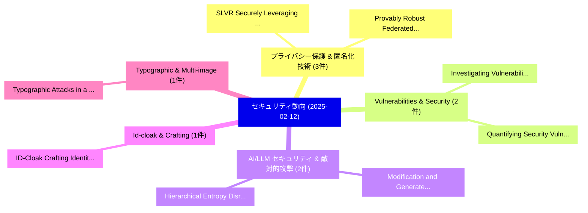

# 📅 02_daily: 日次エグゼクティブサマリー報告書 (2025-02-12)

**集計日時**: 2026-10-02 23:05:16 UTC  
**対象日付**: 2025-02-12  
**本日収集論文数**: 21 件  

---

## 💡 主要セキュリティ動向・脅威インサイト (Executive Insights)

本日の収集論文（計 21 件）において、以下の重点セキュリティ領域で活発な研究動向が確認されました：
- **プライバシー保護 & 匿名化技術** (3 件): 注目論文として 「SLVR: Securely Leveraging Clie...」、「Provably Robust Federated Rein...」 等が発表され、実務防御および攻撃検証の進展が見られます。
- **Vulnerabilities & Security** (2 件): 注目論文として 「Investigating Vulnerabilities ...」、「Quantifying Security Vulnerabi...」 等が発表され、実務防御および攻撃検証の進展が見られます。
- **AI/LLM セキュリティ & 敵対的攻撃** (2 件): 注目論文として 「Modification and Generated-Tex...」、「Hierarchical Entropy Disruptio...」 等が発表され、実務防御および攻撃検証の進展が見られます。
- **Id-cloak & Crafting** (1 件): 注目論文として 「ID-Cloak: Crafting Identity-Sp...」 等が発表され、実務防御および攻撃検証の進展が見られます。
- **Typographic & Multi-image** (1 件): 注目論文として 「Typographic Attacks in a Multi...」 等が発表され、実務防御および攻撃検証の進展が見られます。

### 🗺️ 技術・脅威トピックマインドマップ

---

## 📌 日次セキュリティ論文一覧 (日本語表形式)

| No | arXiv ID | 論文タイトル (日本語訳) | 重要キーワード | 構造化エグゼクティブ要約 (背景・提案・影響) | 脅威分類 | 詳細リンク |
|---|---|---|---|---|---|---|
| 1 | `2502.08055v1` | [SLVR: Securely Leveraging Client Validation for Robust 連合学習](../../okf/papers/2025-02-12/2502.08055.md) | `Securely Leveraging Client Validation`, `Robust Federated Learning`, `Sai Rahul Rachuri` | 【提案】概要 (Overview & Key Finding) 本論文「SLVR: Securely Leveraging Client Validation for Robust ...。実証評価により経営層・セキュリティ管理者向け推奨アクション (E... | `cs.CR` | [arXiv](https://arxiv.org/abs/2502.08055v1) &#124; [OKF](../../okf/papers/2025-02-12/2502.08055.md) |
| 2 | `2502.08097v1` | [ID-Cloak: Crafting Identity-Specific Cloaks Against Personalized Text-to-Image Generation（セキュリティ分析論文）](../../okf/papers/2025-02-12/2502.08097.md) | `Crafting Identity`, `Image Generation`, `Identity-Specific Cloaks` | 【提案】概要 (Overview & Key Finding) 本論文「ID-Cloak: Crafting Identity-Specific Cloaks Against Per...。実証評価により経営層・セキュリティ管理者向け推奨アクション (E... | `cs.CR` | [arXiv](https://arxiv.org/abs/2502.08097v1) &#124; [OKF](../../okf/papers/2025-02-12/2502.08097.md) |
| 3 | `2502.08123v1` | [Provably Robust Federated Reinforcement Learning（セキュリティ分析論文）](../../okf/papers/2025-02-12/2502.08123.md) | `Provably Robust Federated Reinforcement Learning`, `Neil Zhenqiang Gong`, `Minghong Fang` | 【提案】概要 (Overview & Key Finding) 本論文「Provably Robust Federated Reinforcement Learning（セキュリティ...。実証評価により経営層・セキュリティ管理者向け推奨アクション (E... | `cs.CR` | [arXiv](https://arxiv.org/abs/2502.08123v1) &#124; [OKF](../../okf/papers/2025-02-12/2502.08123.md) |
| 4 | `2502.08151v1` | [Local Differential Privacy is Not Enough: A Sample Reconstruction Attack against 連合学習 with Local Differential Privacy](../../okf/papers/2025-02-12/2502.08151.md) | `Local Differential Privacy`, `Sample Reconstruction Attack`, `Federated Learning` | 【提案】背景とセキュリティ上の課題 (Background & Problem) 本研究はサイバー脅威環境におけるセキュリティ構造・脆弱性の検証を目的としています。(主要検出項目: ...。実証評価により経営層・セキュリティ管理者向け推奨アクション (E... | `cs.CR` | [arXiv](https://arxiv.org/abs/2502.08151v1) &#124; [OKF](../../okf/papers/2025-02-12/2502.08151.md) |
| 5 | `2502.08193v1` | [Typographic Attacks in a Multi-Image Setting（セキュリティ分析論文）](../../okf/papers/2025-02-12/2502.08193.md) | `Typographic Attacks`, `Image Setting`, `Multi-Image Setting` | 【提案】概要 (Overview & Key Finding) 本論文「Typographic Attacks in a Multi-Image Setting（セキュリティ分析論文...。実証評価により経営層・セキュリティ管理者向け推奨アクション (E... | `cs.CR` | [arXiv](https://arxiv.org/abs/2502.08193v1) &#124; [OKF](../../okf/papers/2025-02-12/2502.08193.md) |
| 6 | `2502.08217v1` | [Investigating Vulnerabilities of GPS Trip Data to Trajectory-User Linking Attacks（セキュリティ分析論文）](../../okf/papers/2025-02-12/2502.08217.md) | `User Linking Attacks`, `Investigating Vulnerabilities`, `Trip Data` | 【提案】概要 (Overview & Key Finding) 本論文「Investigating Vulnerabilities of GPS Trip Data to Traje...。実証評価により経営層・セキュリティ管理者向け推奨アクション (E... | `cs.CR` | [arXiv](https://arxiv.org/abs/2502.08217v1) &#124; [OKF](../../okf/papers/2025-02-12/2502.08217.md) |
| 7 | `2502.08219v1` | [Tracking Down Software Cluster Bombs: A Current State the Free/Libre and Open Source Software (FLOSS) Ecosystemの分析](../../okf/papers/2025-02-12/2502.08219.md) | `Open Source Software`, `Current State`, `Stefan Tatschner` | 【提案】概要 (Overview & Key Finding) 本論文「Tracking Down Software Cluster Bombs: A Current State t...。実証評価により経営層・セキュリティ管理者向け推奨アクション (E... | `cs.CR` | [arXiv](https://arxiv.org/abs/2502.08219v1) &#124; [OKF](../../okf/papers/2025-02-12/2502.08219.md) |
| 8 | `2502.08240v1` | [Lazy Gatekeepers: A Large-Scale Study on SPF Configuration in the Wild（セキュリティ分析論文）](../../okf/papers/2025-02-12/2502.08240.md) | `Lazy Gatekeepers`, `Stefan Czybik`, `Micha Horlboge` | 【提案】概要 (Overview & Key Finding) 本論文「Lazy Gatekeepers: A Large-Scale Study on SPF Configurat...。実証評価により経営層・セキュリティ管理者向け推奨アクション (E... | `cs.CR` | [arXiv](https://arxiv.org/abs/2502.08240v1) &#124; [OKF](../../okf/papers/2025-02-12/2502.08240.md) |
| 9 | `2502.08332v2` | [Modification and Generated-Text Detection: Achieving Dual Detection Capabilities for the Outputs of LLM by Watermark（セキュリティ分析論文）](../../okf/papers/2025-02-12/2502.08332.md) | `Achieving Dual Detection Capabilities`, `Text Detection`, `Generated-Text Detection` | 【提案】概要 (Overview & Key Finding) 本論文「Modification and Generated-Text Detection: Achieving Du...。実証評価により経営層・セキュリティ管理者向け推奨アクション (E... | `cs.CR` | [arXiv](https://arxiv.org/abs/2502.08332v2) &#124; [OKF](../../okf/papers/2025-02-12/2502.08332.md) |
| 10 | `2502.08341v1` | [SoK: Where to Fuzz? Assessing Target Selection Methods in Directed Fuzzing（セキュリティ分析論文）](../../okf/papers/2025-02-12/2502.08341.md) | `Assessing Target Selection Methods`, `Directed Fuzzing`, `Felix Weissberg` | 【提案】Assessing Target Selection Methods in Directed Fuzzing ### (日本語題名: SoK: Where to Fuzz?。実証評価により経営層・セキュリティ管理者向け推奨アクション (Execu... | `cs.CR` | [arXiv](https://arxiv.org/abs/2502.08341v1) &#124; [OKF](../../okf/papers/2025-02-12/2502.08341.md) |
| 11 | `2502.08401v1` | [Presentations of Racks（セキュリティ分析論文）](../../okf/papers/2025-02-12/2502.08401.md) | `Raw Meta`, `Executive Summary`, `Key Finding` | 【提案】概要 (Overview & Key Finding) 本論文「Presentations of Racks（セキュリティ分析論文）」（原題: Presentations o...。実証評価により経営層・セキュリティ管理者向け推奨アクション (E... | `cs.CR` | [arXiv](https://arxiv.org/abs/2502.08401v1) &#124; [OKF](../../okf/papers/2025-02-12/2502.08401.md) |
| 12 | `2502.08447v1` | [Deserialization Gadget Chains are not a Pathological Problem in Android:an In-Depth Study of Java Gadget Chains in AOSP（セキュリティ分析論文）](../../okf/papers/2025-02-12/2502.08447.md) | `Deserialization Gadget Chains`, `Java Gadget Chains`, `Pathological Problem` | 【提案】背景とセキュリティ上の課題 (Background & Problem) 本研究はサイバー脅威環境におけるセキュリティ構造・脆弱性の検証を目的としています。(主要検出項目: ...。実証評価により経営層・セキュリティ管理者向け推奨アクション (E... | `cs.CR` | [arXiv](https://arxiv.org/abs/2502.08447v1) &#124; [OKF](../../okf/papers/2025-02-12/2502.08447.md) |
| 13 | `2502.08467v1` | [Dancer in the Dark: Synthesizing and Evaluating Polyglots for Blind Cross-Site Scripting（セキュリティ分析論文）](../../okf/papers/2025-02-12/2502.08467.md) | `Evaluating Polyglots`, `Blind Cross`, `Site Scripting` | 【提案】概要 (Overview & Key Finding) 本論文「Dancer in the Dark: Synthesizing and Evaluating Polyglo...。実証評価により経営層・セキュリティ管理者向け推奨アクション (E... | `cs.CR` | [arXiv](https://arxiv.org/abs/2502.08467v1) &#124; [OKF](../../okf/papers/2025-02-12/2502.08467.md) |
| 14 | `2502.08535v5` | [The Forest Behind the Tree: Revealing Hidden Smart Home Communication Patterns（セキュリティ分析論文）](../../okf/papers/2025-02-12/2502.08535.md) | `Revealing Hidden Smart Home Communication Patterns`, `De Keersmaeker`, `Van Boxem` | 【提案】概要 (Overview & Key Finding) 本論文「The Forest Behind the Tree: Revealing Hidden Smart Home...。実証評価により経営層・セキュリティ管理者向け推奨アクション (E... | `cs.CR` | [arXiv](https://arxiv.org/abs/2502.08535v5) &#124; [OKF](../../okf/papers/2025-02-12/2502.08535.md) |
| 15 | `2502.08610v2` | [Quantifying Security Vulnerabilities: A Metric-Driven Security Gaps in Current AI Standardsの分析](../../okf/papers/2025-02-12/2502.08610.md) | `Quantifying Security Vulnerabilities`, `Metric-Driven Security`, `Driven Security Gaps` | 【提案】概要 (Overview & Key Finding) 本論文「Quantifying Security Vulnerabilities: A Metric-Driven S...。実証評価により経営層・セキュリティ管理者向け推奨アクション (E... | `cs.CR` | [arXiv](https://arxiv.org/abs/2502.08610v2) &#124; [OKF](../../okf/papers/2025-02-12/2502.08610.md) |
| 16 | `2502.08679v4` | [Deep Learning-Driven Malware Classification with API Call Sequence Analysis and Concept Drift Handling（セキュリティ分析論文）](../../okf/papers/2025-02-12/2502.08679.md) | `Driven Malware Classification`, `Concept Drift Handling`, `Deep Learning` | 【提案】概要 (Overview & Key Finding) 本論文「Deep Learning-Driven マルウェア Classification with API Call...。実証評価により経営層・セキュリティ管理者向け推奨アクション (E... | `cs.CR` | [arXiv](https://arxiv.org/abs/2502.08679v4) &#124; [OKF](../../okf/papers/2025-02-12/2502.08679.md) |
| 17 | `2502.08830v1` | [Investigation of Advanced Persistent Threats Network-based Tactics, Techniques and Procedures（セキュリティ分析論文）](../../okf/papers/2025-02-12/2502.08830.md) | `Advanced Persistent Threats Network`, `Network-based Tactics`, `Imperial College London` | 【提案】概要 (Overview & Key Finding) 本論文「Investigation of Advanced Persistent Threats Network-ba...。実証評価により経営層・セキュリティ管理者向け推奨アクション (E... | `cs.CR` | [arXiv](https://arxiv.org/abs/2502.08830v1) &#124; [OKF](../../okf/papers/2025-02-12/2502.08830.md) |
| 18 | `2502.08832v2` | [LSM Trees in Adversarial Environments（セキュリティ分析論文）](../../okf/papers/2025-02-12/2502.08832.md) | `Adversarial Environments`, `Hayder Tirmazi`, `Raw Meta` | 【提案】概要 (Overview & Key Finding) 本論文「LSM Trees in Adversarial Environments（セキュリティ分析論文）」（原題: ...。実証評価により経営層・セキュリティ管理者向け推奨アクション (E... | `cs.CR` | [arXiv](https://arxiv.org/abs/2502.08832v2) &#124; [OKF](../../okf/papers/2025-02-12/2502.08832.md) |
| 19 | `2502.08843v2` | [Hierarchical Entropy Disruption for Ransomware Detection: A Computationally-Driven Framework（セキュリティ分析論文）](../../okf/papers/2025-02-12/2502.08843.md) | `Hierarchical Entropy Disruption`, `Ransomware Detection`, `Hayden Srynn` | 【提案】概要 (Overview & Key Finding) 本論文「Hierarchical Entropy Disruption for ランサムウェア Detection: ...。実証評価により経営層・セキュリティ管理者向け推奨アクション (E... | `cs.CR` | [arXiv](https://arxiv.org/abs/2502.08843v2) &#124; [OKF](../../okf/papers/2025-02-12/2502.08843.md) |
| 20 | `2502.10453v1` | [Linking Cryptoasset Attribution Tags to Knowledge Graph Entities: An LLM-based Approach（セキュリティ分析論文）](../../okf/papers/2025-02-12/2502.10453.md) | `Linking Cryptoasset Attribution Tags`, `Knowledge Graph Entities`, `Bernhard Haslhofer` | 【提案】概要 (Overview & Key Finding) 本論文「Linking Cryptoasset Attribution Tags to Knowledge Graph...。実証評価により経営層・セキュリティ管理者向け推奨アクション (E... | `cs.CR` | [arXiv](https://arxiv.org/abs/2502.10453v1) &#124; [OKF](../../okf/papers/2025-02-12/2502.10453.md) |
| 21 | `2502.10465v1` | [Image Watermarking of Generative Diffusion Models（セキュリティ分析論文）](../../okf/papers/2025-02-12/2502.10465.md) | `Generative Diffusion Models`, `Image Watermarking`, `Nur Al Hasan Haldar` | 【提案】概要 (Overview & Key Finding) 本論文「Image Watermarking of Generative Diffusion Models（セキュリテ...。実証評価により経営層・セキュリティ管理者向け推奨アクション (E... | `cs.CR` | [arXiv](https://arxiv.org/abs/2502.10465v1) &#124; [OKF](../../okf/papers/2025-02-12/2502.10465.md) |

