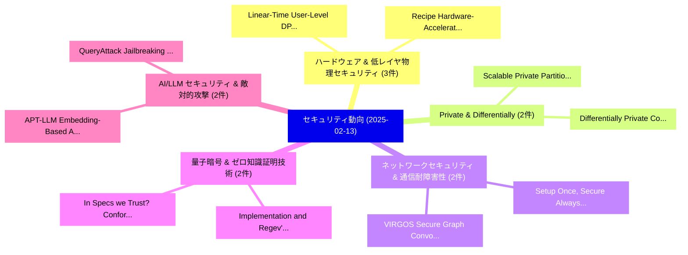

# 📅 02_daily: 日次エグゼクティブサマリー報告書 (2025-02-13)

**集計日時**: 2026-10-02 23:05:17 UTC  
**対象日付**: 2025-02-13  
**本日収集論文数**: 33 件  

---

## 💡 主要セキュリティ動向・脅威インサイト (Executive Insights)

本日の収集論文（計 33 件）において、以下の重点セキュリティ領域で活発な研究動向が確認されました：
- **ハードウェア & 低レイヤ物理セキュリティ** (3 件): 注目論文として 「Linear-Time User-Level DP-SCO ...」、「Recipe: Hardware-Accelerated R...」 等が発表され、実務防御および攻撃検証の進展が見られます。
- **Private & Differentially** (2 件): 注目論文として 「Scalable Private Partition Sel...」、「Differentially Private Compres...」 等が発表され、実務防御および攻撃検証の進展が見られます。
- **ネットワークセキュリティ & 通信耐障害性** (2 件): 注目論文として 「Setup Once, Secure Always: A S...」、「VIRGOS: Secure Graph Convoluti...」 等が発表され、実務防御および攻撃検証の進展が見られます。
- **量子暗号 & ゼロ知識証明技術** (2 件): 注目論文として 「In Specs we Trust? Conformance...」、「Implementation and Regev's Qua...」 等が発表され、実務防御および攻撃検証の進展が見られます。
- **AI/LLM セキュリティ & 敵対的攻撃** (2 件): 注目論文として 「APT-LLM: Embedding-Based Anoma...」、「QueryAttack: Jailbreaking Alig...」 等が発表され、実務防御および攻撃検証の進展が見られます。

### 🗺️ 技術・脅威トピックマインドマップ

---

## 📌 日次セキュリティ論文一覧 (日本語表形式)

| No | arXiv ID | 論文タイトル (日本語訳) | 重要キーワード | 構造化エグゼクティブ要約 (背景・提案・影響) | 脅威分類 | 詳細リンク |
|---|---|---|---|---|---|---|
| 1 | `2502.08865v2` | [Siren Song: Manipulating Pose Estimation in XR Headsets Using Acoustic Attacks（セキュリティ分析論文）](../../okf/papers/2025-02-13/2502.08865.md) | `Headsets Using Acoustic Attacks`, `Manipulating Pose Estimation`, `Siren Song` | 【提案】概要 (Overview & Key Finding) 本論文「Siren Song: Manipulating Pose Estimation in XR Headsets...。実証評価により経営層・セキュリティ管理者向け推奨アクション (E... | `cs.CR` | [arXiv](https://arxiv.org/abs/2502.08865v2) &#124; [OKF](../../okf/papers/2025-02-13/2502.08865.md) |
| 2 | `2502.08878v2` | [Scalable Private Partition Selection via Adaptive Weighting（セキュリティ分析論文）](../../okf/papers/2025-02-13/2502.08878.md) | `Scalable Private Partition Selection`, `Adaptive Weighting`, `Vincent Cohen` | 【提案】概要 (Overview & Key Finding) 本論文「Scalable Private Partition Selection via Adaptive Weigh...。実証評価によりChen, Vincent Cohen-Addad... | `cs.CR` | [arXiv](https://arxiv.org/abs/2502.08878v2) &#124; [OKF](../../okf/papers/2025-02-13/2502.08878.md) |
| 3 | `2502.08886v1` | [Generative AI for Internet of Things Security: Challenges and Opportunities（セキュリティ分析論文）](../../okf/papers/2025-02-13/2502.08886.md) | `Things Security`, `Yan Lin Aung`, `Ivan Christian` | 【提案】概要 (Overview & Key Finding) 本論文「Generative AI for Internet of Things Security: Challeng...。実証評価により経営層・セキュリティ管理者向け推奨アクション (E... | `cs.CR` | [arXiv](https://arxiv.org/abs/2502.08886v1) &#124; [OKF](../../okf/papers/2025-02-13/2502.08886.md) |
| 4 | `2502.08889v1` | [Linear-Time User-Level DP-SCO via Robust Statistics（セキュリティ分析論文）](../../okf/papers/2025-02-13/2502.08889.md) | `Time User`, `Robust Statistics`, `Linear-Time User` | 【提案】概要 (Overview & Key Finding) 本論文「Linear-Time User-Level DP-SCO via Robust Statistics（セキュ...。実証評価により経営層・セキュリティ管理者向け推奨アクション (E... | `cs.CR` | [arXiv](https://arxiv.org/abs/2502.08889v1) &#124; [OKF](../../okf/papers/2025-02-13/2502.08889.md) |
| 5 | `2502.08921v2` | [Detecting Malicious Concepts without Image Generation in AI-Generated Content (AIGC)（セキュリティ分析論文）](../../okf/papers/2025-02-13/2502.08921.md) | `Detecting Malicious Concepts`, `Image Generation`, `Generated Content` | 【提案】背景とセキュリティ上の課題 (Background & Problem) 本研究はサイバー脅威環境におけるセキュリティ構造・脆弱性の検証を目的としています。(主要検出項目: ...。実証評価により経営層・セキュリティ管理者向け推奨アクション (E... | `cs.CR` | [arXiv](https://arxiv.org/abs/2502.08921v2) &#124; [OKF](../../okf/papers/2025-02-13/2502.08921.md) |
| 6 | `2502.08966v2` | [RTBAS: Defending LLMエージェント Against Prompt Injection and Privacy Leakage](../../okf/papers/2025-02-13/2502.08966.md) | `Privacy Leakage`, `Peter Yong Zhong`, `Siyuan Chen` | 【提案】概要 (Overview & Key Finding) 本論文「RTBAS: Defending LLMエージェント Against プロンプトインジェクション and Pr...。実証評価により経営層・セキュリティ管理者向け推奨アクション (E... | `cs.CR` | [arXiv](https://arxiv.org/abs/2502.08966v2) &#124; [OKF](../../okf/papers/2025-02-13/2502.08966.md) |
| 7 | `2502.08970v2` | [A Decade of Metric Differential Privacy: Advancements and Applications（セキュリティ分析論文）](../../okf/papers/2025-02-13/2502.08970.md) | `Metric Differential Privacy`, `Xinpeng Xie`, `Chenyang Yu` | 【提案】概要 (Overview & Key Finding) 本論文「A Decade of Metric 差分プライバシー: Advancements and Applicati...。実証評価により経営層・セキュリティ管理者向け推奨アクション (E... | `cs.CR` | [arXiv](https://arxiv.org/abs/2502.08970v2) &#124; [OKF](../../okf/papers/2025-02-13/2502.08970.md) |
| 8 | `2502.08989v4` | [Setup Once, Secure Always: A Single-Setup Secure 連合学習 Aggregation Protocol with Forward and Backward Secrecy for Dynamic Users](../../okf/papers/2025-02-13/2502.08989.md) | `Secure Always`, `Backward Secrecy`, `Dynamic Users` | 【提案】概要 (Overview & Key Finding) 本論文「Setup Once, Secure Always: A Single-Setup Secure 連合学習 A...。実証評価により経営層・セキュリティ管理者向け推奨アクション (E... | `cs.CR` | [arXiv](https://arxiv.org/abs/2502.08989v4) &#124; [OKF](../../okf/papers/2025-02-13/2502.08989.md) |
| 9 | `2502.09084v1` | [Application of Tabular Transformer Architectures for Operating System Fingerprinting（セキュリティ分析論文）](../../okf/papers/2025-02-13/2502.09084.md) | `Tabular Transformer Architectures`, `Operating System Fingerprinting`, `Tabular Transformer Archi` | 【提案】概要 (Overview & Key Finding) 本論文「Application of Tabular Transformer Architectures for Op...。実証評価により経営層・セキュリティ管理者向け推奨アクション (E... | `cs.CR` | [arXiv](https://arxiv.org/abs/2502.09084v1) &#124; [OKF](../../okf/papers/2025-02-13/2502.09084.md) |
| 10 | `2502.09117v1` | [In Specs we Trust? Conformance-Implementation to Specifications in Node-RED and Associated Security Risksの分析](../../okf/papers/2025-02-13/2502.09117.md) | `Associated Security Risks`, `Associated Security`, `Simon Schneider` | 【提案】Conformance-Analysis of Implementation to Specifications in Node-RED and Associated Sec...。実証評価により経営層・セキュリティ管理者向け推奨アクション (E... | `cs.CR` | [arXiv](https://arxiv.org/abs/2502.09117v1) &#124; [OKF](../../okf/papers/2025-02-13/2502.09117.md) |
| 11 | `2502.09139v3` | [Zebrafix: InterleavingによるMemory-Centric Side-Channel Leakageの軽減](../../okf/papers/2025-02-13/2502.09139.md) | `Centric Side`, `Mitigating Memory`, `Channel Leakage` | 【提案】概要 (Overview & Key Finding) 本論文「Zebrafix: InterleavingによるMemory-Centric サイドチャネル攻撃 Leaka...。実証評価により経営層・セキュリティ管理者向け推奨アクション (E... | `cs.CR` | [arXiv](https://arxiv.org/abs/2502.09139v3) &#124; [OKF](../../okf/papers/2025-02-13/2502.09139.md) |
| 12 | `2502.09175v1` | [FLAME: Flexible LLM-Assisted Moderation Engine（セキュリティ分析論文）](../../okf/papers/2025-02-13/2502.09175.md) | `Assisted Moderation Engine`, `LLM-Assisted Moderation`, `Ivan Bakulin` | 【提案】概要 (Overview & Key Finding) 本論文「FLAME: Flexible LLM-Assisted Moderation Engine（セキュリティ分析...。実証評価により経営層・セキュリティ管理者向け推奨アクション (E... | `cs.CR` | [arXiv](https://arxiv.org/abs/2502.09175v1) &#124; [OKF](../../okf/papers/2025-02-13/2502.09175.md) |
| 13 | `2502.09201v2` | [Commitment Schemes from OWFs with Applications to Quantum Oblivious Transfer（セキュリティ分析論文）](../../okf/papers/2025-02-13/2502.09201.md) | `Quantum Oblivious Transfer`, `Commitment Schemes`, `Sebastian Ramacher` | 【提案】概要 (Overview & Key Finding) 本論文「Commitment Schemes from OWFs with Applications to 量子 Ob...。実証評価により経営層・セキュリティ管理者向け推奨アクション (E... | `cs.CR` | [arXiv](https://arxiv.org/abs/2502.09201v2) &#124; [OKF](../../okf/papers/2025-02-13/2502.09201.md) |
| 14 | `2502.09225v1` | [A Coq Formalization of Unification Modulo Exclusive-Or（セキュリティ分析論文）](../../okf/papers/2025-02-13/2502.09225.md) | `Unification Modulo Exclusive`, `Coq Formalization`, `Yichi Xu` | 【提案】概要 (Overview & Key Finding) 本論文「A Coq Formalization of Unification Modulo Exclusive-Or（...。実証評価によりDougherty, Rose Bohrer - ... | `cs.CR` | [arXiv](https://arxiv.org/abs/2502.09225v1) &#124; [OKF](../../okf/papers/2025-02-13/2502.09225.md) |
| 15 | `2502.09251v1` | [Recipe: Hardware-Accelerated Replication Protocols（セキュリティ分析論文）](../../okf/papers/2025-02-13/2502.09251.md) | `Accelerated Replication Protocols`, `Hardware-Accelerated Replication`, `Dimitra Giantsidi` | 【提案】概要 (Overview & Key Finding) 本論文「Recipe: Hardware-Accelerated Replication Protocols（セキュリ...。実証評価により経営層・セキュリティ管理者向け推奨アクション (E... | `cs.CR` | [arXiv](https://arxiv.org/abs/2502.09251v1) &#124; [OKF](../../okf/papers/2025-02-13/2502.09251.md) |
| 16 | `2502.09385v1` | [APT-LLM: Embedding-Based Anomaly Cyber Advanced Persistent Threats Using Large Language Modelsの検出](../../okf/papers/2025-02-13/2502.09385.md) | `Based Anomaly Cyber Advanced Persistent Threats Using Large Language`, `Embedding-Based Anomaly`, `Cyber Advanced Persistent Threats Using Large Language Models` | 【提案】概要 (Overview & Key Finding) 本論文「APT-LLM: Embedding-Based Anomaly Cyber Advanced Persist...。実証評価により経営層・セキュリティ管理者向け推奨アクション (E... | `cs.CR` | [arXiv](https://arxiv.org/abs/2502.09385v1) &#124; [OKF](../../okf/papers/2025-02-13/2502.09385.md) |
| 17 | `2502.09396v2` | [A hierarchical approach for assessing the vulnerability of tree-based classification models to membership inference attack（セキュリティ分析論文）](../../okf/papers/2025-02-13/2502.09396.md) | `tree-based classification`, `Jim Smith`, `Raw Meta` | 【提案】概要 (Overview & Key Finding) 本論文「A hierarchical approach for assessing the 脆弱性 of tree-b...。実証評価により経営層・セキュリティ管理者向け推奨アクション (E... | `cs.CR` | [arXiv](https://arxiv.org/abs/2502.09396v2) &#124; [OKF](../../okf/papers/2025-02-13/2502.09396.md) |
| 18 | `2502.09484v1` | [PenTest++: Elevating Ethical Hacking with AI and Automation（セキュリティ分析論文）](../../okf/papers/2025-02-13/2502.09484.md) | `Elevating Ethical Hacking`, `Raw Meta`, `Executive Summary` | 【提案】概要 (Overview & Key Finding) 本論文「PenTest++: Elevating Ethical Hacking with AI and Automa...。実証評価によりMitchell - **公開日時**: `202... | `cs.CR` | [arXiv](https://arxiv.org/abs/2502.09484v1) &#124; [OKF](../../okf/papers/2025-02-13/2502.09484.md) |
| 19 | `2502.09535v12` | [Entropy Collapse in Mobile Sensors: The Hidden Risks of Sensor-Based Security（セキュリティ分析論文）](../../okf/papers/2025-02-13/2502.09535.md) | `Entropy Collapse`, `Mobile Sensors`, `Based Security` | 【提案】概要 (Overview & Key Finding) 本論文「Entropy Collapse in Mobile Sensors: The Hidden Risks of...。実証評価により経営層・セキュリティ管理者向け推奨アクション (E... | `cs.CR` | [arXiv](https://arxiv.org/abs/2502.09535v12) &#124; [OKF](../../okf/papers/2025-02-13/2502.09535.md) |
| 20 | `2502.09549v2` | [Registration, Detection, and Deregistration: Analyzing DNS Abuse for Phishing Attacks（セキュリティ分析論文）](../../okf/papers/2025-02-13/2502.09549.md) | `Phishing Attacks`, `Kyungchan Lim`, `Raffaele Sommese` | 【提案】概要 (Overview & Key Finding) 本論文「Registration, Detection, and Deregistration: Analyzing ...。実証評価により経営層・セキュリティ管理者向け推奨アクション (E... | `cs.CR` | [arXiv](https://arxiv.org/abs/2502.09549v2) &#124; [OKF](../../okf/papers/2025-02-13/2502.09549.md) |
| 21 | `2502.09553v1` | [SyntheticPop: Attacking Speaker Verification Systems With Synthetic VoicePops（セキュリティ分析論文）](../../okf/papers/2025-02-13/2502.09553.md) | `Amith Kamath Belman`, `Eshaq Jamdar`, `Raw Meta` | 【提案】概要 (Overview & Key Finding) 本論文「SyntheticPop: Attacking Speaker Verification Systems Wi...。実証評価により経営層・セキュリティ管理者向け推奨アクション (E... | `cs.CR` | [arXiv](https://arxiv.org/abs/2502.09553v1) &#124; [OKF](../../okf/papers/2025-02-13/2502.09553.md) |
| 22 | `2502.09584v3` | [Differentially Private Compression and the Sensitivity of LZ77（セキュリティ分析論文）](../../okf/papers/2025-02-13/2502.09584.md) | `Differentially Private Compression`, `Jeremiah Blocki`, `Seunghoon Lee` | 【提案】概要 (Overview & Key Finding) 本論文「Differentially Private Compression and the Sensitivity ...。実証評価により経営層・セキュリティ管理者向け推奨アクション (E... | `cs.CR` | [arXiv](https://arxiv.org/abs/2502.09584v3) &#124; [OKF](../../okf/papers/2025-02-13/2502.09584.md) |
| 23 | `2502.09723v3` | [QueryAttack: Jailbreaking Aligned 大規模言語モデル Using Structured Non-natural Query Language](../../okf/papers/2025-02-13/2502.09723.md) | `Jailbreaking Aligned Large Language Models Using Structured Non`, `Query Language`, `Non-natural Query` | 【提案】概要 (Overview & Key Finding) 本論文「QueryAttack: ジェイルブレイクing Aligned 大規模言語モデル Using Structu...。実証評価により経営層・セキュリティ管理者向け推奨アクション (E... | `cs.CR` | [arXiv](https://arxiv.org/abs/2502.09723v3) &#124; [OKF](../../okf/papers/2025-02-13/2502.09723.md) |
| 24 | `2502.09726v1` | [Robust and Secure DNS Protocols for IoT Devicesの分析](../../okf/papers/2025-02-13/2502.09726.md) | `Abdullah Aydeger`, `Sanzida Hoque`, `Engin Zeydan` | 【提案】概要 (Overview & Key Finding) 本論文「Robust and Secure DNS Protocols for IoT Devicesの分析」（原題:...。実証評価により経営層・セキュリティ管理者向け推奨アクション (E... | `cs.CR` | [arXiv](https://arxiv.org/abs/2502.09726v1) &#124; [OKF](../../okf/papers/2025-02-13/2502.09726.md) |
| 25 | `2502.09744v1` | [Fine-Tuning Foundation Models with 連合学習 for Privacy Preserving Medical Time Series Forecasting](../../okf/papers/2025-02-13/2502.09744.md) | `Privacy Preserving Medical Time Series Forecasting`, `Tuning Foundation Models`, `Fine-Tuning Foundation` | 【提案】概要 (Overview & Key Finding) 本論文「Fine-Tuning Foundation Models with 連合学習 for Privacy Pre...。実証評価により経営層・セキュリティ管理者向け推奨アクション (E... | `cs.CR` | [arXiv](https://arxiv.org/abs/2502.09744v1) &#124; [OKF](../../okf/papers/2025-02-13/2502.09744.md) |
| 26 | `2502.09755v4` | [Jailbreak Attack Initializations as Extractors of Compliance Directions（セキュリティ分析論文）](../../okf/papers/2025-02-13/2502.09755.md) | `Jailbreak Attack Initializations`, `Compliance Directions`, `Amit Levi` | 【提案】概要 (Overview & Key Finding) 本論文「ジェイルブレイク Attack Initializations as Extractors of Compli...。実証評価により経営層・セキュリティ管理者向け推奨アクション (E... | `cs.CR` | [arXiv](https://arxiv.org/abs/2502.09755v4) &#124; [OKF](../../okf/papers/2025-02-13/2502.09755.md) |
| 27 | `2502.09763v1` | [SoK: Come Together -- Unifying Security, Information Theory, and Cognition for a Mixed Reality Deception Attack Ontology & Analysis Framework（セキュリティ分析論文）](../../okf/papers/2025-02-13/2502.09763.md) | `Mixed Reality Deception Attack Ontology`, `Come Together`, `Unifying Security` | 【提案】概要 (Overview & Key Finding) 本論文「SoK: Come Together -- Unifying Security, Information Th...。実証評価により経営層・セキュリティ管理者向け推奨アクション (E... | `cs.CR` | [arXiv](https://arxiv.org/abs/2502.09763v1) &#124; [OKF](../../okf/papers/2025-02-13/2502.09763.md) |
| 28 | `2502.09772v2` | [Implementation and Regev's Quantum Factorization Algorithmの分析](../../okf/papers/2025-02-13/2502.09772.md) | `Quantum Factorization Algorithm`, `Quantum Factorization`, `Marcin Niemiec` | 【提案】概要 (Overview & Key Finding) 本論文「Implementation and Regev's 量子 Factorization Algorithmの分...。実証評価により経営層・セキュリティ管理者向け推奨アクション (E... | `cs.CR` | [arXiv](https://arxiv.org/abs/2502.09772v2) &#124; [OKF](../../okf/papers/2025-02-13/2502.09772.md) |
| 29 | `2502.09788v1` | [MANTIS: Zero-Day Malicious Domains Leveraging Low Reputed Hosting Infrastructureの検出](../../okf/papers/2025-02-13/2502.09788.md) | `Day Malicious Domains Leveraging Low Reputed Hosting Infrastructure`, `Zero-Day Malicious`, `Day Malicious Domains Leveraging Low Reputed Hosting` | 【提案】概要 (Overview & Key Finding) 本論文「MANTIS: Zero-Day Malicious Domains Leveraging Low Reput...。実証評価により経営層・セキュリティ管理者向け推奨アクション (E... | `cs.CR` | [arXiv](https://arxiv.org/abs/2502.09788v1) &#124; [OKF](../../okf/papers/2025-02-13/2502.09788.md) |
| 30 | `2502.09808v1` | [VIRGOS: Secure Graph Convolutional Network on Vertically Split Data from Sparse Matrix Decomposition（セキュリティ分析論文）](../../okf/papers/2025-02-13/2502.09808.md) | `Secure Graph Convolutional Network`, `Vertically Split Data`, `Sparse Matrix Decomposition` | 【提案】概要 (Overview & Key Finding) 本論文「VIRGOS: Secure Graph Convolutional Network on Verticall...。実証評価により経営層・セキュリティ管理者向け推奨アクション (E... | `cs.CR` | [arXiv](https://arxiv.org/abs/2502.09808v1) &#124; [OKF](../../okf/papers/2025-02-13/2502.09808.md) |
| 31 | `2502.09809v1` | [AgentGuard: Repurposing Agentic Orchestrator for Safety Evaluation of Tool Orchestration（セキュリティ分析論文）](../../okf/papers/2025-02-13/2502.09809.md) | `Repurposing Agentic Orchestrator`, `Tool Orchestration`, `Samuel Lee Cong` | 【提案】概要 (Overview & Key Finding) 本論文「AgentGuard: Repurposing Agentic Orchestrator for Safety...。実証評価により経営層・セキュリティ管理者向け推奨アクション (E... | `cs.CR` | [arXiv](https://arxiv.org/abs/2502.09809v1) &#124; [OKF](../../okf/papers/2025-02-13/2502.09809.md) |
| 32 | `2502.09827v2` | [Data and Decision Traceability for SDA TAP Lab's Prototype Battle Management System（セキュリティ分析論文）](../../okf/papers/2025-02-13/2502.09827.md) | `Prototype Battle Management System`, `Decision Traceability`, `Latha Pratti` | 【提案】概要 (Overview & Key Finding) 本論文「Data and Decision Traceability for SDA TAP Lab's Protot...。実証評価により経営層・セキュリティ管理者向け推奨アクション (E... | `cs.CR` | [arXiv](https://arxiv.org/abs/2502.09827v2) &#124; [OKF](../../okf/papers/2025-02-13/2502.09827.md) |
| 33 | `2502.10475v2` | [X-SG$^2$S: Safe and Generalizable Gaussian Splatting with X-dimensional Watermarks（セキュリティ分析論文）](../../okf/papers/2025-02-13/2502.10475.md) | `Generalizable Gaussian Splatting`, `X-dimensional Watermarks`, `Fei Richard Yu` | 【提案】概要 (Overview & Key Finding) 本論文「X-SG$^2$S: Safe and Generalizable Gaussian Splatting wi...。実証評価により経営層・セキュリティ管理者向け推奨アクション (E... | `cs.CR` | [arXiv](https://arxiv.org/abs/2502.10475v2) &#124; [OKF](../../okf/papers/2025-02-13/2502.10475.md) |

