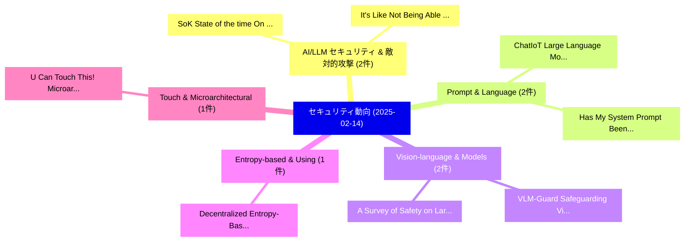

# 📅 02_daily: 日次エグゼクティブサマリー報告書 (2025-02-14)

**集計日時**: 2026-10-02 23:05:17 UTC  
**対象日付**: 2025-02-14  
**本日収集論文数**: 26 件  

---

## 💡 主要セキュリティ動向・脅威インサイト (Executive Insights)

本日の収集論文（計 26 件）において、以下の重点セキュリティ領域で活発な研究動向が確認されました：
- **AI/LLM セキュリティ & 敵対的攻撃** (2 件): 注目論文として 「SoK: State of the time: On Tru...」、「"It's Like Not Being Able to R...」 等が発表され、実務防御および攻撃検証の進展が見られます。
- **Prompt & Language** (2 件): 注目論文として 「ChatIoT: Large Language Model-...」、「Has My System Prompt Been Used...」 等が発表され、実務防御および攻撃検証の進展が見られます。
- **Vision-language & Models** (2 件): 注目論文として 「VLM-Guard: Safeguarding Vision...」、「A Survey of Safety on Large Vi...」 等が発表され、実務防御および攻撃検証の進展が見られます。
- **Entropy-based & Using** (1 件): 注目論文として 「Decentralized Entropy-Based Ra...」 等が発表され、実務防御および攻撃検証の進展が見られます。
- **Touch & Microarchitectural** (1 件): 注目論文として 「U Can Touch This! Microarchite...」 等が発表され、実務防御および攻撃検証の進展が見られます。

### 🗺️ 技術・脅威トピックマインドマップ

---

## 📌 日次セキュリティ論文一覧 (日本語表形式)

| No | arXiv ID | 論文タイトル (日本語訳) | 重要キーワード | 構造化エグゼクティブ要約 (背景・提案・影響) | 脅威分類 | 詳細リンク |
|---|---|---|---|---|---|---|
| 1 | `2502.09833v2` | [Decentralized Entropy-Based Ransomware Detection Using Autonomous Feature Resonance（セキュリティ分析論文）](../../okf/papers/2025-02-14/2502.09833.md) | `Based Ransomware Detection Using Autonomous Feature Resonance`, `Decentralized Entropy`, `Entropy-Based Ransomware` | 【提案】概要 (Overview & Key Finding) 本論文「Decentralized Entropy-Based ランサムウェア Detection Using Aut...。実証評価により経営層・セキュリティ管理者向け推奨アクション (E... | `cs.CR` | [arXiv](https://arxiv.org/abs/2502.09833v2) &#124; [OKF](../../okf/papers/2025-02-14/2502.09833.md) |
| 2 | `2502.09837v1` | [SoK: State of the time: On Trustworthiness of Digital Clocks（セキュリティ分析論文）](../../okf/papers/2025-02-14/2502.09837.md) | `Digital Clocks`, `Adeel Nasrullah`, `Raw Meta` | 【提案】概要 (Overview & Key Finding) 本論文「SoK: State of the time: On Trustworthiness of Digital C...。実証評価によりAnwar - **公開日時**: `2025-。 | `cs.CR` | [arXiv](https://arxiv.org/abs/2502.09837v1) &#124; [OKF](../../okf/papers/2025-02-14/2502.09837.md) |
| 3 | `2502.09864v1` | [U Can Touch This! Microarchitectural Timing Attacks via Machine Clears（セキュリティ分析論文）](../../okf/papers/2025-02-14/2502.09864.md) | `Microarchitectural Timing Attacks`, `Machine Clears`, `Billy Bob Brumley` | 【提案】Microarchitectural Timing Attacks via Machine Clears ### (日本語題名: U Can Touch This!。実証評価により経営層・セキュリティ管理者向け推奨アクション (Executive... | `cs.CR` | [arXiv](https://arxiv.org/abs/2502.09864v1) &#124; [OKF](../../okf/papers/2025-02-14/2502.09864.md) |
| 4 | `2502.09896v1` | [ChatIoT: Large Language Model-based Security Assistant for Internet of Things with Retrieval-Augmented Generation（セキュリティ分析論文）](../../okf/papers/2025-02-14/2502.09896.md) | `Large Language Model`, `Security Assistant`, `Augmented Generation` | 【提案】概要 (Overview & Key Finding) 本論文「ChatIoT: Large Language Model-based Security Assistant ...。実証評価により経営層・セキュリティ管理者向け推奨アクション (E... | `cs.CR` | [arXiv](https://arxiv.org/abs/2502.09896v1) &#124; [OKF](../../okf/papers/2025-02-14/2502.09896.md) |
| 5 | `2502.09941v1` | [A Lightweight and Effective Image Tampering Localization Network with Vision Mamba（セキュリティ分析論文）](../../okf/papers/2025-02-14/2502.09941.md) | `Effective Image Tampering Localization Network`, `Vision Mamba`, `Kun Guo` | 【提案】概要 (Overview & Key Finding) 本論文「A Lightweight and Effective Image Tampering Localizatio...。実証評価により経営層・セキュリティ管理者向け推奨アクション (E... | `cs.CR` | [arXiv](https://arxiv.org/abs/2502.09941v1) &#124; [OKF](../../okf/papers/2025-02-14/2502.09941.md) |
| 6 | `2502.09974v1` | [Has My System Prompt Been Used? Large Language Model Prompt Membership Inference（セキュリティ分析論文）](../../okf/papers/2025-02-14/2502.09974.md) | `Large Language Model Prompt Membership Inference`, `Large Language Model Prompt`, `Roman Levin` | 【提案】Large Language Model Prompt Membership Inference ### (日本語題名: Has My System Prompt Been ...。実証評価により経営層・セキュリティ管理者向け推奨アクション (E... | `cs.CR` | [arXiv](https://arxiv.org/abs/2502.09974v1) &#124; [OKF](../../okf/papers/2025-02-14/2502.09974.md) |
| 7 | `2502.09990v3` | [X-Boundary: Establishing Exact Safety Boundary to Shield LLMs from Multi-Turn Jailbreaks without Compromising Usability（セキュリティ分析論文）](../../okf/papers/2025-02-14/2502.09990.md) | `Establishing Exact Safety Boundary`, `Turn Jailbreaks`, `Compromising Usability` | 【提案】背景とセキュリティ上の課題 (Background & Problem) 本研究はサイバー脅威環境におけるセキュリティ構造・脆弱性の検証を目的としています。(主要検出項目: ...。実証評価により経営層・セキュリティ管理者向け推奨アクション (E... | `cs.CR` | [arXiv](https://arxiv.org/abs/2502.09990v3) &#124; [OKF](../../okf/papers/2025-02-14/2502.09990.md) |
| 8 | `2502.10110v1` | [ScamFerret: Detecting Scam Websites Autonomously with 大規模言語モデル](../../okf/papers/2025-02-14/2502.10110.md) | `Detecting Scam Websites Autonomously`, `Large Language Models`, `Hiroki Nakano` | 【提案】概要 (Overview & Key Finding) 本論文「ScamFerret: Detecting Scam Websites Autonomously with 大...。実証評価により経営層・セキュリティ管理者向け推奨アクション (E... | `cs.CR` | [arXiv](https://arxiv.org/abs/2502.10110v1) &#124; [OKF](../../okf/papers/2025-02-14/2502.10110.md) |
| 9 | `2502.10166v1` | ["It's Like Not Being Able to Read and Write": Narrowing the Digital Divide for Older Adults and Leveraging the Role of Digital Educators in Ireland（セキュリティ分析論文）](../../okf/papers/2025-02-14/2502.10166.md) | `Digital Divide`, `Older Adults`, `Digital Educators` | 【提案】背景とセキュリティ上の課題 (Background & Problem) 本研究はサイバー脅威環境におけるセキュリティ構造・脆弱性の検証を目的としています。(主要検出項目: ...。実証評価により経営層・セキュリティ管理者向け推奨アクション (E... | `cs.CR` | [arXiv](https://arxiv.org/abs/2502.10166v1) &#124; [OKF](../../okf/papers/2025-02-14/2502.10166.md) |
| 10 | `2502.10194v1` | [Translating Common Security Assertions Across Processor Designs: A RISC-V Case Study（セキュリティ分析論文）](../../okf/papers/2025-02-14/2502.10194.md) | `Translating Common Security Assertions Across Processor Designs`, `RISC-V Case`, `Sharjeel Imtiaz` | 【提案】概要 (Overview & Key Finding) 本論文「Translating Common Security Assertions Across Processor...。実証評価により経営層・セキュリティ管理者向け推奨アクション (E... | `cs.CR` | [arXiv](https://arxiv.org/abs/2502.10194v1) &#124; [OKF](../../okf/papers/2025-02-14/2502.10194.md) |
| 11 | `2502.10281v2` | [TrustZero -- open, verifiable and scalable zero-trust（セキュリティ分析論文）](../../okf/papers/2025-02-14/2502.10281.md) | `Tudor Dumitrescu`, `Johan Pouwelse`, `Raw Meta` | 【提案】概要 (Overview & Key Finding) 本論文「TrustZero -- open, verifiable and scalable ゼロトラスト（セキュリテ...。実証評価により経営層・セキュリティ管理者向け推奨アクション (E... | `cs.CR` | [arXiv](https://arxiv.org/abs/2502.10281v2) &#124; [OKF](../../okf/papers/2025-02-14/2502.10281.md) |
| 12 | `2502.10283v1` | [Anomaly Detection with LWE Encrypted Control（セキュリティ分析論文）](../../okf/papers/2025-02-14/2502.10283.md) | `Anomaly Detection`, `Encrypted Control`, `Rijad Alisic` | 【提案】概要 (Overview & Key Finding) 本論文「Anomaly Detection with LWE Encrypted Control（セキュリティ分析論文...。実証評価により経営層・セキュリティ管理者向け推奨アクション (E... | `cs.CR` | [arXiv](https://arxiv.org/abs/2502.10283v1) &#124; [OKF](../../okf/papers/2025-02-14/2502.10283.md) |
| 13 | `2502.10293v1` | [A Roadmap to Address Burnout in the サイバーセキュリティ Profession: Outcomes from a Multifaceted Workshop](../../okf/papers/2025-02-14/2502.10293.md) | `Address Burnout`, `Multifaceted Workshop`, `Cybersecurity Profession` | 【提案】概要 (Overview & Key Finding) 本論文「A Roadmap to Address Burnout in the サイバーセキュリティ Professi...。実証評価により経営層・セキュリティ管理者向け推奨アクション (E... | `cs.CR` | [arXiv](https://arxiv.org/abs/2502.10293v1) &#124; [OKF](../../okf/papers/2025-02-14/2502.10293.md) |
| 14 | `2502.10321v1` | [Dynamic Fraud Proof（セキュリティ分析論文）](../../okf/papers/2025-02-14/2502.10321.md) | `Dynamic Fraud Proof`, `Gabriele Picco`, `Andrea Fortugno` | 【提案】概要 (Overview & Key Finding) 本論文「Dynamic Fraud Proof（セキュリティ分析論文）」（原題: Dynamic Fraud Proo...。実証評価により経営層・セキュリティ管理者向け推奨アクション (E... | `cs.CR` | [arXiv](https://arxiv.org/abs/2502.10321v1) &#124; [OKF](../../okf/papers/2025-02-14/2502.10321.md) |
| 15 | `2502.10329v1` | [VocalCrypt: Novel Active Defense Against Deepfake Voice Based on Masking Effect（セキュリティ分析論文）](../../okf/papers/2025-02-14/2502.10329.md) | `Masking Effect`, `Qingyuan Fei`, `Wenjie Hou` | 【提案】概要 (Overview & Key Finding) 本論文「VocalCrypt: Novel Active Defense Against Deepfake Voice...。実証評価により経営層・セキュリティ管理者向け推奨アクション (E... | `cs.CR` | [arXiv](https://arxiv.org/abs/2502.10329v1) &#124; [OKF](../../okf/papers/2025-02-14/2502.10329.md) |
| 16 | `2502.10390v2` | [(How) Can Transformers Predict Pseudo-Random Numbers?（セキュリティ分析論文）](../../okf/papers/2025-02-14/2502.10390.md) | `Can Transformers Predict Pseudo`, `Random Numbers`, `Pseudo-Random Numbers` | 【提案】### (日本語題名: (How) Can Transformers Predict Pseudo-Random Numbers?（セキュリティ分析論文）)  > [!NOT...。実証評価により経営層・セキュリティ管理者向け推奨アクション (E... | `cs.CR` | [arXiv](https://arxiv.org/abs/2502.10390v2) &#124; [OKF](../../okf/papers/2025-02-14/2502.10390.md) |
| 17 | `2502.10486v1` | [VLM-Guard: Safeguarding Vision-Language Models via Fulfilling Safety Alignment Gap（セキュリティ分析論文）](../../okf/papers/2025-02-14/2502.10486.md) | `Fulfilling Safety Alignment Gap`, `Safeguarding Vision`, `Language Models` | 【提案】概要 (Overview & Key Finding) 本論文「VLM-Guard: Safeguarding Vision-Language Models via Fulf...。実証評価により経営層・セキュリティ管理者向け推奨アクション (E... | `cs.CR` | [arXiv](https://arxiv.org/abs/2502.10486v1) &#124; [OKF](../../okf/papers/2025-02-14/2502.10486.md) |
| 18 | `2502.10487v1` | [Fast Proxies for LLM Robustness Evaluation（セキュリティ分析論文）](../../okf/papers/2025-02-14/2502.10487.md) | `Fast Proxies`, `Tim Beyer`, `Jan Schuchardt` | 【提案】概要 (Overview & Key Finding) 本論文「Fast Proxies for LLM Robustness Evaluation（セキュリティ分析論文）」...。実証評価により# Fast Proxies for LLM Ro... | `cs.CR` | [arXiv](https://arxiv.org/abs/2502.10487v1) &#124; [OKF](../../okf/papers/2025-02-14/2502.10487.md) |
| 19 | `2502.10490v1` | [A Robust Attack: Displacement Backdoor Attack（セキュリティ分析論文）](../../okf/papers/2025-02-14/2502.10490.md) | `Displacement Backdoor Attack`, `Robust Attack`, `Yong Li` | 【提案】概要 (Overview & Key Finding) 本論文「A Robust Attack: Displacement Backdoor Attack（セキュリティ分析論...。実証評価により経営層・セキュリティ管理者向け推奨アクション (E... | `cs.CR` | [arXiv](https://arxiv.org/abs/2502.10490v1) &#124; [OKF](../../okf/papers/2025-02-14/2502.10490.md) |
| 20 | `2502.10495v2` | [SWA-LDM: Toward Stealthy Watermarks for Latent Diffusion Models（セキュリティ分析論文）](../../okf/papers/2025-02-14/2502.10495.md) | `Toward Stealthy Watermarks`, `Latent Diffusion Models`, `Zhonghao Yang` | 【提案】概要 (Overview & Key Finding) 本論文「SWA-LDM: Toward Stealthy Watermarks for Latent Diffusio...。実証評価により経営層・セキュリティ管理者向け推奨アクション (E... | `cs.CR` | [arXiv](https://arxiv.org/abs/2502.10495v2) &#124; [OKF](../../okf/papers/2025-02-14/2502.10495.md) |
| 21 | `2502.10512v2` | [Price manipulation schemes of new crypto-tokens in decentralized exchanges（セキュリティ分析論文）](../../okf/papers/2025-02-14/2502.10512.md) | `Manuel Naviglio`, `Francesco Tarantelli`, `Fabrizio Lillo` | 【提案】概要 (Overview & Key Finding) 本論文「Price manipulation schemes of new crypto-tokens in dece...。実証評価により経営層・セキュリティ管理者向け推奨アクション (E... | `cs.CR` | [arXiv](https://arxiv.org/abs/2502.10512v2) &#124; [OKF](../../okf/papers/2025-02-14/2502.10512.md) |
| 22 | `2502.10525v1` | [Watermarking of Open-Source LLMsに向けて](../../okf/papers/2025-02-14/2502.10525.md) | `Towards Watermarking`, `Open-Source LLMs`, `Thibaud Gloaguen` | 【提案】概要 (Overview & Key Finding) 本論文「Watermarking of Open-Source LLMsに向けて」（原題: Towards Water...。実証評価により経営層・セキュリティ管理者向け推奨アクション (E... | `cs.CR` | [arXiv](https://arxiv.org/abs/2502.10525v1) &#124; [OKF](../../okf/papers/2025-02-14/2502.10525.md) |
| 23 | `2502.10538v2` | [Amortized Locally Decodable Codes（セキュリティ分析論文）](../../okf/papers/2025-02-14/2502.10538.md) | `Amortized Locally Decodable Codes`, `Jeremiah Blocki`, `Justin Zhang` | 【提案】概要 (Overview & Key Finding) 本論文「Amortized Locally Decodable Codes（セキュリティ分析論文）」（原題: Amor...。実証評価により経営層・セキュリティ管理者向け推奨アクション (E... | `cs.CR` | [arXiv](https://arxiv.org/abs/2502.10538v2) &#124; [OKF](../../okf/papers/2025-02-14/2502.10538.md) |
| 24 | `2502.10556v2` | [Recent Advances in マルウェア検出: Graph Learning and Explainability](../../okf/papers/2025-02-14/2502.10556.md) | `Recent Advances`, `Graph Learning`, `Malware Detection` | 【提案】概要 (Overview & Key Finding) 本論文「Recent Advances in マルウェア検出: Graph Learning and Explaina...。実証評価により経営層・セキュリティ管理者向け推奨アクション (E... | `cs.CR` | [arXiv](https://arxiv.org/abs/2502.10556v2) &#124; [OKF](../../okf/papers/2025-02-14/2502.10556.md) |
| 25 | `2502.10599v1` | [Federated Learning-Driven サイバーセキュリティ Framework for IoT Networks with Privacy-Preserving and Real-Time Threat Detection Capabilities](../../okf/papers/2025-02-14/2502.10599.md) | `Time Threat Detection Capabilities`, `Federated Learning`, `Real-Time Threat` | 【提案】概要 (Overview & Key Finding) 本論文「Federated Learning-Driven サイバーセキュリティ Framework for IoT ...。実証評価により経営層・セキュリティ管理者向け推奨アクション (E... | `cs.CR` | [arXiv](https://arxiv.org/abs/2502.10599v1) &#124; [OKF](../../okf/papers/2025-02-14/2502.10599.md) |
| 26 | `2502.14881v1` | [A Survey of Safety on Large Vision-Language Models: Attacks, Defenses and Evaluations（セキュリティ分析論文）](../../okf/papers/2025-02-14/2502.14881.md) | `Large Vision`, `Language Models`, `Vision-Language Models` | 【提案】概要 (Overview & Key Finding) 本論文「A Survey of Safety on Large Vision-Language Models: Att...。実証評価により経営層・セキュリティ管理者向け推奨アクション (E... | `cs.CR` | [arXiv](https://arxiv.org/abs/2502.14881v1) &#124; [OKF](../../okf/papers/2025-02-14/2502.14881.md) |

