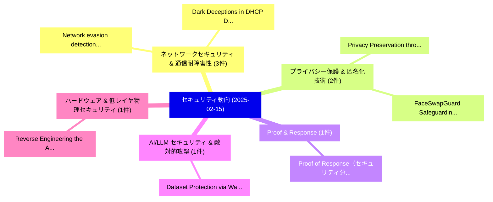

# 📅 02_daily: 日次エグゼクティブサマリー報告書 (2025-02-15)

**集計日時**: 2026-10-02 23:05:17 UTC  
**対象日付**: 2025-02-15  
**本日収集論文数**: 14 件  

---

## 💡 主要セキュリティ動向・脅威インサイト (Executive Insights)

本日の収集論文（計 14 件）において、以下の重点セキュリティ領域で活発な研究動向が確認されました：
- **ネットワークセキュリティ & 通信耐障害性** (3 件): 注目論文として 「Network evasion detection with...」、「Dark Deceptions in DHCP: Disma...」 等が発表され、実務防御および攻撃検証の進展が見られます。
- **プライバシー保護 & 匿名化技術** (2 件): 注目論文として 「Privacy Preservation through P...」、「FaceSwapGuard: Safeguarding Fa...」 等が発表され、実務防御および攻撃検証の進展が見られます。
- **Proof & Response** (1 件): 注目論文として 「Proof of Response（セキュリティ分析論文）」 等が発表され、実務防御および攻撃検証の進展が見られます。
- **AI/LLM セキュリティ & 敵対的攻撃** (1 件): 注目論文として 「Dataset Protection via Waterma...」 等が発表され、実務防御および攻撃検証の進展が見られます。
- **ハードウェア & 低レイヤ物理セキュリティ** (1 件): 注目論文として 「Reverse Engineering the Apple ...」 等が発表され、実務防御および攻撃検証の進展が見られます。

### 🗺️ 技術・脅威トピックマインドマップ

---

## 📌 日次セキュリティ論文一覧 (日本語表形式)

| No | arXiv ID | 論文タイトル (日本語訳) | 重要キーワード | 構造化エグゼクティブ要約 (背景・提案・影響) | 脅威分類 | 詳細リンク |
|---|---|---|---|---|---|---|
| 1 | `2502.10624v1` | [Network evasion detection with Bi-LSTM model（セキュリティ分析論文）](../../okf/papers/2025-02-15/2502.10624.md) | `Bi-LSTM model`, `Kehua Chen`, `Jingping Jia` | 【提案】概要 (Overview & Key Finding) 本論文「Network evasion detection with Bi-LSTM model（セキュリティ分析論文...。実証評価により経営層・セキュリティ管理者向け推奨アクション (E... | `cs.CR` | [arXiv](https://arxiv.org/abs/2502.10624v1) &#124; [OKF](../../okf/papers/2025-02-15/2502.10624.md) |
| 2 | `2502.10635v3` | [Privacy Preservation through Practical Machine Unlearning（セキュリティ分析論文）](../../okf/papers/2025-02-15/2502.10635.md) | `Practical Machine Unlearning`, `Privacy Preservation`, `Robert Dilworth` | 【提案】概要 (Overview & Key Finding) 本論文「Privacy Preservation through Practical Machine Unlearni...。実証評価により経営層・セキュリティ管理者向け推奨アクション (E... | `cs.CR` | [arXiv](https://arxiv.org/abs/2502.10635v3) &#124; [OKF](../../okf/papers/2025-02-15/2502.10635.md) |
| 3 | `2502.10637v1` | [Proof of Response（セキュリティ分析論文）](../../okf/papers/2025-02-15/2502.10637.md) | `Illia Polosukhin`, `Alex Skidanov`, `Raw Meta` | 【提案】概要 (Overview & Key Finding) 本論文「Proof of Response（セキュリティ分析論文）」（原題: Proof of Response / ...。実証評価により経営層・セキュリティ管理者向け推奨アクション (E... | `cs.CR` | [arXiv](https://arxiv.org/abs/2502.10637v1) &#124; [OKF](../../okf/papers/2025-02-15/2502.10637.md) |
| 4 | `2502.10646v3` | [Dark Deceptions in DHCP: Dismantling Network Defenses（セキュリティ分析論文）](../../okf/papers/2025-02-15/2502.10646.md) | `Dismantling Network Defenses`, `Dark Deceptions`, `Robert Dilworth` | 【提案】概要 (Overview & Key Finding) 本論文「Dark Deceptions in DHCP: Dismantling Network Defenses（セ...。実証評価により経営層・セキュリティ管理者向け推奨アクション (E... | `cs.CR` | [arXiv](https://arxiv.org/abs/2502.10646v3) &#124; [OKF](../../okf/papers/2025-02-15/2502.10646.md) |
| 5 | `2502.10673v1` | [Dataset Protection via Watermarked Canaries in Retrieval-Augmented LLMs（セキュリティ分析論文）](../../okf/papers/2025-02-15/2502.10673.md) | `Dataset Protection`, `Watermarked Canaries`, `Retrieval-Augmented LLMs` | 【提案】概要 (Overview & Key Finding) 本論文「Dataset Protection via Watermarked Canaries in Retrieva...。実証評価により経営層・セキュリティ管理者向け推奨アクション (E... | `cs.CR` | [arXiv](https://arxiv.org/abs/2502.10673v1) &#124; [OKF](../../okf/papers/2025-02-15/2502.10673.md) |
| 6 | `2502.10711v2` | [A Computational Model for Ransomware Detection Using Cross-Domain Entropy Signatures（セキュリティ分析論文）](../../okf/papers/2025-02-15/2502.10711.md) | `Ransomware Detection Using Cross`, `Domain Entropy Signatures`, `Computational Model` | 【提案】概要 (Overview & Key Finding) 本論文「A Computational Model for ランサムウェア Detection Using Cross...。実証評価により経営層・セキュリティ管理者向け推奨アクション (E... | `cs.CR` | [arXiv](https://arxiv.org/abs/2502.10711v2) &#124; [OKF](../../okf/papers/2025-02-15/2502.10711.md) |
| 7 | `2502.10719v1` | [Reverse Engineering the Apple M1 Conditional Branch Predictor for Out-of-Place Spectre Mistraining（セキュリティ分析論文）](../../okf/papers/2025-02-15/2502.10719.md) | `Apple M1 Conditional Branch Predictor`, `Place Spectre Mistraining`, `Reverse Engineering` | 【提案】概要 (Overview & Key Finding) 本論文「Reverse Engineering the Apple M1 Conditional Branch Pre...。実証評価により経営層・セキュリティ管理者向け推奨アクション (E... | `cs.CR` | [arXiv](https://arxiv.org/abs/2502.10719v1) &#124; [OKF](../../okf/papers/2025-02-15/2502.10719.md) |
| 8 | `2502.10722v1` | [PMU-Data: Data Traces Could be Distinguished（セキュリティ分析論文）](../../okf/papers/2025-02-15/2502.10722.md) | `Zhouyang Li`, `Pengfei Qiu`, `Yu Qing` | 【提案】概要 (Overview & Key Finding) 本論文「PMU-Data: Data Traces Could be Distinguished（セキュリティ分析論文...。実証評価により経営層・セキュリティ管理者向け推奨アクション (E... | `cs.CR` | [arXiv](https://arxiv.org/abs/2502.10722v1) &#124; [OKF](../../okf/papers/2025-02-15/2502.10722.md) |
| 9 | `2502.10771v1` | [Assessing the Trustworthiness of Electronic Identity Management Systems: Framework and Insights from Inception to Deployment（セキュリティ分析論文）](../../okf/papers/2025-02-15/2502.10771.md) | `Electronic Identity Management Systems`, `Mirko Bottarelli`, `Gregory Epiphaniou` | 【提案】概要 (Overview & Key Finding) 本論文「Assessing the Trustworthiness of Electronic Identity Ma...。実証評価により経営層・セキュリティ管理者向け推奨アクション (E... | `cs.CR` | [arXiv](https://arxiv.org/abs/2502.10771v1) &#124; [OKF](../../okf/papers/2025-02-15/2502.10771.md) |
| 10 | `2502.10801v1` | [FaceSwapGuard: Safeguarding Facial Privacy from DeepFake Threats through Identity Obfuscation（セキュリティ分析論文）](../../okf/papers/2025-02-15/2502.10801.md) | `Safeguarding Facial Privacy`, `Identity Obfuscation`, `Li Wang` | 【提案】概要 (Overview & Key Finding) 本論文「FaceSwapGuard: Safeguarding Facial Privacy from DeepFak...。実証評価により経営層・セキュリティ管理者向け推奨アクション (E... | `cs.CR` | [arXiv](https://arxiv.org/abs/2502.10801v1) &#124; [OKF](../../okf/papers/2025-02-15/2502.10801.md) |
| 11 | `2502.10803v2` | [Beyond Known Fakes: Generalized AI-Generated Images via Post-hoc Distribution Alignmentの検出](../../okf/papers/2025-02-15/2502.10803.md) | `Beyond Known Fakes`, `Generated Images`, `AI-Generated Images` | 【提案】概要 (Overview & Key Finding) 本論文「Beyond Known Fakes: Generalized AI-Generated Images via...。実証評価により経営層・セキュリティ管理者向け推奨アクション (E... | `cs.CR` | [arXiv](https://arxiv.org/abs/2502.10803v2) &#124; [OKF](../../okf/papers/2025-02-15/2502.10803.md) |
| 12 | `2502.10825v1` | [MITRE ATT&CK Applications in サイバーセキュリティ and The Way Forward](../../okf/papers/2025-02-15/2502.10825.md) | `Le Thi Hong Minh`, `Hoon Wei Lim`, `Yuning Jiang` | 【提案】概要 (Overview & Key Finding) 本論文「MITRE ATT&CK Applications in サイバーセキュリティ and The Way For...。実証評価により経営層・セキュリティ管理者向け推奨アクション (E... | `cs.CR` | [arXiv](https://arxiv.org/abs/2502.10825v1) &#124; [OKF](../../okf/papers/2025-02-15/2502.10825.md) |
| 13 | `2502.10931v2` | [D-CIPHER: Dynamic Collaborative Intelligent Multi-Agent System with Planner and Heterogeneous Executors for Offensive Security（セキュリティ分析論文）](../../okf/papers/2025-02-15/2502.10931.md) | `Dynamic Collaborative Intelligent Multi`, `Agent System`, `Heterogeneous Executors` | 【提案】概要 (Overview & Key Finding) 本論文「D-CIPHER: Dynamic Collaborative Intelligent Multi-Agent...。実証評価により経営層・セキュリティ管理者向け推奨アクション (E... | `cs.CR` | [arXiv](https://arxiv.org/abs/2502.10931v2) &#124; [OKF](../../okf/papers/2025-02-15/2502.10931.md) |
| 14 | `2503.22683v1` | [A Novel Chaos-Based Cryptographic Scrambling Technique to Secure Medical Images（セキュリティ分析論文）](../../okf/papers/2025-02-15/2503.22683.md) | `Based Cryptographic Scrambling Technique`, `Secure Medical Images`, `Chaos-Based Cryptographic` | 【提案】概要 (Overview & Key Finding) 本論文「A Novel Chaos-Based Cryptographic Scrambling Technique ...。実証評価により経営層・セキュリティ管理者向け推奨アクション (E... | `cs.CR` | [arXiv](https://arxiv.org/abs/2503.22683v1) &#124; [OKF](../../okf/papers/2025-02-15/2503.22683.md) |

