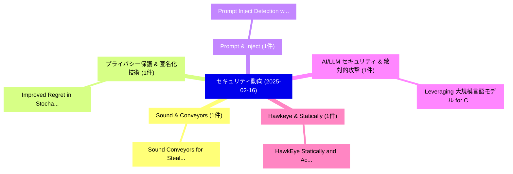

# 📅 02_daily: 日次エグゼクティブサマリー報告書 (2025-02-16)

**集計日時**: 2026-10-02 23:05:17 UTC  
**対象日付**: 2025-02-16  
**本日収集論文数**: 15 件  

---

## 💡 主要セキュリティ動向・脅威インサイト (Executive Insights)

本日の収集論文（計 15 件）において、以下の重点セキュリティ領域で活発な研究動向が確認されました：
- **Sound & Conveyors** (1 件): 注目論文として 「Sound Conveyors for Stealthy D...」 等が発表され、実務防御および攻撃検証の進展が見られます。
- **プライバシー保護 & 匿名化技術** (1 件): 注目論文として 「Improved Regret in Stochastic ...」 等が発表され、実務防御および攻撃検証の進展が見られます。
- **Prompt & Inject** (1 件): 注目論文として 「Prompt Inject Detection with G...」 等が発表され、実務防御および攻撃検証の進展が見られます。
- **AI/LLM セキュリティ & 敵対的攻撃** (1 件): 注目論文として 「Leveraging 大規模言語モデル for Cybers...」 等が発表され、実務防御および攻撃検証の進展が見られます。
- **Hawkeye & Statically** (1 件): 注目論文として 「HawkEye: Statically and Accura...」 等が発表され、実務防御および攻撃検証の進展が見られます。

### 🗺️ 技術・脅威トピックマインドマップ

---

## 📌 日次セキュリティ論文一覧 (日本語表形式)

| No | arXiv ID | 論文タイトル (日本語訳) | 重要キーワード | 構造化エグゼクティブ要約 (背景・提案・影響) | 脅威分類 | 詳細リンク |
|---|---|---|---|---|---|---|
| 1 | `2502.10984v2` | [Sound Conveyors for Stealthy Data Transmission（セキュリティ分析論文）](../../okf/papers/2025-02-16/2502.10984.md) | `Stealthy Data Transmission`, `Sound Conveyors`, `Sachith Dassanayaka` | 【提案】概要 (Overview & Key Finding) 本論文「Sound Conveyors for Stealthy Data Transmission（セキュリティ分析...。実証評価により経営層・セキュリティ管理者向け推奨アクション (E... | `cs.CR` | [arXiv](https://arxiv.org/abs/2502.10984v2) &#124; [OKF](../../okf/papers/2025-02-16/2502.10984.md) |
| 2 | `2502.10997v2` | [Improved Regret in Stochastic Decision-Theoretic Online Learning under Differential Privacy（セキュリティ分析論文）](../../okf/papers/2025-02-16/2502.10997.md) | `Theoretic Online Learning`, `Improved Regret`, `Stochastic Decision` | 【提案】概要 (Overview & Key Finding) 本論文「Improved Regret in Stochastic Decision-Theoretic Online...。実証評価により経営層・セキュリティ管理者向け推奨アクション (E... | `cs.CR` | [arXiv](https://arxiv.org/abs/2502.10997v2) &#124; [OKF](../../okf/papers/2025-02-16/2502.10997.md) |
| 3 | `2502.11006v1` | [Prompt Inject Detection with Generative Explanation as an Investigative Tool（セキュリティ分析論文）](../../okf/papers/2025-02-16/2502.11006.md) | `Prompt Inject Detection`, `Generative Explanation`, `Investigative Tool` | 【提案】概要 (Overview & Key Finding) 本論文「Prompt Inject Detection with Generative Explanation as ...。実証評価により経営層・セキュリティ管理者向け推奨アクション (E... | `cs.CR` | [arXiv](https://arxiv.org/abs/2502.11006v1) &#124; [OKF](../../okf/papers/2025-02-16/2502.11006.md) |
| 4 | `2502.11014v1` | [Leveraging 大規模言語モデル for Cybersecurity: Enhancing SMS Spam Detection with Robust and Context-Aware Text Classification](../../okf/papers/2025-02-16/2502.11014.md) | `Aware Text Classification`, `Spam Detection`, `Context-Aware Text` | 【提案】概要 (Overview & Key Finding) 本論文「Leveraging 大規模言語モデル for Cybersecurity: Enhancing SMS Sp...。実証評価により経営層・セキュリティ管理者向け推奨アクション (E... | `cs.CR` | [arXiv](https://arxiv.org/abs/2502.11014v1) &#124; [OKF](../../okf/papers/2025-02-16/2502.11014.md) |
| 5 | `2502.11029v1` | [HawkEye: Statically and Accurately Profiling the Communication Cost of Models in Multi-party Learning（セキュリティ分析論文）](../../okf/papers/2025-02-16/2502.11029.md) | `Accurately Profiling`, `Communication Cost`, `Multi-party Learning` | 【提案】概要 (Overview & Key Finding) 本論文「HawkEye: Statically and Accurately Profiling the Commun...。実証評価により経営層・セキュリティ管理者向け推奨アクション (E... | `cs.CR` | [arXiv](https://arxiv.org/abs/2502.11029v1) &#124; [OKF](../../okf/papers/2025-02-16/2502.11029.md) |
| 6 | `2502.11054v4` | [Reasoning-Augmented Conversation for Multi-Turn Jailbreak Attacks on 大規模言語モデル](../../okf/papers/2025-02-16/2502.11054.md) | `Turn Jailbreak Attacks`, `Augmented Conversation`, `Reasoning-Augmented Conversation` | 【提案】概要 (Overview & Key Finding) 本論文「Reasoning-Augmented Conversation for Multi-Turn ジェイルブレイ...。実証評価により経営層・セキュリティ管理者向け推奨アクション (E... | `cs.CR` | [arXiv](https://arxiv.org/abs/2502.11054v4) &#124; [OKF](../../okf/papers/2025-02-16/2502.11054.md) |
| 7 | `2502.11070v1` | [A Survey on Vulnerability Prioritization: Taxonomy, Metrics, and Research Challenges（セキュリティ分析論文）](../../okf/papers/2025-02-16/2502.11070.md) | `Vulnerability Prioritization`, `Research Challenges`, `Hoon Wei Lim` | 【提案】概要 (Overview & Key Finding) 本論文「A Survey on 脆弱性 Prioritization: Taxonomy, Metrics, and ...。実証評価により経営層・セキュリティ管理者向け推奨アクション (E... | `cs.CR` | [arXiv](https://arxiv.org/abs/2502.11070v1) &#124; [OKF](../../okf/papers/2025-02-16/2502.11070.md) |
| 8 | `2502.11110v1` | [Ramp Up NTT in Record Time using GPU-Accelerated Algorithms and LLM-based Code Generation（セキュリティ分析論文）](../../okf/papers/2025-02-16/2502.11110.md) | `Record Time`, `Accelerated Algorithms`, `GPU-Accelerated Algorithms` | 【提案】概要 (Overview & Key Finding) 本論文「Ramp Up NTT in Record Time using GPU-Accelerated Algori...。実証評価により経営層・セキュリティ管理者向け推奨アクション (E... | `cs.CR` | [arXiv](https://arxiv.org/abs/2502.11110v1) &#124; [OKF](../../okf/papers/2025-02-16/2502.11110.md) |
| 9 | `2502.11121v1` | [Reversible Data Hiding over Encrypted Images via Intrinsic Correlation in Block-Based Secret Sharing（セキュリティ分析論文）](../../okf/papers/2025-02-16/2502.11121.md) | `Reversible Data Hiding`, `Based Secret Sharing`, `Encrypted Images` | 【提案】概要 (Overview & Key Finding) 本論文「Reversible Data Hiding over Encrypted Images via Intrin...。実証評価により経営層・セキュリティ管理者向け推奨アクション (E... | `cs.CR` | [arXiv](https://arxiv.org/abs/2502.11121v1) &#124; [OKF](../../okf/papers/2025-02-16/2502.11121.md) |
| 10 | `2502.11127v1` | [G-Safeguard: A Topology-Guided Security Lens and Treatment on LLM-based Multi-agent Systems（セキュリティ分析論文）](../../okf/papers/2025-02-16/2502.11127.md) | `Guided Security Lens`, `Topology-Guided Security`, `LLM-based Multi` | 【提案】概要 (Overview & Key Finding) 本論文「G-Safeguard: A Topology-Guided Security Lens and Treatm...。実証評価により経営層・セキュリティ管理者向け推奨アクション (E... | `cs.CR` | [arXiv](https://arxiv.org/abs/2502.11127v1) &#124; [OKF](../../okf/papers/2025-02-16/2502.11127.md) |
| 11 | `2502.11143v1` | [VulRG: Multi-Level Explainable Vulnerability Patch Ranking for Complex Systems Using Graphs（セキュリティ分析論文）](../../okf/papers/2025-02-16/2502.11143.md) | `Level Explainable Vulnerability Patch Ranking`, `Complex Systems Using Graphs`, `Multi-Level Explainable` | 【提案】概要 (Overview & Key Finding) 本論文「VulRG: Multi-Level Explainable 脆弱性 Patch Ranking for Co...。実証評価により経営層・セキュリティ管理者向け推奨アクション (E... | `cs.CR` | [arXiv](https://arxiv.org/abs/2502.11143v1) &#124; [OKF](../../okf/papers/2025-02-16/2502.11143.md) |
| 12 | `2502.11173v1` | [Evaluating the Potential of Quantum Machine Learning in サイバーセキュリティ: A Case-Study on PCA-based Intrusion Detection Systems](../../okf/papers/2025-02-16/2502.11173.md) | `Quantum Machine Learning`, `Intrusion Detection Systems`, `PCA-based Intrusion` | 【提案】概要 (Overview & Key Finding) 本論文「Evaluating the Potential of 量子 Machine Learning in サイバー...。実証評価により経営層・セキュリティ管理者向け推奨アクション (E... | `cs.CR` | [arXiv](https://arxiv.org/abs/2502.11173v1) &#124; [OKF](../../okf/papers/2025-02-16/2502.11173.md) |
| 13 | `2502.11191v3` | [Primus: A Pioneering Collection of Open-Source Datasets for サイバーセキュリティ LLM Training](../../okf/papers/2025-02-16/2502.11191.md) | `Pioneering Collection`, `Source Datasets`, `Open-Source Datasets` | 【提案】概要 (Overview & Key Finding) 本論文「Primus: A Pioneering Collection of Open-Source Datasets...。実証評価により経営層・セキュリティ管理者向け推奨アクション (E... | `cs.CR` | [arXiv](https://arxiv.org/abs/2502.11191v3) &#124; [OKF](../../okf/papers/2025-02-16/2502.11191.md) |
| 14 | `2502.11308v2` | [ALGEN: Few-shot Inversion Attacks on Textual Embeddings using Alignment and Generation（セキュリティ分析論文）](../../okf/papers/2025-02-16/2502.11308.md) | `Inversion Attacks`, `Textual Embeddings`, `Few-shot Inversion` | 【提案】概要 (Overview & Key Finding) 本論文「ALGEN: Few-shot Inversion Attacks on Textual Embeddings...。実証評価により経営層・セキュリティ管理者向け推奨アクション (E... | `cs.CR` | [arXiv](https://arxiv.org/abs/2502.11308v2) &#124; [OKF](../../okf/papers/2025-02-16/2502.11308.md) |
| 15 | `2502.13162v1` | [ShieldLearner: A New Paradigm for Jailbreak Attack Defense in LLMs（セキュリティ分析論文）](../../okf/papers/2025-02-16/2502.13162.md) | `Jailbreak Attack Defense`, `New Paradigm`, `Ziyi Ni` | 【提案】概要 (Overview & Key Finding) 本論文「ShieldLearner: A New Paradigm for ジェイルブレイク Attack Defen...。実証評価により経営層・セキュリティ管理者向け推奨アクション (E... | `cs.CR` | [arXiv](https://arxiv.org/abs/2502.13162v1) &#124; [OKF](../../okf/papers/2025-02-16/2502.13162.md) |

