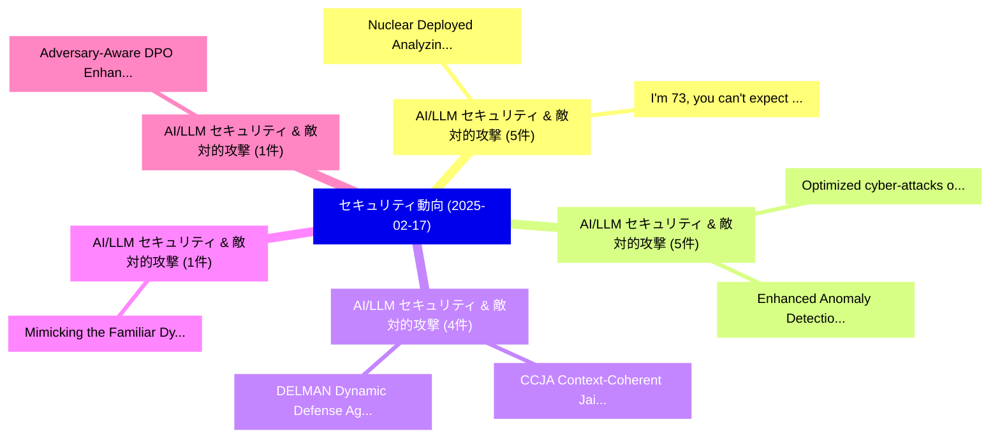

# 📅 02_daily: 日次エグゼクティブサマリー報告書 (2025-02-17)

**集計日時**: 2026-10-02 23:05:17 UTC  
**対象日付**: 2025-02-17  
**本日収集論文数**: 26 件  

---

## 💡 主要セキュリティ動向・脅威インサイト (Executive Insights)

本日の収集論文（計 26 件）において、以下の重点セキュリティ領域で活発な研究動向が確認されました：
- **AI/LLM セキュリティ & 敵対的攻撃** (5 件): 注目論文として 「Nuclear Deployed: Analyzing Ca...」、「"I'm 73, you can't expect me t...」 等が発表され、実務防御および攻撃検証の進展が見られます。
- **AI/LLM セキュリティ & 敵対的攻撃** (5 件): 注目論文として 「Optimized cyber-attacks on IoT...」、「Enhanced Anomaly Detection in ...」 等が発表され、実務防御および攻撃検証の進展が見られます。
- **AI/LLM セキュリティ & 敵対的攻撃** (4 件): 注目論文として 「CCJA: Context-Coherent Jailbre...」、「DELMAN: Dynamic Defense Agains...」 等が発表され、実務防御および攻撃検証の進展が見られます。
- **AI/LLM セキュリティ & 敵対的攻撃** (1 件): 注目論文として 「Mimicking the Familiar: Dynami...」 等が発表され、実務防御および攻撃検証の進展が見られます。
- **AI/LLM セキュリティ & 敵対的攻撃** (1 件): 注目論文として 「Adversary-Aware DPO: Enhancing...」 等が発表され、実務防御および攻撃検証の進展が見られます。

### 🗺️ 技術・脅威トピックマインドマップ

---

## 📌 日次セキュリティ論文一覧 (日本語表形式)

| No | arXiv ID | 論文タイトル (日本語訳) | 重要キーワード | 構造化エグゼクティブ要約 (背景・提案・影響) | 脅威分類 | 詳細リンク |
|---|---|---|---|---|---|---|
| 1 | `2502.11355v3` | [Nuclear Deployed: Analyzing Catastrophic Risks in Decision-making of Autonomous LLMエージェント](../../okf/papers/2025-02-17/2502.11355.md) | `Analyzing Catastrophic Risks`, `Nuclear Deployed`, `Rongwu Xu` | 【提案】概要 (Overview & Key Finding) 本論文「Nuclear Deployed: Analyzing Catastrophic Risks in Decis...。実証評価により経営層・セキュリティ管理者向け推奨アクション (E... | `cs.CR` | [arXiv](https://arxiv.org/abs/2502.11355v3) &#124; [OKF](../../okf/papers/2025-02-17/2502.11355.md) |
| 2 | `2502.11358v1` | [Mimicking the Familiar: Dynamic Command Generation for Information Theft Attacks in LLM Tool-Learning System（セキュリティ分析論文）](../../okf/papers/2025-02-17/2502.11358.md) | `Dynamic Command Generation`, `Information Theft Attacks`, `Learning System` | 【提案】概要 (Overview & Key Finding) 本論文「Mimicking the Familiar: Dynamic Command Generation for ...。実証評価により経営層・セキュリティ管理者向け推奨アクション (E... | `cs.CR` | [arXiv](https://arxiv.org/abs/2502.11358v1) &#124; [OKF](../../okf/papers/2025-02-17/2502.11358.md) |
| 3 | `2502.11379v1` | [CCJA: Context-Coherent Jailbreak Attack for Aligned 大規模言語モデル](../../okf/papers/2025-02-17/2502.11379.md) | `Coherent Jailbreak Attack`, `Context-Coherent Jailbreak`, `Aligned Large Language Models` | 【提案】概要 (Overview & Key Finding) 本論文「CCJA: Context-Coherent ジェイルブレイク Attack for Aligned 大規模言...。実証評価により経営層・セキュリティ管理者向け推奨アクション (E... | `cs.CR` | [arXiv](https://arxiv.org/abs/2502.11379v1) &#124; [OKF](../../okf/papers/2025-02-17/2502.11379.md) |
| 4 | `2502.11455v1` | [Adversary-Aware DPO: Enhancing Safety Alignment in Vision Language Models via Adversarial Training（セキュリティ分析論文）](../../okf/papers/2025-02-17/2502.11455.md) | `Enhancing Safety Alignment`, `Vision Language Models`, `Adversarial Training` | 【提案】概要 (Overview & Key Finding) 本論文「Adversary-Aware DPO: Enhancing Safety Alignment in Visi...。実証評価により経営層・セキュリティ管理者向け推奨アクション (E... | `cs.CR` | [arXiv](https://arxiv.org/abs/2502.11455v1) &#124; [OKF](../../okf/papers/2025-02-17/2502.11455.md) |
| 5 | `2502.11470v1` | [Optimized cyber-attacks on IoT networks via hybrid deep learning modelsの検出](../../okf/papers/2025-02-17/2502.11470.md) | `Ahmed Bensaoud`, `Jugal Kalita`, `Raw Meta` | 【提案】概要 (Overview & Key Finding) 本論文「Optimized cyber-attacks on IoT networks via hybrid deep...。実証評価により経営層・セキュリティ管理者向け推奨アクション (E... | `cs.CR` | [arXiv](https://arxiv.org/abs/2502.11470v1) &#124; [OKF](../../okf/papers/2025-02-17/2502.11470.md) |
| 6 | `2502.11521v2` | [Detecting Various DeFi Price Manipulations with LLM Reasoning（セキュリティ分析論文）](../../okf/papers/2025-02-17/2502.11521.md) | `Detecting Various`, `Price Manipulations`, `Juantao Zhong` | 【提案】概要 (Overview & Key Finding) 本論文「Detecting Various DeFi Price Manipulations with LLM Rea...。実証評価により経営層・セキュリティ管理者向け推奨アクション (E... | `cs.CR` | [arXiv](https://arxiv.org/abs/2502.11521v2) &#124; [OKF](../../okf/papers/2025-02-17/2502.11521.md) |
| 7 | `2502.11550v1` | [Trinity: A Scalable and Forward-Secure DSSE for Spatio-Temporal Range Query（セキュリティ分析論文）](../../okf/papers/2025-02-17/2502.11550.md) | `Temporal Range Query`, `Forward-Secure DSSE`, `Spatio-Temporal Range` | 【提案】概要 (Overview & Key Finding) 本論文「Trinity: A Scalable and Forward-Secure DSSE for Spatio-...。実証評価により経営層・セキュリティ管理者向け推奨アクション (E... | `cs.CR` | [arXiv](https://arxiv.org/abs/2502.11550v1) &#124; [OKF](../../okf/papers/2025-02-17/2502.11550.md) |
| 8 | `2502.11616v1` | [User-Centric Data Management in Decentralized Internet of Behaviors System（セキュリティ分析論文）](../../okf/papers/2025-02-17/2502.11616.md) | `Centric Data Management`, `Decentralized Internet`, `Behaviors System` | 【提案】概要 (Overview & Key Finding) 本論文「User-Centric Data Management in Decentralized Internet ...。実証評価により経営層・セキュリティ管理者向け推奨アクション (E... | `cs.CR` | [arXiv](https://arxiv.org/abs/2502.11616v1) &#124; [OKF](../../okf/papers/2025-02-17/2502.11616.md) |
| 9 | `2502.11641v3` | [A Zero-Knowledge Proof for the Syndrome Decoding Problem in the Lee Metric（セキュリティ分析論文）](../../okf/papers/2025-02-17/2502.11641.md) | `Syndrome Decoding Problem`, `Knowledge Proof`, `Lee Metric` | 【提案】概要 (Overview & Key Finding) 本論文「A ゼロ知識証明 for the Syndrome Decoding Problem in the Lee M...。実証評価により経営層・セキュリティ管理者向け推奨アクション (E... | `cs.CR` | [arXiv](https://arxiv.org/abs/2502.11641v3) &#124; [OKF](../../okf/papers/2025-02-17/2502.11641.md) |
| 10 | `2502.11647v2` | [DELMAN: Dynamic Defense Against Large Language Model Jailbreaking with Model Editing（セキュリティ分析論文）](../../okf/papers/2025-02-17/2502.11647.md) | `Model Editing`, `Yi Wang`, `Fenghua Weng` | 【提案】概要 (Overview & Key Finding) 本論文「DELMAN: Dynamic Defense Against Large Language Model ジェ...。実証評価により経営層・セキュリティ管理者向け推奨アクション (E... | `cs.CR` | [arXiv](https://arxiv.org/abs/2502.11647v2) &#124; [OKF](../../okf/papers/2025-02-17/2502.11647.md) |
| 11 | `2502.11650v1` | ["I'm 73, you can't expect me to have multiple passwords": Password Management Concerns and Solutions of Irish Older Adults（セキュリティ分析論文）](../../okf/papers/2025-02-17/2502.11650.md) | `Password Management Concerns`, `Irish Older Adults`, `Ashley Sheil` | 【提案】背景とセキュリティ上の課題 (Background & Problem) 本研究はサイバー脅威環境におけるセキュリティ構造・脆弱性の検証を目的としています。(主要検出項目: ...。実証評価により経営層・セキュリティ管理者向け推奨アクション (E... | `cs.CR` | [arXiv](https://arxiv.org/abs/2502.11650v1) &#124; [OKF](../../okf/papers/2025-02-17/2502.11650.md) |
| 12 | `2502.11658v3` | ["I'm not for sale" -- Perceptions and limited awareness of privacy risks by digital natives about location data（セキュリティ分析論文）](../../okf/papers/2025-02-17/2502.11658.md) | `Antoine Boutet`, `Victor Morel`, `Raw Meta` | 【提案】背景とセキュリティ上の課題 (Background & Problem) 本研究はサイバー脅威環境におけるセキュリティ構造・脆弱性の検証を目的としています。(主要検出項目: ...。実証評価により経営層・セキュリティ管理者向け推奨アクション (E... | `cs.CR` | [arXiv](https://arxiv.org/abs/2502.11658v3) &#124; [OKF](../../okf/papers/2025-02-17/2502.11658.md) |
| 13 | `2502.11687v1` | [ReVeil: Unconstrained Concealed Backdoor Attack on Deep Neural Networks using Machine Unlearning（セキュリティ分析論文）](../../okf/papers/2025-02-17/2502.11687.md) | `Unconstrained Concealed Backdoor Attack`, `Deep Neural Networks`, `Machine Unlearning` | 【提案】概要 (Overview & Key Finding) 本論文「ReVeil: Unconstrained Concealed Backdoor Attack on Deep...。実証評価により経営層・セキュリティ管理者向け推奨アクション (E... | `cs.CR` | [arXiv](https://arxiv.org/abs/2502.11687v1) &#124; [OKF](../../okf/papers/2025-02-17/2502.11687.md) |
| 14 | `2502.11737v1` | [2FA: Navigating the Challenges and Solutions for Inclusive Access（セキュリティ分析論文）](../../okf/papers/2025-02-17/2502.11737.md) | `Inclusive Access`, `Alexander Lengert`, `Raw Meta` | 【提案】概要 (Overview & Key Finding) 本論文「2FA: Navigating the Challenges and Solutions for Inclus...。実証評価により経営層・セキュリティ管理者向け推奨アクション (E... | `cs.CR` | [arXiv](https://arxiv.org/abs/2502.11737v1) &#124; [OKF](../../okf/papers/2025-02-17/2502.11737.md) |
| 15 | `2502.11745v1` | [Understanding RowHammer Under Reduced Refresh Latency: Experimental Real DRAM Chips and Implications on Future Solutionsの分析](../../okf/papers/2025-02-17/2502.11745.md) | `Future Solutions`, `Yahya Can`, `Ataberk Olgun` | 【提案】概要 (Overview & Key Finding) 本論文「Understanding RowHammer Under Reduced Refresh Latency: ...。実証評価により# Understanding RowHammer... | `cs.CR` | [arXiv](https://arxiv.org/abs/2502.11745v1) &#124; [OKF](../../okf/papers/2025-02-17/2502.11745.md) |
| 16 | `2502.11798v2` | [BackdoorDM: A Comprehensive Benchmark for Backdoor Learning on Diffusion Model（セキュリティ分析論文）](../../okf/papers/2025-02-17/2502.11798.md) | `Comprehensive Benchmark`, `Backdoor Learning`, `Diffusion Model` | 【提案】概要 (Overview & Key Finding) 本論文「BackdoorDM: A Comprehensive Benchmark for Backdoor Lear...。実証評価により経営層・セキュリティ管理者向け推奨アクション (E... | `cs.CR` | [arXiv](https://arxiv.org/abs/2502.11798v2) &#124; [OKF](../../okf/papers/2025-02-17/2502.11798.md) |
| 17 | `2502.11844v3` | [BaxBench: Can LLMs Generate Correct and Secure Backends?（セキュリティ分析論文）](../../okf/papers/2025-02-17/2502.11844.md) | `Generate Correct`, `Secure Backends`, `Mark Vero` | 【提案】### (日本語題名: BaxBench: Can LLMs Generate Correct and Secure Backends?（セキュリティ分析論文）)  > [!...。実証評価により経営層・セキュリティ管理者向け推奨アクション (E... | `cs.CR` | [arXiv](https://arxiv.org/abs/2502.11844v3) &#124; [OKF](../../okf/papers/2025-02-17/2502.11844.md) |
| 18 | `2502.11854v1` | [Enhanced Anomaly Detection in IoMT Networks using Ensemble AI Models on the CICIoMT2024 Dataset（セキュリティ分析論文）](../../okf/papers/2025-02-17/2502.11854.md) | `Enhanced Anomaly Detection`, `Enhanced Anomaly Det`, `Prathamesh Chandekar` | 【提案】概要 (Overview & Key Finding) 本論文「Enhanced Anomaly Detection in IoMT Networks using Ensem...。実証評価により経営層・セキュリティ管理者向け推奨アクション (E... | `cs.CR` | [arXiv](https://arxiv.org/abs/2502.11854v1) &#124; [OKF](../../okf/papers/2025-02-17/2502.11854.md) |
| 19 | `2502.11920v2` | [A limited technical background is sufficient for attack-defense tree acceptability（セキュリティ分析論文）](../../okf/papers/2025-02-17/2502.11920.md) | `attack-defense tree`, `Nathan Daniel Schiele`, `Olga Gadyatskaya` | 【提案】概要 (Overview & Key Finding) 本論文「A limited technical background is sufficient for attack...。実証評価により経営層・セキュリティ管理者向け推奨アクション (E... | `cs.CR` | [arXiv](https://arxiv.org/abs/2502.11920v2) &#124; [OKF](../../okf/papers/2025-02-17/2502.11920.md) |
| 20 | `2502.12103v3` | [CriteoPrivateAds: A Real-World Bidding Dataset to Design Private Advertising Systems（セキュリティ分析論文）](../../okf/papers/2025-02-17/2502.12103.md) | `Design Private Advertising Systems`, `World Bidding Dataset`, `Real-World Bidding` | 【提案】概要 (Overview & Key Finding) 本論文「CriteoPrivateAds: A Real-World Bidding Dataset to Desig...。実証評価により経営層・セキュリティ管理者向け推奨アクション (E... | `cs.CR` | [arXiv](https://arxiv.org/abs/2502.12103v3) &#124; [OKF](../../okf/papers/2025-02-17/2502.12103.md) |
| 21 | `2502.12322v2` | [VIC: Evasive Video Game Cheating via Virtual Machine Introspection（セキュリティ分析論文）](../../okf/papers/2025-02-17/2502.12322.md) | `Evasive Video Game Cheating`, `Virtual Machine Introspection`, `Panicos Karkallis` | 【提案】概要 (Overview & Key Finding) 本論文「VIC: Evasive Video Game Cheating via Virtual Machine In...。実証評価により経営層・セキュリティ管理者向け推奨アクション (E... | `cs.CR` | [arXiv](https://arxiv.org/abs/2502.12322v2) &#124; [OKF](../../okf/papers/2025-02-17/2502.12322.md) |
| 22 | `2502.12382v1` | [Hybrid Machine Learning Models for Intrusion Detection in IoT: Leveraging a Real-World IoT Dataset（セキュリティ分析論文）](../../okf/papers/2025-02-17/2502.12382.md) | `Hybrid Machine Learning Models`, `Intrusion Detection`, `Real-World IoT` | 【提案】概要 (Overview & Key Finding) 本論文「Hybrid Machine Learning Models for Intrusion Detection ...。実証評価により経営層・セキュリティ管理者向け推奨アクション (E... | `cs.CR` | [arXiv](https://arxiv.org/abs/2502.12382v1) &#124; [OKF](../../okf/papers/2025-02-17/2502.12382.md) |
| 23 | `2502.13163v3` | [A Survey of Fuzzing Open-Source Operating Systems（セキュリティ分析論文）](../../okf/papers/2025-02-17/2502.13163.md) | `Source Operating Systems`, `Fuzzing Open`, `Open-Source Operating` | 【提案】概要 (Overview & Key Finding) 本論文「A Survey of Fuzzing Open-Source Operating Systems（セキュリテ...。実証評価により経営層・セキュリティ管理者向け推奨アクション (E... | `cs.CR` | [arXiv](https://arxiv.org/abs/2502.13163v3) &#124; [OKF](../../okf/papers/2025-02-17/2502.13163.md) |
| 24 | `2502.13167v1` | [SmartLLM: Smart Contract Auditing using Custom Generative AI（セキュリティ分析論文）](../../okf/papers/2025-02-17/2502.13167.md) | `Smart Contract Auditing`, `Custom Generative`, `Jun Kevin` | 【提案】概要 (Overview & Key Finding) 本論文「SmartLLM: スマートコントラクト Auditing using Custom Generative A...。実証評価により経営層・セキュリティ管理者向け推奨アクション (E... | `cs.CR` | [arXiv](https://arxiv.org/abs/2502.13167v1) &#124; [OKF](../../okf/papers/2025-02-17/2502.13167.md) |
| 25 | `2502.13171v1` | [Web Phishing Net (WPN): A scalable machine learning approach for real-time phishing campaign detection（セキュリティ分析論文）](../../okf/papers/2025-02-17/2502.13171.md) | `Web Phishing Net`, `real-time phishing`, `Muhammad Fahad Zia` | 【提案】概要 (Overview & Key Finding) 本論文「Web Phishing Net (WPN): A scalable machine learning app...。実証評価により経営層・セキュリティ管理者向け推奨アクション (E... | `cs.CR` | [arXiv](https://arxiv.org/abs/2502.13171v1) &#124; [OKF](../../okf/papers/2025-02-17/2502.13171.md) |
| 26 | `2502.13172v2` | [Unveiling Privacy Risks in LLM Agent Memory（セキュリティ分析論文）](../../okf/papers/2025-02-17/2502.13172.md) | `Unveiling Privacy Risks`, `Agent Memory`, `Bo Wang` | 【提案】概要 (Overview & Key Finding) 本論文「Unveiling Privacy Risks in LLM Agent Memory（セキュリティ分析論文）...。実証評価により経営層・セキュリティ管理者向け推奨アクション (E... | `cs.CR` | [arXiv](https://arxiv.org/abs/2502.13172v2) &#124; [OKF](../../okf/papers/2025-02-17/2502.13172.md) |

