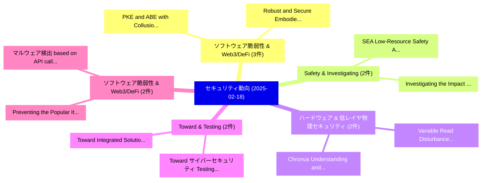

# 📅 02_daily: 日次エグゼクティブサマリー報告書 (2025-02-18)

**集計日時**: 2026-10-02 23:05:17 UTC  
**対象日付**: 2025-02-18  
**本日収集論文数**: 35 件  

---

## 💡 主要セキュリティ動向・脅威インサイト (Executive Insights)

本日の収集論文（計 35 件）において、以下の重点セキュリティ領域で活発な研究動向が確認されました：
- **ソフトウェア脆弱性 & Web3/DeFi** (3 件): 注目論文として 「PKE and ABE with Collusion-Res...」、「Robust and Secure Embodied AI:...」 等が発表され、実務防御および攻撃検証の進展が見られます。
- **Safety & Investigating** (2 件): 注目論文として 「SEA: Low-Resource Safety Align...」、「Investigating the Impact of Qu...」 等が発表され、実務防御および攻撃検証の進展が見られます。
- **ハードウェア & 低レイヤ物理セキュリティ** (2 件): 注目論文として 「Chronus: Understanding and the...」、「Variable Read Disturbance: An ...」 等が発表され、実務防御および攻撃検証の進展が見られます。
- **Toward & Testing** (2 件): 注目論文として 「Toward サイバーセキュリティ Testing and ...」、「Toward Integrated Solutions: A...」 等が発表され、実務防御および攻撃検証の進展が見られます。
- **ソフトウェア脆弱性 & Web3/DeFi** (2 件): 注目論文として 「マルウェア検出 based on API calls」、「Preventing the Popular Item Em...」 等が発表され、実務防御および攻撃検証の進展が見られます。

### 🗺️ 技術・脅威トピックマインドマップ

---

## 📌 日次セキュリティ論文一覧 (日本語表形式)

| No | arXiv ID | 論文タイトル (日本語訳) | 重要キーワード | 構造化エグゼクティブ要約 (背景・提案・影響) | 脅威分類 | 詳細リンク |
|---|---|---|---|---|---|---|
| 1 | `2502.12441v2` | [Choosing Coordinate Forms for Solving ECDLP Using Shor's Algorithm（セキュリティ分析論文）](../../okf/papers/2025-02-18/2502.12441.md) | `Choosing Coordinate Forms`, `Using Shor`, `Yan Huang` | 【提案】概要 (Overview & Key Finding) 本論文「Choosing Coordinate Forms for Solving ECDLP Using Shor'...。実証評価により経営層・セキュリティ管理者向け推奨アクション (E... | `cs.CR` | [arXiv](https://arxiv.org/abs/2502.12441v2) &#124; [OKF](../../okf/papers/2025-02-18/2502.12441.md) |
| 2 | `2502.12460v1` | [LMN: A Tool for Generating Machine Enforceable Policies from Natural Language Access Control Rules using LLMs（セキュリティ分析論文）](../../okf/papers/2025-02-18/2502.12460.md) | `Natural Language Access Control Rules`, `Generating Machine Enforceable Policies`, `Pratik Sonune` | 【提案】概要 (Overview & Key Finding) 本論文「LMN: A Tool for Generating Machine Enforceable Policies...。実証評価により経営層・セキュリティ管理者向け推奨アクション (E... | `cs.CR` | [arXiv](https://arxiv.org/abs/2502.12460v1) &#124; [OKF](../../okf/papers/2025-02-18/2502.12460.md) |
| 3 | `2502.12491v2` | [PKE and ABE with Collusion-Resistant Secure Key Leasing（セキュリティ分析論文）](../../okf/papers/2025-02-18/2502.12491.md) | `Resistant Secure Key Leasing`, `Collusion-Resistant Secure`, `Fuyuki Kitagawa` | 【提案】概要 (Overview & Key Finding) 本論文「PKE and ABE with Collusion-Resistant Secure Key Leasing...。実証評価により経営層・セキュリティ管理者向け推奨アクション (E... | `cs.CR` | [arXiv](https://arxiv.org/abs/2502.12491v2) &#124; [OKF](../../okf/papers/2025-02-18/2502.12491.md) |
| 4 | `2502.12497v2` | [Demystifying LLM Supply Chain Vulnerabilities in the Wild: Distribution, Root Cause, and Real-World Impact（セキュリティ分析論文）](../../okf/papers/2025-02-18/2502.12497.md) | `Supply Chain Vulnerabilities`, `Root Cause`, `World Impact` | 【提案】概要 (Overview & Key Finding) 本論文「Demystifying LLM Supply Chain Vulnerabilities in the Wi...。実証評価により経営層・セキュリティ管理者向け推奨アクション (E... | `cs.CR` | [arXiv](https://arxiv.org/abs/2502.12497v2) &#124; [OKF](../../okf/papers/2025-02-18/2502.12497.md) |
| 5 | `2502.12544v2` | [Mixing Algorithm for Extending the Tiers of the Unapparent Information Send through the Audio Streams（セキュリティ分析論文）](../../okf/papers/2025-02-18/2502.12544.md) | `Unapparent Information Send`, `Mixing Algorithm`, `Audio Streams` | 【提案】概要 (Overview & Key Finding) 本論文「Mixing Algorithm for Extending the Tiers of the Unappar...。実証評価により経営層・セキュリティ管理者向け推奨アクション (E... | `cs.CR` | [arXiv](https://arxiv.org/abs/2502.12544v2) &#124; [OKF](../../okf/papers/2025-02-18/2502.12544.md) |
| 6 | `2502.12562v3` | [SEA: Low-Resource Safety Alignment for Multimodal 大規模言語モデル via Synthetic Embeddings](../../okf/papers/2025-02-18/2502.12562.md) | `Resource Safety Alignment`, `Low-Resource Safety`, `Synthetic Embeddings` | 【提案】概要 (Overview & Key Finding) 本論文「SEA: Low-Resource Safety Alignment for Multimodal 大規模言語...。実証評価により経営層・セキュリティ管理者向け推奨アクション (E... | `cs.CR` | [arXiv](https://arxiv.org/abs/2502.12562v3) &#124; [OKF](../../okf/papers/2025-02-18/2502.12562.md) |
| 7 | `2502.12575v2` | [DemonAgent: Dynamically Encrypted Multi-Backdoor Implantation Attack on LLM-based Agent（セキュリティ分析論文）](../../okf/papers/2025-02-18/2502.12575.md) | `Dynamically Encrypted Multi`, `Backdoor Implantation Attack`, `Multi-Backdoor Implantation` | 【提案】概要 (Overview & Key Finding) 本論文「DemonAgent: Dynamically Encrypted Multi-Backdoor Implan...。実証評価により経営層・セキュリティ管理者向け推奨アクション (E... | `cs.CR` | [arXiv](https://arxiv.org/abs/2502.12575v2) &#124; [OKF](../../okf/papers/2025-02-18/2502.12575.md) |
| 8 | `2502.12628v3` | [Cryptanalysis on Lightweight Verifiable Homomorphic Encryption（セキュリティ分析論文）](../../okf/papers/2025-02-18/2502.12628.md) | `Lightweight Verifiable Homomorphic Encryption`, `Jung Hee Cheon`, `Daehyun Jang` | 【提案】概要 (Overview & Key Finding) 本論文「Cryptanalysis on Lightweight Verifiable 準同型暗号（セキュリティ分析論...。実証評価により経営層・セキュリティ管理者向け推奨アクション (E... | `cs.CR` | [arXiv](https://arxiv.org/abs/2502.12628v3) &#124; [OKF](../../okf/papers/2025-02-18/2502.12628.md) |
| 9 | `2502.12630v1` | [Automating Prompt Leakage Attacks on 大規模言語モデル Using Agentic Approach](../../okf/papers/2025-02-18/2502.12630.md) | `Automating Prompt Leakage Attacks`, `Tvrtko Sternak`, `Davor Runje` | 【提案】概要 (Overview & Key Finding) 本論文「Automating Prompt Leakage Attacks on 大規模言語モデル Using Age...。実証評価により経営層・セキュリティ管理者向け推奨アクション (E... | `cs.CR` | [arXiv](https://arxiv.org/abs/2502.12630v1) &#124; [OKF](../../okf/papers/2025-02-18/2502.12630.md) |
| 10 | `2502.12650v2` | [Chronus: Understanding and the Cutting-Edge Industry Solutions to DRAM Read Disturbanceのセキュリティ強化](../../okf/papers/2025-02-18/2502.12650.md) | `Edge Industry Solutions`, `Cutting-Edge Industry`, `Read Disturbance` | 【提案】概要 (Overview & Key Finding) 本論文「Chronus: Understanding and the Cutting-Edge Industry So...。実証評価により経営層・セキュリティ管理者向け推奨アクション (E... | `cs.CR` | [arXiv](https://arxiv.org/abs/2502.12650v2) &#124; [OKF](../../okf/papers/2025-02-18/2502.12650.md) |
| 11 | `2502.12710v3` | [Innamark: A Whitespace Replacement Information-Hiding Method（セキュリティ分析論文）](../../okf/papers/2025-02-18/2502.12710.md) | `Whitespace Replacement Information`, `Malte Hellmeier`, `Hendrik Norkowski` | 【提案】概要 (Overview & Key Finding) 本論文「Innamark: A Whitespace Replacement Information-Hiding M...。実証評価により経営層・セキュリティ管理者向け推奨アクション (E... | `cs.CR` | [arXiv](https://arxiv.org/abs/2502.12710v3) &#124; [OKF](../../okf/papers/2025-02-18/2502.12710.md) |
| 12 | `2502.12721v2` | [Computation of the Hilbert Series for the Support-Minors Modeling of the MinRank Problem（セキュリティ分析論文）](../../okf/papers/2025-02-18/2502.12721.md) | `Hilbert Series`, `Minors Modeling`, `Support-Minors Modeling` | 【提案】概要 (Overview & Key Finding) 本論文「Computation of the Hilbert Series for the Support-Minor...。実証評価により経営層・セキュリティ管理者向け推奨アクション (E... | `cs.CR` | [arXiv](https://arxiv.org/abs/2502.12721v2) &#124; [OKF](../../okf/papers/2025-02-18/2502.12721.md) |
| 13 | `2502.12734v2` | [Iron Sharpens Iron: Defending Against Attacks in Machine-Generated Text Detection with Adversarial Training（セキュリティ分析論文）](../../okf/papers/2025-02-18/2502.12734.md) | `Iron Sharpens Iron`, `Generated Text Detection`, `Adversarial Training` | 【提案】概要 (Overview & Key Finding) 本論文「Iron Sharpens Iron: Defending Against Attacks in Machin...。実証評価により経営層・セキュリティ管理者向け推奨アクション (E... | `cs.CR` | [arXiv](https://arxiv.org/abs/2502.12734v2) &#124; [OKF](../../okf/papers/2025-02-18/2502.12734.md) |
| 14 | `2502.12794v1` | [RAPID: Retrieval Augmented Training of Differentially Private Diffusion Models（セキュリティ分析論文）](../../okf/papers/2025-02-18/2502.12794.md) | `Differentially Private Diffusion Models`, `Retrieval Augmented Training`, `Tanqiu Jiang` | 【提案】概要 (Overview & Key Finding) 本論文「RAPID: Retrieval Augmented Training of Differentially P...。実証評価により経営層・セキュリティ管理者向け推奨アクション (E... | `cs.CR` | [arXiv](https://arxiv.org/abs/2502.12794v1) &#124; [OKF](../../okf/papers/2025-02-18/2502.12794.md) |
| 15 | `2502.12837v1` | [Toward サイバーセキュリティ Testing and Monitoring of IoT Ecosystems](../../okf/papers/2025-02-18/2502.12837.md) | `Toward Cybersecurity Testing`, `Martin Gile Jaatun`, `Paolo De Lutiis` | 【提案】概要 (Overview & Key Finding) 本論文「Toward サイバーセキュリティ Testing and Monitoring of IoT Ecosyst...。実証評価により経営層・セキュリティ管理者向け推奨アクション (E... | `cs.CR` | [arXiv](https://arxiv.org/abs/2502.12837v1) &#124; [OKF](../../okf/papers/2025-02-18/2502.12837.md) |
| 16 | `2502.12848v1` | [Strands Rocq: Why is a Security Protocol Correct, Mechanically?（セキュリティ分析論文）](../../okf/papers/2025-02-18/2502.12848.md) | `Security Protocol Correct`, `Strands Rocq`, `Matteo Busi` | 【提案】### (日本語題名: Strands Rocq: Why is a Security Protocol Correct, Mechanically?（セキュリティ分析論文）...。実証評価によりLuccio - **公開日時**: `2025-0。 | `cs.CR` | [arXiv](https://arxiv.org/abs/2502.12848v1) &#124; [OKF](../../okf/papers/2025-02-18/2502.12848.md) |
| 17 | `2502.12863v1` | [マルウェア検出 based on API calls](../../okf/papers/2025-02-18/2502.12863.md) | `Malware Detection`, `Christofer Fellicious`, `Manuel Bischof` | 【提案】概要 (Overview & Key Finding) 本論文「マルウェア検出 based on API calls」（原題: マルウェア Detection based o...。実証評価によりReiser, Michael Granitzer... | `cs.CR` | [arXiv](https://arxiv.org/abs/2502.12863v1) &#124; [OKF](../../okf/papers/2025-02-18/2502.12863.md) |
| 18 | `2502.12958v1` | [Preventing the Popular Item Embedding Based Attack in Federated Recommendations（セキュリティ分析論文）](../../okf/papers/2025-02-18/2502.12958.md) | `Popular Item Embedding Based Attack`, `Federated Recommendations`, `Jun Zhang` | 【提案】概要 (Overview & Key Finding) 本論文「Preventing the Popular Item Embedding Based Attack in F...。実証評価により経営層・セキュリティ管理者向け推奨アクション (E... | `cs.CR` | [arXiv](https://arxiv.org/abs/2502.12958v1) &#124; [OKF](../../okf/papers/2025-02-18/2502.12958.md) |
| 19 | `2502.12966v1` | [The Early Days of the Ethereum Blob Fee Market and Lessons Learnt（セキュリティ分析論文）](../../okf/papers/2025-02-18/2502.12966.md) | `Ethereum Blob Fee Market`, `Lessons Learnt`, `Lioba Heimbach` | 【提案】概要 (Overview & Key Finding) 本論文「The Early Days of the Ethereum Blob Fee Market and Less...。実証評価により経営層・セキュリティ管理者向け推奨アクション (E... | `cs.CR` | [arXiv](https://arxiv.org/abs/2502.12966v1) &#124; [OKF](../../okf/papers/2025-02-18/2502.12966.md) |
| 20 | `2502.12976v1` | [Does Training with Synthetic Data Truly Protect Privacy?（セキュリティ分析論文）](../../okf/papers/2025-02-18/2502.12976.md) | `Synthetic Data Truly Protect Privacy`, `Yunpeng Zhao`, `Jie Zhang` | 【提案】### (日本語題名: Does Training with Synthetic Data Truly Protect Privacy?（セキュリティ分析論文）)  > [!...。実証評価により経営層・セキュリティ管理者向け推奨アクション (E... | `cs.CR` | [arXiv](https://arxiv.org/abs/2502.12976v1) &#124; [OKF](../../okf/papers/2025-02-18/2502.12976.md) |
| 21 | `2502.13055v2` | [LAMD: Context-driven Android マルウェア検出 and Classification with LLMs](../../okf/papers/2025-02-18/2502.13055.md) | `Context-driven Android`, `Android Malware Detection`, `Xingzhi Qian` | 【提案】概要 (Overview & Key Finding) 本論文「LAMD: Context-driven Android マルウェア検出 and Classification...。実証評価により経営層・セキュリティ管理者向け推奨アクション (E... | `cs.CR` | [arXiv](https://arxiv.org/abs/2502.13055v2) &#124; [OKF](../../okf/papers/2025-02-18/2502.13055.md) |
| 22 | `2502.13060v3` | [Practical Secure Delegated Linear Algebra with Trapdoored Matrices（セキュリティ分析論文）](../../okf/papers/2025-02-18/2502.13060.md) | `Practical Secure Delegated Linear Algebra`, `Trapdoored Matrices`, `Mark Braverman` | 【提案】概要 (Overview & Key Finding) 本論文「Practical Secure Delegated Linear Algebra with Trapdoor...。実証評価により経営層・セキュリティ管理者向け推奨アクション (E... | `cs.CR` | [arXiv](https://arxiv.org/abs/2502.13060v3) &#124; [OKF](../../okf/papers/2025-02-18/2502.13060.md) |
| 23 | `2502.13065v2` | [Improving Algorithmic Efficiency using Cryptography（セキュリティ分析論文）](../../okf/papers/2025-02-18/2502.13065.md) | `Improving Algorithmic Efficiency`, `Vinod Vaikuntanathan`, `Raw Meta` | 【提案】概要 (Overview & Key Finding) 本論文「Improving Algorithmic Efficiency using 暗号技術（セキュリティ分析論文）...。実証評価により経営層・セキュリティ管理者向け推奨アクション (E... | `cs.CR` | [arXiv](https://arxiv.org/abs/2502.13065v2) &#124; [OKF](../../okf/papers/2025-02-18/2502.13065.md) |
| 24 | `2502.13075v1` | [Variable Read Disturbance: An Experimental Temporal Variation in DRAM Read Disturbanceの分析](../../okf/papers/2025-02-18/2502.13075.md) | `Variable Read Disturbance`, `Temporal Variation`, `Read Disturbance` | 【提案】概要 (Overview & Key Finding) 本論文「Variable Read Disturbance: An Experimental Temporal Var...。実証評価により経営層・セキュリティ管理者向け推奨アクション (E... | `cs.CR` | [arXiv](https://arxiv.org/abs/2502.13075v1) &#124; [OKF](../../okf/papers/2025-02-18/2502.13075.md) |
| 25 | `2502.13115v2` | [Beyond Covariance Matrix: The Statistical Complexity of Private Linear Regression（セキュリティ分析論文）](../../okf/papers/2025-02-18/2502.13115.md) | `Beyond Covariance Matrix`, `Private Linear Regression`, `Fan Chen` | 【提案】概要 (Overview & Key Finding) 本論文「Beyond Covariance Matrix: The Statistical Complexity of...。実証評価により経営層・セキュリティ管理者向け推奨アクション (E... | `cs.CR` | [arXiv](https://arxiv.org/abs/2502.13115v2) &#124; [OKF](../../okf/papers/2025-02-18/2502.13115.md) |
| 26 | `2502.13175v2` | [Robust and Secure Embodied AI: A Survey on Vulnerabilities and Attacksに向けて](../../okf/papers/2025-02-18/2502.13175.md) | `Secure Embodied`, `Towards Robust`, `Wenpeng Xing` | 【提案】概要 (Overview & Key Finding) 本論文「Robust and Secure Embodied AI: A Survey on Vulnerabilit...。実証評価により経営層・セキュリティ管理者向け推奨アクション (E... | `cs.CR` | [arXiv](https://arxiv.org/abs/2502.13175v2) &#124; [OKF](../../okf/papers/2025-02-18/2502.13175.md) |
| 27 | `2502.13197v1` | [Girth of the Cayley graph and Cayley hash functions（セキュリティ分析論文）](../../okf/papers/2025-02-18/2502.13197.md) | `Vladimir Shpilrain`, `Raw Meta`, `Executive Summary` | 【提案】概要 (Overview & Key Finding) 本論文「Girth of the Cayley graph and Cayley hash functions（セキュ...。実証評価により経営層・セキュリティ管理者向け推奨アクション (E... | `cs.CR` | [arXiv](https://arxiv.org/abs/2502.13197v1) &#124; [OKF](../../okf/papers/2025-02-18/2502.13197.md) |
| 28 | `2502.13256v2` | [Cyber-Physical Systems Security: A Comprehensive Review of Anomaly Detection Techniques（セキュリティ分析論文）](../../okf/papers/2025-02-18/2502.13256.md) | `Physical Systems Security`, `Anomaly Detection Techniques`, `Comprehensive Review` | 【提案】概要 (Overview & Key Finding) 本論文「Cyber-Physical Systems Security: A Comprehensive Review...。実証評価により経営層・セキュリティ管理者向け推奨アクション (E... | `cs.CR` | [arXiv](https://arxiv.org/abs/2502.13256v2) &#124; [OKF](../../okf/papers/2025-02-18/2502.13256.md) |
| 29 | `2502.13314v4` | [Debiasing Functions of Private Statistics in Postprocessing（セキュリティ分析論文）](../../okf/papers/2025-02-18/2502.13314.md) | `Debiasing Functions`, `Private Statistics`, `Flavio Calmon` | 【提案】概要 (Overview & Key Finding) 本論文「Debiasing Functions of Private Statistics in Postproces...。実証評価により経営層・セキュリティ管理者向け推奨アクション (E... | `cs.CR` | [arXiv](https://arxiv.org/abs/2502.13314v4) &#124; [OKF](../../okf/papers/2025-02-18/2502.13314.md) |
| 30 | `2502.13345v1` | [Secure and Efficient Watermarking for Latent Diffusion Models in Model Distribution Scenarios（セキュリティ分析論文）](../../okf/papers/2025-02-18/2502.13345.md) | `Latent Diffusion Models`, `Model Distribution Scenarios`, `Efficient Watermarking` | 【提案】概要 (Overview & Key Finding) 本論文「Secure and Efficient Watermarking for Latent Diffusion ...。実証評価により経営層・セキュリティ管理者向け推奨アクション (E... | `cs.CR` | [arXiv](https://arxiv.org/abs/2502.13345v1) &#124; [OKF](../../okf/papers/2025-02-18/2502.13345.md) |
| 31 | `2502.13828v2` | [Software Security in Software-Defined Networking: A Systematic Literature Review（セキュリティ分析論文）](../../okf/papers/2025-02-18/2502.13828.md) | `Systematic Literature Review`, `Software Security`, `Defined Networking` | 【提案】概要 (Overview & Key Finding) 本論文「Software Security in Software-Defined Networking: A Sys...。実証評価により経営層・セキュリティ管理者向け推奨アクション (E... | `cs.CR` | [arXiv](https://arxiv.org/abs/2502.13828v2) &#124; [OKF](../../okf/papers/2025-02-18/2502.13828.md) |
| 32 | `2502.15797v1` | [OCCULT: Evaluating 大規模言語モデル for Offensive Cyber Operation Capabilities](../../okf/papers/2025-02-18/2502.15797.md) | `Offensive Cyber Operation Capabilities`, `Evaluating Large Language Models`, `Offensive Cyber Operation Capabiliti` | 【提案】概要 (Overview & Key Finding) 本論文「OCCULT: Evaluating 大規模言語モデル for Offensive Cyber Operati...。実証評価により経営層・セキュリティ管理者向け推奨アクション (E... | `cs.CR` | [arXiv](https://arxiv.org/abs/2502.15797v1) &#124; [OKF](../../okf/papers/2025-02-18/2502.15797.md) |
| 33 | `2502.15799v2` | [Investigating the Impact of Quantization Methods on the Safety and Reliability of 大規模言語モデル](../../okf/papers/2025-02-18/2502.15799.md) | `Quantization Methods`, `Large Language Models`, `Artyom Kharinaev` | 【提案】概要 (Overview & Key Finding) 本論文「Investigating the Impact of Quantization Methods on the...。実証評価により経営層・セキュリティ管理者向け推奨アクション (E... | `cs.CR` | [arXiv](https://arxiv.org/abs/2502.15799v2) &#124; [OKF](../../okf/papers/2025-02-18/2502.15799.md) |
| 34 | `2502.17485v1` | [Decentralized and Robust Privacy-Preserving Model Using Blockchain-Enabled Federated Deep Learning in Intelligent Enterprises（セキュリティ分析論文）](../../okf/papers/2025-02-18/2502.17485.md) | `Preserving Model Using Blockchain`, `Enabled Federated Deep Learning`, `Robust Privacy` | 【提案】概要 (Overview & Key Finding) 本論文「Decentralized and Robust Privacy-Preserving Model Using...。実証評価により経営層・セキュリティ管理者向け推奨アクション (E... | `cs.CR` | [arXiv](https://arxiv.org/abs/2502.17485v1) &#124; [OKF](../../okf/papers/2025-02-18/2502.17485.md) |
| 35 | `2503.05727v3` | [Toward Integrated Solutions: A Systematic Interdisciplinary Review of Cybergrooming Research（セキュリティ分析論文）](../../okf/papers/2025-02-18/2503.05727.md) | `Toward Integrated Solutions`, `Systematic Interdisciplinary Review`, `Cybergrooming Research` | 【提案】概要 (Overview & Key Finding) 本論文「Toward Integrated Solutions: A Systematic Interdiscipli...。実証評価により経営層・セキュリティ管理者向け推奨アクション (E... | `cs.CR` | [arXiv](https://arxiv.org/abs/2503.05727v3) &#124; [OKF](../../okf/papers/2025-02-18/2503.05727.md) |

