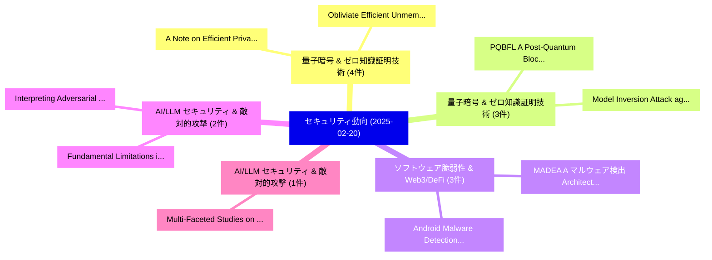

# 📅 02_daily: 日次エグゼクティブサマリー報告書 (2025-02-20)

**集計日時**: 2026-10-02 23:05:17 UTC  
**対象日付**: 2025-02-20  
**本日収集論文数**: 25 件  

---

## 💡 主要セキュリティ動向・脅威インサイト (Executive Insights)

本日の収集論文（計 25 件）において、以下の重点セキュリティ領域で活発な研究動向が確認されました：
- **量子暗号 & ゼロ知識証明技術** (4 件): 注目論文として 「A Note on Efficient Privacy-Pr...」、「Obliviate: Efficient Unmemoriz...」 等が発表され、実務防御および攻撃検証の進展が見られます。
- **量子暗号 & ゼロ知識証明技術** (3 件): 注目論文として 「PQBFL: A Post-Quantum Blockcha...」、「Model Inversion Attack against...」 等が発表され、実務防御および攻撃検証の進展が見られます。
- **ソフトウェア脆弱性 & Web3/DeFi** (3 件): 注目論文として 「Android Malware Detection: Tra...」、「MADEA: A マルウェア検出 Architecture ...」 等が発表され、実務防御および攻撃検証の進展が見られます。
- **AI/LLM セキュリティ & 敵対的攻撃** (2 件): 注目論文として 「Fundamental Limitations in Poi...」、「Interpreting Adversarial Attac...」 等が発表され、実務防御および攻撃検証の進展が見られます。
- **AI/LLM セキュリティ & 敵対的攻撃** (1 件): 注目論文として 「Multi-Faceted Studies on Data ...」 等が発表され、実務防御および攻撃検証の進展が見られます。

### 🗺️ 技術・脅威トピックマインドマップ

---

## 📌 日次セキュリティ論文一覧 (日本語表形式)

| No | arXiv ID | 論文タイトル (日本語訳) | 重要キーワード | 構造化エグゼクティブ要約 (背景・提案・影響) | 脅威分類 | 詳細リンク |
|---|---|---|---|---|---|---|
| 1 | `2502.14182v1` | [Multi-Faceted Studies on Data Poisoning can Advance LLM Development（セキュリティ分析論文）](../../okf/papers/2025-02-20/2502.14182.md) | `Faceted Studies`, `Data Poisoning`, `Multi-Faceted Studies` | 【提案】概要 (Overview & Key Finding) 本論文「Multi-Faceted Studies on Data Poisoning can Advance LLM...。実証評価により経営層・セキュリティ管理者向け推奨アクション (E... | `cs.CR` | [arXiv](https://arxiv.org/abs/2502.14182v1) &#124; [OKF](../../okf/papers/2025-02-20/2502.14182.md) |
| 2 | `2502.14291v1` | [A Note on Efficient Privacy-Preserving Similarity Search for Encrypted Vectors（セキュリティ分析論文）](../../okf/papers/2025-02-20/2502.14291.md) | `Preserving Similarity Search`, `Efficient Privacy`, `Encrypted Vectors` | 【提案】概要 (Overview & Key Finding) 本論文「A Note on Efficient Privacy-Preserving Similarity Searc...。実証評価により経営層・セキュリティ管理者向け推奨アクション (E... | `cs.CR` | [arXiv](https://arxiv.org/abs/2502.14291v1) &#124; [OKF](../../okf/papers/2025-02-20/2502.14291.md) |
| 3 | `2502.14307v1` | [μRL: Discovering Transient Execution Vulnerabilities Using Reinforcement Learning（セキュリティ分析論文）](../../okf/papers/2025-02-20/2502.14307.md) | `Discovering Transient Execution Vulnerabilities Using Reinforcement Learning`, `Caner Tol`, `Kemal Derya` | 【提案】概要 (Overview & Key Finding) 本論文「μRL: Discovering Transient Execution Vulnerabilities Us...。実証評価により経営層・セキュリティ管理者向け推奨アクション (E... | `cs.CR` | [arXiv](https://arxiv.org/abs/2502.14307v1) &#124; [OKF](../../okf/papers/2025-02-20/2502.14307.md) |
| 4 | `2502.14326v1` | [Browser Fingerprint Detection and Anti-Tracking（セキュリティ分析論文）](../../okf/papers/2025-02-20/2502.14326.md) | `Browser Fingerprint Detection`, `Amin Milani Fard`, `Kaitong Lin` | 【提案】概要 (Overview & Key Finding) 本論文「Browser Fingerprint Detection and Anti-Tracking（セキュリティ分...。実証評価により経営層・セキュリティ管理者向け推奨アクション (E... | `cs.CR` | [arXiv](https://arxiv.org/abs/2502.14326v1) &#124; [OKF](../../okf/papers/2025-02-20/2502.14326.md) |
| 5 | `2502.14412v1` | [Evaluating Precise Geolocation Inference Capabilities of Vision Language Models（セキュリティ分析論文）](../../okf/papers/2025-02-20/2502.14412.md) | `Evaluating Precise Geolocation Inference Capabilities`, `Vision Language Models`, `Hieu Minh Nguyen` | 【提案】概要 (Overview & Key Finding) 本論文「Evaluating Precise Geolocation Inference Capabilities o...。実証評価により経営層・セキュリティ管理者向け推奨アクション (E... | `cs.CR` | [arXiv](https://arxiv.org/abs/2502.14412v1) &#124; [OKF](../../okf/papers/2025-02-20/2502.14412.md) |
| 6 | `2502.14436v2` | [Multiplicative character sums over two classes of subsets of quadratic extensions of finite fields（セキュリティ分析論文）](../../okf/papers/2025-02-20/2502.14436.md) | `Kaimin Cheng`, `Arne Winterhof`, `Raw Meta` | 【提案】概要 (Overview & Key Finding) 本論文「Multiplicative character sums over two classes of subse...。実証評価により経営層・セキュリティ管理者向け推奨アクション (E... | `cs.CR` | [arXiv](https://arxiv.org/abs/2502.14436v2) &#124; [OKF](../../okf/papers/2025-02-20/2502.14436.md) |
| 7 | `2502.14464v1` | [PQBFL: A Post-Quantum Blockchain-based Protocol for 連合学習](../../okf/papers/2025-02-20/2502.14464.md) | `Quantum Blockchain`, `Post-Quantum Blockchain`, `Federated Learning` | 【提案】概要 (Overview & Key Finding) 本論文「PQBFL: A Post-量子 Blockchain-based Protocol for 連合学習」（原題...。実証評価により経営層・セキュリティ管理者向け推奨アクション (E... | `cs.CR` | [arXiv](https://arxiv.org/abs/2502.14464v1) &#124; [OKF](../../okf/papers/2025-02-20/2502.14464.md) |
| 8 | `2502.14486v1` | [How Jailbreak Defenses Work and Ensemble? A Mechanistic Investigation（セキュリティ分析論文）](../../okf/papers/2025-02-20/2502.14486.md) | `Mechanistic Investigation`, `Zhuohang Long`, `Siyuan Wang` | 【提案】A Mechanistic Investigation ### (日本語題名: How ジェイルブレイク Defenses Work and Ensemble?。実証評価により経営層・セキュリティ管理者向け推奨アクション (Executive R... | `cs.CR` | [arXiv](https://arxiv.org/abs/2502.14486v1) &#124; [OKF](../../okf/papers/2025-02-20/2502.14486.md) |
| 9 | `2502.14558v3` | [Model Inversion Attack against Federated Unlearning（セキュリティ分析論文）](../../okf/papers/2025-02-20/2502.14558.md) | `Model Inversion Attack`, `Federated Unlearning`, `Lei Zhou` | 【提案】概要 (Overview & Key Finding) 本論文「モデル反転攻撃 Attack against Federated Unlearning（セキュリティ分析論文）...。実証評価により経営層・セキュリティ管理者向け推奨アクション (E... | `cs.CR` | [arXiv](https://arxiv.org/abs/2502.14558v3) &#124; [OKF](../../okf/papers/2025-02-20/2502.14558.md) |
| 10 | `2502.14586v1` | [Moshi Moshi? A Model Selection Hijacking Adversarial Attack（セキュリティ分析論文）](../../okf/papers/2025-02-20/2502.14586.md) | `Model Selection Hijacking Adversarial Attack`, `Moshi Moshi`, `Riccardo Petrucci` | 【提案】A Model Selection Hijacking 敵対的攻撃 ### (日本語題名: Moshi Moshi?。実証評価により経営層・セキュリティ管理者向け推奨アクション (Executive Recommendations) - 組織のセ... | `cs.CR` | [arXiv](https://arxiv.org/abs/2502.14586v1) &#124; [OKF](../../okf/papers/2025-02-20/2502.14586.md) |
| 11 | `2502.14726v1` | [Pitch Imperfect: Detecting Audio Deepfakes Through Acoustic Prosodic Analysis（セキュリティ分析論文）](../../okf/papers/2025-02-20/2502.14726.md) | `Pitch Imperfect`, `Kevin Warren`, `Daniel Olszewski` | 【提案】概要 (Overview & Key Finding) 本論文「Pitch Imperfect: Detecting Audio Deepfakes Through Acou...。実証評価により経営層・セキュリティ管理者向け推奨アクション (E... | `cs.CR` | [arXiv](https://arxiv.org/abs/2502.14726v1) &#124; [OKF](../../okf/papers/2025-02-20/2502.14726.md) |
| 12 | `2502.14828v2` | [Fundamental Limitations in Pointwise Defences of LLM Finetuning APIs（セキュリティ分析論文）](../../okf/papers/2025-02-20/2502.14828.md) | `Fundamental Limitations`, `Pointwise Defences`, `Xander Davies` | 【提案】概要 (Overview & Key Finding) 本論文「Fundamental Limitations in Pointwise Defences of LLM Fi...。実証評価により経営層・セキュリティ管理者向け推奨アクション (E... | `cs.CR` | [arXiv](https://arxiv.org/abs/2502.14828v2) &#124; [OKF](../../okf/papers/2025-02-20/2502.14828.md) |
| 13 | `2502.14847v2` | [Red-Teaming LLM Multi-Agent Systems via Communication Attacks（セキュリティ分析論文）](../../okf/papers/2025-02-20/2502.14847.md) | `Agent Systems`, `Communication Attacks`, `Red-Teaming LLM` | 【提案】概要 (Overview & Key Finding) 本論文「Red-Teaming LLM Multi-Agent Systems via Communication A...。実証評価により経営層・セキュリティ管理者向け推奨アクション (E... | `cs.CR` | [arXiv](https://arxiv.org/abs/2502.14847v2) &#124; [OKF](../../okf/papers/2025-02-20/2502.14847.md) |
| 14 | `2502.14945v2` | [A Survey of Internet Censorship and its Measurement: Methodology, Trends, and Challenges（セキュリティ分析論文）](../../okf/papers/2025-02-20/2502.14945.md) | `Internet Censorship`, `Steffen Wendzel`, `Simon Volpert` | 【提案】概要 (Overview & Key Finding) 本論文「A Survey of Internet Censorship and its Measurement: Me...。実証評価により経営層・セキュリティ管理者向け推奨アクション (E... | `cs.CR` | [arXiv](https://arxiv.org/abs/2502.14945v2) &#124; [OKF](../../okf/papers/2025-02-20/2502.14945.md) |
| 15 | `2502.14966v1` | [CyberSentinel: An Emergent Threat Detection System for AI Security（セキュリティ分析論文）](../../okf/papers/2025-02-20/2502.14966.md) | `Krti Tallam`, `Raw Meta`, `Executive Summary` | 【提案】概要 (Overview & Key Finding) 本論文「CyberSentinel: An Emergent 脅威 Detection System for AI S...。実証評価により経営層・セキュリティ管理者向け推奨アクション (E... | `cs.CR` | [arXiv](https://arxiv.org/abs/2502.14966v1) &#124; [OKF](../../okf/papers/2025-02-20/2502.14966.md) |
| 16 | `2502.14976v1` | [EigenShield: Causal Subspace Filtering via Random Matrix Theory for Adversarially Robust Vision-Language Models（セキュリティ分析論文）](../../okf/papers/2025-02-20/2502.14976.md) | `Causal Subspace Filtering`, `Random Matrix Theory`, `Adversarially Robust Vision` | 【提案】概要 (Overview & Key Finding) 本論文「EigenShield: Causal Subspace Filtering via Random Matri...。実証評価により経営層・セキュリティ管理者向け推奨アクション (E... | `cs.CR` | [arXiv](https://arxiv.org/abs/2502.14976v1) &#124; [OKF](../../okf/papers/2025-02-20/2502.14976.md) |
| 17 | `2502.15010v2` | [Obliviate: Efficient Unmemorization for Protecting Intellectual Property in 大規模言語モデル](../../okf/papers/2025-02-20/2502.15010.md) | `Protecting Intellectual Property`, `Efficient Unmemorization`, `Large Language Models` | 【提案】概要 (Overview & Key Finding) 本論文「Obliviate: Efficient Unmemorization for Protecting Inte...。実証評価により経営層・セキュリティ管理者向け推奨アクション (E... | `cs.CR` | [arXiv](https://arxiv.org/abs/2502.15010v2) &#124; [OKF](../../okf/papers/2025-02-20/2502.15010.md) |
| 18 | `2502.15012v1` | [Graph in the Vault: Protecting Edge GNN Inference with Trusted Execution Environment（セキュリティ分析論文）](../../okf/papers/2025-02-20/2502.15012.md) | `Trusted Execution Environment`, `Protecting Edge`, `Aidong Adam Ding` | 【提案】概要 (Overview & Key Finding) 本論文「Graph in the Vault: Protecting Edge GNN Inference with ...。実証評価により経営層・セキュリティ管理者向け推奨アクション (E... | `cs.CR` | [arXiv](https://arxiv.org/abs/2502.15012v1) &#124; [OKF](../../okf/papers/2025-02-20/2502.15012.md) |
| 19 | `2502.15017v1` | [Interpreting Adversarial Attacks and Defences using Architectures with Enhanced Interpretability（セキュリティ分析論文）](../../okf/papers/2025-02-20/2502.15017.md) | `Interpreting Adversarial Attacks`, `Enhanced Interpretability`, `Chandrashekhar Lakshminarayanan` | 【提案】概要 (Overview & Key Finding) 本論文「Interpreting 敵対的攻撃s and Defences using Architectures wi...。実証評価により経営層・セキュリティ管理者向け推奨アクション (E... | `cs.CR` | [arXiv](https://arxiv.org/abs/2502.15017v1) &#124; [OKF](../../okf/papers/2025-02-20/2502.15017.md) |
| 20 | `2502.15020v1` | [MACPruning: Dynamic Operation Pruning to Mitigate Side-Channel DNN Model Extraction（セキュリティ分析論文）](../../okf/papers/2025-02-20/2502.15020.md) | `Dynamic Operation Pruning`, `Mitigate Side`, `Side-Channel DNN` | 【提案】概要 (Overview & Key Finding) 本論文「MACPruning: Dynamic Operation Pruning to Mitigate サイドチャ...。実証評価により経営層・セキュリティ管理者向け推奨アクション (E... | `cs.CR` | [arXiv](https://arxiv.org/abs/2502.15020v1) &#124; [OKF](../../okf/papers/2025-02-20/2502.15020.md) |
| 21 | `2502.15023v1` | [A Quantum Signature Validation Algorithm for Efficient Tampered Transactions in Blockchainの検出](../../okf/papers/2025-02-20/2502.15023.md) | `Quantum Signature Validation Algorithm`, `Efficient Tampered Transactions`, `Efficient Detection` | 【提案】概要 (Overview & Key Finding) 本論文「A 量子 Signature Validation Algorithm for Efficient Tampe...。実証評価により経営層・セキュリティ管理者向け推奨アクション (E... | `cs.CR` | [arXiv](https://arxiv.org/abs/2502.15023v1) &#124; [OKF](../../okf/papers/2025-02-20/2502.15023.md) |
| 22 | `2502.15041v2` | [Android Malware Detection: Traditional vs. Deep Learning Modelsのベンチマーク評価](../../okf/papers/2025-02-20/2502.15041.md) | `Benchmarking Android Malware Detection`, `Deep Learning Models`, `Android Malware Detection` | 【提案】概要 (Overview & Key Finding) 本論文「Android マルウェア Detection: Traditional vs. Deep Learning ...。実証評価により経営層・セキュリティ管理者向け推奨アクション (E... | `cs.CR` | [arXiv](https://arxiv.org/abs/2502.15041v2) &#124; [OKF](../../okf/papers/2025-02-20/2502.15041.md) |
| 23 | `2502.15098v1` | [MADEA: A マルウェア検出 Architecture for IoT blending Network Monitoring and Device Attestation](../../okf/papers/2025-02-20/2502.15098.md) | `Network Monitoring`, `Device Attestation`, `Malware Detection Architecture` | 【提案】概要 (Overview & Key Finding) 本論文「MADEA: A マルウェア検出 Architecture for IoT blending Network ...。実証評価により経営層・セキュリティ管理者向け推奨アクション (E... | `cs.CR` | [arXiv](https://arxiv.org/abs/2502.15098v1) &#124; [OKF](../../okf/papers/2025-02-20/2502.15098.md) |
| 24 | `2502.15830v1` | [Show Me Your Code! Kill Code Poisoning: A Lightweight Method Based on Code Naturalness（セキュリティ分析論文）](../../okf/papers/2025-02-20/2502.15830.md) | `Kill Code Poisoning`, `Code Naturalness`, `Weisong Sun` | 【提案】Kill Code Poisoning: A Lightweight Method Based on Code Naturalness ### (日本語題名: Show Me...。実証評価により経営層・セキュリティ管理者向け推奨アクション (E... | `cs.CR` | [arXiv](https://arxiv.org/abs/2502.15830v1) &#124; [OKF](../../okf/papers/2025-02-20/2502.15830.md) |
| 25 | `2503.22684v1` | [Binary and Multi-Class Intrusion Detection in IoT Using Standalone and Hybrid Machine and Deep Learning Models（セキュリティ分析論文）](../../okf/papers/2025-02-20/2503.22684.md) | `Class Intrusion Detection`, `Deep Learning Models`, `Using Standalone` | 【提案】概要 (Overview & Key Finding) 本論文「Binary and Multi-Class Intrusion Detection in IoT Using...。実証評価により経営層・セキュリティ管理者向け推奨アクション (E... | `cs.CR` | [arXiv](https://arxiv.org/abs/2503.22684v1) &#124; [OKF](../../okf/papers/2025-02-20/2503.22684.md) |

