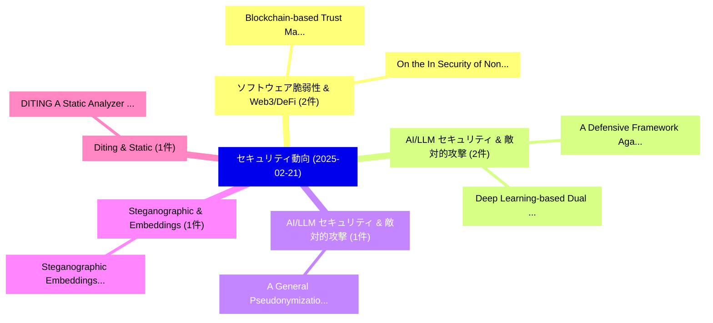

# 📅 02_daily: 日次エグゼクティブサマリー報告書 (2025-02-21)

**集計日時**: 2026-10-02 23:05:17 UTC  
**対象日付**: 2025-02-21  
**本日収集論文数**: 18 件  

---

## 💡 主要セキュリティ動向・脅威インサイト (Executive Insights)

本日の収集論文（計 18 件）において、以下の重点セキュリティ領域で活発な研究動向が確認されました：
- **ソフトウェア脆弱性 & Web3/DeFi** (2 件): 注目論文として 「On the (In)Security of Non-res...」、「Blockchain-based Trust Managem...」 等が発表され、実務防御および攻撃検証の進展が見られます。
- **AI/LLM セキュリティ & 敵対的攻撃** (2 件): 注目論文として 「A Defensive Framework Against ...」、「Deep Learning-based Dual Water...」 等が発表され、実務防御および攻撃検証の進展が見られます。
- **AI/LLM セキュリティ & 敵対的攻撃** (1 件): 注目論文として 「A General Pseudonymization Fra...」 等が発表され、実務防御および攻撃検証の進展が見られます。
- **Steganographic & Embeddings** (1 件): 注目論文として 「Steganographic Embeddings as a...」 等が発表され、実務防御および攻撃検証の進展が見られます。
- **Diting & Static** (1 件): 注目論文として 「DITING: A Static Analyzer for ...」 等が発表され、実務防御および攻撃検証の進展が見られます。

### 🗺️ 技術・脅威トピックマインドマップ

---

## 📌 日次セキュリティ論文一覧 (日本語表形式)

| No | arXiv ID | 論文タイトル (日本語訳) | 重要キーワード | 構造化エグゼクティブ要約 (背景・提案・影響) | 脅威分類 | 詳細リンク |
|---|---|---|---|---|---|---|
| 1 | `2502.15233v1` | [A General Pseudonymization Framework for Cloud-Based LLMs: Replacing Privacy Information in Controlled Text Generation（セキュリティ分析論文）](../../okf/papers/2025-02-21/2502.15233.md) | `Replacing Privacy Information`, `Controlled Text Generation`, `Cloud-Based LLMs` | 【提案】概要 (Overview & Key Finding) 本論文「A General Pseudonymization Framework for Cloud-Based LL...。実証評価により経営層・セキュリティ管理者向け推奨アクション (E... | `cs.CR` | [arXiv](https://arxiv.org/abs/2502.15233v1) &#124; [OKF](../../okf/papers/2025-02-21/2502.15233.md) |
| 2 | `2502.15245v1` | [Steganographic Embeddings as an Effective Data Augmentation（セキュリティ分析論文）](../../okf/papers/2025-02-21/2502.15245.md) | `Effective Data Augmentation`, `Steganographic Embeddings`, `Raw Meta` | 【提案】概要 (Overview & Key Finding) 本論文「Steganographic Embeddings as an Effective Data Augmenta...。実証評価により経営層・セキュリティ管理者向け推奨アクション (E... | `cs.CR` | [arXiv](https://arxiv.org/abs/2502.15245v1) &#124; [OKF](../../okf/papers/2025-02-21/2502.15245.md) |
| 3 | `2502.15270v1` | [On the (In)Security of Non-resettable Device Identifiers in Custom Android Systems（セキュリティ分析論文）](../../okf/papers/2025-02-21/2502.15270.md) | `Custom Android Systems`, `Device Identifiers`, `Non-resettable Device` | 【提案】概要 (Overview & Key Finding) 本論文「On the (In)Security of Non-resettable Device Identifier...。実証評価により経営層・セキュリティ管理者向け推奨アクション (E... | `cs.CR` | [arXiv](https://arxiv.org/abs/2502.15270v1) &#124; [OKF](../../okf/papers/2025-02-21/2502.15270.md) |
| 4 | `2502.15281v2` | [DITING: A Static Analyzer for Identifying Bad Partitioning Issues in TEE Applications（セキュリティ分析論文）](../../okf/papers/2025-02-21/2502.15281.md) | `Identifying Bad Partitioning Issues`, `Static Analyzer`, `Chengyan Ma` | 【提案】概要 (Overview & Key Finding) 本論文「DITING: A Static Analyzer for Identifying Bad Partition...。実証評価により経営層・セキュリティ管理者向け推奨アクション (E... | `cs.CR` | [arXiv](https://arxiv.org/abs/2502.15281v2) &#124; [OKF](../../okf/papers/2025-02-21/2502.15281.md) |
| 5 | `2502.15334v1` | [Attention Eclipse: Manipulating Attention to Bypass LLM Safety-Alignment（セキュリティ分析論文）](../../okf/papers/2025-02-21/2502.15334.md) | `Attention Eclipse`, `Manipulating Attention`, `Md Abdullah Al Mamun` | 【提案】概要 (Overview & Key Finding) 本論文「Attention Eclipse: Manipulating Attention to Bypass LLM...。実証評価により経営層・セキュリティ管理者向け推奨アクション (E... | `cs.CR` | [arXiv](https://arxiv.org/abs/2502.15334v1) &#124; [OKF](../../okf/papers/2025-02-21/2502.15334.md) |
| 6 | `2502.15427v1` | [Adversarial Prompt Evaluation: Systematic of Guardrails Against Prompt Input Attacks on LLMsのベンチマーク評価](../../okf/papers/2025-02-21/2502.15427.md) | `Systematic Benchmarking`, `Muhammad Zaid Hameed`, `Giulio Zizzo` | 【提案】概要 (Overview & Key Finding) 本論文「Adversarial Prompt Evaluation: Systematic of Guardrails...。実証評価により経営層・セキュリティ管理者向け推奨アクション (E... | `cs.CR` | [arXiv](https://arxiv.org/abs/2502.15427v1) &#124; [OKF](../../okf/papers/2025-02-21/2502.15427.md) |
| 7 | `2502.15504v1` | [Jeffrey's update rule as a minimizer of Kullback-Leibler divergence（セキュリティ分析論文）](../../okf/papers/2025-02-21/2502.15504.md) | `Kullback-Leibler divergence`, `Catuscia Palamidessi`, `Raw Meta` | 【提案】概要 (Overview & Key Finding) 本論文「Jeffrey's update rule as a minimizer of Kullback-Leible...。実証評価により経営層・セキュリティ管理者向け推奨アクション (E... | `cs.CR` | [arXiv](https://arxiv.org/abs/2502.15504v1) &#124; [OKF](../../okf/papers/2025-02-21/2502.15504.md) |
| 8 | `2502.15505v1` | [Dynamic User Competition and Miner Behavior in the Bitcoin Market（セキュリティ分析論文）](../../okf/papers/2025-02-21/2502.15505.md) | `Dynamic User Competition`, `Miner Behavior`, `Bitcoin Market` | 【提案】概要 (Overview & Key Finding) 本論文「Dynamic User Competition and Miner Behavior in the Bitc...。実証評価により経営層・セキュリティ管理者向け推奨アクション (E... | `cs.CR` | [arXiv](https://arxiv.org/abs/2502.15505v1) &#124; [OKF](../../okf/papers/2025-02-21/2502.15505.md) |
| 9 | `2502.15506v1` | [Construction and Evaluation of LLM-based agents for Semi-Autonomous penetration testing（セキュリティ分析論文）](../../okf/papers/2025-02-21/2502.15506.md) | `LLM-based agents`, `Semi-Autonomous penetration`, `Masaya Kobayashi` | 【提案】概要 (Overview & Key Finding) 本論文「Construction and Evaluation of LLM-based agents for Sem...。実証評価により経営層・セキュリティ管理者向け推奨アクション (E... | `cs.CR` | [arXiv](https://arxiv.org/abs/2502.15506v1) &#124; [OKF](../../okf/papers/2025-02-21/2502.15506.md) |
| 10 | `2502.15561v1` | [A Defensive Framework Against Machine Learning-Based Network Intrusion Detection Systemsに対する敵対的攻撃](../../okf/papers/2025-02-21/2502.15561.md) | `Learning-Based Network`, `Based Network Intrusion Detection`, `Based Network Intrusion Detection Systems` | 【提案】概要 (Overview & Key Finding) 本論文「A Defensive Framework Against Machine Learning-Based Ne...。実証評価により経営層・セキュリティ管理者向け推奨アクション (E... | `cs.CR` | [arXiv](https://arxiv.org/abs/2502.15561v1) &#124; [OKF](../../okf/papers/2025-02-21/2502.15561.md) |
| 11 | `2502.15578v1` | [FLARE: Fault Attack Leveraging Address Reconfiguration Exploits in Multi-Tenant FPGAs（セキュリティ分析論文）](../../okf/papers/2025-02-21/2502.15578.md) | `Fault Attack Leveraging Address Reconfiguration Exploits`, `Multi-Tenant FPGAs`, `Jayeeta Chaudhuri` | 【提案】概要 (Overview & Key Finding) 本論文「FLARE: フォールト攻撃 Leveraging Address Reconfiguration Explo...。実証評価により経営層・セキュリティ管理者向け推奨アクション (E... | `cs.CR` | [arXiv](https://arxiv.org/abs/2502.15578v1) &#124; [OKF](../../okf/papers/2025-02-21/2502.15578.md) |
| 12 | `2502.15629v2` | [Computationally Differentially Private Inner Product Protocols Imply Oblivious Transfer（セキュリティ分析論文）](../../okf/papers/2025-02-21/2502.15629.md) | `Computationally Differentially Private Inner Product Protocols Imply Oblivious Transfer`, `Computationally Differentially Private Inner Produ`, `Iftach Haitner` | 【提案】概要 (Overview & Key Finding) 本論文「Computationally Differentially Private Inner Product Pr...。実証評価により経営層・セキュリティ管理者向け推奨アクション (E... | `cs.CR` | [arXiv](https://arxiv.org/abs/2502.15629v2) &#124; [OKF](../../okf/papers/2025-02-21/2502.15629.md) |
| 13 | `2502.15653v1` | [Blockchain-based Trust Management in Security Credential Management System for Vehicular Network（セキュリティ分析論文）](../../okf/papers/2025-02-21/2502.15653.md) | `Security Credential Management System`, `Trust Management`, `Vehicular Network` | 【提案】概要 (Overview & Key Finding) 本論文「Blockchain-based Trust Management in Security Credentia...。実証評価により経営層・セキュリティ管理者向け推奨アクション (E... | `cs.CR` | [arXiv](https://arxiv.org/abs/2502.15653v1) &#124; [OKF](../../okf/papers/2025-02-21/2502.15653.md) |
| 14 | `2502.15680v2` | [Privacy Ripple Effects from Adding or Removing Personal Information in Language Model Training（セキュリティ分析論文）](../../okf/papers/2025-02-21/2502.15680.md) | `Privacy Ripple Effects`, `Removing Personal Information`, `Language Model Training` | 【提案】概要 (Overview & Key Finding) 本論文「Privacy Ripple Effects from Adding or Removing Personal...。実証評価により経営層・セキュリティ管理者向け推奨アクション (E... | `cs.CR` | [arXiv](https://arxiv.org/abs/2502.15680v2) &#124; [OKF](../../okf/papers/2025-02-21/2502.15680.md) |
| 15 | `2502.15929v1` | [Approximate Differential Privacy of the $\ell_2$ Mechanism（セキュリティ分析論文）](../../okf/papers/2025-02-21/2502.15929.md) | `Approximate Differential Privacy`, `Matthew Joseph`, `Alex Kulesza` | 【提案】概要 (Overview & Key Finding) 本論文「Approximate 差分プライバシー of the $\ell_2$ Mechanism（セキュリティ分析...。実証評価により経営層・セキュリティ管理者向け推奨アクション (E... | `cs.CR` | [arXiv](https://arxiv.org/abs/2502.15929v1) &#124; [OKF](../../okf/papers/2025-02-21/2502.15929.md) |
| 16 | `2502.15932v1` | [CVE-LLM : Ontology-Assisted Automatic Vulnerability Evaluation Using 大規模言語モデル](../../okf/papers/2025-02-21/2502.15932.md) | `Ontology-Assisted Automatic`, `Assisted Automatic Vulnerability Evaluat`, `George Marica Vasile` | 【提案】概要 (Overview & Key Finding) 本論文「CVE-LLM : Ontology-Assisted Automatic 脆弱性 Evaluation Us...。実証評価により経営層・セキュリティ管理者向け推奨アクション (E... | `cs.CR` | [arXiv](https://arxiv.org/abs/2502.15932v1) &#124; [OKF](../../okf/papers/2025-02-21/2502.15932.md) |
| 17 | `2502.18501v1` | [Deep Learning-based Dual Watermarking for Image Copyright Protection and Authentication（セキュリティ分析論文）](../../okf/papers/2025-02-21/2502.18501.md) | `Image Copyright Protection`, `Deep Learning`, `Dual Watermarking` | 【提案】概要 (Overview & Key Finding) 本論文「Deep Learning-based Dual Watermarking for Image Copyrig...。実証評価により経営層・セキュリティ管理者向け推奨アクション (E... | `cs.CR` | [arXiv](https://arxiv.org/abs/2502.18501v1) &#124; [OKF](../../okf/papers/2025-02-21/2502.18501.md) |
| 18 | `2502.18504v2` | [TurboFuzzLLM: Turbocharging Mutation-based Fuzzing for Effectively Jailbreaking 大規模言語モデル in Practice](../../okf/papers/2025-02-21/2502.18504.md) | `Turbocharging Mutation`, `Mutation-based Fuzzing`, `Effectively Jailbreaking Large Language Models` | 【提案】概要 (Overview & Key Finding) 本論文「TurboFuzzLLM: Turbocharging Mutation-based Fuzzing for ...。実証評価により経営層・セキュリティ管理者向け推奨アクション (E... | `cs.CR` | [arXiv](https://arxiv.org/abs/2502.18504v2) &#124; [OKF](../../okf/papers/2025-02-21/2502.18504.md) |

