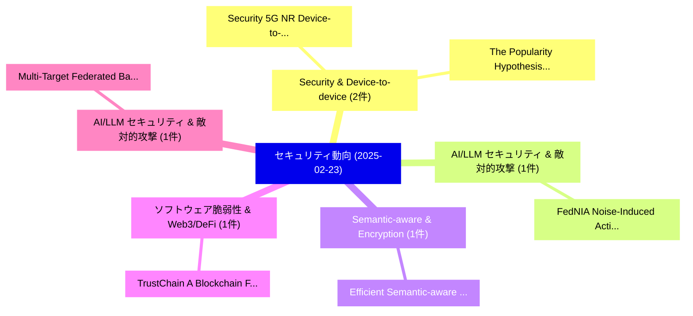

# 📅 02_daily: 日次エグゼクティブサマリー報告書 (2025-02-23)

**集計日時**: 2026-10-02 23:05:18 UTC  
**対象日付**: 2025-02-23  
**本日収集論文数**: 14 件  

---

## 💡 主要セキュリティ動向・脅威インサイト (Executive Insights)

本日の収集論文（計 14 件）において、以下の重点セキュリティ領域で活発な研究動向が確認されました：
- **Security & Device-to-device** (2 件): 注目論文として 「Security 5G NR Device-to-Devic...」、「The Popularity Hypothesis in S...」 等が発表され、実務防御および攻撃検証の進展が見られます。
- **AI/LLM セキュリティ & 敵対的攻撃** (1 件): 注目論文として 「FedNIA: Noise-Induced Activati...」 等が発表され、実務防御および攻撃検証の進展が見られます。
- **Semantic-aware & Encryption** (1 件): 注目論文として 「Efficient Semantic-aware Encry...」 等が発表され、実務防御および攻撃検証の進展が見られます。
- **ソフトウェア脆弱性 & Web3/DeFi** (1 件): 注目論文として 「TrustChain: A Blockchain Frame...」 等が発表され、実務防御および攻撃検証の進展が見られます。
- **AI/LLM セキュリティ & 敵対的攻撃** (1 件): 注目論文として 「Multi-Target Federated Backdoo...」 等が発表され、実務防御および攻撃検証の進展が見られます。

### 🗺️ 技術・脅威トピックマインドマップ

---

## 📌 日次セキュリティ論文一覧 (日本語表形式)

| No | arXiv ID | 論文タイトル (日本語訳) | 重要キーワード | 構造化エグゼクティブ要約 (背景・提案・影響) | 脅威分類 | 詳細リンク |
|---|---|---|---|---|---|---|
| 1 | `2502.16396v1` | [FedNIA: Noise-Induced Activation Analysis for Mitigating Data Poisoning in FL（セキュリティ分析論文）](../../okf/papers/2025-02-23/2502.16396.md) | `Mitigating Data Poisoning`, `Noise-Induced Activation`, `Ehsan Hallaji` | 【提案】概要 (Overview & Key Finding) 本論文「FedNIA: Noise-Induced Activation Analysis for Mitigatin...。実証評価により経営層・セキュリティ管理者向け推奨アクション (E... | `cs.CR` | [arXiv](https://arxiv.org/abs/2502.16396v1) &#124; [OKF](../../okf/papers/2025-02-23/2502.16396.md) |
| 2 | `2502.16400v1` | [Efficient Semantic-aware Encryption for Secure Communications in Intelligent Connected Vehicles（セキュリティ分析論文）](../../okf/papers/2025-02-23/2502.16400.md) | `Intelligent Connected Vehicles`, `Efficient Semantic`, `Secure Communications` | 【提案】概要 (Overview & Key Finding) 本論文「Efficient Semantic-aware Encryption for Secure Communic...。実証評価により経営層・セキュリティ管理者向け推奨アクション (E... | `cs.CR` | [arXiv](https://arxiv.org/abs/2502.16400v1) &#124; [OKF](../../okf/papers/2025-02-23/2502.16400.md) |
| 3 | `2502.16406v2` | [TrustChain: A Blockchain Framework for Auditing and Verifying Aggregators in Decentralized 連合学習](../../okf/papers/2025-02-23/2502.16406.md) | `Verifying Aggregators`, `Decentralized Federated Learning`, `Ehsan Hallaji` | 【提案】概要 (Overview & Key Finding) 本論文「TrustChain: A Blockchain Framework for Auditing and Ver...。実証評価により経営層・セキュリティ管理者向け推奨アクション (E... | `cs.CR` | [arXiv](https://arxiv.org/abs/2502.16406v2) &#124; [OKF](../../okf/papers/2025-02-23/2502.16406.md) |
| 4 | `2502.16545v1` | [Multi-Target Federated Backdoor Attack Based on Feature Aggregation（セキュリティ分析論文）](../../okf/papers/2025-02-23/2502.16545.md) | `Target Federated Backdoor Attack Based`, `Feature Aggregation`, `Multi-Target Federated` | 【提案】概要 (Overview & Key Finding) 本論文「Multi-Target Federated Backdoor Attack Based on Feature...。実証評価により経営層・セキュリティ管理者向け推奨アクション (E... | `cs.CR` | [arXiv](https://arxiv.org/abs/2502.16545v1) &#124; [OKF](../../okf/papers/2025-02-23/2502.16545.md) |
| 5 | `2502.16580v5` | [Can Indirect Prompt Injection Attacks Be Detected and Removed?（セキュリティ分析論文）](../../okf/papers/2025-02-23/2502.16580.md) | `Yulin Chen`, `Haoran Li`, `Yuan Sui` | 【提案】### (日本語題名: Can Indirect プロンプトインジェクション Attacks Be Detected and Removed?（セキュリティ分析論文）)  >...。実証評価により経営層・セキュリティ管理者向け推奨アクション (E... | `cs.CR` | [arXiv](https://arxiv.org/abs/2502.16580v5) &#124; [OKF](../../okf/papers/2025-02-23/2502.16580.md) |
| 6 | `2502.16605v1` | [OPAQUE: Obfuscating Phase in Quantum Circuit Compilation for Efficient IP Protection（セキュリティ分析論文）](../../okf/papers/2025-02-23/2502.16605.md) | `Quantum Circuit Compilation`, `Obfuscating Phase`, `Anees Rehman` | 【提案】概要 (Overview & Key Finding) 本論文「OPAQUE: Obfuscating Phase in 量子 Circuit Compilation for...。実証評価により経営層・セキュリティ管理者向け推奨アクション (E... | `cs.CR` | [arXiv](https://arxiv.org/abs/2502.16605v1) &#124; [OKF](../../okf/papers/2025-02-23/2502.16605.md) |
| 7 | `2502.16650v1` | [Security 5G NR Device-to-Device Sidelink Communicationsの分析](../../okf/papers/2025-02-23/2502.16650.md) | `Device Sidelink Communications`, `Device Sidelink`, `Evangelos Bitsikas` | 【提案】概要 (Overview & Key Finding) 本論文「Security 5G NR Device-to-Device Sidelink Communications...。実証評価により経営層・セキュリティ管理者向け推奨アクション (E... | `cs.CR` | [arXiv](https://arxiv.org/abs/2502.16650v1) &#124; [OKF](../../okf/papers/2025-02-23/2502.16650.md) |
| 8 | `2502.16670v2` | [The Popularity Hypothesis in Software Security: A Large-Scale Replication with PHP Packages（セキュリティ分析論文）](../../okf/papers/2025-02-23/2502.16670.md) | `Software Security`, `Scale Replication`, `Large-Scale Replication` | 【提案】概要 (Overview & Key Finding) 本論文「The Popularity Hypothesis in Software Security: A Large...。実証評価により経営層・セキュリティ管理者向け推奨アクション (E... | `cs.CR` | [arXiv](https://arxiv.org/abs/2502.16670v2) &#124; [OKF](../../okf/papers/2025-02-23/2502.16670.md) |
| 9 | `2502.16730v2` | [RapidPen: Fully Automated IP-to-Shell Penetration Testing with LLM-based Agents（セキュリティ分析論文）](../../okf/papers/2025-02-23/2502.16730.md) | `Shell Penetration Testing`, `Fully Automated`, `LLM-based Agents` | 【提案】概要 (Overview & Key Finding) 本論文「RapidPen: Fully Automated IP-to-Shell Penetration Testi...。実証評価により経営層・セキュリティ管理者向け推奨アクション (E... | `cs.CR` | [arXiv](https://arxiv.org/abs/2502.16730v2) &#124; [OKF](../../okf/papers/2025-02-23/2502.16730.md) |
| 10 | `2502.16750v4` | [Guardians of the Agentic System: Preventing Many Shots Jailbreak with Agentic System（セキュリティ分析論文）](../../okf/papers/2025-02-23/2502.16750.md) | `Agentic System`, `Preventing Many Shots Jailbreak`, `Md Jafor Sadek` | 【提案】概要 (Overview & Key Finding) 本論文「Guardians of the Agentic System: Preventing Many Shots ...。実証評価により経営層・セキュリティ管理者向け推奨アクション (E... | `cs.CR` | [arXiv](https://arxiv.org/abs/2502.16750v4) &#124; [OKF](../../okf/papers/2025-02-23/2502.16750.md) |
| 11 | `2502.18517v2` | [RewardDS: Privacy-Preserving Fine-Tuning for 大規模言語モデル via Reward Driven Data Synthesis](../../okf/papers/2025-02-23/2502.18517.md) | `Reward Driven Data Synthesis`, `Preserving Fine`, `Privacy-Preserving Fine` | 【提案】概要 (Overview & Key Finding) 本論文「RewardDS: Privacy-Preserving Fine-Tuning for 大規模言語モデル v...。実証評価により経営層・セキュリティ管理者向け推奨アクション (E... | `cs.CR` | [arXiv](https://arxiv.org/abs/2502.18517v2) &#124; [OKF](../../okf/papers/2025-02-23/2502.18517.md) |
| 12 | `2502.18518v1` | [Swallowing the Poison Pills: Insights from Vulnerability Disparity Among LLMs（セキュリティ分析論文）](../../okf/papers/2025-02-23/2502.18518.md) | `Vulnerability Disparity Among`, `Poison Pills`, `Peng Yifeng` | 【提案】概要 (Overview & Key Finding) 本論文「Swallowing the Poison Pills: Insights from 脆弱性 Disparit...。実証評価により経営層・セキュリティ管理者向け推奨アクション (E... | `cs.CR` | [arXiv](https://arxiv.org/abs/2502.18518v1) &#124; [OKF](../../okf/papers/2025-02-23/2502.18518.md) |
| 13 | `2502.18520v1` | [Class-Conditional Neural Polarizer: A Lightweight and Effective Backdoor Defense by Purifying Poisoned Features（セキュリティ分析論文）](../../okf/papers/2025-02-23/2502.18520.md) | `Conditional Neural Polarizer`, `Effective Backdoor Defense`, `Purifying Poisoned Features` | 【提案】概要 (Overview & Key Finding) 本論文「Class-Conditional Neural Polarizer: A Lightweight and E...。実証評価により経営層・セキュリティ管理者向け推奨アクション (E... | `cs.CR` | [arXiv](https://arxiv.org/abs/2502.18520v1) &#124; [OKF](../../okf/papers/2025-02-23/2502.18520.md) |
| 14 | `2503.22685v1` | [Provenance of Adaptation in Scientific and Business Workflows -- Literature Review（セキュリティ分析論文）](../../okf/papers/2025-02-23/2503.22685.md) | `Business Workflows`, `Literature Review`, `Ludwig Stage` | 【提案】概要 (Overview & Key Finding) 本論文「Provenance of Adaptation in Scientific and Business Wor...。実証評価により経営層・セキュリティ管理者向け推奨アクション (E... | `cs.CR` | [arXiv](https://arxiv.org/abs/2503.22685v1) &#124; [OKF](../../okf/papers/2025-02-23/2503.22685.md) |

