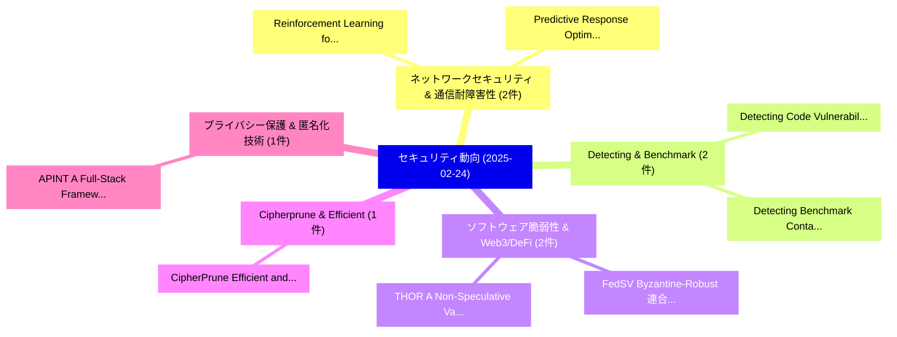

# 📅 02_daily: 日次エグゼクティブサマリー報告書 (2025-02-24)

**集計日時**: 2026-10-02 23:05:18 UTC  
**対象日付**: 2025-02-24  
**本日収集論文数**: 21 件  

---

## 💡 主要セキュリティ動向・脅威インサイト (Executive Insights)

本日の収集論文（計 21 件）において、以下の重点セキュリティ領域で活発な研究動向が確認されました：
- **ネットワークセキュリティ & 通信耐障害性** (2 件): 注目論文として 「Reinforcement Learning for Exp...」、「Predictive Response Optimizati...」 等が発表され、実務防御および攻撃検証の進展が見られます。
- **Detecting & Benchmark** (2 件): 注目論文として 「Detecting Code Vulnerabilities...」、「Detecting Benchmark Contaminat...」 等が発表され、実務防御および攻撃検証の進展が見られます。
- **ソフトウェア脆弱性 & Web3/DeFi** (2 件): 注目論文として 「FedSV: Byzantine-Robust 連合学習 v...」、「THOR: A Non-Speculative Value ...」 等が発表され、実務防御および攻撃検証の進展が見られます。
- **Cipherprune & Efficient** (1 件): 注目論文として 「CipherPrune: Efficient and Sca...」 等が発表され、実務防御および攻撃検証の進展が見られます。
- **プライバシー保護 & 匿名化技術** (1 件): 注目論文として 「APINT: A Full-Stack Framework ...」 等が発表され、実務防御および攻撃検証の進展が見られます。

### 🗺️ 技術・脅威トピックマインドマップ

---

## 📌 日次セキュリティ論文一覧 (日本語表形式)

| No | arXiv ID | 論文タイトル (日本語訳) | 重要キーワード | 構造化エグゼクティブ要約 (背景・提案・影響) | 脅威分類 | 詳細リンク |
|---|---|---|---|---|---|---|
| 1 | `2502.16756v2` | [Reinforcement Learning for Exploration of Speculative Execution Vulnerabilitiesに向けて](../../okf/papers/2025-02-24/2502.16756.md) | `Towards Reinforcement Learning`, `Speculative Execution Vulnerabilities`, `Reinforcement Learning` | 【提案】概要 (Overview & Key Finding) 本論文「Reinforcement Learning for Exploration of Speculative E...。実証評価により経営層・セキュリティ管理者向け推奨アクション (E... | `cs.CR` | [arXiv](https://arxiv.org/abs/2502.16756v2) &#124; [OKF](../../okf/papers/2025-02-24/2502.16756.md) |
| 2 | `2502.16782v2` | [CipherPrune: Efficient and Scalable Private Transformer Inference（セキュリティ分析論文）](../../okf/papers/2025-02-24/2502.16782.md) | `Scalable Private Transformer Inference`, `Yancheng Zhang`, `Jiaqi Xue` | 【提案】概要 (Overview & Key Finding) 本論文「CipherPrune: Efficient and Scalable Private Transformer...。実証評価により経営層・セキュリティ管理者向け推奨アクション (E... | `cs.CR` | [arXiv](https://arxiv.org/abs/2502.16782v2) &#124; [OKF](../../okf/papers/2025-02-24/2502.16782.md) |
| 3 | `2502.16835v1` | [Detecting Code Vulnerabilities with Heterogeneous GNN Training（セキュリティ分析論文）](../../okf/papers/2025-02-24/2502.16835.md) | `Detecting Code Vulnerabilities`, `Yu Luo`, `Weifeng Xu` | 【提案】概要 (Overview & Key Finding) 本論文「Detecting Code Vulnerabilities with Heterogeneous GNN T...。実証評価により経営層・セキュリティ管理者向け推奨アクション (E... | `cs.CR` | [arXiv](https://arxiv.org/abs/2502.16835v1) &#124; [OKF](../../okf/papers/2025-02-24/2502.16835.md) |
| 4 | `2502.16877v1` | [APINT: A Full-Stack Framework for Acceleration of Privacy-Preserving Inference of Transformers based on Garbled Circuits（セキュリティ分析論文）](../../okf/papers/2025-02-24/2502.16877.md) | `Preserving Inference`, `Garbled Circuits`, `Privacy-Preserving Inference` | 【提案】概要 (Overview & Key Finding) 本論文「APINT: A Full-Stack Framework for Acceleration of Priva...。実証評価により経営層・セキュリティ管理者向け推奨アクション (E... | `cs.CR` | [arXiv](https://arxiv.org/abs/2502.16877v1) &#124; [OKF](../../okf/papers/2025-02-24/2502.16877.md) |
| 5 | `2502.16903v2` | [GuidedBench: Measuring and Mitigating the Evaluation Discrepancies of In-the-wild LLM Jailbreak Methods（セキュリティ分析論文）](../../okf/papers/2025-02-24/2502.16903.md) | `Jailbreak Methods`, `Ruixuan Huang`, `Xunguang Wang` | 【提案】概要 (Overview & Key Finding) 本論文「GuidedBench: Measuring and Mitigating the Evaluation Di...。実証評価により# GuidedBench: Measuring ... | `cs.CR` | [arXiv](https://arxiv.org/abs/2502.16903v2) &#124; [OKF](../../okf/papers/2025-02-24/2502.16903.md) |
| 6 | `2502.16955v1` | [MTVHunter: Smart Contracts 脆弱性検出 Based on Multi-Teacher Knowledge Translation](../../okf/papers/2025-02-24/2502.16955.md) | `Teacher Knowledge Translation`, `Multi-Teacher Knowledge`, `Smart Contracts Vulnerability Detection Based` | 【提案】概要 (Overview & Key Finding) 本論文「MTVHunter: スマートコントラクトs 脆弱性検出 Based on Multi-Teacher Kno...。実証評価により経営層・セキュリティ管理者向け推奨アクション (E... | `cs.CR` | [arXiv](https://arxiv.org/abs/2502.16955v1) &#124; [OKF](../../okf/papers/2025-02-24/2502.16955.md) |
| 7 | `2502.17010v2` | [Unconditional foundations for supersingular isogeny-based cryptography（セキュリティ分析論文）](../../okf/papers/2025-02-24/2502.17010.md) | `isogeny-based cryptography`, `Le Merdy`, `Benjamin Wesolowski` | 【提案】概要 (Overview & Key Finding) 本論文「Unconditional foundations for supersingular isogeny-bas...。実証評価により経営層・セキュリティ管理者向け推奨アクション (E... | `cs.CR` | [arXiv](https://arxiv.org/abs/2502.17010v2) &#124; [OKF](../../okf/papers/2025-02-24/2502.17010.md) |
| 8 | `2502.17259v2` | [Detecting Benchmark Contamination Through Watermarking（セキュリティ分析論文）](../../okf/papers/2025-02-24/2502.17259.md) | `Tom Sander`, `Pierre Fernandez`, `Saeed Mahloujifar` | 【提案】概要 (Overview & Key Finding) 本論文「Detecting Benchmark Contamination Through Watermarking（...。実証評価により経営層・セキュリティ管理者向け推奨アクション (E... | `cs.CR` | [arXiv](https://arxiv.org/abs/2502.17259v2) &#124; [OKF](../../okf/papers/2025-02-24/2502.17259.md) |
| 9 | `2502.17270v2` | [Order Fairness Evaluation of DAG-based ledgers（セキュリティ分析論文）](../../okf/papers/2025-02-24/2502.17270.md) | `DAG-based ledgers`, `Erwan Mahe`, `Sara Tucci` | 【提案】概要 (Overview & Key Finding) 本論文「Order Fairness Evaluation of DAG-based ledgers（セキュリティ分析...。実証評価により経営層・セキュリティ管理者向け推奨アクション (E... | `cs.CR` | [arXiv](https://arxiv.org/abs/2502.17270v2) &#124; [OKF](../../okf/papers/2025-02-24/2502.17270.md) |
| 10 | `2502.17330v1` | [Unveiling ECC Vulnerabilities: LSTM Networks for Operation Recognition in Side-Channel Attacks（セキュリティ分析論文）](../../okf/papers/2025-02-24/2502.17330.md) | `Operation Recognition`, `Channel Attacks`, `Side-Channel Attacks` | 【提案】概要 (Overview & Key Finding) 本論文「Unveiling ECC Vulnerabilities: LSTM Networks for Operat...。実証評価により経営層・セキュリティ管理者向け推奨アクション (E... | `cs.CR` | [arXiv](https://arxiv.org/abs/2502.17330v1) &#124; [OKF](../../okf/papers/2025-02-24/2502.17330.md) |
| 11 | `2502.17392v1` | [Emoti-Attack: Zero-Perturbation NLP Systems via Emoji Sequencesに対する敵対的攻撃](../../okf/papers/2025-02-24/2502.17392.md) | `Perturbation Adversarial Attacks`, `Emoji Sequences`, `Zero-Perturbation Adversarial` | 【提案】概要 (Overview & Key Finding) 本論文「Emoti-Attack: Zero-Perturbation NLP Systems via Emoji S...。実証評価により経営層・セキュリティ管理者向け推奨アクション (E... | `cs.CR` | [arXiv](https://arxiv.org/abs/2502.17392v1) &#124; [OKF](../../okf/papers/2025-02-24/2502.17392.md) |
| 12 | `2502.17424v7` | [Emergent Misalignment: Narrow finetuning can produce broadly misaligned LLMs（セキュリティ分析論文）](../../okf/papers/2025-02-24/2502.17424.md) | `Emergent Misalignment`, `Jan Betley`, `Daniel Tan` | 【提案】概要 (Overview & Key Finding) 本論文「Emergent Misalignment: Narrow finetuning can produce br...。実証評価により経営層・セキュリティ管理者向け推奨アクション (E... | `cs.CR` | [arXiv](https://arxiv.org/abs/2502.17424v7) &#124; [OKF](../../okf/papers/2025-02-24/2502.17424.md) |
| 13 | `2502.17526v1` | [FedSV: Byzantine-Robust 連合学習 via Shapley Value](../../okf/papers/2025-02-24/2502.17526.md) | `Shapley Value`, `Robust Federated Learning`, `Byzantine-Robust Federated` | 【提案】概要 (Overview & Key Finding) 本論文「FedSV: Byzantine-Robust 連合学習 via Shapley Value」（原題: Fed...。実証評価により経営層・セキュリティ管理者向け推奨アクション (E... | `cs.CR` | [arXiv](https://arxiv.org/abs/2502.17526v1) &#124; [OKF](../../okf/papers/2025-02-24/2502.17526.md) |
| 14 | `2502.17537v3` | [Rethinking the Vulnerability of Concept Erasure and a New Method（セキュリティ分析論文）](../../okf/papers/2025-02-24/2502.17537.md) | `Concept Erasure`, `Kaicheng Zhang`, `Lucas Beerens` | 【提案】概要 (Overview & Key Finding) 本論文「Rethinking the 脆弱性 of Concept Erasure and a New Method（...。実証評価によりRichardson, Kaicheng Zhan。 | `cs.CR` | [arXiv](https://arxiv.org/abs/2502.17537v3) &#124; [OKF](../../okf/papers/2025-02-24/2502.17537.md) |
| 15 | `2502.17653v2` | [Formally-verified Security against Forgery of Remote Attestation using SSProve（セキュリティ分析論文）](../../okf/papers/2025-02-24/2502.17653.md) | `Remote Attestation`, `Formally-verified Security`, `Sara Zain` | 【提案】概要 (Overview & Key Finding) 本論文「Formally-verified Security against Forgery of Remote At...。実証評価により経営層・セキュリティ管理者向け推奨アクション (E... | `cs.CR` | [arXiv](https://arxiv.org/abs/2502.17653v2) &#124; [OKF](../../okf/papers/2025-02-24/2502.17653.md) |
| 16 | `2502.17658v1` | [THOR: A Non-Speculative Value Dependent Timing Side Channel Attack Exploiting Intel AMX（セキュリティ分析論文）](../../okf/papers/2025-02-24/2502.17658.md) | `Speculative Value Dependent Timing Side Channel Attack Exploiting Intel`, `Non-Speculative Value`, `Samira Mirbagher Ajorpaz` | 【提案】概要 (Overview & Key Finding) 本論文「THOR: A Non-Speculative Value Dependent Timing サイドチャネル攻...。実証評価により経営層・セキュリティ管理者向け推奨アクション (E... | `cs.CR` | [arXiv](https://arxiv.org/abs/2502.17658v1) &#124; [OKF](../../okf/papers/2025-02-24/2502.17658.md) |
| 17 | `2502.17693v1` | [Predictive Response Optimization: Using Reinforcement Learning to Fight Online Social Network Abuse（セキュリティ分析論文）](../../okf/papers/2025-02-24/2502.17693.md) | `Fight Online Social Network Abuse`, `Predictive Response Optimization`, `Using Reinforcement Learning` | 【提案】概要 (Overview & Key Finding) 本論文「Predictive Response Optimization: Using Reinforcement L...。実証評価により経営層・セキュリティ管理者向け推奨アクション (E... | `cs.CR` | [arXiv](https://arxiv.org/abs/2502.17693v1) &#124; [OKF](../../okf/papers/2025-02-24/2502.17693.md) |
| 18 | `2502.17698v1` | [The Cyber Immune System: Harnessing Adversarial Forces for Security Resilience（セキュリティ分析論文）](../../okf/papers/2025-02-24/2502.17698.md) | `Harnessing Adversarial Forces`, `Security Resilience`, `Krti Tallam` | 【提案】概要 (Overview & Key Finding) 本論文「The Cyber Immune System: Harnessing Adversarial Forces ...。実証評価により経営層・セキュリティ管理者向け推奨アクション (E... | `cs.CR` | [arXiv](https://arxiv.org/abs/2502.17698v1) &#124; [OKF](../../okf/papers/2025-02-24/2502.17698.md) |
| 19 | `2502.17703v1` | [To Patch or Not to Patch: Motivations, Challenges, and Implications for サイバーセキュリティ](../../okf/papers/2025-02-24/2502.17703.md) | `Raw Meta`, `Executive Summary`, `Key Finding` | 【提案】背景とセキュリティ上の課題 (Background & Problem) 本研究はサイバー脅威環境におけるセキュリティ構造・脆弱性の検証を目的としています。(主要検出項目: ...。実証評価により経営層・セキュリティ管理者向け推奨アクション (E... | `cs.CR` | [arXiv](https://arxiv.org/abs/2502.17703v1) &#124; [OKF](../../okf/papers/2025-02-24/2502.17703.md) |
| 20 | `2502.18527v2` | [GOD model: Privacy Preserved AI School for Personal Assistant（セキュリティ分析論文）](../../okf/papers/2025-02-24/2502.18527.md) | `Privacy Preserved`, `Personal Assistant`, `Bill Sun` | 【提案】概要 (Overview & Key Finding) 本論文「GOD model: Privacy Preserved AI School for Personal Ass...。実証評価により経営層・セキュリティ管理者向け推奨アクション (E... | `cs.CR` | [arXiv](https://arxiv.org/abs/2502.18527v2) &#124; [OKF](../../okf/papers/2025-02-24/2502.18527.md) |
| 21 | `2502.18528v1` | [ARACNE: An LLM-Based Autonomous Shell Pentesting Agent（セキュリティ分析論文）](../../okf/papers/2025-02-24/2502.18528.md) | `Based Autonomous Shell Pentesting Agent`, `LLM-Based Autonomous`, `Tomas Nieponice` | 【提案】概要 (Overview & Key Finding) 本論文「ARACNE: An LLM-Based Autonomous Shell Pentesting Agent（...。実証評価により経営層・セキュリティ管理者向け推奨アクション (E... | `cs.CR` | [arXiv](https://arxiv.org/abs/2502.18528v1) &#124; [OKF](../../okf/papers/2025-02-24/2502.18528.md) |

