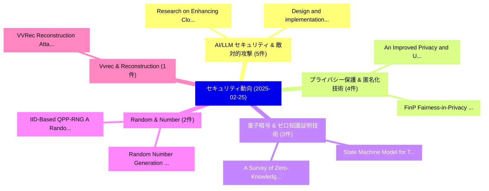

# 📅 02_daily: 日次エグゼクティブサマリー報告書 (2025-02-25)

**集計日時**: 2026-10-02 23:05:18 UTC  
**対象日付**: 2025-02-25  
**本日収集論文数**: 25 件  

---

## 💡 主要セキュリティ動向・脅威インサイト (Executive Insights)

本日の収集論文（計 25 件）において、以下の重点セキュリティ領域で活発な研究動向が確認されました：
- **AI/LLM セキュリティ & 敵対的攻撃** (5 件): 注目論文として 「Design and implementation of a...」、「Research on Enhancing Cloud Co...」 等が発表され、実務防御および攻撃検証の進展が見られます。
- **プライバシー保護 & 匿名化技術** (4 件): 注目論文として 「FinP: Fairness-in-Privacy in 連...」、「An Improved Privacy and Utilit...」 等が発表され、実務防御および攻撃検証の進展が見られます。
- **量子暗号 & ゼロ知識証明技術** (3 件): 注目論文として 「State Machine Model for The Up...」、「A Survey of Zero-Knowledge Pro...」 等が発表され、実務防御および攻撃検証の進展が見られます。
- **Random & Number** (2 件): 注目論文として 「Random Number Generation from ...」、「IID-Based QPP-RNG: A Random Nu...」 等が発表され、実務防御および攻撃検証の進展が見られます。
- **Vvrec & Reconstruction** (1 件): 注目論文として 「VVRec: Reconstruction Attacks ...」 等が発表され、実務防御および攻撃検証の進展が見られます。

### 🗺️ 技術・脅威トピックマインドマップ

---

## 📌 日次セキュリティ論文一覧 (日本語表形式)

| No | arXiv ID | 論文タイトル (日本語訳) | 重要キーワード | 構造化エグゼクティブ要約 (背景・提案・影響) | 脅威分類 | 詳細リンク |
|---|---|---|---|---|---|---|
| 1 | `2502.17748v4` | [FinP: Fairness-in-Privacy in 連合学習 by Addressing Disparities in Privacy Risk](../../okf/papers/2025-02-25/2502.17748.md) | `Addressing Disparities`, `Privacy Risk`, `Federated Learning` | 【提案】概要 (Overview & Key Finding) 本論文「FinP: Fairness-in-Privacy in 連合学習 by Addressing Dispari...。実証評価により経営層・セキュリティ管理者向け推奨アクション (E... | `cs.CR` | [arXiv](https://arxiv.org/abs/2502.17748v4) &#124; [OKF](../../okf/papers/2025-02-25/2502.17748.md) |
| 2 | `2502.17763v1` | [Design and implementation of a distributed security threat detection system integrating 連合学習 and multimodal LLM](../../okf/papers/2025-02-25/2502.17763.md) | `Yuqing Wang`, `Xiao Yang`, `Raw Meta` | 【提案】概要 (Overview & Key Finding) 本論文「Design and implementation of a distributed security 脅威 ...。実証評価により経営層・セキュリティ管理者向け推奨アクション (E... | `cs.CR` | [arXiv](https://arxiv.org/abs/2502.17763v1) &#124; [OKF](../../okf/papers/2025-02-25/2502.17763.md) |
| 3 | `2502.17772v4` | [An Improved Privacy and Utility Differentially Private SGD with Bounded Domain and Smooth Lossesの分析](../../okf/papers/2025-02-25/2502.17772.md) | `Bounded Domain`, `Utility Differentially Private`, `Differentially Private` | 【提案】概要 (Overview & Key Finding) 本論文「An Improved Privacy and Utility Differentially Private ...。実証評価により経営層・セキュリティ管理者向け推奨アクション (E... | `cs.CR` | [arXiv](https://arxiv.org/abs/2502.17772v4) &#124; [OKF](../../okf/papers/2025-02-25/2502.17772.md) |
| 4 | `2502.17801v3` | [Research on Enhancing Cloud Computing Network Security using Artificial Intelligence Algorithms（セキュリティ分析論文）](../../okf/papers/2025-02-25/2502.17801.md) | `Enhancing Cloud Computing Network Security`, `Artificial Intelligence Algorithms`, `Enhancing Cloud Computing Network Securi` | 【提案】概要 (Overview & Key Finding) 本論文「Research on Enhancing Cloud Computing Network Security ...。実証評価により経営層・セキュリティ管理者向け推奨アクション (E... | `cs.CR` | [arXiv](https://arxiv.org/abs/2502.17801v3) &#124; [OKF](../../okf/papers/2025-02-25/2502.17801.md) |
| 5 | `2502.17832v4` | [MM-PoisonRAG: Disrupting Multimodal RAG with Local and Global Poisoning Attacks（セキュリティ分析論文）](../../okf/papers/2025-02-25/2502.17832.md) | `Global Poisoning Attacks`, `Disrupting Multimodal`, `Hyeonjeong Ha` | 【提案】概要 (Overview & Key Finding) 本論文「MM-PoisonRAG: Disrupting Multimodal RAG with Local and ...。実証評価により経営層・セキュリティ管理者向け推奨アクション (E... | `cs.CR` | [arXiv](https://arxiv.org/abs/2502.17832v4) &#124; [OKF](../../okf/papers/2025-02-25/2502.17832.md) |
| 6 | `2502.17880v1` | [VVRec: Reconstruction Attacks on DL-based Volumetric Video Upstreaming via Latent Diffusion Model with Gamma Distribution（セキュリティ分析論文）](../../okf/papers/2025-02-25/2502.17880.md) | `Volumetric Video Upstreaming`, `Latent Diffusion Model`, `Reconstruction Attacks` | 【提案】概要 (Overview & Key Finding) 本論文「VVRec: Reconstruction Attacks on DL-based Volumetric Vi...。実証評価により経営層・セキュリティ管理者向け推奨アクション (E... | `cs.CR` | [arXiv](https://arxiv.org/abs/2502.17880v1) &#124; [OKF](../../okf/papers/2025-02-25/2502.17880.md) |
| 7 | `2502.18077v1` | [Examining the Threat Landscape: Foundation Models and Model Stealing（セキュリティ分析論文）](../../okf/papers/2025-02-25/2502.18077.md) | `Threat Landscape`, `Foundation Models`, `Model Stealing` | 【提案】概要 (Overview & Key Finding) 本論文「Examining the 脅威 Landscape: Foundation Models and Model...。実証評価により経営層・セキュリティ管理者向け推奨アクション (E... | `cs.CR` | [arXiv](https://arxiv.org/abs/2502.18077v1) &#124; [OKF](../../okf/papers/2025-02-25/2502.18077.md) |
| 8 | `2502.18092v1` | [State Machine Model for The Update Framework (TUF)（セキュリティ分析論文）](../../okf/papers/2025-02-25/2502.18092.md) | `State Machine Model`, `Brian Romansky`, `Thomas Mazzuchi` | 【提案】概要 (Overview & Key Finding) 本論文「State Machine Model for The Update Framework (TUF)（セキュリ...。実証評価により経営層・セキュリティ管理者向け推奨アクション (E... | `cs.CR` | [arXiv](https://arxiv.org/abs/2502.18092v1) &#124; [OKF](../../okf/papers/2025-02-25/2502.18092.md) |
| 9 | `2502.18227v3` | [Local Differential Privacy for Tensors in Distributed Computing Systems（セキュリティ分析論文）](../../okf/papers/2025-02-25/2502.18227.md) | `Local Differential Privacy`, `Distributed Computing Systems`, `Yachao Yuan` | 【提案】概要 (Overview & Key Finding) 本論文「Local 差分プライバシー for Tensors in Distributed Computing Sys...。実証評価により経営層・セキュリティ管理者向け推奨アクション (E... | `cs.CR` | [arXiv](https://arxiv.org/abs/2502.18227v3) &#124; [OKF](../../okf/papers/2025-02-25/2502.18227.md) |
| 10 | `2502.18288v1` | [Yoimiya: A Scalable Framework for Optimal Resource Utilization in ZK-SNARK Systems（セキュリティ分析論文）](../../okf/papers/2025-02-25/2502.18288.md) | `Optimal Resource Utilization`, `ZK-SNARK Systems`, `Zheming Ye` | 【提案】概要 (Overview & Key Finding) 本論文「Yoimiya: A Scalable Framework for Optimal Resource Util...。実証評価により経営層・セキュリティ管理者向け推奨アクション (E... | `cs.CR` | [arXiv](https://arxiv.org/abs/2502.18288v1) &#124; [OKF](../../okf/papers/2025-02-25/2502.18288.md) |
| 11 | `2502.18303v2` | [Efficiency of the Messaging Layer Security protocol in Experimental Settingsの分析](../../okf/papers/2025-02-25/2502.18303.md) | `Messaging Layer Security`, `David Soler`, `Carlos Dafonte` | 【提案】概要 (Overview & Key Finding) 本論文「Efficiency of the Messaging Layer Security protocol in ...。実証評価により経営層・セキュリティ管理者向け推奨アクション (E... | `cs.CR` | [arXiv](https://arxiv.org/abs/2502.18303v2) &#124; [OKF](../../okf/papers/2025-02-25/2502.18303.md) |
| 12 | `2502.18430v2` | [Random Number Generation from Pulsars（セキュリティ分析論文）](../../okf/papers/2025-02-25/2502.18430.md) | `Random Number Generation`, `Hayder Tirmazi`, `Raw Meta` | 【提案】概要 (Overview & Key Finding) 本論文「Random Number Generation from Pulsars（セキュリティ分析論文）」（原題: ...。実証評価により経営層・セキュリティ管理者向け推奨アクション (E... | `cs.CR` | [arXiv](https://arxiv.org/abs/2502.18430v2) &#124; [OKF](../../okf/papers/2025-02-25/2502.18430.md) |
| 13 | `2502.18535v2` | [A Survey of Zero-Knowledge Proof Based Verifiable Machine Learning（セキュリティ分析論文）](../../okf/papers/2025-02-25/2502.18535.md) | `Knowledge Proof Based Verifiable Machine Learning`, `Zero-Knowledge Proof`, `Knowledge Proof Based Verifiable Machine Lear` | 【提案】概要 (Overview & Key Finding) 本論文「A Survey of ゼロ知識証明 Based Verifiable Machine Learning（セキ...。実証評価により経営層・セキュリティ管理者向け推奨アクション (E... | `cs.CR` | [arXiv](https://arxiv.org/abs/2502.18535v2) &#124; [OKF](../../okf/papers/2025-02-25/2502.18535.md) |
| 14 | `2502.18545v2` | [PII-Bench: Evaluating Query-Aware Privacy Protection Systems（セキュリティ分析論文）](../../okf/papers/2025-02-25/2502.18545.md) | `Aware Privacy Protection Systems`, `Evaluating Query`, `Query-Aware Privacy` | 【提案】概要 (Overview & Key Finding) 本論文「PII-Bench: Evaluating Query-Aware Privacy Protection Sy...。実証評価により経営層・セキュリティ管理者向け推奨アクション (E... | `cs.CR` | [arXiv](https://arxiv.org/abs/2502.18545v2) &#124; [OKF](../../okf/papers/2025-02-25/2502.18545.md) |
| 15 | `2502.18547v2` | [Steganography Beyond Space-Time with Chain of Multimodal AI（セキュリティ分析論文）](../../okf/papers/2025-02-25/2502.18547.md) | `Steganography Beyond Space`, `Chun Chang`, `Isao Echizen` | 【提案】概要 (Overview & Key Finding) 本論文「Steganography Beyond Space-Time with Chain of Multimoda...。実証評価により経営層・セキュリティ管理者向け推奨アクション (E... | `cs.CR` | [arXiv](https://arxiv.org/abs/2502.18547v2) &#124; [OKF](../../okf/papers/2025-02-25/2502.18547.md) |
| 16 | `2502.18549v3` | [ARBoids: Adaptive Residual Reinforcement Learning With Boids Model for Cooperative Multi-USV Target Defense（セキュリティ分析論文）](../../okf/papers/2025-02-25/2502.18549.md) | `Cooperative Multi`, `Target Defense`, `Multi-USV Target` | 【提案】概要 (Overview & Key Finding) 本論文「ARBoids: Adaptive Residual Reinforcement Learning With ...。実証評価により経営層・セキュリティ管理者向け推奨アクション (E... | `cs.CR` | [arXiv](https://arxiv.org/abs/2502.18549v3) &#124; [OKF](../../okf/papers/2025-02-25/2502.18549.md) |
| 17 | `2502.18578v1` | [Differentially Private Iterative Screening Rules for Linear Regression（セキュリティ分析論文）](../../okf/papers/2025-02-25/2502.18578.md) | `Differentially Private Iterative Screening Rules`, `Linear Regression`, `Amol Khanna` | 【提案】概要 (Overview & Key Finding) 本論文「Differentially Private Iterative Screening Rules for Li...。実証評価により経営層・セキュリティ管理者向け推奨アクション (E... | `cs.CR` | [arXiv](https://arxiv.org/abs/2502.18578v1) &#124; [OKF](../../okf/papers/2025-02-25/2502.18578.md) |
| 18 | `2502.18608v2` | [Breaking Distortion-free Watermarks in 大規模言語モデル](../../okf/papers/2025-02-25/2502.18608.md) | `Breaking Distortion`, `Distortion-free Watermarks`, `Large Language Models` | 【提案】概要 (Overview & Key Finding) 本論文「Breaking Distortion-free Watermarks in 大規模言語モデル」（原題: Br...。実証評価によりPotluru, Manuela Veloso -... | `cs.CR` | [arXiv](https://arxiv.org/abs/2502.18608v2) &#124; [OKF](../../okf/papers/2025-02-25/2502.18608.md) |
| 19 | `2502.18609v3` | [IID-Based QPP-RNG: A Random Number Generator Utilizing Random Permutation Sorting Driven by System Jitter（セキュリティ分析論文）](../../okf/papers/2025-02-25/2502.18609.md) | `Random Number Generator Utilizing Random Permutation Sorting Driven`, `System Jitter`, `IID-Based QPP` | 【提案】概要 (Overview & Key Finding) 本論文「IID-Based QPP-RNG: A Random Number Generator Utilizing ...。実証評価により経営層・セキュリティ管理者向け推奨アクション (E... | `cs.CR` | [arXiv](https://arxiv.org/abs/2502.18609v3) &#124; [OKF](../../okf/papers/2025-02-25/2502.18609.md) |
| 20 | `2502.18631v2` | [XTS mode revisited: high hopes for key scopes?（セキュリティ分析論文）](../../okf/papers/2025-02-25/2502.18631.md) | `Raw Meta`, `Executive Summary`, `Key Finding` | 【提案】### (日本語題名: XTS mode revisited: high hopes for key scopes?（セキュリティ分析論文）)  > [!NOTE] > **...。実証評価により経営層・セキュリティ管理者向け推奨アクション (E... | `cs.CR` | [arXiv](https://arxiv.org/abs/2502.18631v2) &#124; [OKF](../../okf/papers/2025-02-25/2502.18631.md) |
| 21 | `2502.18697v1` | [H-FLTN: A Privacy-Preserving Hierarchical Framework for Electric Vehicle Spatio-Temporal Charge Prediction（セキュリティ分析論文）](../../okf/papers/2025-02-25/2502.18697.md) | `Electric Vehicle Spatio`, `Temporal Charge Prediction`, `Privacy-Preserving Hierarchical` | 【提案】概要 (Overview & Key Finding) 本論文「H-FLTN: A Privacy-Preserving Hierarchical Framework for...。実証評価により経営層・セキュリティ管理者向け推奨アクション (E... | `cs.CR` | [arXiv](https://arxiv.org/abs/2502.18697v1) &#124; [OKF](../../okf/papers/2025-02-25/2502.18697.md) |
| 22 | `2502.18706v1` | [Differentially Private 連合学習 With Time-Adaptive Privacy Spending](../../okf/papers/2025-02-25/2502.18706.md) | `Adaptive Privacy Spending`, `Time-Adaptive Privacy`, `Differentially Private` | 【提案】概要 (Overview & Key Finding) 本論文「Differentially Private 連合学習 With Time-Adaptive Privacy ...。実証評価により経営層・セキュリティ管理者向け推奨アクション (E... | `cs.CR` | [arXiv](https://arxiv.org/abs/2502.18706v1) &#124; [OKF](../../okf/papers/2025-02-25/2502.18706.md) |
| 23 | `2503.00038v5` | [from Benign import Toxic: Jailbreaking the Language Model via Adversarial Metaphors（セキュリティ分析論文）](../../okf/papers/2025-02-25/2503.00038.md) | `Language Model`, `Adversarial Metaphors`, `Yu Yan` | 【提案】概要 (Overview & Key Finding) 本論文「from Benign import Toxic: ジェイルブレイクing the Language Mode...。実証評価により経営層・セキュリティ管理者向け推奨アクション (E... | `cs.CR` | [arXiv](https://arxiv.org/abs/2503.00038v5) &#124; [OKF](../../okf/papers/2025-02-25/2503.00038.md) |
| 24 | `2503.01865v1` | [Guiding not Forcing: Enhancing the Transferability of Jailbreaking Attacks on LLMs via Removing Superfluous Constraints（セキュリティ分析論文）](../../okf/papers/2025-02-25/2503.01865.md) | `Removing Superfluous Constraints`, `Jailbreaking Attacks`, `Junxiao Yang` | 【提案】背景とセキュリティ上の課題 (Background & Problem) 本研究はサイバー脅威環境におけるセキュリティ構造・脆弱性の検証を目的としています。(主要検出項目: ...。実証評価により経営層・セキュリティ管理者向け推奨アクション (E... | `cs.CR` | [arXiv](https://arxiv.org/abs/2503.01865v1) &#124; [OKF](../../okf/papers/2025-02-25/2503.01865.md) |
| 25 | `2503.04783v1` | [Comparative Analysis Based on DeepSeek, ChatGPT, and Google Gemini: Features, Techniques, Performance, Future Prospects（セキュリティ分析論文）](../../okf/papers/2025-02-25/2503.04783.md) | `Google Gemini`, `Future Prospects`, `Shahariar Hossain Mahir` | 【提案】概要 (Overview & Key Finding) 本論文「Comparative Analysis Based on DeepSeek, ChatGPT, and Go...。実証評価により経営層・セキュリティ管理者向け推奨アクション (E... | `cs.CR` | [arXiv](https://arxiv.org/abs/2503.04783v1) &#124; [OKF](../../okf/papers/2025-02-25/2503.04783.md) |

