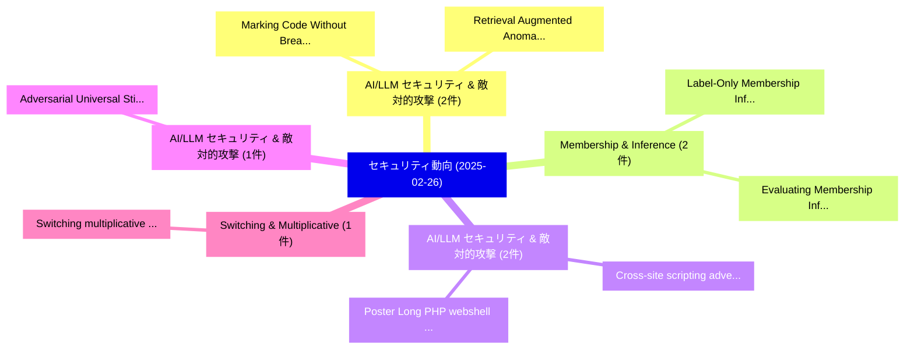

# 📅 02_daily: 日次エグゼクティブサマリー報告書 (2025-02-26)

**集計日時**: 2026-10-02 23:05:18 UTC  
**対象日付**: 2025-02-26  
**本日収集論文数**: 18 件  

---

## 💡 主要セキュリティ動向・脅威インサイト (Executive Insights)

本日の収集論文（計 18 件）において、以下の重点セキュリティ領域で活発な研究動向が確認されました：
- **AI/LLM セキュリティ & 敵対的攻撃** (2 件): 注目論文として 「Marking Code Without Breaking ...」、「Retrieval Augmented Anomaly De...」 等が発表され、実務防御および攻撃検証の進展が見られます。
- **Membership & Inference** (2 件): 注目論文として 「Label-Only Membership Inferenc...」、「Evaluating Membership Inferenc...」 等が発表され、実務防御および攻撃検証の進展が見られます。
- **AI/LLM セキュリティ & 敵対的攻撃** (2 件): 注目論文として 「Cross-site scripting adversari...」、「Poster: Long PHP webshell file...」 等が発表され、実務防御および攻撃検証の進展が見られます。
- **AI/LLM セキュリティ & 敵対的攻撃** (1 件): 注目論文として 「Adversarial Universal Stickers...」 等が発表され、実務防御および攻撃検証の進展が見られます。
- **Switching & Multiplicative** (1 件): 注目論文として 「Switching multiplicative water...」 等が発表され、実務防御および攻撃検証の進展が見られます。

### 🗺️ 技術・脅威トピックマインドマップ

---

## 📌 日次セキュリティ論文一覧 (日本語表形式)

| No | arXiv ID | 論文タイトル (日本語訳) | 重要キーワード | 構造化エグゼクティブ要約 (背景・提案・影響) | 脅威分類 | 詳細リンク |
|---|---|---|---|---|---|---|
| 1 | `2502.18724v1` | [Adversarial Universal Stickers: Universal Perturbation Attacks on Traffic Sign using Stickers（セキュリティ分析論文）](../../okf/papers/2025-02-26/2502.18724.md) | `Adversarial Universal Stickers`, `Universal Perturbation Attacks`, `Traffic Sign` | 【提案】概要 (Overview & Key Finding) 本論文「Adversarial Universal Stickers: Universal Perturbation ...。実証評価により経営層・セキュリティ管理者向け推奨アクション (E... | `cs.CR` | [arXiv](https://arxiv.org/abs/2502.18724v1) &#124; [OKF](../../okf/papers/2025-02-26/2502.18724.md) |
| 2 | `2502.18851v4` | [Marking Code Without Breaking It: Code Watermarking for Detecting LLM-Generated Code（セキュリティ分析論文）](../../okf/papers/2025-02-26/2502.18851.md) | `Code Watermarking`, `Generated Code`, `LLM-Generated Code` | 【提案】背景とセキュリティ上の課題 (Background & Problem) 本研究はサイバー脅威環境におけるセキュリティ構造・脆弱性の検証を目的としています。(主要検出項目: ...。実証評価により経営層・セキュリティ管理者向け推奨アクション (E... | `cs.CR` | [arXiv](https://arxiv.org/abs/2502.18851v4) &#124; [OKF](../../okf/papers/2025-02-26/2502.18851.md) |
| 3 | `2502.18943v1` | [Label-Only Membership Inference Attack against Pre-trained Large Language Modelsに向けて](../../okf/papers/2025-02-26/2502.18943.md) | `Label-Only Membership`, `Pre-trained Large`, `Towards Label` | 【提案】概要 (Overview & Key Finding) 本論文「Label-Only Membership Inference Attack against Pre-trai...。実証評価により経営層・セキュリティ管理者向け推奨アクション (E... | `cs.CR` | [arXiv](https://arxiv.org/abs/2502.18943v1) &#124; [OKF](../../okf/papers/2025-02-26/2502.18943.md) |
| 4 | `2502.18948v1` | [Switching multiplicative watermark design against covert attacks（セキュリティ分析論文）](../../okf/papers/2025-02-26/2502.18948.md) | `Raw Meta`, `Executive Summary`, `Key Finding` | 【提案】概要 (Overview & Key Finding) 本論文「Switching multiplicative watermark design against cover...。実証評価によりTeixeira, R。 | `cs.CR` | [arXiv](https://arxiv.org/abs/2502.18948v1) &#124; [OKF](../../okf/papers/2025-02-26/2502.18948.md) |
| 5 | `2502.18986v2` | [Evaluating Membership Inference Attacks in heterogeneous-data setups（セキュリティ分析論文）](../../okf/papers/2025-02-26/2502.18986.md) | `Evaluating Membership Inference Attacks`, `heterogeneous-data setups`, `Marc Damie` | 【提案】概要 (Overview & Key Finding) 本論文「Evaluating Membership Inference Attacks in heterogeneou...。実証評価により経営層・セキュリティ管理者向け推奨アクション (E... | `cs.CR` | [arXiv](https://arxiv.org/abs/2502.18986v2) &#124; [OKF](../../okf/papers/2025-02-26/2502.18986.md) |
| 6 | `2502.19041v2` | [Beyond Surface-Level Patterns: An Essence-Driven Defense Framework Against Jailbreak Attacks in LLMs（セキュリティ分析論文）](../../okf/papers/2025-02-26/2502.19041.md) | `Beyond Surface`, `Level Patterns`, `Surface-Level Patterns` | 【提案】概要 (Overview & Key Finding) 本論文「Beyond Surface-Level Patterns: An Essence-Driven Defens...。実証評価により経営層・セキュリティ管理者向け推奨アクション (E... | `cs.CR` | [arXiv](https://arxiv.org/abs/2502.19041v2) &#124; [OKF](../../okf/papers/2025-02-26/2502.19041.md) |
| 7 | `2502.19070v1` | [A Sample-Level Evaluation and Generative Framework for Model Inversion Attacks（セキュリティ分析論文）](../../okf/papers/2025-02-26/2502.19070.md) | `Model Inversion Attacks`, `Haoyang Li`, `Li Bai` | 【提案】概要 (Overview & Key Finding) 本論文「A Sample-Level Evaluation and Generative Framework for ...。実証評価により経営層・セキュリティ管理者向け推奨アクション (E... | `cs.CR` | [arXiv](https://arxiv.org/abs/2502.19070v1) &#124; [OKF](../../okf/papers/2025-02-26/2502.19070.md) |
| 8 | `2502.19095v2` | [Cross-site scripting adversarial attacks based on deep reinforcement learning: Evaluation and extension study（セキュリティ分析論文）](../../okf/papers/2025-02-26/2502.19095.md) | `Cross-site scripting`, `Samuele Pasini`, `Gianluca Maragliano` | 【提案】概要 (Overview & Key Finding) 本論文「Cross-site scripting 敵対的攻撃s based on deep reinforcement...。実証評価により経営層・セキュリティ管理者向け推奨アクション (E... | `cs.CR` | [arXiv](https://arxiv.org/abs/2502.19095v2) &#124; [OKF](../../okf/papers/2025-02-26/2502.19095.md) |
| 9 | `2502.19154v1` | [Privacy-Preserving Anomaly-Based Intrusion Detection in Energy Communitiesに向けて](../../okf/papers/2025-02-26/2502.19154.md) | `Based Intrusion Detection`, `Preserving Anomaly`, `Privacy-Preserving Anomaly` | 【提案】概要 (Overview & Key Finding) 本論文「Privacy-Preserving Anomaly-Based Intrusion Detection in...。実証評価により経営層・セキュリティ管理者向け推奨アクション (E... | `cs.CR` | [arXiv](https://arxiv.org/abs/2502.19154v1) &#124; [OKF](../../okf/papers/2025-02-26/2502.19154.md) |
| 10 | `2502.19257v2` | [Poster: Long PHP webshell files detection based on sliding window attention（セキュリティ分析論文）](../../okf/papers/2025-02-26/2502.19257.md) | `Zhiqiang Wang`, `Haoyu Wang`, `Lu Hao` | 【提案】概要 (Overview & Key Finding) 本論文「Poster: Long PHP webshell files detection based on slid...。実証評価により経営層・セキュリティ管理者向け推奨アクション (E... | `cs.CR` | [arXiv](https://arxiv.org/abs/2502.19257v2) &#124; [OKF](../../okf/papers/2025-02-26/2502.19257.md) |
| 11 | `2502.19320v2` | [Shh, don't say that! Domain Certification in LLMs（セキュリティ分析論文）](../../okf/papers/2025-02-26/2502.19320.md) | `Domain Certification`, `Cornelius Emde`, `Alasdair Paren` | 【提案】Domain Certification in LLMs ### (日本語題名: Shh, don't say that!。実証評価により経営層・セキュリティ管理者向け推奨アクション (Executive Recommendations) - 組... | `cs.CR` | [arXiv](https://arxiv.org/abs/2502.19320v2) &#124; [OKF](../../okf/papers/2025-02-26/2502.19320.md) |
| 12 | `2502.19341v2` | [Malicious Pseudo-Ranging and Localization of Static LOS Wireless Users via Downlink Modulation Classification and Uplink Refinement（セキュリティ分析論文）](../../okf/papers/2025-02-26/2502.19341.md) | `Downlink Modulation Classification`, `Malicious Pseudo`, `Wireless Users` | 【提案】概要 (Overview & Key Finding) 本論文「Malicious Pseudo-Ranging and Localization of Static LOS...。実証評価により経営層・セキュリティ管理者向け推奨アクション (E... | `cs.CR` | [arXiv](https://arxiv.org/abs/2502.19341v2) &#124; [OKF](../../okf/papers/2025-02-26/2502.19341.md) |
| 13 | `2502.19525v5` | [Privacy-Aware Sequential Learning（セキュリティ分析論文）](../../okf/papers/2025-02-26/2502.19525.md) | `Aware Sequential Learning`, `Privacy-Aware Sequential`, `Yuxin Liu` | 【提案】概要 (Overview & Key Finding) 本論文「Privacy-Aware Sequential Learning（セキュリティ分析論文）」（原題: Priv...。実証評価によりAmin Rahimian - **公開日時**:... | `cs.CR` | [arXiv](https://arxiv.org/abs/2502.19525v5) &#124; [OKF](../../okf/papers/2025-02-26/2502.19525.md) |
| 14 | `2502.19534v1` | [Retrieval Augmented Anomaly Detection (RAAD): Nimble Model Adjustment Without Retraining（セキュリティ分析論文）](../../okf/papers/2025-02-26/2502.19534.md) | `Retrieval Augmented Anomaly Detection`, `Nimble Model Adjustment Without Retraining`, `Nimble Model Adjustmen` | 【提案】背景とセキュリティ上の課題 (Background & Problem) 本研究はサイバー脅威環境におけるセキュリティ構造・脆弱性の検証を目的としています。(主要検出項目: ...。実証評価により経営層・セキュリティ管理者向け推奨アクション (E... | `cs.CR` | [arXiv](https://arxiv.org/abs/2502.19534v1) &#124; [OKF](../../okf/papers/2025-02-26/2502.19534.md) |
| 15 | `2502.19537v5` | [No, of Course I Can! Deeper Fine-Tuning Attacks That Bypass Token-Level Safety Mechanisms（セキュリティ分析論文）](../../okf/papers/2025-02-26/2502.19537.md) | `Level Safety Mechanisms`, `Deeper Fine`, `Fine-Tuning Attacks` | 【提案】Deeper Fine-Tuning Attacks That Bypass Token-Level Safety Mechanisms ### (日本語題名: No, of...。実証評価により経営層・セキュリティ管理者向け推奨アクション (E... | `cs.CR` | [arXiv](https://arxiv.org/abs/2502.19537v5) &#124; [OKF](../../okf/papers/2025-02-26/2502.19537.md) |
| 16 | `2502.19567v2` | [Atlas: A Framework for ML Lifecycle Provenance & Transparency（セキュリティ分析論文）](../../okf/papers/2025-02-26/2502.19567.md) | `Lifecycle Provenance`, `Marcin Spoczynski`, `Sebastian Szyller` | 【提案】概要 (Overview & Key Finding) 本論文「Atlas: A Framework for ML Lifecycle Provenance & Transp...。実証評価によりMelara, Sebastian Szyller... | `cs.CR` | [arXiv](https://arxiv.org/abs/2502.19567v2) &#124; [OKF](../../okf/papers/2025-02-26/2502.19567.md) |
| 17 | `2502.19621v1` | [Comprehensive Digital Forensics and Risk Mitigation Strategy for Modern Enterprises（セキュリティ分析論文）](../../okf/papers/2025-02-26/2502.19621.md) | `Comprehensive Digital Forensics`, `Risk Mitigation Strategy`, `Modern Enterprises` | 【提案】概要 (Overview & Key Finding) 本論文「Comprehensive Digital Forensics and Risk Mitigation Str...。実証評価により経営層・セキュリティ管理者向け推奨アクション (E... | `cs.CR` | [arXiv](https://arxiv.org/abs/2502.19621v1) &#124; [OKF](../../okf/papers/2025-02-26/2502.19621.md) |
| 18 | `2503.22686v1` | [Truth in Text: A Meta-ML-Based Cyber Information Influence Detection Approachesの分析](../../okf/papers/2025-02-26/2503.22686.md) | `Based Cyber Information Influence Detection Approaches`, `Based Cyber Information Influence Detection`, `ML-Based Cyber` | 【提案】概要 (Overview & Key Finding) 本論文「Truth in Text: A Meta-ML-Based Cyber Information Influe...。実証評価により経営層・セキュリティ管理者向け推奨アクション (E... | `cs.CR` | [arXiv](https://arxiv.org/abs/2503.22686v1) &#124; [OKF](../../okf/papers/2025-02-26/2503.22686.md) |

