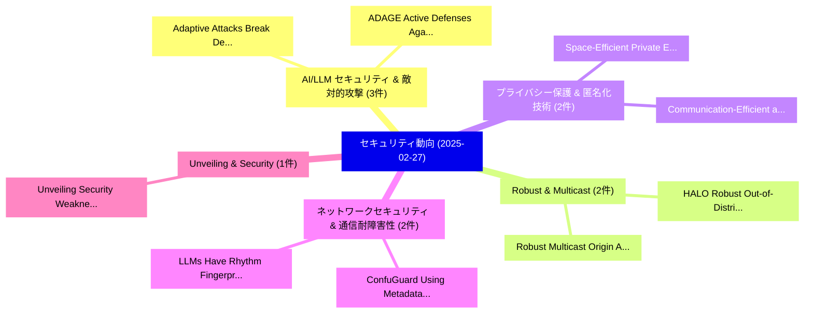

# 📅 02_daily: 日次エグゼクティブサマリー報告書 (2025-02-27)

**集計日時**: 2026-10-02 23:05:18 UTC  
**対象日付**: 2025-02-27  
**本日収集論文数**: 25 件  

---

## 💡 主要セキュリティ動向・脅威インサイト (Executive Insights)

本日の収集論文（計 25 件）において、以下の重点セキュリティ領域で活発な研究動向が確認されました：
- **AI/LLM セキュリティ & 敵対的攻撃** (3 件): 注目論文として 「Adaptive Attacks Break Defense...」、「ADAGE: Active Defenses Against...」 等が発表され、実務防御および攻撃検証の進展が見られます。
- **Robust & Multicast** (2 件): 注目論文として 「HALO: Robust Out-of-Distributi...」、「Robust Multicast Origin Authen...」 等が発表され、実務防御および攻撃検証の進展が見られます。
- **プライバシー保護 & 匿名化技術** (2 件): 注目論文として 「Space-Efficient Private Estima...」、「Communication-Efficient and Di...」 等が発表され、実務防御および攻撃検証の進展が見られます。
- **ネットワークセキュリティ & 通信耐障害性** (2 件): 注目論文として 「ConfuGuard: Using Metadata to ...」、「LLMs Have Rhythm: Fingerprinti...」 等が発表され、実務防御および攻撃検証の進展が見られます。
- **Unveiling & Security** (1 件): 注目論文として 「Unveiling Security Weaknesses ...」 等が発表され、実務防御および攻撃検証の進展が見られます。

### 🗺️ 技術・脅威トピックマインドマップ

---

## 📌 日次セキュリティ論文一覧 (日本語表形式)

| No | arXiv ID | 論文タイトル (日本語訳) | 重要キーワード | 構造化エグゼクティブ要約 (背景・提案・影響) | 脅威分類 | 詳細リンク |
|---|---|---|---|---|---|---|
| 1 | `2502.19687v1` | [Unveiling Security Weaknesses in Autonomous Driving Systems: An In-Depth Empirical Study（セキュリティ分析論文）](../../okf/papers/2025-02-27/2502.19687.md) | `Unveiling Security Weaknesses`, `Autonomous Driving Systems`, `In-Depth Empirical` | 【提案】概要 (Overview & Key Finding) 本論文「Unveiling Security Weaknesses in Autonomous Driving Sys...。実証評価により経営層・セキュリティ管理者向け推奨アクション (E... | `cs.CR` | [arXiv](https://arxiv.org/abs/2502.19687v1) &#124; [OKF](../../okf/papers/2025-02-27/2502.19687.md) |
| 2 | `2502.19710v1` | [SAP-DIFF: Semantic Adversarial Patch Generation for Black-Box Face Recognition Models via Diffusion Models（セキュリティ分析論文）](../../okf/papers/2025-02-27/2502.19710.md) | `Semantic Adversarial Patch Generation`, `Box Face Recognition Models`, `Diffusion Models` | 【提案】概要 (Overview & Key Finding) 本論文「SAP-DIFF: Semantic Adversarial Patch Generation for Bla...。実証評価により経営層・セキュリティ管理者向け推奨アクション (E... | `cs.CR` | [arXiv](https://arxiv.org/abs/2502.19710v1) &#124; [OKF](../../okf/papers/2025-02-27/2502.19710.md) |
| 3 | `2502.19755v1` | [HALO: Robust Out-of-Distribution Detection via Joint Optimisation（セキュリティ分析論文）](../../okf/papers/2025-02-27/2502.19755.md) | `Distribution Detection`, `Joint Optimisation`, `Hugo Lyons Keenan` | 【提案】概要 (Overview & Key Finding) 本論文「HALO: Robust Out-of-Distribution Detection via Joint Op...。実証評価により経営層・セキュリティ管理者向け推奨アクション (E... | `cs.CR` | [arXiv](https://arxiv.org/abs/2502.19755v1) &#124; [OKF](../../okf/papers/2025-02-27/2502.19755.md) |
| 4 | `2502.19757v1` | [Snowball Adversarial Attack on Traffic Sign Classification（セキュリティ分析論文）](../../okf/papers/2025-02-27/2502.19757.md) | `Snowball Adversarial Attack`, `Traffic Sign Classification`, `Anthony Etim` | 【提案】概要 (Overview & Key Finding) 本論文「Snowball 敵対的攻撃 on Traffic Sign Classification（セキュリティ分析論...。実証評価により経営層・セキュリティ管理者向け推奨アクション (E... | `cs.CR` | [arXiv](https://arxiv.org/abs/2502.19757v1) &#124; [OKF](../../okf/papers/2025-02-27/2502.19757.md) |
| 5 | `2502.19770v2` | [TAPE: Tailored Posterior Difference for Auditing of Machine Unlearning（セキュリティ分析論文）](../../okf/papers/2025-02-27/2502.19770.md) | `Tailored Posterior Difference`, `Machine Unlearning`, `Weiqi Wang` | 【提案】概要 (Overview & Key Finding) 本論文「TAPE: Tailored Posterior Difference for Auditing of Mac...。実証評価により経営層・セキュリティ管理者向け推奨アクション (E... | `cs.CR` | [arXiv](https://arxiv.org/abs/2502.19770v2) &#124; [OKF](../../okf/papers/2025-02-27/2502.19770.md) |
| 6 | `2502.19785v1` | [SCU: An Efficient Machine Unlearning Scheme for Deep Learning Enabled Semantic Communications（セキュリティ分析論文）](../../okf/papers/2025-02-27/2502.19785.md) | `Deep Learning Enabled Semantic Communications`, `Weiqi Wang`, `Zhiyi Tian` | 【提案】概要 (Overview & Key Finding) 本論文「SCU: An Efficient Machine Unlearning Scheme for Deep Le...。実証評価により経営層・セキュリティ管理者向け推奨アクション (E... | `cs.CR` | [arXiv](https://arxiv.org/abs/2502.19785v1) &#124; [OKF](../../okf/papers/2025-02-27/2502.19785.md) |
| 7 | `2502.19883v3` | [Beyond the Tip of Efficiency: Uncovering the Submerged Threats of Jailbreak Attacks in Small Language Models（セキュリティ分析論文）](../../okf/papers/2025-02-27/2502.19883.md) | `Small Language Models`, `Submerged Threats`, `Jailbreak Attacks` | 【提案】概要 (Overview & Key Finding) 本論文「Beyond the Tip of Efficiency: Uncovering the Submerged ...。実証評価により経営層・セキュリティ管理者向け推奨アクション (E... | `cs.CR` | [arXiv](https://arxiv.org/abs/2502.19883v3) &#124; [OKF](../../okf/papers/2025-02-27/2502.19883.md) |
| 8 | `2502.19996v1` | [Modern DDoS Threats and Countermeasures: Insights into Emerging Attacks and Detection Strategies（セキュリティ分析論文）](../../okf/papers/2025-02-27/2502.19996.md) | `Emerging Attacks`, `Detection Strategies`, `Jincheng Wang` | 【提案】概要 (Overview & Key Finding) 本論文「Modern DDoS Threats and Countermeasures: Insights into ...。実証評価により経営層・セキュリティ管理者向け推奨アクション (E... | `cs.CR` | [arXiv](https://arxiv.org/abs/2502.19996v1) &#124; [OKF](../../okf/papers/2025-02-27/2502.19996.md) |
| 9 | `2502.20178v2` | [SSD: A State-based Stealthy Backdoor Attack For Navigation System in UAV Route Planning（セキュリティ分析論文）](../../okf/papers/2025-02-27/2502.20178.md) | `State-based Stealthy`, `Route Planning`, `Zhaoxuan Wang` | 【提案】概要 (Overview & Key Finding) 本論文「SSD: A State-based Stealthy Backdoor Attack For Navigat...。実証評価により経営層・セキュリティ管理者向け推奨アクション (E... | `cs.CR` | [arXiv](https://arxiv.org/abs/2502.20178v2) &#124; [OKF](../../okf/papers/2025-02-27/2502.20178.md) |
| 10 | `2502.20207v2` | [Space-Efficient Private Estimation of Quantiles（セキュリティ分析論文）](../../okf/papers/2025-02-27/2502.20207.md) | `Efficient Private Estimation`, `Space-Efficient Private`, `Massimo Cafaro` | 【提案】概要 (Overview & Key Finding) 本論文「Space-Efficient Private Estimation of Quantiles（セキュリティ分...。実証評価により経営層・セキュリティ管理者向け推奨アクション (E... | `cs.CR` | [arXiv](https://arxiv.org/abs/2502.20207v2) &#124; [OKF](../../okf/papers/2025-02-27/2502.20207.md) |
| 11 | `2502.20225v2` | [DIN-CTS: Low-Complexity Depthwise-Inception Neural Network with Contrastive Training Strategy for Deepfake Speech Detection（セキュリティ分析論文）](../../okf/papers/2025-02-27/2502.20225.md) | `Inception Neural Network`, `Contrastive Training Strategy`, `Deepfake Speech Detection` | 【提案】概要 (Overview & Key Finding) 本論文「DIN-CTS: Low-Complexity Depthwise-Inception Neural Netw...。実証評価により経営層・セキュリティ管理者向け推奨アクション (E... | `cs.CR` | [arXiv](https://arxiv.org/abs/2502.20225v2) &#124; [OKF](../../okf/papers/2025-02-27/2502.20225.md) |
| 12 | `2502.20234v1` | [URL Inspection Tasks: Helping Users Detect Phishing Links in Emails（セキュリティ分析論文）](../../okf/papers/2025-02-27/2502.20234.md) | `Helping Users Detect Phishing Links`, `Inspection Tasks`, `Daniele Lain` | 【提案】概要 (Overview & Key Finding) 本論文「URL Inspection Tasks: Helping Users Detect Phishing Lin...。実証評価により経営層・セキュリティ管理者向け推奨アクション (E... | `cs.CR` | [arXiv](https://arxiv.org/abs/2502.20234v1) &#124; [OKF](../../okf/papers/2025-02-27/2502.20234.md) |
| 13 | `2502.20359v1` | [Evaluating the long-term viability of eye-tracking for continuous authentication in virtual reality（セキュリティ分析論文）](../../okf/papers/2025-02-27/2502.20359.md) | `long-term viability`, `Sai Ganesh Grandhi`, `Saeed Samet` | 【提案】概要 (Overview & Key Finding) 本論文「Evaluating the long-term viability of eye-tracking for ...。実証評価により経営層・セキュリティ管理者向け推奨アクション (E... | `cs.CR` | [arXiv](https://arxiv.org/abs/2502.20359v1) &#124; [OKF](../../okf/papers/2025-02-27/2502.20359.md) |
| 14 | `2502.20427v3` | [DeePen: Penetration Testing for Audio Deepfake Detection（セキュリティ分析論文）](../../okf/papers/2025-02-27/2502.20427.md) | `Audio Deepfake Detection`, `Penetration Testing`, `Wei Herng Choong` | 【提案】概要 (Overview & Key Finding) 本論文「DeePen: Penetration Testing for Audio Deepfake Detectio...。実証評価により経営層・セキュリティ管理者向け推奨アクション (E... | `cs.CR` | [arXiv](https://arxiv.org/abs/2502.20427v3) &#124; [OKF](../../okf/papers/2025-02-27/2502.20427.md) |
| 15 | `2502.20477v1` | [HELENE: An Open-Source High-Security Privacy-Preserving Blockchain Based System for Automating and Managing Laboratory Health Tests（セキュリティ分析論文）](../../okf/papers/2025-02-27/2502.20477.md) | `Preserving Blockchain Based System`, `Managing Laboratory Health Tests`, `Source High` | 【提案】概要 (Overview & Key Finding) 本論文「HELENE: An Open-Source High-Security Privacy-Preserving...。実証評価により経営層・セキュリティ管理者向け推奨アクション (E... | `cs.CR` | [arXiv](https://arxiv.org/abs/2502.20477v1) &#124; [OKF](../../okf/papers/2025-02-27/2502.20477.md) |
| 16 | `2502.20528v3` | [ConfuGuard: Using Metadata to Detect Active and Stealthy Package Confusion Attacks Accurately and at Scale（セキュリティ分析論文）](../../okf/papers/2025-02-27/2502.20528.md) | `Stealthy Package Confusion Attacks Accurately`, `Using Metadata`, `Detect Active` | 【提案】概要 (Overview & Key Finding) 本論文「ConfuGuard: Using Metadata to Detect Active and Stealth...。実証評価により経営層・セキュリティ管理者向け推奨アクション (E... | `cs.CR` | [arXiv](https://arxiv.org/abs/2502.20528v3) &#124; [OKF](../../okf/papers/2025-02-27/2502.20528.md) |
| 17 | `2502.20555v1` | [Robust Multicast Origin Authentication in MACsec and CANsec for Automotive Scenarios（セキュリティ分析論文）](../../okf/papers/2025-02-27/2502.20555.md) | `Robust Multicast Origin Authentication`, `Automotive Scenarios`, `Gianluca Cena` | 【提案】概要 (Overview & Key Finding) 本論文「Robust Multicast Origin Authentication in MACsec and CA...。実証評価により経営層・セキュリティ管理者向け推奨アクション (E... | `cs.CR` | [arXiv](https://arxiv.org/abs/2502.20555v1) &#124; [OKF](../../okf/papers/2025-02-27/2502.20555.md) |
| 18 | `2502.20562v1` | [LISArD: Learning Image Similarity to Defend Against Gray-box Adversarial Attacks（セキュリティ分析論文）](../../okf/papers/2025-02-27/2502.20562.md) | `Learning Image Similarity`, `Gray-box Adversarial`, `Adversarial Attacks` | 【提案】概要 (Overview & Key Finding) 本論文「LISArD: Learning Image Similarity to Defend Against Gra...。実証評価により経営層・セキュリティ管理者向け推奨アクション (E... | `cs.CR` | [arXiv](https://arxiv.org/abs/2502.20562v1) &#124; [OKF](../../okf/papers/2025-02-27/2502.20562.md) |
| 19 | `2502.20565v3` | [Communication-Efficient and Differentially Private Vertical 連合学習 with Zeroth-Order Optimization](../../okf/papers/2025-02-27/2502.20565.md) | `Order Optimization`, `Zeroth-Order Optimization`, `Differentially Private Vertical` | 【提案】概要 (Overview & Key Finding) 本論文「Communication-Efficient and Differentially Private Vert...。実証評価により経営層・セキュリティ管理者向け推奨アクション (E... | `cs.CR` | [arXiv](https://arxiv.org/abs/2502.20565v3) &#124; [OKF](../../okf/papers/2025-02-27/2502.20565.md) |
| 20 | `2502.20589v1` | [LLMs Have Rhythm: Fingerprinting 大規模言語モデル Using Inter-Token Times and Network Traffic Analysis](../../okf/papers/2025-02-27/2502.20589.md) | `Token Times`, `Inter-Token Times`, `Fingerprinting Large Language Models Using Inter` | 【提案】概要 (Overview & Key Finding) 本論文「LLMs Have Rhythm: Fingerprinting 大規模言語モデル Using Inter-T...。実証評価により経営層・セキュリティ管理者向け推奨アクション (E... | `cs.CR` | [arXiv](https://arxiv.org/abs/2502.20589v1) &#124; [OKF](../../okf/papers/2025-02-27/2502.20589.md) |
| 21 | `2503.00061v2` | [Adaptive Attacks Break Defenses Against Indirect Prompt Injection Attacks on LLMエージェント](../../okf/papers/2025-02-27/2503.00061.md) | `Henil Shalin Panchal`, `Qiusi Zhan`, `Richard Fang` | 【提案】概要 (Overview & Key Finding) 本論文「Adaptive Attacks Break Defenses Against Indirect プロンプトイ...。実証評価により経営層・セキュリティ管理者向け推奨アクション (E... | `cs.CR` | [arXiv](https://arxiv.org/abs/2503.00061v2) &#124; [OKF](../../okf/papers/2025-02-27/2503.00061.md) |
| 22 | `2503.00062v1` | [CRFU: Compressive Representation Forgetting Against Privacy Leakage on Machine Unlearning（セキュリティ分析論文）](../../okf/papers/2025-02-27/2503.00062.md) | `Machine Unlearning`, `Compressive Representation Forgetting`, `Weiqi Wang` | 【提案】概要 (Overview & Key Finding) 本論文「CRFU: Compressive Representation Forgetting Against Pri...。実証評価により経営層・セキュリティ管理者向け推奨アクション (E... | `cs.CR` | [arXiv](https://arxiv.org/abs/2503.00062v1) &#124; [OKF](../../okf/papers/2025-02-27/2503.00062.md) |
| 23 | `2503.00065v4` | [ADAGE: Active Defenses Against GNN Extraction（セキュリティ分析論文）](../../okf/papers/2025-02-27/2503.00065.md) | `Jing Xu`, `Franziska Boenisch`, `Adam Dziedzic` | 【提案】概要 (Overview & Key Finding) 本論文「ADAGE: Active Defenses Against GNN Extraction（セキュリティ分析論...。実証評価により経営層・セキュリティ管理者向け推奨アクション (E... | `cs.CR` | [arXiv](https://arxiv.org/abs/2503.00065v4) &#124; [OKF](../../okf/papers/2025-02-27/2503.00065.md) |
| 24 | `2503.00066v1` | [CrowdAL: a Blockchain-empowered Active Learning System in Crowd Data Labelingに向けて](../../okf/papers/2025-02-27/2503.00066.md) | `Active Learning System`, `Blockchain-empowered Active`, `Crowd Data Labeling` | 【提案】概要 (Overview & Key Finding) 本論文「CrowdAL: a Blockchain-empowered Active Learning System ...。実証評価により経営層・セキュリティ管理者向け推奨アクション (E... | `cs.CR` | [arXiv](https://arxiv.org/abs/2503.00066v1) &#124; [OKF](../../okf/papers/2025-02-27/2503.00066.md) |
| 25 | `2503.00070v1` | [Systematic Review of サイバーセキュリティ in Banking: Evolution from Pre-Industry 4.0 to Post-Industry 4.0 in Artificial Intelligence, Blockchain, Policies and Practice](../../okf/papers/2025-02-27/2503.00070.md) | `Systematic Review`, `Artificial Intelligence`, `Pre-Industry 4` | 【提案】概要 (Overview & Key Finding) 本論文「Systematic Review of サイバーセキュリティ in Banking: Evolution f...。実証評価により経営層・セキュリティ管理者向け推奨アクション (E... | `cs.CR` | [arXiv](https://arxiv.org/abs/2503.00070v1) &#124; [OKF](../../okf/papers/2025-02-27/2503.00070.md) |

