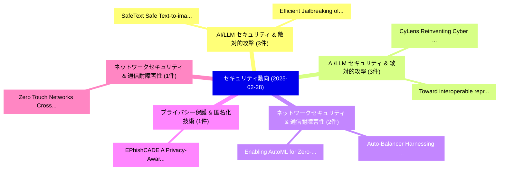

# 📅 02_daily: 日次エグゼクティブサマリー報告書 (2025-02-28)

**集計日時**: 2026-10-02 23:05:18 UTC  
**対象日付**: 2025-02-28  
**本日収集論文数**: 22 件  

---

## 💡 主要セキュリティ動向・脅威インサイト (Executive Insights)

本日の収集論文（計 22 件）において、以下の重点セキュリティ領域で活発な研究動向が確認されました：
- **AI/LLM セキュリティ & 敵対的攻撃** (3 件): 注目論文として 「SafeText: Safe Text-to-image M...」、「Efficient Jailbreaking of Larg...」 等が発表され、実務防御および攻撃検証の進展が見られます。
- **AI/LLM セキュリティ & 敵対的攻撃** (3 件): 注目論文として 「CyLens: Reinventing Cyber Thre...」、「Toward interoperable represent...」 等が発表され、実務防御および攻撃検証の進展が見られます。
- **ネットワークセキュリティ & 通信耐障害性** (2 件): 注目論文として 「Auto-Balancer: Harnessing idle...」、「Enabling AutoML for Zero-Touch...」 等が発表され、実務防御および攻撃検証の進展が見られます。
- **プライバシー保護 & 匿名化技術** (1 件): 注目論文として 「EPhishCADE: A Privacy-Aware Mu...」 等が発表され、実務防御および攻撃検証の進展が見られます。
- **ネットワークセキュリティ & 通信耐障害性** (1 件): 注目論文として 「Zero Touch Networks: Cross-Lay...」 等が発表され、実務防御および攻撃検証の進展が見られます。

### 🗺️ 技術・脅威トピックマインドマップ

---

## 📌 日次セキュリティ論文一覧 (日本語表形式)

| No | arXiv ID | 論文タイトル (日本語訳) | 重要キーワード | 構造化エグゼクティブ要約 (背景・提案・影響) | 脅威分類 | 詳細リンク |
|---|---|---|---|---|---|---|
| 1 | `2502.20621v1` | [EPhishCADE: A Privacy-Aware Multi-Dimensional Framework for Email Phishing Campaign Detection（セキュリティ分析論文）](../../okf/papers/2025-02-28/2502.20621.md) | `Email Phishing Campaign Detection`, `Aware Multi`, `Privacy-Aware Multi` | 【提案】概要 (Overview & Key Finding) 本論文「EPhishCADE: A Privacy-Aware Multi-Dimensional Framework...。実証評価により経営層・セキュリティ管理者向け推奨アクション (E... | `cs.CR` | [arXiv](https://arxiv.org/abs/2502.20621v1) &#124; [OKF](../../okf/papers/2025-02-28/2502.20621.md) |
| 2 | `2502.20623v1` | [SafeText: Safe Text-to-image Models via Aligning the Text Encoder（セキュリティ分析論文）](../../okf/papers/2025-02-28/2502.20623.md) | `Safe Text`, `Text Encoder`, `Neil Zhenqiang Gong` | 【提案】概要 (Overview & Key Finding) 本論文「SafeText: Safe Text-to-image Models via Aligning the Te...。実証評価により経営層・セキュリティ管理者向け推奨アクション (E... | `cs.CR` | [arXiv](https://arxiv.org/abs/2502.20623v1) &#124; [OKF](../../okf/papers/2025-02-28/2502.20623.md) |
| 3 | `2502.20627v1` | [Zero Touch Networks: Cross-Layer Automated Security Solutions for 6G Wireless Networksに向けて](../../okf/papers/2025-02-28/2502.20627.md) | `Layer Automated Security Solutions`, `Cross-Layer Automated`, `Zero Touch Networks` | 【提案】概要 (Overview & Key Finding) 本論文「Zero Touch Networks: Cross-Layer Automated Security Sol...。実証評価により経営層・セキュリティ管理者向け推奨アクション (E... | `cs.CR` | [arXiv](https://arxiv.org/abs/2502.20627v1) &#124; [OKF](../../okf/papers/2025-02-28/2502.20627.md) |
| 4 | `2502.20629v1` | [Privacy-Preserving Split Learning: Destabilizing Adversarial Inference and Reconstruction Attacks in the Cloudに向けて](../../okf/papers/2025-02-28/2502.20629.md) | `Preserving Split Learning`, `Destabilizing Adversarial Inference`, `Reconstruction Attacks` | 【提案】概要 (Overview & Key Finding) 本論文「Privacy-Preserving Split Learning: Destabilizing Advers...。実証評価により経営層・セキュリティ管理者向け推奨アクション (E... | `cs.CR` | [arXiv](https://arxiv.org/abs/2502.20629v1) &#124; [OKF](../../okf/papers/2025-02-28/2502.20629.md) |
| 5 | `2502.20650v5` | [Gungnir: Exploiting Stylistic Features in Images for Backdoor Attacks on Diffusion Models（セキュリティ分析論文）](../../okf/papers/2025-02-28/2502.20650.md) | `Exploiting Stylistic Features`, `Backdoor Attacks`, `Diffusion Models` | 【提案】概要 (Overview & Key Finding) 本論文「Gungnir: Exploiting Stylistic Features in Images for Ba...。実証評価により経営層・セキュリティ管理者向け推奨アクション (E... | `cs.CR` | [arXiv](https://arxiv.org/abs/2502.20650v5) &#124; [OKF](../../okf/papers/2025-02-28/2502.20650.md) |
| 6 | `2502.20670v1` | [Auto-Balancer: Harnessing idle network resources for enhanced market stability（セキュリティ分析論文）](../../okf/papers/2025-02-28/2502.20670.md) | `Arman Abgaryan`, `Utkarsh Sharma`, `Raw Meta` | 【提案】概要 (Overview & Key Finding) 本論文「Auto-Balancer: Harnessing idle network resources for en...。実証評価により経営層・セキュリティ管理者向け推奨アクション (E... | `cs.CR` | [arXiv](https://arxiv.org/abs/2502.20670v1) &#124; [OKF](../../okf/papers/2025-02-28/2502.20670.md) |
| 7 | `2502.20791v2` | [CyLens: Reinventing Cyber Threat Intelligence in the Paradigm of Agentic Large Language Modelsに向けて](../../okf/papers/2025-02-28/2502.20791.md) | `Reinventing Cyber Threat Intelligence`, `Towards Reinventing Cyber Threat Intelligence`, `Agentic Large Language Models` | 【提案】概要 (Overview & Key Finding) 本論文「CyLens: Reinventing Cyber 脅威 Intelligence in the Paradi...。実証評価により経営層・セキュリティ管理者向け推奨アクション (E... | `cs.CR` | [arXiv](https://arxiv.org/abs/2502.20791v2) &#124; [OKF](../../okf/papers/2025-02-28/2502.20791.md) |
| 8 | `2502.20835v3` | [Federated Distributed Key Generation（セキュリティ分析論文）](../../okf/papers/2025-02-28/2502.20835.md) | `Federated Distributed Key Generation`, `Stanislaw Baranski`, `Julian Szymanski` | 【提案】概要 (Overview & Key Finding) 本論文「Federated Distributed Key Generation（セキュリティ分析論文）」（原題: F...。実証評価により経営層・セキュリティ管理者向け推奨アクション (E... | `cs.CR` | [arXiv](https://arxiv.org/abs/2502.20835v3) &#124; [OKF](../../okf/papers/2025-02-28/2502.20835.md) |
| 9 | `2502.20902v1` | [The Effect of Hop-count Modification Attack on Random Walk-based SLP Schemes Developed forWSNs: a Study（セキュリティ分析論文）](../../okf/papers/2025-02-28/2502.20902.md) | `Hop-count Modification`, `Modification Attack`, `Random Walk` | 【提案】概要 (Overview & Key Finding) 本論文「The Effect of Hop-count Modification Attack on Random W...。実証評価により経営層・セキュリティ管理者向け推奨アクション (E... | `cs.CR` | [arXiv](https://arxiv.org/abs/2502.20902v1) &#124; [OKF](../../okf/papers/2025-02-28/2502.20902.md) |
| 10 | `2502.20952v1` | [Efficient Jailbreaking of Large Models by Freeze Training: Lower Layers Exhibit Greater Sensitivity to Harmful Content（セキュリティ分析論文）](../../okf/papers/2025-02-28/2502.20952.md) | `Lower Layers Exhibit Greater Sensitivity`, `Efficient Jailbreaking`, `Large Models` | 【提案】概要 (Overview & Key Finding) 本論文「Efficient ジェイルブレイクing of Large Models by Freeze Trainin...。実証評価により経営層・セキュリティ管理者向け推奨アクション (E... | `cs.CR` | [arXiv](https://arxiv.org/abs/2502.20952v1) &#124; [OKF](../../okf/papers/2025-02-28/2502.20952.md) |
| 11 | `2502.20995v3` | [The RAG Paradox: A Black-Box Attack Exploiting Unintentional Vulnerabilities in Retrieval-Augmented Generation Systems（セキュリティ分析論文）](../../okf/papers/2025-02-28/2502.20995.md) | `Box Attack Exploiting Unintentional Vulnerabilities`, `Augmented Generation Systems`, `Black-Box Attack` | 【提案】概要 (Overview & Key Finding) 本論文「The RAG Paradox: A Black-Box Attack Exploiting Unintent...。実証評価により経営層・セキュリティ管理者向け推奨アクション (E... | `cs.CR` | [arXiv](https://arxiv.org/abs/2502.20995v3) &#124; [OKF](../../okf/papers/2025-02-28/2502.20995.md) |
| 12 | `2502.20997v1` | [Toward interoperable representation and sharing of disinformation incidents in cyber threat intelligence（セキュリティ分析論文）](../../okf/papers/2025-02-28/2502.20997.md) | `Javier Pastor`, `Raw Meta`, `Executive Summary` | 【提案】概要 (Overview & Key Finding) 本論文「Toward interoperable representation and sharing of disi...。実証評価により経営層・セキュリティ管理者向け推奨アクション (E... | `cs.CR` | [arXiv](https://arxiv.org/abs/2502.20997v1) &#124; [OKF](../../okf/papers/2025-02-28/2502.20997.md) |
| 13 | `2502.21026v3` | [Artemis: Toward Accurate Server-Side Request Forgeries through LLM-Assisted Inter-Procedural Path-Sensitive Taint Analysisの検出](../../okf/papers/2025-02-28/2502.21026.md) | `Side Request Forgeries`, `Assisted Inter`, `Procedural Path` | 【提案】概要 (Overview & Key Finding) 本論文「Artemis: Toward Accurate Server-Side Request Forgeries ...。実証評価により経営層・セキュリティ管理者向け推奨アクション (E... | `cs.CR` | [arXiv](https://arxiv.org/abs/2502.21026v3) &#124; [OKF](../../okf/papers/2025-02-28/2502.21026.md) |
| 14 | `2502.21059v3` | [FC-Attack: Jailbreaking Multimodal 大規模言語モデル via Auto-Generated Flowcharts](../../okf/papers/2025-02-28/2502.21059.md) | `Generated Flowcharts`, `Auto-Generated Flowcharts`, `Jailbreaking Multimodal Large Language Models` | 【提案】概要 (Overview & Key Finding) 本論文「FC-Attack: ジェイルブレイクing Multimodal 大規模言語モデル via Auto-Gen...。実証評価により経営層・セキュリティ管理者向け推奨アクション (E... | `cs.CR` | [arXiv](https://arxiv.org/abs/2502.21059v3) &#124; [OKF](../../okf/papers/2025-02-28/2502.21059.md) |
| 15 | `2502.21156v2` | [Cryptis: Cryptographic Reasoning in Separation Logic（セキュリティ分析論文）](../../okf/papers/2025-02-28/2502.21156.md) | `Cryptographic Reasoning`, `Separation Logic`, `Arthur Azevedo` | 【提案】概要 (Overview & Key Finding) 本論文「Cryptis: Cryptographic Reasoning in Separation Logic（セキ...。実証評価により経営層・セキュリティ管理者向け推奨アクション (E... | `cs.CR` | [arXiv](https://arxiv.org/abs/2502.21156v2) &#124; [OKF](../../okf/papers/2025-02-28/2502.21156.md) |
| 16 | `2502.21286v1` | [Enabling AutoML for Zero-Touch Network Security: Use-Case Driven Analysis（セキュリティ分析論文）](../../okf/papers/2025-02-28/2502.21286.md) | `Touch Network Security`, `Zero-Touch Network`, `Use-Case Driven` | 【提案】概要 (Overview & Key Finding) 本論文「Enabling AutoML for Zero-Touch Network Security: Use-Ca...。実証評価により経営層・セキュリティ管理者向け推奨アクション (E... | `cs.CR` | [arXiv](https://arxiv.org/abs/2502.21286v1) &#124; [OKF](../../okf/papers/2025-02-28/2502.21286.md) |
| 17 | `2503.00092v2` | [EdgeAIGuard: Agentic LLMs for Minor Protection in Digital Spaces（セキュリティ分析論文）](../../okf/papers/2025-02-28/2503.00092.md) | `Minor Protection`, `Digital Spaces`, `Sunder Ali Khowaja` | 【提案】概要 (Overview & Key Finding) 本論文「EdgeAIGuard: Agentic LLMs for Minor Protection in Digit...。実証評価により経営層・セキュリティ管理者向け推奨アクション (E... | `cs.CR` | [arXiv](https://arxiv.org/abs/2503.00092v2) &#124; [OKF](../../okf/papers/2025-02-28/2503.00092.md) |
| 18 | `2503.00140v2` | [Approaching the Harm of Gradient Attacks While Only Flipping Labels（セキュリティ分析論文）](../../okf/papers/2025-02-28/2503.00140.md) | `Abdessamad El`, `Mahdi El`, `Raw Meta` | 【提案】概要 (Overview & Key Finding) 本論文「Approaching the Harm of Gradient Attacks While Only Fli...。実証評価により経営層・セキュリティ管理者向け推奨アクション (E... | `cs.CR` | [arXiv](https://arxiv.org/abs/2503.00140v2) &#124; [OKF](../../okf/papers/2025-02-28/2503.00140.md) |
| 19 | `2503.00145v1` | [AMuLeT: Automated Design-Time Testing of Secure Speculation Countermeasures（セキュリティ分析論文）](../../okf/papers/2025-02-28/2503.00145.md) | `Secure Speculation Countermeasures`, `Automated Design`, `Time Testing` | 【提案】概要 (Overview & Key Finding) 本論文「AMuLeT: Automated Design-Time Testing of Secure Specula...。実証評価により経営層・セキュリティ管理者向け推奨アクション (E... | `cs.CR` | [arXiv](https://arxiv.org/abs/2503.00145v1) &#124; [OKF](../../okf/papers/2025-02-28/2503.00145.md) |
| 20 | `2503.00164v1` | [Transforming Cyber Defense: Harnessing Agentic and Frontier AI for Proactive, Ethical Threat Intelligence（セキュリティ分析論文）](../../okf/papers/2025-02-28/2503.00164.md) | `Transforming Cyber Defense`, `Ethical Threat Intelligence`, `Harnessing Agentic` | 【提案】概要 (Overview & Key Finding) 本論文「Transforming Cyber Defense: Harnessing Agentic and Fron...。実証評価により経営層・セキュリティ管理者向け推奨アクション (E... | `cs.CR` | [arXiv](https://arxiv.org/abs/2503.00164v1) &#124; [OKF](../../okf/papers/2025-02-28/2503.00164.md) |
| 21 | `2503.00187v3` | [Steering Dialogue Dynamics for Robustness against Multi-turn Jailbreaking Attacks（セキュリティ分析論文）](../../okf/papers/2025-02-28/2503.00187.md) | `Steering Dialogue Dynamics`, `Jailbreaking Attacks`, `Multi-turn Jailbreaking` | 【提案】概要 (Overview & Key Finding) 本論文「Steering Dialogue Dynamics for Robustness against Multi...。実証評価により経営層・セキュリティ管理者向け推奨アクション (E... | `cs.CR` | [arXiv](https://arxiv.org/abs/2503.00187v3) &#124; [OKF](../../okf/papers/2025-02-28/2503.00187.md) |
| 22 | `2503.01908v3` | [UDora: A Unified Red Teaming Framework against LLMエージェント by Dynamically Hijacking Their Own Reasoning](../../okf/papers/2025-02-28/2503.01908.md) | `Unified Red Teaming Fram`, `Jiawei Zhang`, `Shuang Yang` | 【提案】概要 (Overview & Key Finding) 本論文「UDora: A Unified Red Teaming Framework against LLMエージェン...。実証評価により経営層・セキュリティ管理者向け推奨アクション (E... | `cs.CR` | [arXiv](https://arxiv.org/abs/2503.01908v3) &#124; [OKF](../../okf/papers/2025-02-28/2503.01908.md) |

