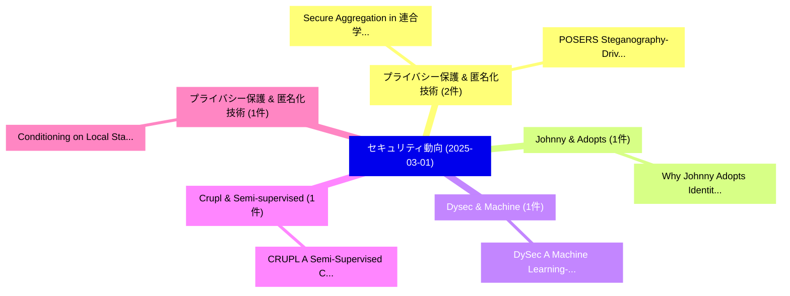

# 📅 02_daily: 日次エグゼクティブサマリー報告書 (2025-03-01)

**集計日時**: 2026-10-02 23:05:18 UTC  
**対象日付**: 2025-03-01  
**本日収集論文数**: 13 件  

---

## 💡 主要セキュリティ動向・脅威インサイト (Executive Insights)

本日の収集論文（計 13 件）において、以下の重点セキュリティ領域で活発な研究動向が確認されました：
- **プライバシー保護 & 匿名化技術** (2 件): 注目論文として 「Secure Aggregation in 連合学習 usi...」、「POSERS: Steganography-Driven M...」 等が発表され、実務防御および攻撃検証の進展が見られます。
- **Johnny & Adopts** (1 件): 注目論文として 「Why Johnny Adopts Identity-Bas...」 等が発表され、実務防御および攻撃検証の進展が見られます。
- **Dysec & Machine** (1 件): 注目論文として 「DySec: A Machine Learning-base...」 等が発表され、実務防御および攻撃検証の進展が見られます。
- **Crupl & Semi-supervised** (1 件): 注目論文として 「CRUPL: A Semi-Supervised Cyber...」 等が発表され、実務防御および攻撃検証の進展が見られます。
- **プライバシー保護 & 匿名化技術** (1 件): 注目論文として 「Conditioning on Local Statisti...」 等が発表され、実務防御および攻撃検証の進展が見られます。

### 🗺️ 技術・脅威トピックマインドマップ

---

## 📌 日次セキュリティ論文一覧 (日本語表形式)

| No | arXiv ID | 論文タイトル (日本語訳) | 重要キーワード | 構造化エグゼクティブ要約 (背景・提案・影響) | 脅威分類 | 詳細リンク |
|---|---|---|---|---|---|---|
| 1 | `2503.00271v6` | [Why Johnny Adopts Identity-Based Software Signing: A Usability Case Study of Sigstore（セキュリティ分析論文）](../../okf/papers/2025-03-01/2503.00271.md) | `Based Software Signing`, `Identity-Based Software`, `Sofia Okorafor` | 【提案】概要 (Overview & Key Finding) 本論文「Why Johnny Adopts Identity-Based Software Signing: A Us...。実証評価により経営層・セキュリティ管理者向け推奨アクション (E... | `cs.CR` | [arXiv](https://arxiv.org/abs/2503.00271v6) &#124; [OKF](../../okf/papers/2025-03-01/2503.00271.md) |
| 2 | `2503.00324v1` | [DySec: A Machine Learning-based Dynamic Analysis for Detecting Malicious Packages in PyPI Ecosystem（セキュリティ分析論文）](../../okf/papers/2025-03-01/2503.00324.md) | `Detecting Malicious Packages`, `Machine Learning`, `Learning-based Dynamic` | 【提案】概要 (Overview & Key Finding) 本論文「DySec: A Machine Learning-based Dynamic Analysis for De...。実証評価により経営層・セキュリティ管理者向け推奨アクション (E... | `cs.CR` | [arXiv](https://arxiv.org/abs/2503.00324v1) &#124; [OKF](../../okf/papers/2025-03-01/2503.00324.md) |
| 3 | `2503.00358v1` | [CRUPL: A Semi-Supervised Cyber Attack Detection with Consistency Regularization and Uncertainty-aware Pseudo-Labeling in Smart Grid（セキュリティ分析論文）](../../okf/papers/2025-03-01/2503.00358.md) | `Supervised Cyber Attack Detection`, `Consistency Regularization`, `Smart Grid` | 【提案】概要 (Overview & Key Finding) 本論文「CRUPL: A Semi-Supervised Cyber Attack Detection with Co...。実証評価により経営層・セキュリティ管理者向け推奨アクション (E... | `cs.CR` | [arXiv](https://arxiv.org/abs/2503.00358v1) &#124; [OKF](../../okf/papers/2025-03-01/2503.00358.md) |
| 4 | `2503.00378v1` | [Conditioning on Local Statistics for Scalable Heterogeneous 連合学習](../../okf/papers/2025-03-01/2503.00378.md) | `Local Statistics`, `Scalable Heterogeneous Federated Learning`, `Scalable Heterogeneous` | 【提案】概要 (Overview & Key Finding) 本論文「Conditioning on Local Statistics for Scalable Heterogen...。実証評価により経営層・セキュリティ管理者向け推奨アクション (E... | `cs.CR` | [arXiv](https://arxiv.org/abs/2503.00378v1) &#124; [OKF](../../okf/papers/2025-03-01/2503.00378.md) |
| 5 | `2503.00404v2` | [SecRef*: Securely Sharing Mutable References Between Verified and Unverified Code in F*（セキュリティ分析論文）](../../okf/papers/2025-03-01/2503.00404.md) | `Unverified Code`, `Constantin Andrici`, `Danel Ahman` | 【提案】概要 (Overview & Key Finding) 本論文「SecRef*: Securely Sharing Mutable References Between Ve...。実証評価により経営層・セキュリティ管理者向け推奨アクション (E... | `cs.CR` | [arXiv](https://arxiv.org/abs/2503.00404v2) &#124; [OKF](../../okf/papers/2025-03-01/2503.00404.md) |
| 6 | `2503.00416v1` | [Breaking the Loop: Detecting and Mitigating Denial-of-Service Vulnerabilities in 大規模言語モデル](../../okf/papers/2025-03-01/2503.00416.md) | `Mitigating Denial`, `Service Vulnerabilities`, `Large Language Models` | 【提案】概要 (Overview & Key Finding) 本論文「Breaking the Loop: Detecting and Mitigating Denial-of-S...。実証評価により経営層・セキュリティ管理者向け推奨アクション (E... | `cs.CR` | [arXiv](https://arxiv.org/abs/2503.00416v1) &#124; [OKF](../../okf/papers/2025-03-01/2503.00416.md) |
| 7 | `2503.00555v2` | [Safety Tax: Safety Alignment Makes Your Large Reasoning Models Less Reasonable（セキュリティ分析論文）](../../okf/papers/2025-03-01/2503.00555.md) | `Safety Tax`, `Selim Furkan Tekin`, `Safety Alignment Makes` | 【提案】概要 (Overview & Key Finding) 本論文「Safety Tax: Safety Alignment Makes Your Large Reasoning...。実証評価により経営層・セキュリティ管理者向け推奨アクション (E... | `cs.CR` | [arXiv](https://arxiv.org/abs/2503.00555v2) &#124; [OKF](../../okf/papers/2025-03-01/2503.00555.md) |
| 8 | `2503.00581v1` | [Secure Aggregation in 連合学習 using Multiparty Homomorphic Encryption](../../okf/papers/2025-03-01/2503.00581.md) | `Multiparty Homomorphic Encryption`, `Secure Aggregation`, `Federated Learning` | 【提案】概要 (Overview & Key Finding) 本論文「Secure Aggregation in 連合学習 using Multiparty 準同型暗号」（原題: ...。実証評価により経営層・セキュリティ管理者向け推奨アクション (E... | `cs.CR` | [arXiv](https://arxiv.org/abs/2503.00581v1) &#124; [OKF](../../okf/papers/2025-03-01/2503.00581.md) |
| 9 | `2503.00596v1` | [BadJudge: Backdoor Vulnerabilities of LLM-as-a-Judge（セキュリティ分析論文）](../../okf/papers/2025-03-01/2503.00596.md) | `Backdoor Vulnerabilities`, `Terry Tong`, `Fei Wang` | 【提案】概要 (Overview & Key Finding) 本論文「BadJudge: Backdoor Vulnerabilities of LLM-as-a-Judge（セキ...。実証評価により経営層・セキュリティ管理者向け推奨アクション (E... | `cs.CR` | [arXiv](https://arxiv.org/abs/2503.00596v1) &#124; [OKF](../../okf/papers/2025-03-01/2503.00596.md) |
| 10 | `2503.00615v1` | [xIDS-EnsembleGuard: An Explainable Ensemble Learning-based Intrusion Detection System（セキュリティ分析論文）](../../okf/papers/2025-03-01/2503.00615.md) | `Intrusion Detection System`, `Learning-based Intrusion`, `Mian Ahmad Jan` | 【提案】概要 (Overview & Key Finding) 本論文「xIDS-EnsembleGuard: An Explainable Ensemble Learning-ba...。実証評価により経営層・セキュリティ管理者向け推奨アクション (E... | `cs.CR` | [arXiv](https://arxiv.org/abs/2503.00615v1) &#124; [OKF](../../okf/papers/2025-03-01/2503.00615.md) |
| 11 | `2503.00638v2` | [POSERS: Steganography-Driven Molecular Tagging Using Randomized DNA Sequences（セキュリティ分析論文）](../../okf/papers/2025-03-01/2503.00638.md) | `Driven Molecular Tagging Using Randomized`, `Steganography-Driven Molecular`, `Ali Tafazoli Yazdi` | 【提案】概要 (Overview & Key Finding) 本論文「POSERS: Steganography-Driven Molecular Tagging Using Ra...。実証評価により経営層・セキュリティ管理者向け推奨アクション (E... | `cs.CR` | [arXiv](https://arxiv.org/abs/2503.00638v2) &#124; [OKF](../../okf/papers/2025-03-01/2503.00638.md) |
| 12 | `2503.00659v1` | [CATS: A framework for Cooperative Autonomy Trust & Security（セキュリティ分析論文）](../../okf/papers/2025-03-01/2503.00659.md) | `Cooperative Autonomy Trust`, `Namo Asavisanu`, `Tina Khezresmaeilzadeh` | 【提案】概要 (Overview & Key Finding) 本論文「CATS: A framework for Cooperative Autonomy Trust & Secu...。実証評価により経営層・セキュリティ管理者向け推奨アクション (E... | `cs.CR` | [arXiv](https://arxiv.org/abs/2503.00659v1) &#124; [OKF](../../okf/papers/2025-03-01/2503.00659.md) |
| 13 | `2503.01915v1` | [Datenschutzkonformer LLM-Einsatz: Eine Open-Source-Referenzarchitektur（セキュリティ分析論文）](../../okf/papers/2025-03-01/2503.01915.md) | `Eine Open`, `Marian Lambert`, `Thomas Schuster` | 【提案】概要 (Overview & Key Finding) 本論文「Datenschutzkonformer LLM-Einsatz: Eine Open-Source-Refe...。実証評価により経営層・セキュリティ管理者向け推奨アクション (E... | `cs.CR` | [arXiv](https://arxiv.org/abs/2503.01915v1) &#124; [OKF](../../okf/papers/2025-03-01/2503.01915.md) |

