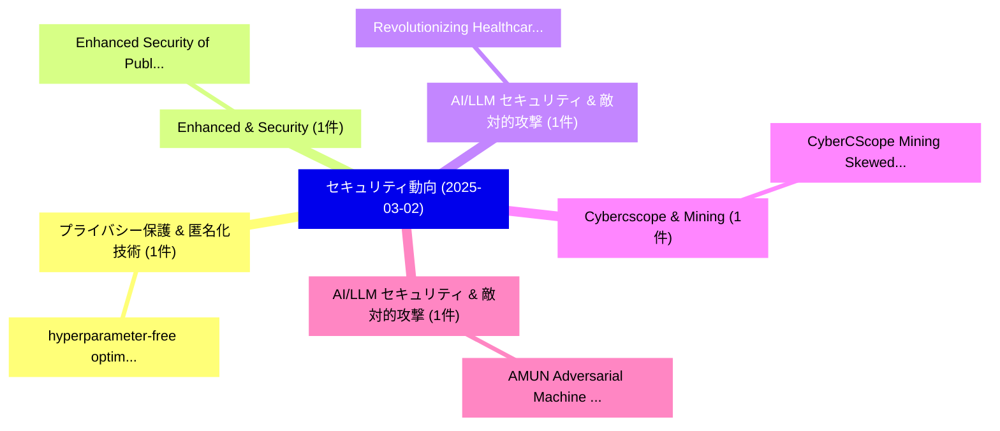

# 📅 02_daily: 日次エグゼクティブサマリー報告書 (2025-03-02)

**集計日時**: 2026-10-02 23:05:18 UTC  
**対象日付**: 2025-03-02  
**本日収集論文数**: 9 件  

---

## 💡 主要セキュリティ動向・脅威インサイト (Executive Insights)

本日の収集論文（計 9 件）において、以下の重点セキュリティ領域で活発な研究動向が確認されました：
- **プライバシー保護 & 匿名化技術** (1 件): 注目論文として 「hyperparameter-free optimizati...」 等が発表され、実務防御および攻撃検証の進展が見られます。
- **Enhanced & Security** (1 件): 注目論文として 「Enhanced Security of Public Ke...」 等が発表され、実務防御および攻撃検証の進展が見られます。
- **AI/LLM セキュリティ & 敵対的攻撃** (1 件): 注目論文として 「Revolutionizing Healthcare Rec...」 等が発表され、実務防御および攻撃検証の進展が見られます。
- **Cybercscope & Mining** (1 件): 注目論文として 「CyberCScope: Mining Skewed Ten...」 等が発表され、実務防御および攻撃検証の進展が見られます。
- **AI/LLM セキュリティ & 敵対的攻撃** (1 件): 注目論文として 「AMUN: Adversarial Machine UNle...」 等が発表され、実務防御および攻撃検証の進展が見られます。

### 🗺️ 技術・脅威トピックマインドマップ

---

## 📌 日次セキュリティ論文一覧 (日本語表形式)

| No | arXiv ID | 論文タイトル (日本語訳) | 重要キーワード | 構造化エグゼクティブ要約 (背景・提案・影響) | 脅威分類 | 詳細リンク |
|---|---|---|---|---|---|---|
| 1 | `2503.00703v1` | [hyperparameter-free optimization with differential privacyに向けて](../../okf/papers/2025-03-02/2503.00703.md) | `hyperparameter-free optimization`, `Zhiqi Bu`, `Ruixuan Liu` | 【提案】概要 (Overview & Key Finding) 本論文「hyperparameter-free optimization with 差分プライバシーに向けて」（原題:...。実証評価により経営層・セキュリティ管理者向け推奨アクション (E... | `cs.CR` | [arXiv](https://arxiv.org/abs/2503.00703v1) &#124; [OKF](../../okf/papers/2025-03-02/2503.00703.md) |
| 2 | `2503.00719v1` | [Enhanced Security of Public Key Encryption with Certified Deletion（セキュリティ分析論文）](../../okf/papers/2025-03-02/2503.00719.md) | `Public Key Encryption`, `Enhanced Security`, `Certified Deletion` | 【提案】概要 (Overview & Key Finding) 本論文「Enhanced Security of Public Key Encryption with Certifi...。実証評価により経営層・セキュリティ管理者向け推奨アクション (E... | `cs.CR` | [arXiv](https://arxiv.org/abs/2503.00719v1) &#124; [OKF](../../okf/papers/2025-03-02/2503.00719.md) |
| 3 | `2503.00742v1` | [Revolutionizing Healthcare Record Management: Secure Documentation Storage and Access through Advanced Blockchain Solutions（セキュリティ分析論文）](../../okf/papers/2025-03-02/2503.00742.md) | `Revolutionizing Healthcare Record Management`, `Secure Documentation Storage`, `Advanced Blockchain Solutions` | 【提案】概要 (Overview & Key Finding) 本論文「Revolutionizing Healthcare Record Management: Secure Do...。実証評価により経営層・セキュリティ管理者向け推奨アクション (E... | `cs.CR` | [arXiv](https://arxiv.org/abs/2503.00742v1) &#124; [OKF](../../okf/papers/2025-03-02/2503.00742.md) |
| 4 | `2503.00871v1` | [CyberCScope: Mining Skewed Tensor Streams and Online Anomaly Detection in サイバーセキュリティ Systems](../../okf/papers/2025-03-02/2503.00871.md) | `Mining Skewed Tensor Streams`, `Online Anomaly Detection`, `Cybersecurity Systems` | 【提案】概要 (Overview & Key Finding) 本論文「CyberCScope: Mining Skewed Tensor Streams and Online An...。実証評価により経営層・セキュリティ管理者向け推奨アクション (E... | `cs.CR` | [arXiv](https://arxiv.org/abs/2503.00871v1) &#124; [OKF](../../okf/papers/2025-03-02/2503.00871.md) |
| 5 | `2503.00917v3` | [AMUN: Adversarial Machine UNlearning（セキュリティ分析論文）](../../okf/papers/2025-03-02/2503.00917.md) | `Adversarial Machine`, `Ali Ebrahimpour`, `Hari Sundaram` | 【提案】概要 (Overview & Key Finding) 本論文「AMUN: Adversarial Machine UNlearning（セキュリティ分析論文）」（原題: A...。実証評価により経営層・セキュリティ管理者向け推奨アクション (E... | `cs.CR` | [arXiv](https://arxiv.org/abs/2503.00917v3) &#124; [OKF](../../okf/papers/2025-03-02/2503.00917.md) |
| 6 | `2503.00932v1` | [Improving the Transferability of Adversarial Attacks by an Input Transpose（セキュリティ分析論文）](../../okf/papers/2025-03-02/2503.00932.md) | `Adversarial Attacks`, `Input Transpose`, `Qing Wan` | 【提案】概要 (Overview & Key Finding) 本論文「Improving the Transferability of 敵対的攻撃s by an Input Tra...。実証評価により経営層・セキュリティ管理者向け推奨アクション (E... | `cs.CR` | [arXiv](https://arxiv.org/abs/2503.00932v1) &#124; [OKF](../../okf/papers/2025-03-02/2503.00932.md) |
| 7 | `2503.00950v1` | [Decomposition of RSA modulus applying even order elliptic curves（セキュリティ分析論文）](../../okf/papers/2025-03-02/2503.00950.md) | `Mariusz Jurkiewicz`, `Raw Meta`, `Executive Summary` | 【提案】概要 (Overview & Key Finding) 本論文「Decomposition of RSA modulus applying even order ellipt...。実証評価により経営層・セキュリティ管理者向け推奨アクション (E... | `cs.CR` | [arXiv](https://arxiv.org/abs/2503.00950v1) &#124; [OKF](../../okf/papers/2025-03-02/2503.00950.md) |
| 8 | `2503.00957v2` | [Exploiting Vulnerabilities in Speech Translation Systems through Targeted Adversarial Attacks（セキュリティ分析論文）](../../okf/papers/2025-03-02/2503.00957.md) | `Speech Translation Systems`, `Targeted Adversarial Attacks`, `Exploiting Vulnerabilities` | 【提案】概要 (Overview & Key Finding) 本論文「Exploiting Vulnerabilities in Speech Translation System...。実証評価により経営層・セキュリティ管理者向け推奨アクション (E... | `cs.CR` | [arXiv](https://arxiv.org/abs/2503.00957v2) &#124; [OKF](../../okf/papers/2025-03-02/2503.00957.md) |
| 9 | `2503.05794v3` | [CBW: Dataset Ownership Verification for Speaker Verification via Clustering-based Backdoor Watermarkingに向けて](../../okf/papers/2025-03-02/2503.05794.md) | `Speaker Verification`, `Clustering-based Backdoor`, `Towards Dataset Ownership Verification` | 【提案】概要 (Overview & Key Finding) 本論文「CBW: Dataset Ownership Verification for Speaker Verific...。実証評価により経営層・セキュリティ管理者向け推奨アクション (E... | `cs.CR` | [arXiv](https://arxiv.org/abs/2503.05794v3) &#124; [OKF](../../okf/papers/2025-03-02/2503.05794.md) |

