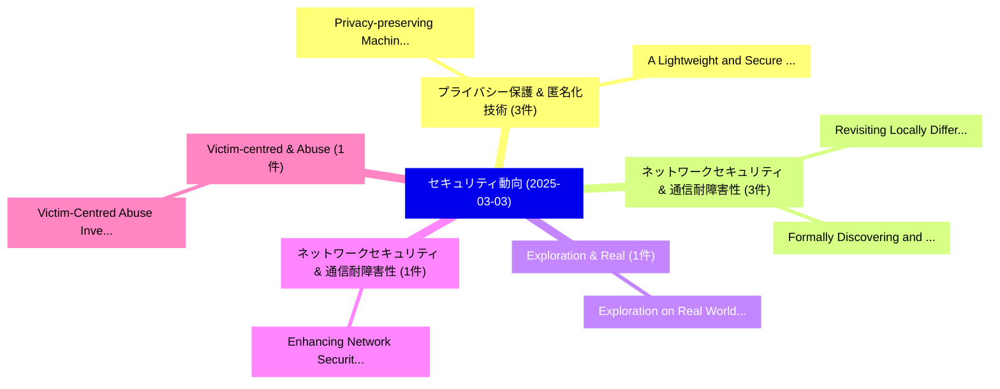

# 📅 02_daily: 日次エグゼクティブサマリー報告書 (2025-03-03)

**集計日時**: 2026-10-02 23:05:18 UTC  
**対象日付**: 2025-03-03  
**本日収集論文数**: 27 件  

---

## 💡 主要セキュリティ動向・脅威インサイト (Executive Insights)

本日の収集論文（計 27 件）において、以下の重点セキュリティ領域で活発な研究動向が確認されました：
- **プライバシー保護 & 匿名化技術** (3 件): 注目論文として 「Privacy-preserving Machine Lea...」、「A Lightweight and Secure Deep ...」 等が発表され、実務防御および攻撃検証の進展が見られます。
- **ネットワークセキュリティ & 通信耐障害性** (3 件): 注目論文として 「Revisiting Locally Differentia...」、「Formally Discovering and Repro...」 等が発表され、実務防御および攻撃検証の進展が見られます。
- **Exploration & Real** (1 件): 注目論文として 「Exploration on Real World Asse...」 等が発表され、実務防御および攻撃検証の進展が見られます。
- **ネットワークセキュリティ & 通信耐障害性** (1 件): 注目論文として 「Enhancing Network Security Man...」 等が発表され、実務防御および攻撃検証の進展が見られます。
- **Victim-centred & Abuse** (1 件): 注目論文として 「Victim-Centred Abuse Investiga...」 等が発表され、実務防御および攻撃検証の進展が見られます。

### 🗺️ 技術・脅威トピックマインドマップ

---

## 📌 日次セキュリティ論文一覧 (日本語表形式)

| No | arXiv ID | 論文タイトル (日本語訳) | 重要キーワード | 構造化エグゼクティブ要約 (背景・提案・影響) | 脅威分類 | 詳細リンク |
|---|---|---|---|---|---|---|
| 1 | `2503.01089v2` | [Privacy-preserving Machine Learning in Internet of Vehicle Applications: Fundamentals, Recent Advances, and Future Direction（セキュリティ分析論文）](../../okf/papers/2025-03-03/2503.01089.md) | `Machine Learning`, `Vehicle Applications`, `Recent Advances` | 【提案】概要 (Overview & Key Finding) 本論文「Privacy-preserving Machine Learning in Internet of Vehi...。実証評価により経営層・セキュリティ管理者向け推奨アクション (E... | `cs.CR` | [arXiv](https://arxiv.org/abs/2503.01089v2) &#124; [OKF](../../okf/papers/2025-03-03/2503.01089.md) |
| 2 | `2503.01111v2` | [Exploration on Real World Assets and Tokenization（セキュリティ分析論文）](../../okf/papers/2025-03-03/2503.01111.md) | `Real World Assets`, `Ning Xia`, `Xiaolei Zhao` | 【提案】概要 (Overview & Key Finding) 本論文「Exploration on Real World Assets and Tokenization（セキュリテ...。実証評価により経営層・セキュリティ管理者向け推奨アクション (E... | `cs.CR` | [arXiv](https://arxiv.org/abs/2503.01111v2) &#124; [OKF](../../okf/papers/2025-03-03/2503.01111.md) |
| 3 | `2503.01229v1` | [Enhancing Network Security Management in Water Systems using FM-based Attack Attribution（セキュリティ分析論文）](../../okf/papers/2025-03-03/2503.01229.md) | `Enhancing Network Security Management`, `Water Systems`, `Attack Attribution` | 【提案】概要 (Overview & Key Finding) 本論文「Enhancing Network Security Management in Water Systems ...。実証評価により経営層・セキュリティ管理者向け推奨アクション (E... | `cs.CR` | [arXiv](https://arxiv.org/abs/2503.01229v1) &#124; [OKF](../../okf/papers/2025-03-03/2503.01229.md) |
| 4 | `2503.01327v1` | [Victim-Centred Abuse Investigations and Defenses for Social Media Platforms（セキュリティ分析論文）](../../okf/papers/2025-03-03/2503.01327.md) | `Centred Abuse Investigations`, `Social Media Platforms`, `Victim-Centred Abuse` | 【提案】概要 (Overview & Key Finding) 本論文「Victim-Centred Abuse Investigations and Defenses for So...。実証評価により経営層・セキュリティ管理者向け推奨アクション (E... | `cs.CR` | [arXiv](https://arxiv.org/abs/2503.01327v1) &#124; [OKF](../../okf/papers/2025-03-03/2503.01327.md) |
| 5 | `2503.01391v1` | [The Road Less Traveled: Investigating Robustness and Explainability in CNN マルウェア検出](../../okf/papers/2025-03-03/2503.01391.md) | `Investigating Robustness`, `Malware Detection`, `Matteo Brosolo` | 【提案】概要 (Overview & Key Finding) 本論文「The Road Less Traveled: Investigating Robustness and Ex...。実証評価により経営層・セキュリティ管理者向け推奨アクション (E... | `cs.CR` | [arXiv](https://arxiv.org/abs/2503.01391v1) &#124; [OKF](../../okf/papers/2025-03-03/2503.01391.md) |
| 6 | `2503.01395v1` | [Jailbreaking Generative AI: Empowering Novices to Conduct Phishing Attacks（セキュリティ分析論文）](../../okf/papers/2025-03-03/2503.01395.md) | `Conduct Phishing Attacks`, `Jailbreaking Generative`, `Empowering Novices` | 【提案】概要 (Overview & Key Finding) 本論文「ジェイルブレイクing Generative AI: Empowering Novices to Conduc...。実証評価により経営層・セキュリティ管理者向け推奨アクション (E... | `cs.CR` | [arXiv](https://arxiv.org/abs/2503.01395v1) &#124; [OKF](../../okf/papers/2025-03-03/2503.01395.md) |
| 7 | `2503.01396v1` | [CorrNetDroid: Android Malware Detector leveraging a Correlation-based Feature Selection for Network Traffic features（セキュリティ分析論文）](../../okf/papers/2025-03-03/2503.01396.md) | `Android Malware Detector`, `Feature Selection`, `Network Traffic` | 【提案】概要 (Overview & Key Finding) 本論文「CorrNetDroid: Android マルウェア Detector leveraging a Corre...。実証評価により経営層・セキュリティ管理者向け推奨アクション (E... | `cs.CR` | [arXiv](https://arxiv.org/abs/2503.01396v1) &#124; [OKF](../../okf/papers/2025-03-03/2503.01396.md) |
| 8 | `2503.01470v1` | [Position: Ensuring mutual privacy is necessary for effective external evaluation of proprietary AI systems（セキュリティ分析論文）](../../okf/papers/2025-03-03/2503.01470.md) | `Ben Bucknall`, `Raw Meta`, `Executive Summary` | 【提案】概要 (Overview & Key Finding) 本論文「Position: Ensuring mutual privacy is necessary for effe...。実証評価により# Position: Ensuring mutu... | `cs.CR` | [arXiv](https://arxiv.org/abs/2503.01470v1) &#124; [OKF](../../okf/papers/2025-03-03/2503.01470.md) |
| 9 | `2503.01482v3` | [Revisiting Locally Differentially Private Protocols: Better Trade-offs in Privacy, Utility, and Attack Resistanceに向けて](../../okf/papers/2025-03-03/2503.01482.md) | `Revisiting Locally Differentially Private Protocols`, `Better Trade`, `Towards Better Trade` | 【提案】概要 (Overview & Key Finding) 本論文「Revisiting Locally Differentially Private Protocols: Be...。実証評価により経営層・セキュリティ管理者向け推奨アクション (E... | `cs.CR` | [arXiv](https://arxiv.org/abs/2503.01482v3) &#124; [OKF](../../okf/papers/2025-03-03/2503.01482.md) |
| 10 | `2503.01522v2` | [Byzantine Distributed Function Computation（セキュリティ分析論文）](../../okf/papers/2025-03-03/2503.01522.md) | `Byzantine Distributed Function Computation`, `Hari Krishnan`, `Neha Sangwan` | 【提案】概要 (Overview & Key Finding) 本論文「Byzantine Distributed Function Computation（セキュリティ分析論文）」...。実証評価によりPrabhakaran - **公開日時**: `... | `cs.CR` | [arXiv](https://arxiv.org/abs/2503.01522v2) &#124; [OKF](../../okf/papers/2025-03-03/2503.01522.md) |
| 11 | `2503.01538v1` | [Formally Discovering and Reproducing Network Protocols Vulnerabilities（セキュリティ分析論文）](../../okf/papers/2025-03-03/2503.01538.md) | `Reproducing Network Protocols Vulnerabilities`, `Formally Discovering`, `Christophe Crochet` | 【提案】概要 (Overview & Key Finding) 本論文「Formally Discovering and Reproducing Network Protocols ...。実証評価により経営層・セキュリティ管理者向け推奨アクション (E... | `cs.CR` | [arXiv](https://arxiv.org/abs/2503.01538v1) &#124; [OKF](../../okf/papers/2025-03-03/2503.01538.md) |
| 12 | `2503.01734v3` | [Adversarial Agents: Black-Box Evasion Attacks with Reinforcement Learning（セキュリティ分析論文）](../../okf/papers/2025-03-03/2503.01734.md) | `Box Evasion Attacks`, `Adversarial Agents`, `Reinforcement Learning` | 【提案】概要 (Overview & Key Finding) 本論文「Adversarial Agents: Black-Box Evasion Attacks with Rein...。実証評価により経営層・セキュリティ管理者向け推奨アクション (E... | `cs.CR` | [arXiv](https://arxiv.org/abs/2503.01734v3) &#124; [OKF](../../okf/papers/2025-03-03/2503.01734.md) |
| 13 | `2503.01758v1` | [Zero-Trust Artificial Intelligence Model Security Based on Moving Target Defense and Content Disarm and Reconstruction（セキュリティ分析論文）](../../okf/papers/2025-03-03/2503.01758.md) | `Trust Artificial Intelligence Model Security Based`, `Moving Target Defense`, `Zero-Trust Artificial` | 【提案】概要 (Overview & Key Finding) 本論文「ゼロトラスト Artificial Intelligence Model Security Based on ...。実証評価により経営層・セキュリティ管理者向け推奨アクション (E... | `cs.CR` | [arXiv](https://arxiv.org/abs/2503.01758v1) &#124; [OKF](../../okf/papers/2025-03-03/2503.01758.md) |
| 14 | `2503.01766v1` | [Optimal Differentially Private Sampling of Unbounded Gaussians（セキュリティ分析論文）](../../okf/papers/2025-03-03/2503.01766.md) | `Optimal Differentially Private Sampling`, `Unbounded Gaussians`, `Valentio Iverson` | 【提案】概要 (Overview & Key Finding) 本論文「Optimal Differentially Private Sampling of Unbounded Ga...。実証評価により経営層・セキュリティ管理者向け推奨アクション (E... | `cs.CR` | [arXiv](https://arxiv.org/abs/2503.01766v1) &#124; [OKF](../../okf/papers/2025-03-03/2503.01766.md) |
| 15 | `2503.01799v1` | [PhishVQC: Optimizing Phishing URL Detection with Correlation Based Feature Selection and Variational Quantum Classifier（セキュリティ分析論文）](../../okf/papers/2025-03-03/2503.01799.md) | `Correlation Based Feature Selection`, `Variational Quantum Classifier`, `Optimizing Phishing` | 【提案】概要 (Overview & Key Finding) 本論文「PhishVQC: Optimizing Phishing URL Detection with Correl...。実証評価により経営層・セキュリティ管理者向け推奨アクション (E... | `cs.CR` | [arXiv](https://arxiv.org/abs/2503.01799v1) &#124; [OKF](../../okf/papers/2025-03-03/2503.01799.md) |
| 16 | `2503.01811v1` | [AutoAdvExBench: autonomous exploitation of adversarial example defensesのベンチマーク評価](../../okf/papers/2025-03-03/2503.01811.md) | `Nicholas Carlini`, `Javier Rando`, `Edoardo Debenedetti` | 【提案】概要 (Overview & Key Finding) 本論文「AutoAdvExBench: autonomous exploitation of 敵対的サンプル defe...。実証評価により経営層・セキュリティ管理者向け推奨アクション (E... | `cs.CR` | [arXiv](https://arxiv.org/abs/2503.01811v1) &#124; [OKF](../../okf/papers/2025-03-03/2503.01811.md) |
| 17 | `2503.01816v2` | [A Mapping Requirements Between the CRA and the GDPRの分析](../../okf/papers/2025-03-03/2503.01816.md) | `Jukka Ruohonen`, `Kalle Hjerppe`, `Young Kang` | 【提案】概要 (Overview & Key Finding) 本論文「A Mapping Requirements Between the CRA and the GDPRの分析」...。実証評価により経営層・セキュリティ管理者向け推奨アクション (E... | `cs.CR` | [arXiv](https://arxiv.org/abs/2503.01816v2) &#124; [OKF](../../okf/papers/2025-03-03/2503.01816.md) |
| 18 | `2503.01839v2` | [Jailbreaking Safeguarded Text-to-Image Models via 大規模言語モデル](../../okf/papers/2025-03-03/2503.01839.md) | `Jailbreaking Safeguarded Text`, `Image Models`, `Large Language Models` | 【提案】概要 (Overview & Key Finding) 本論文「ジェイルブレイクing Safeguarded Text-to-Image Models via 大規模言語モ...。実証評価により経営層・セキュリティ管理者向け推奨アクション (E... | `cs.CR` | [arXiv](https://arxiv.org/abs/2503.01839v2) &#124; [OKF](../../okf/papers/2025-03-03/2503.01839.md) |
| 19 | `2503.01944v1` | [Protecting DeFi Platforms against Non-Price Flash Loan Attacks（セキュリティ分析論文）](../../okf/papers/2025-03-03/2503.01944.md) | `Price Flash Loan Attacks`, `Non-Price Flash`, `Abdulrahman Alhaidari` | 【提案】概要 (Overview & Key Finding) 本論文「Protecting DeFi Platforms against Non-Price Flash Loan ...。実証評価により経営層・セキュリティ管理者向け推奨アクション (E... | `cs.CR` | [arXiv](https://arxiv.org/abs/2503.01944v1) &#124; [OKF](../../okf/papers/2025-03-03/2503.01944.md) |
| 20 | `2503.02017v1` | [A Lightweight and Secure Deep Learning Model for Privacy-Preserving 連合学習 in Intelligent Enterprises](../../okf/papers/2025-03-03/2503.02017.md) | `Secure Deep Learning Model`, `Intelligent Enterprises`, `Preserving Federated Learning` | 【提案】概要 (Overview & Key Finding) 本論文「A Lightweight and Secure Deep Learning Model for Privac...。実証評価により経営層・セキュリティ管理者向け推奨アクション (E... | `cs.CR` | [arXiv](https://arxiv.org/abs/2503.02017v1) &#124; [OKF](../../okf/papers/2025-03-03/2503.02017.md) |
| 21 | `2503.02018v1` | [Advancing Obfuscation Strategies to Counter China's Great Firewall: A Technical and Policy Perspective（セキュリティ分析論文）](../../okf/papers/2025-03-03/2503.02018.md) | `Advancing Obfuscation Strategies`, `Counter China`, `Great Firewall` | 【提案】概要 (Overview & Key Finding) 本論文「Advancing Obfuscation Strategies to Counter China's Gre...。実証評価により経営層・セキュリティ管理者向け推奨アクション (E... | `cs.CR` | [arXiv](https://arxiv.org/abs/2503.02018v1) &#124; [OKF](../../okf/papers/2025-03-03/2503.02018.md) |
| 22 | `2503.02019v2` | [SLAP: Secure Location-proof and Anonymous Privacy-preserving Spectrum Access（セキュリティ分析論文）](../../okf/papers/2025-03-03/2503.02019.md) | `Secure Location`, `Anonymous Privacy`, `Spectrum Access` | 【提案】概要 (Overview & Key Finding) 本論文「SLAP: Secure Location-proof and Anonymous Privacy-prese...。実証評価により経営層・セキュリティ管理者向け推奨アクション (E... | `cs.CR` | [arXiv](https://arxiv.org/abs/2503.02019v2) &#124; [OKF](../../okf/papers/2025-03-03/2503.02019.md) |
| 23 | `2503.02065v2` | [Too Much to Trust? Measuring the Security and Cognitive Impacts of Explainability in AI-Driven SOCs（セキュリティ分析論文）](../../okf/papers/2025-03-03/2503.02065.md) | `Cognitive Impacts`, `AI-Driven SOCs`, `Nidhi Rastogi` | 【提案】Measuring the Security and Cognitive Impacts of Explainability in AI-Driven SOCs ### (日...。実証評価により経営層・セキュリティ管理者向け推奨アクション (E... | `cs.CR` | [arXiv](https://arxiv.org/abs/2503.02065v2) &#124; [OKF](../../okf/papers/2025-03-03/2503.02065.md) |
| 24 | `2503.02097v1` | [Bomfather: An eBPF-based Kernel-level Monitoring Framework for Accurate Identification of Unknown, Unused, and Dynamically Loaded Dependencies in Modern Software Supply Chains（セキュリティ分析論文）](../../okf/papers/2025-03-03/2503.02097.md) | `Modern Software Supply Chains`, `Dynamically Loaded Dependencies`, `Accurate Identification` | 【提案】概要 (Overview & Key Finding) 本論文「Bomfather: An eBPF-based Kernel-level Monitoring Framew...。実証評価によりセキュリティ影響と実験結果 (Results & ... | `cs.CR` | [arXiv](https://arxiv.org/abs/2503.02097v1) &#124; [OKF](../../okf/papers/2025-03-03/2503.02097.md) |
| 25 | `2503.02118v2` | [OrbID: Identifying Orbcomm Satellite RF Fingerprints（セキュリティ分析論文）](../../okf/papers/2025-03-03/2503.02118.md) | `Identifying Orbcomm Satellite`, `Joshua Smailes`, `Martin Strohmeier` | 【提案】概要 (Overview & Key Finding) 本論文「OrbID: Identifying Orbcomm Satellite RF Fingerprints（セキ...。実証評価により経営層・セキュリティ管理者向け推奨アクション (E... | `cs.CR` | [arXiv](https://arxiv.org/abs/2503.02118v2) &#124; [OKF](../../okf/papers/2025-03-03/2503.02118.md) |
| 26 | `2503.04806v1` | [The Post-Quantum Cryptography Transition: Making Progress, But Still a Long Road Ahead（セキュリティ分析論文）](../../okf/papers/2025-03-03/2503.04806.md) | `Quantum Cryptography Transition`, `Long Road Ahead`, `Making Progress` | 【提案】概要 (Overview & Key Finding) 本論文「The ポスト量子暗号 Transition: Making Progress, But Still a Lo...。実証評価により経営層・セキュリティ管理者向け推奨アクション (E... | `cs.CR` | [arXiv](https://arxiv.org/abs/2503.04806v1) &#124; [OKF](../../okf/papers/2025-03-03/2503.04806.md) |
| 27 | `2506.12257v1` | [Lessons for サイバーセキュリティ from the American Public Health System](../../okf/papers/2025-03-03/2506.12257.md) | `American Public Health System`, `Yi Ting Chua`, `Adam Shostack` | 【提案】概要 (Overview & Key Finding) 本論文「Lessons for サイバーセキュリティ from the American Public Health ...。実証評価によりJean Camp, Yi Ting Chua, ... | `cs.CR` | [arXiv](https://arxiv.org/abs/2506.12257v1) &#124; [OKF](../../okf/papers/2025-03-03/2506.12257.md) |

