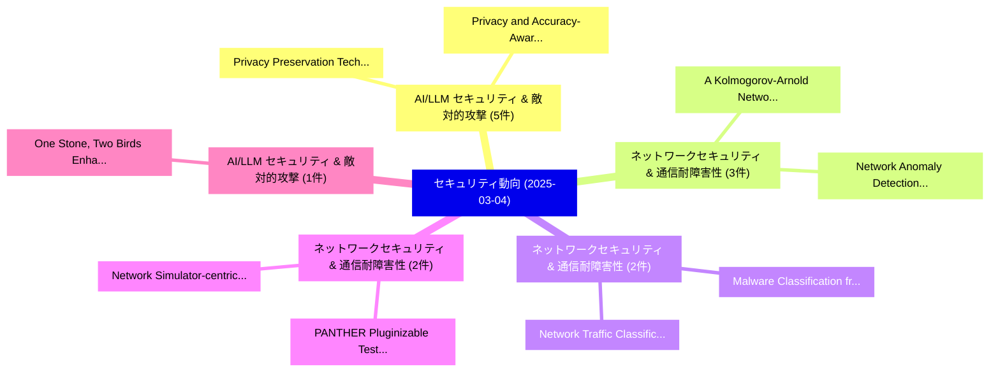

# 📅 02_daily: 日次エグゼクティブサマリー報告書 (2025-03-04)

**集計日時**: 2026-10-02 23:05:19 UTC  
**対象日付**: 2025-03-04  
**本日収集論文数**: 30 件  

---

## 💡 主要セキュリティ動向・脅威インサイト (Executive Insights)

本日の収集論文（計 30 件）において、以下の重点セキュリティ領域で活発な研究動向が確認されました：
- **AI/LLM セキュリティ & 敵対的攻撃** (5 件): 注目論文として 「Privacy Preservation Technique...」、「Privacy and Accuracy-Aware AI/...」 等が発表され、実務防御および攻撃検証の進展が見られます。
- **ネットワークセキュリティ & 通信耐障害性** (3 件): 注目論文として 「A Kolmogorov-Arnold Network fo...」、「Network Anomaly Detection for ...」 等が発表され、実務防御および攻撃検証の進展が見られます。
- **ネットワークセキュリティ & 通信耐障害性** (2 件): 注目論文として 「Network Traffic Classification...」、「Malware Classification from Me...」 等が発表され、実務防御および攻撃検証の進展が見られます。
- **ネットワークセキュリティ & 通信耐障害性** (2 件): 注目論文として 「PANTHER: Pluginizable Testing ...」、「Network Simulator-centric Comp...」 等が発表され、実務防御および攻撃検証の進展が見られます。
- **AI/LLM セキュリティ & 敵対的攻撃** (1 件): 注目論文として 「One Stone, Two Birds: Enhancin...」 等が発表され、実務防御および攻撃検証の進展が見られます。

### 🗺️ 技術・脅威トピックマインドマップ

---

## 📌 日次セキュリティ論文一覧 (日本語表形式)

| No | arXiv ID | 論文タイトル (日本語訳) | 重要キーワード | 構造化エグゼクティブ要約 (背景・提案・影響) | 脅威分類 | 詳細リンク |
|---|---|---|---|---|---|---|
| 1 | `2503.02141v1` | [Network Traffic Classification Using Machine Learning, Transformer, and 大規模言語モデル](../../okf/papers/2025-03-04/2503.02141.md) | `Network Traffic Classification Using Machine Learning`, `Large Language Models`, `Ahmad Antari` | 【提案】概要 (Overview & Key Finding) 本論文「Network Traffic Classification Using Machine Learning, ...。実証評価により経営層・セキュリティ管理者向け推奨アクション (E... | `cs.CR` | [arXiv](https://arxiv.org/abs/2503.02141v1) &#124; [OKF](../../okf/papers/2025-03-04/2503.02141.md) |
| 2 | `2503.02144v1` | [Malware Classification from Memory Dumps Using Machine Learning, Transformers, and 大規模言語モデル](../../okf/papers/2025-03-04/2503.02144.md) | `Memory Dumps Using Machine Learning`, `Malware Classification`, `Large Language Models` | 【提案】概要 (Overview & Key Finding) 本論文「マルウェア Classification from Memory Dumps Using Machine Le...。実証評価により経営層・セキュリティ管理者向け推奨アクション (E... | `cs.CR` | [arXiv](https://arxiv.org/abs/2503.02144v1) &#124; [OKF](../../okf/papers/2025-03-04/2503.02144.md) |
| 3 | `2503.02169v2` | [One Stone, Two Birds: Enhancing Adversarial Defense Through the Lens of Distributional Discrepancy（セキュリティ分析論文）](../../okf/papers/2025-03-04/2503.02169.md) | `One Stone`, `Two Birds`, `Distributional Discrepancy` | 【提案】概要 (Overview & Key Finding) 本論文「One Stone, Two Birds: Enhancing Adversarial Defense Thr...。実証評価により経営層・セキュリティ管理者向け推奨アクション (E... | `cs.CR` | [arXiv](https://arxiv.org/abs/2503.02169v2) &#124; [OKF](../../okf/papers/2025-03-04/2503.02169.md) |
| 4 | `2503.02176v3` | [Client-Aided Secure Two-Party Computation of Dynamic Controllers（セキュリティ分析論文）](../../okf/papers/2025-03-04/2503.02176.md) | `Aided Secure Two`, `Party Computation`, `Dynamic Controllers` | 【提案】概要 (Overview & Key Finding) 本論文「Client-Aided Secure Two-Party Computation of Dynamic Co...。実証評価により経営層・セキュリティ管理者向け推奨アクション (E... | `cs.CR` | [arXiv](https://arxiv.org/abs/2503.02176v3) &#124; [OKF](../../okf/papers/2025-03-04/2503.02176.md) |
| 5 | `2503.02281v1` | [A Kolmogorov-Arnold Network for Explainable Cyberattacks on EV Chargersの検出](../../okf/papers/2025-03-04/2503.02281.md) | `Arnold Network`, `Kolmogorov-Arnold Network`, `Explainable Detection` | 【提案】概要 (Overview & Key Finding) 本論文「A Kolmogorov-Arnold Network for Explainable Cyberattack...。実証評価により経営層・セキュリティ管理者向け推奨アクション (E... | `cs.CR` | [arXiv](https://arxiv.org/abs/2503.02281v1) &#124; [OKF](../../okf/papers/2025-03-04/2503.02281.md) |
| 6 | `2503.02402v1` | [Trace of the Times: Rootkit Detection through Temporal Anomalies in Kernel Activity（セキュリティ分析論文）](../../okf/papers/2025-03-04/2503.02402.md) | `Rootkit Detection`, `Temporal Anomalies`, `Kernel Activity` | 【提案】概要 (Overview & Key Finding) 本論文「Trace of the Times: Rootkit Detection through Temporal ...。実証評価により経営層・セキュリティ管理者向け推奨アクション (E... | `cs.CR` | [arXiv](https://arxiv.org/abs/2503.02402v1) &#124; [OKF](../../okf/papers/2025-03-04/2503.02402.md) |
| 7 | `2503.02413v1` | [PANTHER: Pluginizable Testing Environment for Network Protocols（セキュリティ分析論文）](../../okf/papers/2025-03-04/2503.02413.md) | `Pluginizable Testing Environment`, `Network Protocols`, `Christophe Crochet` | 【提案】概要 (Overview & Key Finding) 本論文「PANTHER: Pluginizable Testing Environment for Network P...。実証評価により経営層・セキュリティ管理者向け推奨アクション (E... | `cs.CR` | [arXiv](https://arxiv.org/abs/2503.02413v1) &#124; [OKF](../../okf/papers/2025-03-04/2503.02413.md) |
| 8 | `2503.02441v1` | [Through the Static: Demystifying Malware Visualization via Explainability（セキュリティ分析論文）](../../okf/papers/2025-03-04/2503.02441.md) | `Demystifying Malware Visualization`, `Matteo Brosolo`, `Vinod Puthuvath` | 【提案】概要 (Overview & Key Finding) 本論文「Through the Static: Demystifying マルウェア Visualization vi...。実証評価により経営層・セキュリティ管理者向け推奨アクション (E... | `cs.CR` | [arXiv](https://arxiv.org/abs/2503.02441v1) &#124; [OKF](../../okf/papers/2025-03-04/2503.02441.md) |
| 9 | `2503.02455v2` | [Privacy Preservation Techniques (PPTs) in IoT Systems: A Scoping Review and Future Directions（セキュリティ分析論文）](../../okf/papers/2025-03-04/2503.02455.md) | `Privacy Preservation Techniques`, `Scoping Review`, `Future Directions` | 【提案】概要 (Overview & Key Finding) 本論文「Privacy Preservation Techniques (PPTs) in IoT Systems: ...。実証評価により経営層・セキュリティ管理者向け推奨アクション (E... | `cs.CR` | [arXiv](https://arxiv.org/abs/2503.02455v2) &#124; [OKF](../../okf/papers/2025-03-04/2503.02455.md) |
| 10 | `2503.02499v1` | [Attack Tree Distance: a practical examination of tree difference measurement within cyber security（セキュリティ分析論文）](../../okf/papers/2025-03-04/2503.02499.md) | `Attack Tree Distance`, `Olga Gadyatskaya`, `Raw Meta` | 【提案】概要 (Overview & Key Finding) 本論文「Attack Tree Distance: a practical examination of tree d...。実証評価により経営層・セキュリティ管理者向け推奨アクション (E... | `cs.CR` | [arXiv](https://arxiv.org/abs/2503.02499v1) &#124; [OKF](../../okf/papers/2025-03-04/2503.02499.md) |
| 11 | `2503.02559v2` | [TFHE-SBC: Software Designs for Fully Homomorphic Encryption over the Torus on Single Board Computers（セキュリティ分析論文）](../../okf/papers/2025-03-04/2503.02559.md) | `Fully Homomorphic Encryption`, `Single Board Computers`, `Software Designs` | 【提案】概要 (Overview & Key Finding) 本論文「TFHE-SBC: Software Designs for Fully 準同型暗号 over the Tor...。実証評価により経営層・セキュリティ管理者向け推奨アクション (E... | `cs.CR` | [arXiv](https://arxiv.org/abs/2503.02559v2) &#124; [OKF](../../okf/papers/2025-03-04/2503.02559.md) |
| 12 | `2503.02574v2` | [LLM-Safety Evaluations Lack Robustness（セキュリティ分析論文）](../../okf/papers/2025-03-04/2503.02574.md) | `Safety Evaluations Lack Robustness`, `LLM-Safety Evaluations`, `Tim Beyer` | 【提案】背景とセキュリティ上の課題 (Background & Problem) 本研究はサイバー脅威環境におけるセキュリティ構造・脆弱性の検証を目的としています。(主要検出項目: ...。実証評価により概要 (Overview & Key Findin... | `cs.CR` | [arXiv](https://arxiv.org/abs/2503.02574v2) &#124; [OKF](../../okf/papers/2025-03-04/2503.02574.md) |
| 13 | `2503.02648v2` | [Practical Unclonable Encryption with Continuous Variables（セキュリティ分析論文）](../../okf/papers/2025-03-04/2503.02648.md) | `Practical Unclonable Encryption`, `Continuous Variables`, `Arpan Akash Ray` | 【提案】概要 (Overview & Key Finding) 本論文「Practical Unclonable Encryption with Continuous Variabl...。実証評価により経営層・セキュリティ管理者向け推奨アクション (E... | `cs.CR` | [arXiv](https://arxiv.org/abs/2503.02648v2) &#124; [OKF](../../okf/papers/2025-03-04/2503.02648.md) |
| 14 | `2503.02702v2` | [RedChronos: A Large Language Model-Based Log Analysis System for Insider Threat Detection in Enterprises（セキュリティ分析論文）](../../okf/papers/2025-03-04/2503.02702.md) | `Large Language Model`, `Insider Threat Detection`, `Model-Based Log` | 【提案】概要 (Overview & Key Finding) 本論文「RedChronos: A Large Language Model-Based Log Analysis S...。実証評価により経営層・セキュリティ管理者向け推奨アクション (E... | `cs.CR` | [arXiv](https://arxiv.org/abs/2503.02702v2) &#124; [OKF](../../okf/papers/2025-03-04/2503.02702.md) |
| 15 | `2503.02706v1` | [Optimisation of cyber insurance coverage with selection of cost effective security controls（セキュリティ分析論文）](../../okf/papers/2025-03-04/2503.02706.md) | `Ganbayar Uuganbayar`, `Artsiom Yautsiukhin`, `Fabio Martinelli` | 【提案】概要 (Overview & Key Finding) 本論文「Optimisation of cyber insurance coverage with selection...。実証評価により経営層・セキュリティ管理者向け推奨アクション (E... | `cs.CR` | [arXiv](https://arxiv.org/abs/2503.02706v1) &#124; [OKF](../../okf/papers/2025-03-04/2503.02706.md) |
| 16 | `2503.02772v2` | [ESSPI: ECDSA/Schnorr Signed Program Input for BitVMX（セキュリティ分析論文）](../../okf/papers/2025-03-04/2503.02772.md) | `Schnorr Signed Program Input`, `Sergio Demian Lerner`, `Martin Jonas` | 【提案】概要 (Overview & Key Finding) 本論文「ESSPI: ECDSA/Schnorr Signed Program Input for BitVMX（セキ...。実証評価により経営層・セキュリティ管理者向け推奨アクション (E... | `cs.CR` | [arXiv](https://arxiv.org/abs/2503.02772v2) &#124; [OKF](../../okf/papers/2025-03-04/2503.02772.md) |
| 17 | `2503.02780v2` | [Quantitative Resilience Modeling for Autonomous Cyber Defense（セキュリティ分析論文）](../../okf/papers/2025-03-04/2503.02780.md) | `Quantitative Resilience Modeling`, `Autonomous Cyber Defense`, `Xavier Cadet` | 【提案】概要 (Overview & Key Finding) 本論文「Quantitative Resilience Modeling for Autonomous Cyber D...。実証評価により経営層・セキュリティ管理者向け推奨アクション (E... | `cs.CR` | [arXiv](https://arxiv.org/abs/2503.02780v2) &#124; [OKF](../../okf/papers/2025-03-04/2503.02780.md) |
| 18 | `2503.02862v1` | [Privacy and Accuracy-Aware AI/ML Model Deduplication（セキュリティ分析論文）](../../okf/papers/2025-03-04/2503.02862.md) | `Model Deduplication`, `Accuracy-Aware AI`, `Hong Guan` | 【提案】概要 (Overview & Key Finding) 本論文「Privacy and Accuracy-Aware AI/ML Model Deduplication（セキ...。実証評価により経営層・セキュリティ管理者向け推奨アクション (E... | `cs.CR` | [arXiv](https://arxiv.org/abs/2503.02862v1) &#124; [OKF](../../okf/papers/2025-03-04/2503.02862.md) |
| 19 | `2503.02959v1` | [Node-level Contrastive Unlearning on Graph Neural Networks（セキュリティ分析論文）](../../okf/papers/2025-03-04/2503.02959.md) | `Graph Neural Networks`, `Contrastive Unlearning`, `Node-level Contrastive` | 【提案】概要 (Overview & Key Finding) 本論文「Node-level Contrastive Unlearning on Graph Neural Netwo...。実証評価により経営層・セキュリティ管理者向け推奨アクション (E... | `cs.CR` | [arXiv](https://arxiv.org/abs/2503.02959v1) &#124; [OKF](../../okf/papers/2025-03-04/2503.02959.md) |
| 20 | `2503.02968v1` | [Privacy-Preserving Fair Synthetic Tabular Data（セキュリティ分析論文）](../../okf/papers/2025-03-04/2503.02968.md) | `Preserving Fair Synthetic Tabular Data`, `Privacy-Preserving Fair`, `Noman Mohammed` | 【提案】概要 (Overview & Key Finding) 本論文「Privacy-Preserving Fair Synthetic Tabular Data（セキュリティ分析...。実証評価によりHenry, Noman Mohammed - *... | `cs.CR` | [arXiv](https://arxiv.org/abs/2503.02968v1) &#124; [OKF](../../okf/papers/2025-03-04/2503.02968.md) |
| 21 | `2503.02986v3` | [Mind the Gap: Detecting Black-box Adversarial Attacks in the Making through Query Update Analysis（セキュリティ分析論文）](../../okf/papers/2025-03-04/2503.02986.md) | `Detecting Black`, `Adversarial Attacks`, `Black-box Adversarial` | 【提案】概要 (Overview & Key Finding) 本論文「Mind the Gap: Detecting Black-box 敵対的攻撃s in the Making ...。実証評価により経営層・セキュリティ管理者向け推奨アクション (E... | `cs.CR` | [arXiv](https://arxiv.org/abs/2503.02986v3) &#124; [OKF](../../okf/papers/2025-03-04/2503.02986.md) |
| 22 | `2503.03022v3` | [Generative Active Adaptation for Drifting and Imbalanced Network Intrusion Detection（セキュリティ分析論文）](../../okf/papers/2025-03-04/2503.03022.md) | `Generative Active Adaptation`, `Imbalanced Network Intrusion Detection`, `Ragini Gupta` | 【提案】概要 (Overview & Key Finding) 本論文「Generative Active Adaptation for Drifting and Imbalance...。実証評価により経営層・セキュリティ管理者向け推奨アクション (E... | `cs.CR` | [arXiv](https://arxiv.org/abs/2503.03022v3) &#124; [OKF](../../okf/papers/2025-03-04/2503.03022.md) |
| 23 | `2503.03027v2` | [Adopt a PET! An Exploration of PETs, Policy, and Practicalities for Industry in Canada（セキュリティ分析論文）](../../okf/papers/2025-03-04/2503.03027.md) | `Masoumeh Shafieinejad`, `Bailey Kacsmar`, `Raw Meta` | 【提案】An Exploration of PETs, Policy, and Practicalities for Industry in Canada ### (日本語題名: A...。実証評価により経営層・セキュリティ管理者向け推奨アクション (E... | `cs.CR` | [arXiv](https://arxiv.org/abs/2503.03027v2) &#124; [OKF](../../okf/papers/2025-03-04/2503.03027.md) |
| 24 | `2503.03031v1` | [Network Anomaly Detection for IoT Using Hyperdimensional Computing on NSL-KDD（セキュリティ分析論文）](../../okf/papers/2025-03-04/2503.03031.md) | `Network Anomaly Detection`, `Using Hyperdimensional Computing`, `Ghazal Ghajari` | 【提案】概要 (Overview & Key Finding) 本論文「Network Anomaly Detection for IoT Using Hyperdimensiona...。実証評価により経営層・セキュリティ管理者向け推奨アクション (E... | `cs.CR` | [arXiv](https://arxiv.org/abs/2503.03031v1) &#124; [OKF](../../okf/papers/2025-03-04/2503.03031.md) |
| 25 | `2503.03037v1` | [Intrusion Detection in IoT Networks Using Hyperdimensional Computing: A Case Study on the NSL-KDD Dataset（セキュリティ分析論文）](../../okf/papers/2025-03-04/2503.03037.md) | `Networks Using Hyperdimensional Computing`, `Intrusion Detection`, `NSL-KDD Dataset` | 【提案】概要 (Overview & Key Finding) 本論文「Intrusion Detection in IoT Networks Using Hyperdimensio...。実証評価により経営層・セキュリティ管理者向け推奨アクション (E... | `cs.CR` | [arXiv](https://arxiv.org/abs/2503.03037v1) &#124; [OKF](../../okf/papers/2025-03-04/2503.03037.md) |
| 26 | `2503.03043v2` | [Leveraging Randomness in Model and Data Partitioning for Privacy Amplification（セキュリティ分析論文）](../../okf/papers/2025-03-04/2503.03043.md) | `Leveraging Randomness`, `Data Partitioning`, `Privacy Amplification` | 【提案】概要 (Overview & Key Finding) 本論文「Leveraging Randomness in Model and Data Partitioning fo...。実証評価により経営層・セキュリティ管理者向け推奨アクション (E... | `cs.CR` | [arXiv](https://arxiv.org/abs/2503.03043v2) &#124; [OKF](../../okf/papers/2025-03-04/2503.03043.md) |
| 27 | `2503.04810v1` | [Network Simulator-centric Compositional Testing（セキュリティ分析論文）](../../okf/papers/2025-03-04/2503.04810.md) | `Network Simulator`, `Compositional Testing`, `Simulator-centric Compositional` | 【提案】概要 (Overview & Key Finding) 本論文「Network Simulator-centric Compositional Testing（セキュリティ分...。実証評価により経営層・セキュリティ管理者向け推奨アクション (E... | `cs.CR` | [arXiv](https://arxiv.org/abs/2503.04810v1) &#124; [OKF](../../okf/papers/2025-03-04/2503.04810.md) |
| 28 | `2503.04815v1` | [Comparative Lightweight Kubernetes Distributions for Edge Computing: Security, Resilience and Maintainabilityの分析](../../okf/papers/2025-03-04/2503.04815.md) | `Edge Computing`, `Comparative Lightweight Kubernetes Distributions`, `Lightweight Kubernetes Distributions` | 【提案】概要 (Overview & Key Finding) 本論文「Comparative Lightweight Kubernetes Distributions for Ed...。実証評価により経営層・セキュリティ管理者向け推奨アクション (E... | `cs.CR` | [arXiv](https://arxiv.org/abs/2503.04815v1) &#124; [OKF](../../okf/papers/2025-03-04/2503.04815.md) |
| 29 | `2503.04819v1` | [Technique Inference Engine: A Recommender Model to Support Cyber Threat Hunting（セキュリティ分析論文）](../../okf/papers/2025-03-04/2503.04819.md) | `Support Cyber Threat Hunting`, `Technique Inference Engine`, `Recommender Model` | 【提案】概要 (Overview & Key Finding) 本論文「Technique Inference Engine: A Recommender Model to Supp...。実証評価によりTurner, Mi。 | `cs.CR` | [arXiv](https://arxiv.org/abs/2503.04819v1) &#124; [OKF](../../okf/papers/2025-03-04/2503.04819.md) |
| 30 | `2503.05812v1` | [Intolerable Risk Threshold Recommendations for Artificial Intelligence（セキュリティ分析論文）](../../okf/papers/2025-03-04/2503.05812.md) | `Intolerable Risk Threshold Recommendations`, `Artificial Intelligence`, `Deepika Raman` | 【提案】概要 (Overview & Key Finding) 本論文「Intolerable Risk Threshold Recommendations for Artifici...。実証評価により経営層・セキュリティ管理者向け推奨アクション (E... | `cs.CR` | [arXiv](https://arxiv.org/abs/2503.05812v1) &#124; [OKF](../../okf/papers/2025-03-04/2503.05812.md) |

