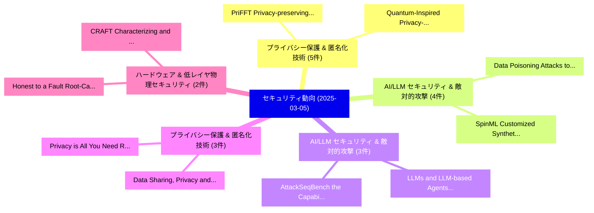

# 📅 02_daily: 日次エグゼクティブサマリー報告書 (2025-03-05)

**集計日時**: 2026-10-02 23:05:19 UTC  
**対象日付**: 2025-03-05  
**本日収集論文数**: 30 件  

---

## 💡 主要セキュリティ動向・脅威インサイト (Executive Insights)

本日の収集論文（計 30 件）において、以下の重点セキュリティ領域で活発な研究動向が確認されました：
- **プライバシー保護 & 匿名化技術** (5 件): 注目論文として 「PriFFT: Privacy-preserving Fed...」、「Quantum-Inspired Privacy-Prese...」 等が発表され、実務防御および攻撃検証の進展が見られます。
- **AI/LLM セキュリティ & 敵対的攻撃** (4 件): 注目論文として 「SpinML: Customized Synthetic D...」、「Data Poisoning Attacks to Loca...」 等が発表され、実務防御および攻撃検証の進展が見られます。
- **AI/LLM セキュリティ & 敵対的攻撃** (3 件): 注目論文として 「AttackSeqBench: the Capabiliti...」、「LLMs and LLM-based Agents in P...」 等が発表され、実務防御および攻撃検証の進展が見られます。
- **プライバシー保護 & 匿名化技術** (3 件): 注目論文として 「Privacy is All You Need: Revol...」、「Data Sharing, Privacy and Secu...」 等が発表され、実務防御および攻撃検証の進展が見られます。
- **ハードウェア & 低レイヤ物理セキュリティ** (2 件): 注目論文として 「CRAFT: Characterizing and Root...」、「Honest to a Fault: Root-Causin...」 等が発表され、実務防御および攻撃検証の進展が見られます。

### 🗺️ 技術・脅威トピックマインドマップ

---

## 📌 日次セキュリティ論文一覧 (日本語表形式)

| No | arXiv ID | 論文タイトル (日本語訳) | 重要キーワード | 構造化エグゼクティブ要約 (背景・提案・影響) | 脅威分類 | 詳細リンク |
|---|---|---|---|---|---|---|
| 1 | `2503.03108v4` | [OMNISEC: LLM-Driven Provenance-based Intrusion Detection via Retrieval-Augmented Behavior Prompting（セキュリティ分析論文）](../../okf/papers/2025-03-05/2503.03108.md) | `Augmented Behavior Prompting`, `Driven Provenance`, `LLM-Driven Provenance` | 【提案】概要 (Overview & Key Finding) 本論文「OMNISEC: LLM-Driven Provenance-based Intrusion Detectio...。実証評価により経営層・セキュリティ管理者向け推奨アクション (E... | `cs.CR` | [arXiv](https://arxiv.org/abs/2503.03108v4) &#124; [OKF](../../okf/papers/2025-03-05/2503.03108.md) |
| 2 | `2503.03146v2` | [PriFFT: Privacy-preserving Federated Fine-tuning of 大規模言語モデル via Hybrid Secret Sharing](../../okf/papers/2025-03-05/2503.03146.md) | `Hybrid Secret Sharing`, `Federated Fine`, `Privacy-preserving Federated` | 【提案】概要 (Overview & Key Finding) 本論文「PriFFT: Privacy-preserving Federated Fine-tuning of 大規模...。実証評価により経営層・セキュリティ管理者向け推奨アクション (E... | `cs.CR` | [arXiv](https://arxiv.org/abs/2503.03146v2) &#124; [OKF](../../okf/papers/2025-03-05/2503.03146.md) |
| 3 | `2503.03160v2` | [SpinML: Customized Synthetic Data Generation for Private Training of Specialized ML Models（セキュリティ分析論文）](../../okf/papers/2025-03-05/2503.03160.md) | `Customized Synthetic Data Generation`, `Private Training`, `Customized Synthetic Data Generat` | 【提案】概要 (Overview & Key Finding) 本論文「SpinML: Customized Synthetic Data Generation for Privat...。実証評価により経営層・セキュリティ管理者向け推奨アクション (E... | `cs.CR` | [arXiv](https://arxiv.org/abs/2503.03160v2) &#124; [OKF](../../okf/papers/2025-03-05/2503.03160.md) |
| 4 | `2503.03170v3` | [AttackSeqBench: the Capabilities of LLMs for Attack Sequences Understandingのベンチマーク評価](../../okf/papers/2025-03-05/2503.03170.md) | `Attack Sequences`, `Attack Sequences Understanding`, `Haokai Ma` | 【提案】概要 (Overview & Key Finding) 本論文「AttackSeqBench: the Capabilities of LLMs for Attack Seq...。実証評価により経営層・セキュリティ管理者向け推奨アクション (E... | `cs.CR` | [arXiv](https://arxiv.org/abs/2503.03170v3) &#124; [OKF](../../okf/papers/2025-03-05/2503.03170.md) |
| 5 | `2503.03180v1` | [Enhancing サイバーセキュリティ in Critical Infrastructure with LLM-Assisted Explainable IoT Systems](../../okf/papers/2025-03-05/2503.03180.md) | `Critical Infrastructure`, `Assisted Explainable`, `LLM-Assisted Explainable` | 【提案】概要 (Overview & Key Finding) 本論文「Enhancing サイバーセキュリティ in Critical Infrastructure with LL...。実証評価により経営層・セキュリティ管理者向け推奨アクション (E... | `cs.CR` | [arXiv](https://arxiv.org/abs/2503.03180v1) &#124; [OKF](../../okf/papers/2025-03-05/2503.03180.md) |
| 6 | `2503.03245v2` | [Less is more? Rewards in RL for Cyber Defence（セキュリティ分析論文）](../../okf/papers/2025-03-05/2503.03245.md) | `Cyber Defence`, `Elizabeth Bates`, `Chris Hicks` | 【提案】Rewards in RL for Cyber Defence ### (日本語題名: Less is more?。実証評価により経営層・セキュリティ管理者向け推奨アクション (Executive Recommendations) - 組織のセキ... | `cs.CR` | [arXiv](https://arxiv.org/abs/2503.03245v2) &#124; [OKF](../../okf/papers/2025-03-05/2503.03245.md) |
| 7 | `2503.03267v1` | [Quantum-Inspired Privacy-Preserving 連合学習 Framework for Secure Dementia Classification](../../okf/papers/2025-03-05/2503.03267.md) | `Secure Dementia Classification`, `Inspired Privacy`, `Quantum-Inspired Privacy` | 【提案】概要 (Overview & Key Finding) 本論文「量子-Inspired Privacy-Preserving 連合学習 Framework for Secur...。実証評価により経営層・セキュリティ管理者向け推奨アクション (E... | `cs.CR` | [arXiv](https://arxiv.org/abs/2503.03267v1) &#124; [OKF](../../okf/papers/2025-03-05/2503.03267.md) |
| 8 | `2503.03270v1` | [Reduced Spatial Dependency for More General Video-level Deepfake Detection（セキュリティ分析論文）](../../okf/papers/2025-03-05/2503.03270.md) | `Reduced Spatial Dependency`, `Deepfake Detection`, `Video-level Deepfake` | 【提案】概要 (Overview & Key Finding) 本論文「Reduced Spatial Dependency for More General Video-level...。実証評価により経営層・セキュリティ管理者向け推奨アクション (E... | `cs.CR` | [arXiv](https://arxiv.org/abs/2503.03270v1) &#124; [OKF](../../okf/papers/2025-03-05/2503.03270.md) |
| 9 | `2503.03428v2` | [Privacy is All You Need: Revolutionizing Wearable Health Data with Advanced PETs（セキュリティ分析論文）](../../okf/papers/2025-03-05/2503.03428.md) | `Revolutionizing Wearable Health Data`, `Karthik Barma`, `Raw Meta` | 【提案】概要 (Overview & Key Finding) 本論文「Privacy is All You Need: Revolutionizing Wearable Healt...。実証評価により経営層・セキュリティ管理者向け推奨アクション (E... | `cs.CR` | [arXiv](https://arxiv.org/abs/2503.03428v2) &#124; [OKF](../../okf/papers/2025-03-05/2503.03428.md) |
| 10 | `2503.03436v1` | [Time-bin Phase and Polarization based QKD systems performance analysis over 16Km Aerial Fibers（セキュリティ分析論文）](../../okf/papers/2025-03-05/2503.03436.md) | `Aerial Fibers`, `Time-bin Phase`, `Persefoni Konteli` | 【提案】概要 (Overview & Key Finding) 本論文「Time-bin Phase and Polarization based QKD systems perfo...。実証評価により経営層・セキュリティ管理者向け推奨アクション (E... | `cs.CR` | [arXiv](https://arxiv.org/abs/2503.03436v1) &#124; [OKF](../../okf/papers/2025-03-05/2503.03436.md) |
| 11 | `2503.03454v2` | [Data Poisoning Attacks to Locally Differentially Private Range Query Protocols（セキュリティ分析論文）](../../okf/papers/2025-03-05/2503.03454.md) | `Locally Differentially Private Range Query Protocols`, `Data Poisoning Attacks`, `Data Poisoning Atta` | 【提案】概要 (Overview & Key Finding) 本論文「Data Poisoning Attacks to Locally Differentially Privat...。実証評価により経営層・セキュリティ管理者向け推奨アクション (E... | `cs.CR` | [arXiv](https://arxiv.org/abs/2503.03454v2) &#124; [OKF](../../okf/papers/2025-03-05/2503.03454.md) |
| 12 | `2503.03486v1` | [Differentially Private Learners for Heterogeneous Treatment Effects（セキュリティ分析論文）](../../okf/papers/2025-03-05/2503.03486.md) | `Differentially Private Learners`, `Heterogeneous Treatment Effects`, `Valentyn Melnychuk` | 【提案】概要 (Overview & Key Finding) 本論文「Differentially Private Learners for Heterogeneous Treat...。実証評価により経営層・セキュリティ管理者向け推奨アクション (E... | `cs.CR` | [arXiv](https://arxiv.org/abs/2503.03486v1) &#124; [OKF](../../okf/papers/2025-03-05/2503.03486.md) |
| 13 | `2503.03494v2` | [Oblivious Digital Tokens（セキュリティ分析論文）](../../okf/papers/2025-03-05/2503.03494.md) | `Oblivious Digital Tokens`, `Mihael Liskij`, `Xuhua Ding` | 【提案】概要 (Overview & Key Finding) 本論文「Oblivious Digital Tokens（セキュリティ分析論文）」（原題: Oblivious Dig...。実証評価により経営層・セキュリティ管理者向け推奨アクション (E... | `cs.CR` | [arXiv](https://arxiv.org/abs/2503.03494v2) &#124; [OKF](../../okf/papers/2025-03-05/2503.03494.md) |
| 14 | `2503.03539v1` | [Data Sharing, Privacy and Security Considerations in the Energy Sector: A Review from Technical Landscape to Regulatory Specifications（セキュリティ分析論文）](../../okf/papers/2025-03-05/2503.03539.md) | `Data Sharing`, `Security Considerations`, `Energy Sector` | 【提案】概要 (Overview & Key Finding) 本論文「Data Sharing, Privacy and Security Considerations in th...。実証評価により経営層・セキュリティ管理者向け推奨アクション (E... | `cs.CR` | [arXiv](https://arxiv.org/abs/2503.03539v1) &#124; [OKF](../../okf/papers/2025-03-05/2503.03539.md) |
| 15 | `2503.03586v2` | [LLMs and LLM-based Agents in Practical Vulnerability Detection for Code Repositoriesのベンチマーク評価](../../okf/papers/2025-03-05/2503.03586.md) | `Practical Vulnerability Detection`, `LLM-based Agents`, `Code Repositories` | 【提案】概要 (Overview & Key Finding) 本論文「LLMs and LLM-based Agents in Practical 脆弱性 Detection fo...。実証評価により経営層・セキュリティ管理者向け推奨アクション (E... | `cs.CR` | [arXiv](https://arxiv.org/abs/2503.03586v2) &#124; [OKF](../../okf/papers/2025-03-05/2503.03586.md) |
| 16 | `2503.03652v1` | [Token-Level Privacy in 大規模言語モデル](../../okf/papers/2025-03-05/2503.03652.md) | `Level Privacy`, `Token-Level Privacy`, `Large Language Models` | 【提案】概要 (Overview & Key Finding) 本論文「Token-Level Privacy in 大規模言語モデル」（原題: Token-Level Privac...。実証評価により経営層・セキュリティ管理者向け推奨アクション (E... | `cs.CR` | [arXiv](https://arxiv.org/abs/2503.03652v1) &#124; [OKF](../../okf/papers/2025-03-05/2503.03652.md) |
| 17 | `2503.03684v1` | [Trustworthy Federated Learningに向けて](../../okf/papers/2025-03-05/2503.03684.md) | `Towards Trustworthy Federated Learning`, `Trustworthy Federated`, `Alina Basharat` | 【提案】概要 (Overview & Key Finding) 本論文「Trustworthy Federated Learningに向けて」（原題: Towards Trustwo...。実証評価により経営層・セキュリティ管理者向け推奨アクション (E... | `cs.CR` | [arXiv](https://arxiv.org/abs/2503.03684v1) &#124; [OKF](../../okf/papers/2025-03-05/2503.03684.md) |
| 18 | `2503.03710v3` | [Improving LLM Safety Alignment with Dual-Objective Optimization（セキュリティ分析論文）](../../okf/papers/2025-03-05/2503.03710.md) | `Safety Alignment`, `Objective Optimization`, `Dual-Objective Optimization` | 【提案】概要 (Overview & Key Finding) 本論文「Improving LLM Safety Alignment with Dual-Objective Opti...。実証評価により経営層・セキュリティ管理者向け推奨アクション (E... | `cs.CR` | [arXiv](https://arxiv.org/abs/2503.03710v3) &#124; [OKF](../../okf/papers/2025-03-05/2503.03710.md) |
| 19 | `2503.03747v1` | [PacketCLIP: Multi-Modal Embedding of Network Traffic and Language for サイバーセキュリティ Reasoning](../../okf/papers/2025-03-05/2503.03747.md) | `Modal Embedding`, `Network Traffic`, `Multi-Modal Embedding` | 【提案】概要 (Overview & Key Finding) 本論文「PacketCLIP: Multi-Modal Embedding of Network Traffic an...。実証評価により経営層・セキュリティ管理者向け推奨アクション (E... | `cs.CR` | [arXiv](https://arxiv.org/abs/2503.03747v1) &#124; [OKF](../../okf/papers/2025-03-05/2503.03747.md) |
| 20 | `2503.03842v1` | [Task-Agnostic Attacks Against Vision Foundation Models（セキュリティ分析論文）](../../okf/papers/2025-03-05/2503.03842.md) | `Task-Agnostic Attacks`, `Brian Pulfer`, `Yury Belousov` | 【提案】概要 (Overview & Key Finding) 本論文「Task-Agnostic Attacks Against Vision Foundation Models（...。実証評価により経営層・セキュリティ管理者向け推奨アクション (E... | `cs.CR` | [arXiv](https://arxiv.org/abs/2503.03842v1) &#124; [OKF](../../okf/papers/2025-03-05/2503.03842.md) |
| 21 | `2503.03877v4` | [CRAFT: Characterizing and Root-Causing Fault Injection Threats at Pre-Silicon（セキュリティ分析論文）](../../okf/papers/2025-03-05/2503.03877.md) | `Causing Fault Injection Threats`, `Root-Causing Fault`, `Arsalan Ali Malik` | 【提案】概要 (Overview & Key Finding) 本論文「CRAFT: Characterizing and Root-Causing フォールト注入攻撃 Threat...。実証評価により経営層・セキュリティ管理者向け推奨アクション (E... | `cs.CR` | [arXiv](https://arxiv.org/abs/2503.03877v4) &#124; [OKF](../../okf/papers/2025-03-05/2503.03877.md) |
| 22 | `2503.03884v1` | [A Quantum Good Authentication Protocol（セキュリティ分析論文）](../../okf/papers/2025-03-05/2503.03884.md) | `Quantum Good Authentication Protocol`, `Shuangbao Wang`, `Raw Meta` | 【提案】概要 (Overview & Key Finding) 本論文「A 量子 Good Authentication Protocol（セキュリティ分析論文）」（原題: A 量子...。実証評価により経営層・セキュリティ管理者向け推奨アクション (E... | `cs.CR` | [arXiv](https://arxiv.org/abs/2503.03884v1) &#124; [OKF](../../okf/papers/2025-03-05/2503.03884.md) |
| 23 | `2503.03893v2` | [Parser Knows Best: Testing DBMS with Coverage-Guided Grammar-Rule Traversal（セキュリティ分析論文）](../../okf/papers/2025-03-05/2503.03893.md) | `Parser Knows Best`, `Guided Grammar`, `Rule Traversal` | 【提案】概要 (Overview & Key Finding) 本論文「Parser Knows Best: Testing DBMS with Coverage-Guided Gr...。実証評価により経営層・セキュリティ管理者向け推奨アクション (E... | `cs.CR` | [arXiv](https://arxiv.org/abs/2503.03893v2) &#124; [OKF](../../okf/papers/2025-03-05/2503.03893.md) |
| 24 | `2503.03927v1` | ["Impressively Scary:" Exploring User Perceptions and Reactions to Unraveling Machine Learning Models in Social Media Applications（セキュリティ分析論文）](../../okf/papers/2025-03-05/2503.03927.md) | `Unraveling Machine Learning Models`, `Exploring User Perceptions`, `Social Media Applications` | 【提案】概要 (Overview & Key Finding) 本論文「"Impressively Scary:" Exploring User Perceptions and Re...。実証評価により経営層・セキュリティ管理者向け推奨アクション (E... | `cs.CR` | [arXiv](https://arxiv.org/abs/2503.03927v1) &#124; [OKF](../../okf/papers/2025-03-05/2503.03927.md) |
| 25 | `2503.03969v1` | [Trim My View: An LLM-Based Code Query System for Module Retrieval in Robotic Firmware（セキュリティ分析論文）](../../okf/papers/2025-03-05/2503.03969.md) | `Based Code Query System`, `Module Retrieval`, `Robotic Firmware` | 【提案】概要 (Overview & Key Finding) 本論文「Trim My View: An LLM-Based Code Query System for Module...。実証評価により経営層・セキュリティ管理者向け推奨アクション (E... | `cs.CR` | [arXiv](https://arxiv.org/abs/2503.03969v1) &#124; [OKF](../../okf/papers/2025-03-05/2503.03969.md) |
| 26 | `2503.03974v1` | [Cryptographic Verifiability for Voter Registration Systems（セキュリティ分析論文）](../../okf/papers/2025-03-05/2503.03974.md) | `Voter Registration Systems`, `Cryptographic Verifiability`, `Jack Cable` | 【提案】概要 (Overview & Key Finding) 本論文「Cryptographic Verifiability for Voter Registration Syst...。実証評価によりSpecter, Sunoo Park - **公... | `cs.CR` | [arXiv](https://arxiv.org/abs/2503.03974v1) &#124; [OKF](../../okf/papers/2025-03-05/2503.03974.md) |
| 27 | `2503.04825v1` | [Adversarial Example Based Fingerprinting for Robust Copyright Protection in Split Learning（セキュリティ分析論文）](../../okf/papers/2025-03-05/2503.04825.md) | `Adversarial Example Based Fingerprinting`, `Robust Copyright Protection`, `Split Learning` | 【提案】概要 (Overview & Key Finding) 本論文「敵対的サンプル Based Fingerprinting for Robust Copyright Prote...。実証評価により経営層・セキュリティ管理者向け推奨アクション (E... | `cs.CR` | [arXiv](https://arxiv.org/abs/2503.04825v1) &#124; [OKF](../../okf/papers/2025-03-05/2503.04825.md) |
| 28 | `2503.04837v1` | [FedPalm: A General 連合学習 Framework for Closed- and Open-Set Palmprint Verification](../../okf/papers/2025-03-05/2503.04837.md) | `Set Palmprint Verification`, `Open-Set Palmprint`, `Andrew Beng Jin Teoh` | 【提案】概要 (Overview & Key Finding) 本論文「FedPalm: A General 連合学習 Framework for Closed- and Open-...。実証評価により経営層・セキュリティ管理者向け推奨アクション (E... | `cs.CR` | [arXiv](https://arxiv.org/abs/2503.04837v1) &#124; [OKF](../../okf/papers/2025-03-05/2503.04837.md) |
| 29 | `2503.04846v2` | [Honest to a Fault: Root-Causing Fault Attacks with Pre-Silicon RISC Pipeline Characterization（セキュリティ分析論文）](../../okf/papers/2025-03-05/2503.04846.md) | `Causing Fault Attacks`, `Pipeline Characterization`, `Root-Causing Fault` | 【提案】概要 (Overview & Key Finding) 本論文「Honest to a Fault: Root-Causing Fault Attacks with Pre-...。実証評価により経営層・セキュリティ管理者向け推奨アクション (E... | `cs.CR` | [arXiv](https://arxiv.org/abs/2503.04846v2) &#124; [OKF](../../okf/papers/2025-03-05/2503.04846.md) |
| 30 | `2503.13478v1` | [Advancing Highway Work Zone Safety: A Comprehensive Review of Sensor Technologies for Intrusion and Proximity Hazards（セキュリティ分析論文）](../../okf/papers/2025-03-05/2503.13478.md) | `Comprehensive Review`, `Sensor Technologies`, `Proximity Hazards` | 【提案】概要 (Overview & Key Finding) 本論文「Advancing Highway Work Zone Safety: A Comprehensive Rev...。実証評価により経営層・セキュリティ管理者向け推奨アクション (E... | `cs.CR` | [arXiv](https://arxiv.org/abs/2503.13478v1) &#124; [OKF](../../okf/papers/2025-03-05/2503.13478.md) |

