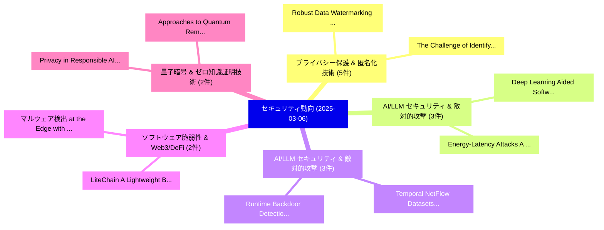

# 📅 02_daily: 日次エグゼクティブサマリー報告書 (2025-03-06)

**集計日時**: 2026-10-02 23:05:19 UTC  
**対象日付**: 2025-03-06  
**本日収集論文数**: 35 件  

---

## 💡 主要セキュリティ動向・脅威インサイト (Executive Insights)

本日の収集論文（計 35 件）において、以下の重点セキュリティ領域で活発な研究動向が確認されました：
- **プライバシー保護 & 匿名化技術** (5 件): 注目論文として 「Robust Data Watermarking in La...」、「The Challenge of Identifying t...」 等が発表され、実務防御および攻撃検証の進展が見られます。
- **AI/LLM セキュリティ & 敵対的攻撃** (3 件): 注目論文として 「Deep Learning Aided Software 脆...」、「Energy-Latency Attacks: A New ...」 等が発表され、実務防御および攻撃検証の進展が見られます。
- **AI/LLM セキュリティ & 敵対的攻撃** (3 件): 注目論文として 「Temporal NetFlow Datasets for ...」、「Runtime Backdoor Detection for...」 等が発表され、実務防御および攻撃検証の進展が見られます。
- **ソフトウェア脆弱性 & Web3/DeFi** (2 件): 注目論文として 「LiteChain: A Lightweight Block...」、「マルウェア検出 at the Edge with Light...」 等が発表され、実務防御および攻撃検証の進展が見られます。
- **量子暗号 & ゼロ知識証明技術** (2 件): 注目論文として 「Approaches to Quantum Remote M...」、「Privacy in Responsible AI: App...」 等が発表され、実務防御および攻撃検証の進展が見られます。

### 🗺️ 技術・脅威トピックマインドマップ

---

## 📌 日次セキュリティ論文一覧 (日本語表形式)

| No | arXiv ID | 論文タイトル (日本語訳) | 重要キーワード | 構造化エグゼクティブ要約 (背景・提案・影響) | 脅威分類 | 詳細リンク |
|---|---|---|---|---|---|---|
| 1 | `2503.03980v2` | [USBSnoop -- Revealing Device Activities via USB Congestions（セキュリティ分析論文）](../../okf/papers/2025-03-06/2503.03980.md) | `Revealing Device Activities`, `Davis Ranney`, `Yufei Wang` | 【提案】概要 (Overview & Key Finding) 本論文「USBSnoop -- Revealing Device Activities via USB Congest...。実証評価によりAdam Ding, Yunsi Fei - **... | `cs.CR` | [arXiv](https://arxiv.org/abs/2503.03980v2) &#124; [OKF](../../okf/papers/2025-03-06/2503.03980.md) |
| 2 | `2503.04002v1` | [Deep Learning Aided Software 脆弱性検出: A Survey](../../okf/papers/2025-03-06/2503.04002.md) | `Deep Learning Aided Software Vulnerability Detection`, `Deep Learning Aided Software`, `Md Nizam Uddin` | 【提案】概要 (Overview & Key Finding) 本論文「Deep Learning Aided Software 脆弱性検出: A Survey」（原題: Deep ...。実証評価により経営層・セキュリティ管理者向け推奨アクション (E... | `cs.CR` | [arXiv](https://arxiv.org/abs/2503.04002v1) &#124; [OKF](../../okf/papers/2025-03-06/2503.04002.md) |
| 3 | `2503.04036v3` | [Robust Data Watermarking in Language Models by Injecting Fictitious Knowledge（セキュリティ分析論文）](../../okf/papers/2025-03-06/2503.04036.md) | `Robust Data Watermarking`, `Injecting Fictitious Knowledge`, `Language Models` | 【提案】概要 (Overview & Key Finding) 本論文「Robust Data Watermarking in Language Models by Injectin...。実証評価により経営層・セキュリティ管理者向け推奨アクション (E... | `cs.CR` | [arXiv](https://arxiv.org/abs/2503.04036v3) &#124; [OKF](../../okf/papers/2025-03-06/2503.04036.md) |
| 4 | `2503.04054v1` | [Controlled privacy leakage propagation throughout overlapping grouped learning（セキュリティ分析論文）](../../okf/papers/2025-03-06/2503.04054.md) | `Shahrzad Kiani`, `Franziska Boenisch`, `Raw Meta` | 【提案】概要 (Overview & Key Finding) 本論文「Controlled privacy leakage propagation throughout overl...。実証評価により経営層・セキュリティ管理者向け推奨アクション (E... | `cs.CR` | [arXiv](https://arxiv.org/abs/2503.04054v1) &#124; [OKF](../../okf/papers/2025-03-06/2503.04054.md) |
| 5 | `2503.04140v1` | [LiteChain: A Lightweight Blockchain for Verifiable and Scalable 連合学習 in Massive Edge Networks](../../okf/papers/2025-03-06/2503.04140.md) | `Massive Edge Networks`, `Lightweight Blockchain`, `Scalable Federated Learning` | 【提案】概要 (Overview & Key Finding) 本論文「LiteChain: A Lightweight Blockchain for Verifiable and ...。実証評価により経営層・セキュリティ管理者向け推奨アクション (E... | `cs.CR` | [arXiv](https://arxiv.org/abs/2503.04140v1) &#124; [OKF](../../okf/papers/2025-03-06/2503.04140.md) |
| 6 | `2503.04174v2` | [UniNet: A Unified Multi-granular Traffic Modeling Framework for Network Security（セキュリティ分析論文）](../../okf/papers/2025-03-06/2503.04174.md) | `Unified Multi`, `Network Security`, `Multi-granular Traffic` | 【提案】概要 (Overview & Key Finding) 本論文「UniNet: A Unified Multi-granular Traffic Modeling Frame...。実証評価により経営層・セキュリティ管理者向け推奨アクション (E... | `cs.CR` | [arXiv](https://arxiv.org/abs/2503.04174v2) &#124; [OKF](../../okf/papers/2025-03-06/2503.04174.md) |
| 7 | `2503.04178v2` | [Unsupervised anomaly detection on サイバーセキュリティ data streams: a case with BETH dataset](../../okf/papers/2025-03-06/2503.04178.md) | `Evgeniy Eremin`, `Raw Meta`, `Executive Summary` | 【提案】概要 (Overview & Key Finding) 本論文「Unsupervised anomaly detection on サイバーセキュリティ data strea...。実証評価により経営層・セキュリティ管理者向け推奨アクション (E... | `cs.CR` | [arXiv](https://arxiv.org/abs/2503.04178v2) &#124; [OKF](../../okf/papers/2025-03-06/2503.04178.md) |
| 8 | `2503.04259v1` | [Qualitative In-Depth GDPR Data Subject Access Requests and Responses from Major Online Servicesの分析](../../okf/papers/2025-03-06/2503.04259.md) | `Data Subject Access Requests`, `Major Online`, `In-Depth GDPR` | 【提案】概要 (Overview & Key Finding) 本論文「Qualitative In-Depth GDPR Data Subject Access Requests ...。実証評価により経営層・セキュリティ管理者向け推奨アクション (E... | `cs.CR` | [arXiv](https://arxiv.org/abs/2503.04259v1) &#124; [OKF](../../okf/papers/2025-03-06/2503.04259.md) |
| 9 | `2503.04260v1` | [DTL: Data Tumbling Layer. A Composable Unlinkability for Smart Contracts（セキュリティ分析論文）](../../okf/papers/2025-03-06/2503.04260.md) | `Data Tumbling Layer`, `Composable Unlinkability`, `Smart Contracts` | 【提案】A Composable Unlinkability for スマートコントラクトs ### (日本語題名: DTL: Data Tumbling Layer. A Comp...。実証評価により経営層・セキュリティ管理者向け推奨アクション (E... | `cs.CR` | [arXiv](https://arxiv.org/abs/2503.04260v1) &#124; [OKF](../../okf/papers/2025-03-06/2503.04260.md) |
| 10 | `2503.04274v1` | [Got Ya! -- Sensors for Identity Management Specific Security Situational Awareness（セキュリティ分析論文）](../../okf/papers/2025-03-06/2503.04274.md) | `Identity Management Specific Security Situational Awareness`, `Got Ya`, `Raw Meta` | 【提案】-- Sensors for Identity Management Specific Security Situational Awareness（セキュリティ分析論文）)...。実証評価により経営層・セキュリティ管理者向け推奨アクション (E... | `cs.CR` | [arXiv](https://arxiv.org/abs/2503.04274v1) &#124; [OKF](../../okf/papers/2025-03-06/2503.04274.md) |
| 11 | `2503.04292v2` | [A Study on Malicious Browser Extensions in 2025（セキュリティ分析論文）](../../okf/papers/2025-03-06/2503.04292.md) | `Malicious Browser Extensions`, `Tarun Kumar Singh`, `Shreya Singh` | 【提案】概要 (Overview & Key Finding) 本論文「A Study on Malicious Browser Extensions in 2025（セキュリティ分...。実証評価により経営層・セキュリティ管理者向け推奨アクション (E... | `cs.CR` | [arXiv](https://arxiv.org/abs/2503.04292v2) &#124; [OKF](../../okf/papers/2025-03-06/2503.04292.md) |
| 12 | `2503.04293v1` | [No Silver Bullet: Demonstrating Secure Software Development for Danish Small and Medium Enterprises in a Business-to-Business Modelに向けて](../../okf/papers/2025-03-06/2503.04293.md) | `Danish Small`, `Medium Enterprises`, `Towards Demonstrating Secure Software Development` | 【提案】概要 (Overview & Key Finding) 本論文「No Silver Bullet: Demonstrating Secure Software Develop...。実証評価により経営層・セキュリティ管理者向け推奨アクション (E... | `cs.CR` | [arXiv](https://arxiv.org/abs/2503.04293v1) &#124; [OKF](../../okf/papers/2025-03-06/2503.04293.md) |
| 13 | `2503.04302v1` | [マルウェア検出 at the Edge with Lightweight LLMs: A Performance Evaluation](../../okf/papers/2025-03-06/2503.04302.md) | `Malware Detection`, `Christian Rondanini`, `Barbara Carminati` | 【提案】概要 (Overview & Key Finding) 本論文「マルウェア検出 at the Edge with Lightweight LLMs: A Performanc...。実証評価により経営層・セキュリティ管理者向け推奨アクション (E... | `cs.CR` | [arXiv](https://arxiv.org/abs/2503.04302v1) &#124; [OKF](../../okf/papers/2025-03-06/2503.04302.md) |
| 14 | `2503.04311v1` | [Approaches to Quantum Remote Memory Attestation（セキュリティ分析論文）](../../okf/papers/2025-03-06/2503.04311.md) | `Quantum Remote Memory Attestation`, `Rolando Trujillo Rasua`, `Jesse Laeuchli` | 【提案】概要 (Overview & Key Finding) 本論文「Approaches to 量子 Remote Memory Attestation（セキュリティ分析論文）」...。実証評価により経営層・セキュリティ管理者向け推奨アクション (E... | `cs.CR` | [arXiv](https://arxiv.org/abs/2503.04311v1) &#124; [OKF](../../okf/papers/2025-03-06/2503.04311.md) |
| 15 | `2503.04332v1` | [The Challenge of Identifying the Origin of Black-Box 大規模言語モデル](../../okf/papers/2025-03-06/2503.04332.md) | `Box Large Language Models`, `Black-Box Large`, `Ziqing Yang` | 【提案】概要 (Overview & Key Finding) 本論文「The Challenge of Identifying the Origin of Black-Box 大規...。実証評価により経営層・セキュリティ管理者向け推奨アクション (E... | `cs.CR` | [arXiv](https://arxiv.org/abs/2503.04332v1) &#124; [OKF](../../okf/papers/2025-03-06/2503.04332.md) |
| 16 | `2503.04404v2` | [Temporal NetFlow Datasets for Network Intrusion Detection Systemsの分析](../../okf/papers/2025-03-06/2503.04404.md) | `Network Intrusion Detection Systems`, `Network Intrusion Detection`, `Majed Luay` | 【提案】概要 (Overview & Key Finding) 本論文「Temporal NetFlow Datasets for Network Intrusion Detecti...。実証評価により経営層・セキュリティ管理者向け推奨アクション (E... | `cs.CR` | [arXiv](https://arxiv.org/abs/2503.04404v2) &#124; [OKF](../../okf/papers/2025-03-06/2503.04404.md) |
| 17 | `2503.04451v1` | [Privacy Preserving and Robust Aggregation for Cross-Silo 連合学習 in Non-IID Settings](../../okf/papers/2025-03-06/2503.04451.md) | `Privacy Preserving`, `Robust Aggregation`, `Non-IID Settings` | 【提案】概要 (Overview & Key Finding) 本論文「Privacy Preserving and Robust Aggregation for Cross-Sil...。実証評価により経営層・セキュリティ管理者向け推奨アクション (E... | `cs.CR` | [arXiv](https://arxiv.org/abs/2503.04451v1) &#124; [OKF](../../okf/papers/2025-03-06/2503.04451.md) |
| 18 | `2503.04473v1` | [Runtime Backdoor Detection for 連合学習 via Representational Dissimilarity Analysis](../../okf/papers/2025-03-06/2503.04473.md) | `Runtime Backdoor Detection`, `Federated Learning`, `Xiyue Zhang` | 【提案】概要 (Overview & Key Finding) 本論文「Runtime Backdoor Detection for 連合学習 via Representationa...。実証評価により経営層・セキュリティ管理者向け推奨アクション (E... | `cs.CR` | [arXiv](https://arxiv.org/abs/2503.04473v1) &#124; [OKF](../../okf/papers/2025-03-06/2503.04473.md) |
| 19 | `2503.04474v1` | [Know Thy Judge: On the Robustness Meta-Evaluation of LLM Safety Judges（セキュリティ分析論文）](../../okf/papers/2025-03-06/2503.04474.md) | `Know Thy Judge`, `Robustness Meta`, `Safety Judges` | 【提案】概要 (Overview & Key Finding) 本論文「Know Thy Judge: On the Robustness Meta-Evaluation of LL...。実証評価により# Know Thy Judge: On the ... | `cs.CR` | [arXiv](https://arxiv.org/abs/2503.04474v1) &#124; [OKF](../../okf/papers/2025-03-06/2503.04474.md) |
| 20 | `2503.04549v1` | [Lite-PoT: Practical Powers-of-Tau Setup Ceremony（セキュリティ分析論文）](../../okf/papers/2025-03-06/2503.04549.md) | `Tau Setup Ceremony`, `Practical Powers`, `Pedro Moreno` | 【提案】概要 (Overview & Key Finding) 本論文「Lite-PoT: Practical Powers-of-Tau Setup Ceremony（セキュリティ...。実証評価によりLe - **公開日時**:。 | `cs.CR` | [arXiv](https://arxiv.org/abs/2503.04549v1) &#124; [OKF](../../okf/papers/2025-03-06/2503.04549.md) |
| 21 | `2503.04555v1` | [Cryptoa tropical triad matrix semiring key exchange protocolの分析](../../okf/papers/2025-03-06/2503.04555.md) | `Alvaro Otero Sanchez`, `Raw Meta`, `Executive Summary` | 【提案】概要 (Overview & Key Finding) 本論文「Cryptoa tropical triad matrix semiring key exchange pro...。実証評価により経営層・セキュリティ管理者向け推奨アクション (E... | `cs.CR` | [arXiv](https://arxiv.org/abs/2503.04555v1) &#124; [OKF](../../okf/papers/2025-03-06/2503.04555.md) |
| 22 | `2503.04564v6` | [Fundamental Limits of Hierarchical Secure Aggregation with Cyclic User Association（セキュリティ分析論文）](../../okf/papers/2025-03-06/2503.04564.md) | `Hierarchical Secure Aggregation`, `Cyclic User Association`, `Fundamental Limits` | 【提案】概要 (Overview & Key Finding) 本論文「Fundamental Limits of Hierarchical Secure Aggregation w...。実証評価により経営層・セキュリティ管理者向け推奨アクション (E... | `cs.CR` | [arXiv](https://arxiv.org/abs/2503.04564v6) &#124; [OKF](../../okf/papers/2025-03-06/2503.04564.md) |
| 23 | `2503.04636v2` | [Mark Your LLM: Detecting the Misuse of Open-Source 大規模言語モデル via Watermarking](../../okf/papers/2025-03-06/2503.04636.md) | `Source Large Language Models`, `Open-Source Large`, `Yijie Xu` | 【提案】概要 (Overview & Key Finding) 本論文「Mark Your LLM: Detecting the Misuse of Open-Source 大規模言...。実証評価により経営層・セキュリティ管理者向け推奨アクション (E... | `cs.CR` | [arXiv](https://arxiv.org/abs/2503.04636v2) &#124; [OKF](../../okf/papers/2025-03-06/2503.04636.md) |
| 24 | `2503.04652v1` | [Evaluation of Privacy-aware Support Vector Machine (SVM) Learning using Homomorphic Encryption（セキュリティ分析論文）](../../okf/papers/2025-03-06/2503.04652.md) | `Support Vector Machine`, `Privacy-aware Support`, `Homomorphic Encryption` | 【提案】概要 (Overview & Key Finding) 本論文「Evaluation of Privacy-aware Support Vector Machine (SVM...。実証評価により経営層・セキュリティ管理者向け推奨アクション (E... | `cs.CR` | [arXiv](https://arxiv.org/abs/2503.04652v1) &#124; [OKF](../../okf/papers/2025-03-06/2503.04652.md) |
| 25 | `2503.04850v3` | [Slow is Fast! Dissecting Ethereum's Slow Liquidity Drain Scams（セキュリティ分析論文）](../../okf/papers/2025-03-06/2503.04850.md) | `Slow Liquidity Drain Scams`, `Dissecting Ethereum`, `Minh Trung Tran` | 【提案】Dissecting Ethereum's Slow Liquidity Drain Scams ### (日本語題名: Slow is Fast!。実証評価により経営層・セキュリティ管理者向け推奨アクション (Executive Recomme... | `cs.CR` | [arXiv](https://arxiv.org/abs/2503.04850v3) &#124; [OKF](../../okf/papers/2025-03-06/2503.04850.md) |
| 26 | `2503.04853v1` | [From Pixels to Trajectory: Universal Adversarial Example Detection via Temporal Imprints（セキュリティ分析論文）](../../okf/papers/2025-03-06/2503.04853.md) | `Universal Adversarial Example Detection`, `Temporal Imprints`, `Yansong Gao` | 【提案】概要 (Overview & Key Finding) 本論文「From Pixels to Trajectory: Universal 敵対的サンプル Detection ...。実証評価により経営層・セキュリティ管理者向け推奨アクション (E... | `cs.CR` | [arXiv](https://arxiv.org/abs/2503.04853v1) &#124; [OKF](../../okf/papers/2025-03-06/2503.04853.md) |
| 27 | `2503.04866v1` | [Privacy in Responsible AI: Approaches to Facial Recognition from Cloud Providers（セキュリティ分析論文）](../../okf/papers/2025-03-06/2503.04866.md) | `Facial Recognition`, `Cloud Providers`, `Anna Elivanova` | 【提案】概要 (Overview & Key Finding) 本論文「Privacy in Responsible AI: Approaches to Facial Recogni...。実証評価により経営層・セキュリティ管理者向け推奨アクション (E... | `cs.CR` | [arXiv](https://arxiv.org/abs/2503.04866v1) &#124; [OKF](../../okf/papers/2025-03-06/2503.04866.md) |
| 28 | `2503.04867v2` | [Security and Real-time FPGA integration for Learned Image Compression（セキュリティ分析論文）](../../okf/papers/2025-03-06/2503.04867.md) | `Learned Image Compression`, `Real-time FPGA`, `Carl De Sousa Tria` | 【提案】概要 (Overview & Key Finding) 本論文「Security and Real-time FPGA integration for Learned Ima...。実証評価により経営層・セキュリティ管理者向け推奨アクション (E... | `cs.CR` | [arXiv](https://arxiv.org/abs/2503.04867v2) &#124; [OKF](../../okf/papers/2025-03-06/2503.04867.md) |
| 29 | `2503.04954v1` | [Security-Aware Sensor Fusion with MATE: the Multi-Agent Trust Estimator（セキュリティ分析論文）](../../okf/papers/2025-03-06/2503.04954.md) | `Aware Sensor Fusion`, `Agent Trust Estimator`, `Security-Aware Sensor` | 【提案】概要 (Overview & Key Finding) 本論文「Security-Aware Sensor Fusion with MATE: the Multi-Agent...。実証評価によりSpencer Hallyb。 | `cs.CR` | [arXiv](https://arxiv.org/abs/2503.04954v1) &#124; [OKF](../../okf/papers/2025-03-06/2503.04954.md) |
| 30 | `2503.04963v1` | [Energy-Latency Attacks: A New Adversarial Threat to Deep Learning（セキュリティ分析論文）](../../okf/papers/2025-03-06/2503.04963.md) | `New Adversarial Threat`, `Latency Attacks`, `Deep Learning` | 【提案】概要 (Overview & Key Finding) 本論文「Energy-Latency Attacks: A New Adversarial 脅威 to Deep Le...。実証評価によりBrachemi Meftah,。 | `cs.CR` | [arXiv](https://arxiv.org/abs/2503.04963v1) &#124; [OKF](../../okf/papers/2025-03-06/2503.04963.md) |
| 31 | `2503.04980v1` | [A Consensus Privacy Metrics Framework for Synthetic Data（セキュリティ分析論文）](../../okf/papers/2025-03-06/2503.04980.md) | `Synthetic Data`, `Jean Louis Raisaro`, `Khaled El Emam` | 【提案】概要 (Overview & Key Finding) 本論文「A Consensus Privacy Metrics Framework for Synthetic Dat...。実証評価によりDankar, Jorg Drechsler, M... | `cs.CR` | [arXiv](https://arxiv.org/abs/2503.04980v1) &#124; [OKF](../../okf/papers/2025-03-06/2503.04980.md) |
| 32 | `2503.05021v2` | [Safety is Not Only About Refusal: Reasoning-Enhanced Fine-tuning for Interpretable LLM Safety（セキュリティ分析論文）](../../okf/papers/2025-03-06/2503.05021.md) | `Enhanced Fine`, `Reasoning-Enhanced Fine`, `Yuyou Zhang` | 【提案】背景とセキュリティ上の課題 (Background & Problem) 本研究はサイバー脅威環境におけるセキュリティ構造・脆弱性の検証を目的としています。(主要検出項目: ...。実証評価により経営層・セキュリティ管理者向け推奨アクション (E... | `cs.CR` | [arXiv](https://arxiv.org/abs/2503.05021v2) &#124; [OKF](../../okf/papers/2025-03-06/2503.05021.md) |
| 33 | `2503.05045v1` | [Semi-Quantum Conference Key Agreement with GHZ-type states（セキュリティ分析論文）](../../okf/papers/2025-03-06/2503.05045.md) | `Quantum Conference Key Agreement`, `Semi-Quantum Conference`, `GHZ-type states` | 【提案】概要 (Overview & Key Finding) 本論文「Semi-量子 Conference Key Agreement with GHZ-type states（セ...。実証評価によりKrawec, Paulo Mateus, Nik... | `cs.CR` | [arXiv](https://arxiv.org/abs/2503.05045v1) &#124; [OKF](../../okf/papers/2025-03-06/2503.05045.md) |
| 34 | `2503.05839v2` | [Enhancing AUTOSAR-Based Firmware Over-the-Air Updates in the Automotive Industry with a Practical Implementation on a Steering System（セキュリティ分析論文）](../../okf/papers/2025-03-06/2503.05839.md) | `Air Updates`, `Automotive Industry`, `Practical Implementation` | 【提案】概要 (Overview & Key Finding) 本論文「Enhancing AUTOSAR-Based Firmware Over-the-Air Updates i...。実証評価により経営層・セキュリティ管理者向け推奨アクション (E... | `cs.CR` | [arXiv](https://arxiv.org/abs/2503.05839v2) &#124; [OKF](../../okf/papers/2025-03-06/2503.05839.md) |
| 35 | `2503.07483v1` | [Poisoning Attacks to Local Differential Privacy Protocols for Trajectory Data（セキュリティ分析論文）](../../okf/papers/2025-03-06/2503.07483.md) | `Local Differential Privacy Protocols`, `Poisoning Attacks`, `Trajectory Data` | 【提案】概要 (Overview & Key Finding) 本論文「Poisoning Attacks to Local 差分プライバシー Protocols for Traje...。実証評価により経営層・セキュリティ管理者向け推奨アクション (E... | `cs.CR` | [arXiv](https://arxiv.org/abs/2503.07483v1) &#124; [OKF](../../okf/papers/2025-03-06/2503.07483.md) |

