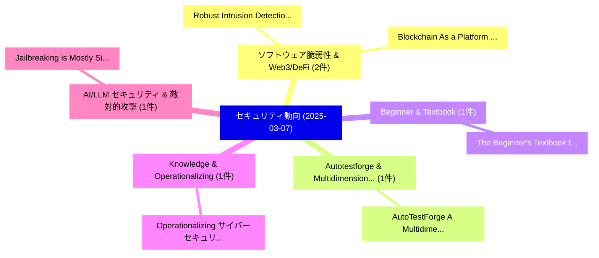

# 📅 02_daily: 日次エグゼクティブサマリー報告書 (2025-03-07)

**集計日時**: 2026-10-02 23:05:19 UTC  
**対象日付**: 2025-03-07  
**本日収集論文数**: 13 件  

---

## 💡 主要セキュリティ動向・脅威インサイト (Executive Insights)

本日の収集論文（計 13 件）において、以下の重点セキュリティ領域で活発な研究動向が確認されました：
- **ソフトウェア脆弱性 & Web3/DeFi** (2 件): 注目論文として 「Robust Intrusion Detection Sys...」、「Blockchain As a Platform For A...」 等が発表され、実務防御および攻撃検証の進展が見られます。
- **Autotestforge & Multidimensional** (1 件): 注目論文として 「AutoTestForge: A Multidimensio...」 等が発表され、実務防御および攻撃検証の進展が見られます。
- **Beginner & Textbook** (1 件): 注目論文として 「The Beginner's Textbook for Fu...」 等が発表され、実務防御および攻撃検証の進展が見られます。
- **Knowledge & Operationalizing** (1 件): 注目論文として 「Operationalizing サイバーセキュリティ Kn...」 等が発表され、実務防御および攻撃検証の進展が見られます。
- **AI/LLM セキュリティ & 敵対的攻撃** (1 件): 注目論文として 「Jailbreaking is (Mostly) Simpl...」 等が発表され、実務防御および攻撃検証の進展が見られます。

### 🗺️ 技術・脅威トピックマインドマップ

---

## 📌 日次セキュリティ論文一覧 (日本語表形式)

| No | arXiv ID | 論文タイトル (日本語訳) | 重要キーワード | 構造化エグゼクティブ要約 (背景・提案・影響) | 脅威分類 | 詳細リンク |
|---|---|---|---|---|---|---|
| 1 | `2503.05102v1` | [AutoTestForge: A Multidimensional Automated Testing Framework for Natural Language Processing Models（セキュリティ分析論文）](../../okf/papers/2025-03-07/2503.05102.md) | `Natural Language Processing Models`, `Hengrui Xing`, `Cong Tian` | 【提案】概要 (Overview & Key Finding) 本論文「AutoTestForge: A Multidimensional Automated Testing Fra...。実証評価により経営層・セキュリティ管理者向け推奨アクション (E... | `cs.CR` | [arXiv](https://arxiv.org/abs/2503.05102v1) &#124; [OKF](../../okf/papers/2025-03-07/2503.05102.md) |
| 2 | `2503.05136v26` | [The Beginner's Textbook for Fully Homomorphic Encryption（セキュリティ分析論文）](../../okf/papers/2025-03-07/2503.05136.md) | `Fully Homomorphic Encryption`, `Ronny Ko`, `Raw Meta` | 【提案】概要 (Overview & Key Finding) 本論文「The Beginner's Textbook for Fully 準同型暗号（セキュリティ分析論文）」（原題...。実証評価により経営層・セキュリティ管理者向け推奨アクション (E... | `cs.CR` | [arXiv](https://arxiv.org/abs/2503.05136v26) &#124; [OKF](../../okf/papers/2025-03-07/2503.05136.md) |
| 3 | `2503.05206v2` | [Operationalizing サイバーセキュリティ Knowledge: Design, Implementation & Evaluation of a Knowledge Management System for CACAO Playbooks](../../okf/papers/2025-03-07/2503.05206.md) | `Knowledge Management System`, `Operationalizing Cybersecurity Knowledge`, `Orestis Tsirakis` | 【提案】概要 (Overview & Key Finding) 本論文「Operationalizing サイバーセキュリティ Knowledge: Design, Implemen...。実証評価により経営層・セキュリティ管理者向け推奨アクション (E... | `cs.CR` | [arXiv](https://arxiv.org/abs/2503.05206v2) &#124; [OKF](../../okf/papers/2025-03-07/2503.05206.md) |
| 4 | `2503.05264v1` | [Jailbreaking is (Mostly) Simpler Than You Think（セキュリティ分析論文）](../../okf/papers/2025-03-07/2503.05264.md) | `Mark Russinovich`, `Ahmed Salem`, `Raw Meta` | 【提案】概要 (Overview & Key Finding) 本論文「ジェイルブレイクing is (Mostly) Simpler Than You Think（セキュリティ分析...。実証評価により経営層・セキュリティ管理者向け推奨アクション (E... | `cs.CR` | [arXiv](https://arxiv.org/abs/2503.05264v1) &#124; [OKF](../../okf/papers/2025-03-07/2503.05264.md) |
| 5 | `2503.05303v1` | [Robust Intrusion Detection System with Explainable Artificial Intelligence（セキュリティ分析論文）](../../okf/papers/2025-03-07/2503.05303.md) | `Robust Intrusion Detection System`, `Explainable Artificial Intelligence`, `Rim El Malki` | 【提案】概要 (Overview & Key Finding) 本論文「Robust Intrusion Detection System with Explainable Arti...。実証評価により経営層・セキュリティ管理者向け推奨アクション (E... | `cs.CR` | [arXiv](https://arxiv.org/abs/2503.05303v1) &#124; [OKF](../../okf/papers/2025-03-07/2503.05303.md) |
| 6 | `2503.05376v1` | [Femur: A Flexible Framework for Fast and Secure Querying from Public Key-Value Store（セキュリティ分析論文）](../../okf/papers/2025-03-07/2503.05376.md) | `Secure Querying`, `Public Key`, `Value Store` | 【提案】概要 (Overview & Key Finding) 本論文「Femur: A Flexible Framework for Fast and Secure Queryin...。実証評価により経営層・セキュリティ管理者向け推奨アクション (E... | `cs.CR` | [arXiv](https://arxiv.org/abs/2503.05376v1) &#124; [OKF](../../okf/papers/2025-03-07/2503.05376.md) |
| 7 | `2503.05430v1` | [Cybersafety Card Game: Empowering Digital Educators to Teach Cybersafety to Older Adults（セキュリティ分析論文）](../../okf/papers/2025-03-07/2503.05430.md) | `Cybersafety Card Game`, `Empowering Digital Educators`, `Teach Cybersafety` | 【提案】概要 (Overview & Key Finding) 本論文「Cybersafety Card Game: Empowering Digital Educators to ...。実証評価により経営層・セキュリティ管理者向け推奨アクション (E... | `cs.CR` | [arXiv](https://arxiv.org/abs/2503.05430v1) &#124; [OKF](../../okf/papers/2025-03-07/2503.05430.md) |
| 8 | `2503.05445v3` | [Are Your LLM-based Text-to-SQL Models Secure? Exploring SQL Injection via Backdoor Attacks（セキュリティ分析論文）](../../okf/papers/2025-03-07/2503.05445.md) | `Models Secure`, `LLM-based Text`, `to-SQL Models` | 【提案】Exploring SQL Injection via Backdoor Attacks ### (日本語題名: Are Your LLM-based Text-to-SQL...。実証評価により経営層・セキュリティ管理者向け推奨アクション (E... | `cs.CR` | [arXiv](https://arxiv.org/abs/2503.05445v3) &#124; [OKF](../../okf/papers/2025-03-07/2503.05445.md) |
| 9 | `2503.05477v1` | [Enhancing Network Security: A Hybrid Approach for Detection and Mitigation of Distributed Denial-of-Service Attacks Using Machine Learning（セキュリティ分析論文）](../../okf/papers/2025-03-07/2503.05477.md) | `Service Attacks Using Machine Learning`, `Enhancing Network Security`, `Distributed Denial` | 【提案】概要 (Overview & Key Finding) 本論文「Enhancing Network Security: A Hybrid Approach for Detec...。実証評価により経営層・セキュリティ管理者向け推奨アクション (E... | `cs.CR` | [arXiv](https://arxiv.org/abs/2503.05477v1) &#124; [OKF](../../okf/papers/2025-03-07/2503.05477.md) |
| 10 | `2503.05482v1` | [Bridging the Semantic Gap in Virtual Machine Introspection and Forensic Memory Analysis（セキュリティ分析論文）](../../okf/papers/2025-03-07/2503.05482.md) | `Virtual Machine Introspection`, `Semantic Gap`, `Christofer Fellicious` | 【提案】概要 (Overview & Key Finding) 本論文「Bridging the Semantic Gap in Virtual Machine Introspect...。実証評価により経営層・セキュリティ管理者向け推奨アクション (E... | `cs.CR` | [arXiv](https://arxiv.org/abs/2503.05482v1) &#124; [OKF](../../okf/papers/2025-03-07/2503.05482.md) |
| 11 | `2503.05528v1` | [Improved Two-source Extractors against Quantum Side Information（セキュリティ分析論文）](../../okf/papers/2025-03-07/2503.05528.md) | `Quantum Side Information`, `Improved Two`, `Two-source Extractors` | 【提案】概要 (Overview & Key Finding) 本論文「Improved Two-source Extractors against 量子 Side Informat...。実証評価により経営層・セキュリティ管理者向け推奨アクション (E... | `cs.CR` | [arXiv](https://arxiv.org/abs/2503.05528v1) &#124; [OKF](../../okf/papers/2025-03-07/2503.05528.md) |
| 12 | `2503.05850v1` | [Encrypted Vector Similarity Computations Using Partially Homomorphic Encryption: Applications and Performance Analysis（セキュリティ分析論文）](../../okf/papers/2025-03-07/2503.05850.md) | `Encrypted Vector Similarity Computations Using Partially Homomorphic Encryption`, `Encrypted Vector Similarity Com`, `Sefik Serengil` | 【提案】概要 (Overview & Key Finding) 本論文「Encrypted Vector Similarity Computations Using Partiall...。実証評価により経営層・セキュリティ管理者向け推奨アクション (E... | `cs.CR` | [arXiv](https://arxiv.org/abs/2503.05850v1) &#124; [OKF](../../okf/papers/2025-03-07/2503.05850.md) |
| 13 | `2503.08699v1` | [Blockchain As a Platform For Artificial Intelligence (AI) Transparency（セキュリティ分析論文）](../../okf/papers/2025-03-07/2503.08699.md) | `Abdullah Al Adnan`, `Afroja Akther`, `Ayesha Arobee` | 【提案】概要 (Overview & Key Finding) 本論文「Blockchain As a Platform For Artificial Intelligence (A...。実証評価により経営層・セキュリティ管理者向け推奨アクション (E... | `cs.CR` | [arXiv](https://arxiv.org/abs/2503.08699v1) &#124; [OKF](../../okf/papers/2025-03-07/2503.08699.md) |

