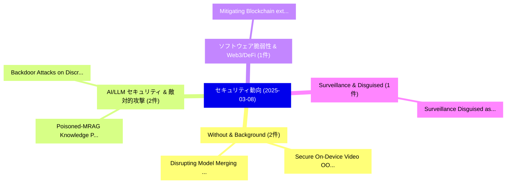

# 📅 02_daily: 日次エグゼクティブサマリー報告書 (2025-03-08)

**集計日時**: 2026-10-02 23:05:19 UTC  
**対象日付**: 2025-03-08  
**本日収集論文数**: 6 件  

---

## 💡 主要セキュリティ動向・脅威インサイト (Executive Insights)

本日の収集論文（計 6 件）において、以下の重点セキュリティ領域で活発な研究動向が確認されました：
- **Without & Background** (2 件): 注目論文として 「Secure On-Device Video OOD Det...」、「Disrupting Model Merging: A Pa...」 等が発表され、実務防御および攻撃検証の進展が見られます。
- **AI/LLM セキュリティ & 敵対的攻撃** (2 件): 注目論文として 「Poisoned-MRAG: Knowledge Poiso...」、「Backdoor Attacks on Discrete G...」 等が発表され、実務防御および攻撃検証の進展が見られます。
- **ソフトウェア脆弱性 & Web3/DeFi** (1 件): 注目論文として 「Mitigating Blockchain extracta...」 等が発表され、実務防御および攻撃検証の進展が見られます。
- **Surveillance & Disguised** (1 件): 注目論文として 「Surveillance Disguised as Prot...」 等が発表され、実務防御および攻撃検証の進展が見られます。

### 🗺️ 技術・脅威トピックマインドマップ

---

## 📌 日次セキュリティ論文一覧 (日本語表形式)

| No | arXiv ID | 論文タイトル (日本語訳) | 重要キーワード | 構造化エグゼクティブ要約 (背景・提案・影響) | 脅威分類 | 詳細リンク |
|---|---|---|---|---|---|---|
| 1 | `2503.06166v2` | [Secure On-Device Video OOD Detection Without Backpropagation（セキュリティ分析論文）](../../okf/papers/2025-03-08/2503.06166.md) | `Detection Without Backpropagation`, `Device Video`, `On-Device Video` | 【提案】背景とセキュリティ上の課題 (Background & Problem) 本研究はサイバー脅威環境におけるセキュリティ構造・脆弱性の検証を目的としています。(主要検出項目: ...。実証評価により経営層・セキュリティ管理者向け推奨アクション (E... | `cs.CR` | [arXiv](https://arxiv.org/abs/2503.06166v2) &#124; [OKF](../../okf/papers/2025-03-08/2503.06166.md) |
| 2 | `2503.06254v2` | [Poisoned-MRAG: Knowledge Poisoning Attacks to Multimodal Retrieval Augmented Generation（セキュリティ分析論文）](../../okf/papers/2025-03-08/2503.06254.md) | `Multimodal Retrieval Augmented Generation`, `Knowledge Poisoning Attacks`, `Neil Zhenqiang Gong` | 【提案】概要 (Overview & Key Finding) 本論文「Poisoned-MRAG: Knowledge Poisoning Attacks to Multimoda...。実証評価により経営層・セキュリティ管理者向け推奨アクション (E... | `cs.CR` | [arXiv](https://arxiv.org/abs/2503.06254v2) &#124; [OKF](../../okf/papers/2025-03-08/2503.06254.md) |
| 3 | `2503.06279v1` | [Mitigating Blockchain extractable value (BEV) threats by Distributed Transaction Sequencing in Blockchains（セキュリティ分析論文）](../../okf/papers/2025-03-08/2503.06279.md) | `Distributed Transaction Sequencing`, `Mitigating Blockchain`, `Xiongfei Zhao` | 【提案】概要 (Overview & Key Finding) 本論文「Mitigating Blockchain extractable value (BEV) threats b...。実証評価により経営層・セキュリティ管理者向け推奨アクション (E... | `cs.CR` | [arXiv](https://arxiv.org/abs/2503.06279v1) &#124; [OKF](../../okf/papers/2025-03-08/2503.06279.md) |
| 4 | `2503.06340v1` | [Backdoor Attacks on Discrete Graph Diffusion Models（セキュリティ分析論文）](../../okf/papers/2025-03-08/2503.06340.md) | `Discrete Graph Diffusion Models`, `Backdoor Attacks`, `Jiawen Wang` | 【提案】概要 (Overview & Key Finding) 本論文「Backdoor Attacks on Discrete Graph Diffusion Models（セキュ...。実証評価により経営層・セキュリティ管理者向け推奨アクション (E... | `cs.CR` | [arXiv](https://arxiv.org/abs/2503.06340v1) &#124; [OKF](../../okf/papers/2025-03-08/2503.06340.md) |
| 5 | `2503.07661v2` | [Disrupting Model Merging: A Parameter-Level Defense Without Sacrificing Accuracy（セキュリティ分析論文）](../../okf/papers/2025-03-08/2503.07661.md) | `Level Defense Without Sacrificing Accuracy`, `Disrupting Model Merging`, `Parameter-Level Defense` | 【提案】背景とセキュリティ上の課題 (Background & Problem) 本研究はサイバー脅威環境におけるセキュリティ構造・脆弱性の検証を目的としています。(主要検出項目: ...。実証評価により経営層・セキュリティ管理者向け推奨アクション (E... | `cs.CR` | [arXiv](https://arxiv.org/abs/2503.07661v2) &#124; [OKF](../../okf/papers/2025-03-08/2503.07661.md) |
| 6 | `2504.16087v1` | [Surveillance Disguised as Protection: A Comparative Sideloaded and In-Store Parental Control Appsの分析](../../okf/papers/2025-03-08/2504.16087.md) | `Surveillance Disguised`, `In-Store Parental`, `Store Parental Control` | 【提案】概要 (Overview & Key Finding) 本論文「Surveillance Disguised as Protection: A Comparative Sid...。実証評価により経営層・セキュリティ管理者向け推奨アクション (E... | `cs.CR` | [arXiv](https://arxiv.org/abs/2504.16087v1) &#124; [OKF](../../okf/papers/2025-03-08/2504.16087.md) |

