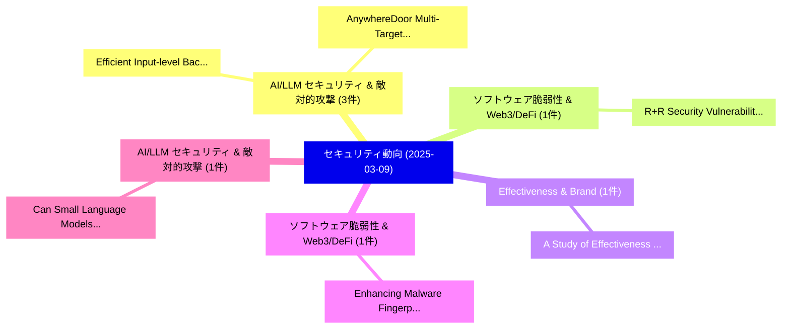

# 📅 02_daily: 日次エグゼクティブサマリー報告書 (2025-03-09)

**集計日時**: 2026-10-02 23:05:19 UTC  
**対象日付**: 2025-03-09  
**本日収集論文数**: 10 件  

---

## 💡 主要セキュリティ動向・脅威インサイト (Executive Insights)

本日の収集論文（計 10 件）において、以下の重点セキュリティ領域で活発な研究動向が確認されました：
- **AI/LLM セキュリティ & 敵対的攻撃** (3 件): 注目論文として 「Efficient Input-level Backdoor...」、「AnywhereDoor: Multi-Target Bac...」 等が発表され、実務防御および攻撃検証の進展が見られます。
- **ソフトウェア脆弱性 & Web3/DeFi** (1 件): 注目論文として 「R+R: Security Vulnerability Da...」 等が発表され、実務防御および攻撃検証の進展が見られます。
- **Effectiveness & Brand** (1 件): 注目論文として 「A Study of Effectiveness of Br...」 等が発表され、実務防御および攻撃検証の進展が見られます。
- **ソフトウェア脆弱性 & Web3/DeFi** (1 件): 注目論文として 「Enhancing Malware Fingerprinti...」 等が発表され、実務防御および攻撃検証の進展が見られます。
- **AI/LLM セキュリティ & 敵対的攻撃** (1 件): 注目論文として 「Can Small Language Models Reli...」 等が発表され、実務防御および攻撃検証の進展が見られます。

### 🗺️ 技術・脅威トピックマインドマップ

---

## 📌 日次セキュリティ論文一覧 (日本語表形式)

| No | arXiv ID | 論文タイトル (日本語訳) | 重要キーワード | 構造化エグゼクティブ要約 (背景・提案・影響) | 脅威分類 | 詳細リンク |
|---|---|---|---|---|---|---|
| 1 | `2503.06387v1` | [R+R: Security Vulnerability Dataset Quality Is Critical（セキュリティ分析論文）](../../okf/papers/2025-03-09/2503.06387.md) | `Anurag Swarnim Yadav`, `Raw Meta`, `Executive Summary` | 【提案】概要 (Overview & Key Finding) 本論文「R+R: Security 脆弱性 Dataset Quality Is Critical（セキュリティ分析論...。実証評価によりWilson - **公開日時**: `2025-... | `cs.CR` | [arXiv](https://arxiv.org/abs/2503.06387v1) &#124; [OKF](../../okf/papers/2025-03-09/2503.06387.md) |
| 2 | `2503.06453v2` | [Efficient Input-level Backdoor Defense on Text-to-Image Synthesis via Neuron Activation Variation（セキュリティ分析論文）](../../okf/papers/2025-03-09/2503.06453.md) | `Neuron Activation Variation`, `Efficient Input`, `Backdoor Defense` | 【提案】概要 (Overview & Key Finding) 本論文「Efficient Input-level Backdoor Defense on Text-to-Image...。実証評価により経営層・セキュリティ管理者向け推奨アクション (E... | `cs.CR` | [arXiv](https://arxiv.org/abs/2503.06453v2) &#124; [OKF](../../okf/papers/2025-03-09/2503.06453.md) |
| 3 | `2503.06487v1` | [A Study of Effectiveness of Brand Domain Identification Features for Phishing Detection in 2025（セキュリティ分析論文）](../../okf/papers/2025-03-09/2503.06487.md) | `Brand Domain Identification Features`, `Phishing Detection`, `Brand Domain Identification Fe` | 【提案】概要 (Overview & Key Finding) 本論文「A Study of Effectiveness of Brand Domain Identification...。実証評価により経営層・セキュリティ管理者向け推奨アクション (E... | `cs.CR` | [arXiv](https://arxiv.org/abs/2503.06487v1) &#124; [OKF](../../okf/papers/2025-03-09/2503.06487.md) |
| 4 | `2503.06495v1` | [Enhancing Malware Fingerprinting through Evasive Techniquesの分析](../../okf/papers/2025-03-09/2503.06495.md) | `Enhancing Malware Fingerprinting`, `Evasive Techniques`, `Mohamed Ali Kaafar` | 【提案】概要 (Overview & Key Finding) 本論文「Enhancing マルウェア Fingerprinting through Evasive Techniqu...。実証評価により経営層・セキュリティ管理者向け推奨アクション (E... | `cs.CR` | [arXiv](https://arxiv.org/abs/2503.06495v1) &#124; [OKF](../../okf/papers/2025-03-09/2503.06495.md) |
| 5 | `2503.06519v2` | [Can Small Language Models Reliably Resist Jailbreak Attacks? A Comprehensive Evaluation（セキュリティ分析論文）](../../okf/papers/2025-03-09/2503.06519.md) | `Can Small Language Models Reliably Resist Jailbreak Attacks`, `Can Small Language Models Reli`, `Zhibo Wang` | 【提案】A Comprehensive Evaluation ### (日本語題名: Can Small Language Models Reliably Resist ジェイルブレ...。実証評価により経営層・セキュリティ管理者向け推奨アクション (E... | `cs.CR` | [arXiv](https://arxiv.org/abs/2503.06519v2) &#124; [OKF](../../okf/papers/2025-03-09/2503.06519.md) |
| 6 | `2503.06529v2` | [AnywhereDoor: Multi-Target Backdoor Attacks on Object Detection（セキュリティ分析論文）](../../okf/papers/2025-03-09/2503.06529.md) | `Target Backdoor Attacks`, `Object Detection`, `Multi-Target Backdoor` | 【提案】概要 (Overview & Key Finding) 本論文「AnywhereDoor: Multi-Target Backdoor Attacks on Object D...。実証評価により経営層・セキュリティ管理者向け推奨アクション (E... | `cs.CR` | [arXiv](https://arxiv.org/abs/2503.06529v2) &#124; [OKF](../../okf/papers/2025-03-09/2503.06529.md) |
| 7 | `2503.06554v2` | [BDPFL: Backdoor Defense for Personalized 連合学習 via Explainable Distillation](../../okf/papers/2025-03-09/2503.06554.md) | `Backdoor Defense`, `Explainable Distillation`, `Personalized Federated Learning` | 【提案】概要 (Overview & Key Finding) 本論文「BDPFL: Backdoor Defense for Personalized 連合学習 via Expla...。実証評価により経営層・セキュリティ管理者向け推奨アクション (E... | `cs.CR` | [arXiv](https://arxiv.org/abs/2503.06554v2) &#124; [OKF](../../okf/papers/2025-03-09/2503.06554.md) |
| 8 | `2503.06785v1` | [Key Establishment in the Space Environment（セキュリティ分析論文）](../../okf/papers/2025-03-09/2503.06785.md) | `Key Establishment`, `Space Environment`, `Benjamin Dowling` | 【提案】概要 (Overview & Key Finding) 本論文「Key Establishment in the Space Environment（セキュリティ分析論文）」...。実証評価により経営層・セキュリティ管理者向け推奨アクション (E... | `cs.CR` | [arXiv](https://arxiv.org/abs/2503.06785v1) &#124; [OKF](../../okf/papers/2025-03-09/2503.06785.md) |
| 9 | `2503.06808v1` | [Privacy Auditing of 大規模言語モデル](../../okf/papers/2025-03-09/2503.06808.md) | `Privacy Auditing`, `Large Language Models`, `Ashwinee Panda` | 【提案】概要 (Overview & Key Finding) 本論文「Privacy Auditing of 大規模言語モデル」（原題: Privacy Auditing of L...。実証評価によりChoquette-Choo, Prateek M... | `cs.CR` | [arXiv](https://arxiv.org/abs/2503.06808v1) &#124; [OKF](../../okf/papers/2025-03-09/2503.06808.md) |
| 10 | `2503.08704v1` | [Life-Cycle Routing Vulnerabilities of LLM Router（セキュリティ分析論文）](../../okf/papers/2025-03-09/2503.08704.md) | `Cycle Routing Vulnerabilities`, `Life-Cycle Routing`, `Qiqi Lin` | 【提案】概要 (Overview & Key Finding) 本論文「Life-Cycle Routing Vulnerabilities of LLM Router（セキュリティ...。実証評価により経営層・セキュリティ管理者向け推奨アクション (E... | `cs.CR` | [arXiv](https://arxiv.org/abs/2503.08704v1) &#124; [OKF](../../okf/papers/2025-03-09/2503.08704.md) |

