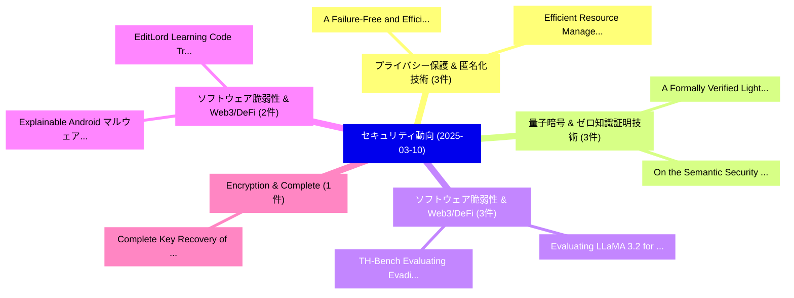

# 📅 02_daily: 日次エグゼクティブサマリー報告書 (2025-03-10)

**集計日時**: 2026-10-02 23:05:19 UTC  
**対象日付**: 2025-03-10  
**本日収集論文数**: 23 件  

---

## 💡 主要セキュリティ動向・脅威インサイト (Executive Insights)

本日の収集論文（計 23 件）において、以下の重点セキュリティ領域で活発な研究動向が確認されました：
- **プライバシー保護 & 匿名化技術** (3 件): 注目論文として 「A Failure-Free and Efficient D...」、「Efficient Resource Management ...」 等が発表され、実務防御および攻撃検証の進展が見られます。
- **量子暗号 & ゼロ知識証明技術** (3 件): 注目論文として 「A Formally Verified Lightning ...」、「On the Semantic Security of NT...」 等が発表され、実務防御および攻撃検証の進展が見られます。
- **ソフトウェア脆弱性 & Web3/DeFi** (3 件): 注目論文として 「Evaluating LLaMA 3.2 for Softw...」、「TH-Bench: Evaluating Evading A...」 等が発表され、実務防御および攻撃検証の進展が見られます。
- **ソフトウェア脆弱性 & Web3/DeFi** (2 件): 注目論文として 「Explainable Android マルウェア検出 an...」、「EditLord: Learning Code Transf...」 等が発表され、実務防御および攻撃検証の進展が見られます。
- **Encryption & Complete** (1 件): 注目論文として 「Complete Key Recovery of a DNA...」 等が発表され、実務防御および攻撃検証の進展が見られます。

### 🗺️ 技術・脅威トピックマインドマップ

---

## 📌 日次セキュリティ論文一覧 (日本語表形式)

| No | arXiv ID | 論文タイトル (日本語訳) | 重要キーワード | 構造化エグゼクティブ要約 (背景・提案・影響) | 脅威分類 | 詳細リンク |
|---|---|---|---|---|---|---|
| 1 | `2503.06925v1` | [Complete Key Recovery of a DNA-based Encryption and Developing a Novel Stream Cipher for Color Image Encryption: Bio-SNOW（セキュリティ分析論文）](../../okf/papers/2025-03-10/2503.06925.md) | `Complete Key Recovery`, `Color Image Encryption`, `DNA-based Encryption` | 【提案】概要 (Overview & Key Finding) 本論文「Complete Key Recovery of a DNA-based Encryption and Dev...。実証評価により経営層・セキュリティ管理者向け推奨アクション (E... | `cs.CR` | [arXiv](https://arxiv.org/abs/2503.06925v1) &#124; [OKF](../../okf/papers/2025-03-10/2503.06925.md) |
| 2 | `2503.06989v4` | [Probabilistic Modeling of Jailbreak on Multimodal LLMs: From Quantification to Application（セキュリティ分析論文）](../../okf/papers/2025-03-10/2503.06989.md) | `Probabilistic Modeling`, `Wenzhuo Xu`, `Zhipeng Wei` | 【提案】概要 (Overview & Key Finding) 本論文「Probabilistic Modeling of ジェイルブレイク on Multimodal LLMs: ...。実証評価により経営層・セキュリティ管理者向け推奨アクション (E... | `cs.CR` | [arXiv](https://arxiv.org/abs/2503.06989v4) &#124; [OKF](../../okf/papers/2025-03-10/2503.06989.md) |
| 3 | `2503.07048v1` | [A Failure-Free and Efficient Discrete Laplace Distribution for Differential Privacy in MPC（セキュリティ分析論文）](../../okf/papers/2025-03-10/2503.07048.md) | `Efficient Discrete Laplace Distribution`, `Differential Privacy`, `Ivan Tjuawinata` | 【提案】概要 (Overview & Key Finding) 本論文「A Failure-Free and Efficient Discrete Laplace Distribut...。実証評価により経営層・セキュリティ管理者向け推奨アクション (E... | `cs.CR` | [arXiv](https://arxiv.org/abs/2503.07048v1) &#124; [OKF](../../okf/papers/2025-03-10/2503.07048.md) |
| 4 | `2503.07109v1` | [Explainable Android マルウェア検出 and Malicious Code Localization Using Graph Attention](../../okf/papers/2025-03-10/2503.07109.md) | `Malicious Code Localization Using Graph Attention`, `Explainable Android Malware Detection`, `Explainable Android` | 【提案】概要 (Overview & Key Finding) 本論文「Explainable Android マルウェア検出 and Malicious Code Localiza...。実証評価により経営層・セキュリティ管理者向け推奨アクション (E... | `cs.CR` | [arXiv](https://arxiv.org/abs/2503.07109v1) &#124; [OKF](../../okf/papers/2025-03-10/2503.07109.md) |
| 5 | `2503.07191v1` | [All That Glitters Is Not Gold: Key-Secured 3D Secrets within 3D Gaussian Splatting（セキュリティ分析論文）](../../okf/papers/2025-03-10/2503.07191.md) | `Gaussian Splatting`, `Key-Secured 3D`, `Yan Ren` | 【提案】背景とセキュリティ上の課題 (Background & Problem) 本研究はサイバー脅威環境におけるセキュリティ構造・脆弱性の検証を目的としています。(主要検出項目: ...。実証評価により経営層・セキュリティ管理者向け推奨アクション (E... | `cs.CR` | [arXiv](https://arxiv.org/abs/2503.07191v1) &#124; [OKF](../../okf/papers/2025-03-10/2503.07191.md) |
| 6 | `2503.07196v1` | [QKD-KEM: Hybrid QKD Integration into TLS with OpenSSL Providers（セキュリティ分析論文）](../../okf/papers/2025-03-10/2503.07196.md) | `Florina Almenares Mendoza`, `Javier Blanco`, `Pedro Otero` | 【提案】概要 (Overview & Key Finding) 本論文「QKD-KEM: Hybrid QKD Integration into TLS with OpenSSL P...。実証評価により経営層・セキュリティ管理者向け推奨アクション (E... | `cs.CR` | [arXiv](https://arxiv.org/abs/2503.07196v1) &#124; [OKF](../../okf/papers/2025-03-10/2503.07196.md) |
| 7 | `2503.07199v4` | [How Well Can Differential Privacy Be Audited in One Run?（セキュリティ分析論文）](../../okf/papers/2025-03-10/2503.07199.md) | `One Run`, `Amit Keinan`, `Moshe Shenfeld` | 【提案】### (日本語題名: How Well Can 差分プライバシー Be Audited in One Run?（セキュリティ分析論文）)  > [!NOTE] > **OK...。実証評価により経営層・セキュリティ管理者向け推奨アクション (E... | `cs.CR` | [arXiv](https://arxiv.org/abs/2503.07199v4) &#124; [OKF](../../okf/papers/2025-03-10/2503.07199.md) |
| 8 | `2503.07200v1` | [A Formally Verified Lightning Network（セキュリティ分析論文）](../../okf/papers/2025-03-10/2503.07200.md) | `Formally Verified Lightning Network`, `Orfeas Stefanos Thyfronitis Litos`, `Raw Meta` | 【提案】概要 (Overview & Key Finding) 本論文「A Formally Verified Lightning Network（セキュリティ分析論文）」（原題: ...。実証評価により経営層・セキュリティ管理者向け推奨アクション (E... | `cs.CR` | [arXiv](https://arxiv.org/abs/2503.07200v1) &#124; [OKF](../../okf/papers/2025-03-10/2503.07200.md) |
| 9 | `2503.07243v2` | [Beyond the Edge of Function: Unraveling the Patterns of Type Recovery in Binary Code（セキュリティ分析論文）](../../okf/papers/2025-03-10/2503.07243.md) | `Type Recovery`, `Binary Code`, `Gangyang Li` | 【提案】概要 (Overview & Key Finding) 本論文「Beyond the Edge of Function: Unraveling the Patterns of...。実証評価により経営層・セキュリティ管理者向け推奨アクション (E... | `cs.CR` | [arXiv](https://arxiv.org/abs/2503.07243v2) &#124; [OKF](../../okf/papers/2025-03-10/2503.07243.md) |
| 10 | `2503.07250v1` | [Creating サイバーセキュリティ Regulatory Mechanisms, as Seen Through EU and US Law](../../okf/papers/2025-03-10/2503.07250.md) | `Creating Cybersecurity Regulatory Mechanisms`, `Regulatory Mechanisms`, `Kaspar Rosager Ludvigsen` | 【提案】概要 (Overview & Key Finding) 本論文「Creating サイバーセキュリティ Regulatory Mechanisms, as Seen Thro...。実証評価により経営層・セキュリティ管理者向け推奨アクション (E... | `cs.CR` | [arXiv](https://arxiv.org/abs/2503.07250v1) &#124; [OKF](../../okf/papers/2025-03-10/2503.07250.md) |
| 11 | `2503.07464v2` | [Learning to Localize Leakage of Cryptographic Sensitive Variables（セキュリティ分析論文）](../../okf/papers/2025-03-10/2503.07464.md) | `Cryptographic Sensitive Variables`, `Localize Leakage`, `Jimmy Gammell` | 【提案】概要 (Overview & Key Finding) 本論文「Learning to Localize Leakage of Cryptographic Sensitive...。実証評価により経営層・セキュリティ管理者向け推奨アクション (E... | `cs.CR` | [arXiv](https://arxiv.org/abs/2503.07464v2) &#124; [OKF](../../okf/papers/2025-03-10/2503.07464.md) |
| 12 | `2503.07568v1` | [Runtime Adversarial Attacks in AI Accelerators Using Performance Countersの検出](../../okf/papers/2025-03-10/2503.07568.md) | `Accelerators Using Performance Counters`, `Runtime Adversarial Attacks`, `Accelerators Using Performance` | 【提案】概要 (Overview & Key Finding) 本論文「Runtime 敵対的攻撃s in AI Accelerators Using Performance Cou...。実証評価により経営層・セキュリティ管理者向け推奨アクション (E... | `cs.CR` | [arXiv](https://arxiv.org/abs/2503.07568v1) &#124; [OKF](../../okf/papers/2025-03-10/2503.07568.md) |
| 13 | `2503.07570v3` | [Split-n-Chain: Privacy-Preserving Multi-Node Split Learning with Blockchain-Based Auditability（セキュリティ分析論文）](../../okf/papers/2025-03-10/2503.07570.md) | `Node Split Learning`, `Preserving Multi`, `Privacy-Preserving Multi` | 【提案】概要 (Overview & Key Finding) 本論文「Split-n-Chain: Privacy-Preserving Multi-Node Split Lear...。実証評価により経営層・セキュリティ管理者向け推奨アクション (E... | `cs.CR` | [arXiv](https://arxiv.org/abs/2503.07570v3) &#124; [OKF](../../okf/papers/2025-03-10/2503.07570.md) |
| 14 | `2503.07697v2` | [PoisonedParrot: Subtle Data Poisoning Attacks to Elicit Copyright-Infringing Content from 大規模言語モデル](../../okf/papers/2025-03-10/2503.07697.md) | `Subtle Data Poisoning Attacks`, `Elicit Copyright`, `Infringing Content` | 【提案】概要 (Overview & Key Finding) 本論文「PoisonedParrot: Subtle Data Poisoning Attacks to Elicit...。実証評価により経営層・セキュリティ管理者向け推奨アクション (E... | `cs.CR` | [arXiv](https://arxiv.org/abs/2503.07697v2) &#124; [OKF](../../okf/papers/2025-03-10/2503.07697.md) |
| 15 | `2503.07770v1` | [Evaluating LLaMA 3.2 for Software 脆弱性検出](../../okf/papers/2025-03-10/2503.07770.md) | `Software Vulnerability Detection`, `Miguel Silva`, `Bernardo Cabral` | 【提案】概要 (Overview & Key Finding) 本論文「Evaluating LLaMA 3.2 for Software 脆弱性検出」（原題: Evaluating...。実証評価により経営層・セキュリティ管理者向け推奨アクション (E... | `cs.CR` | [arXiv](https://arxiv.org/abs/2503.07770v1) &#124; [OKF](../../okf/papers/2025-03-10/2503.07770.md) |
| 16 | `2503.07790v1` | [On the Semantic Security of NTRU -- with a gentle introduction to cryptography（セキュリティ分析論文）](../../okf/papers/2025-03-10/2503.07790.md) | `Semantic Security`, `Liam Peet`, `Raw Meta` | 【提案】概要 (Overview & Key Finding) 本論文「On the Semantic Security of NTRU -- with a gentle intro...。実証評価により経営層・セキュリティ管理者向け推奨アクション (E... | `cs.CR` | [arXiv](https://arxiv.org/abs/2503.07790v1) &#124; [OKF](../../okf/papers/2025-03-10/2503.07790.md) |
| 17 | `2503.07857v1` | [Efficient Resource Management for Secure and Low-Latency O-RAN Communication（セキュリティ分析論文）](../../okf/papers/2025-03-10/2503.07857.md) | `Efficient Resource Management`, `Low-Latency O`, `Zaineh Abughazzah` | 【提案】概要 (Overview & Key Finding) 本論文「Efficient Resource Management for Secure and Low-Latenc...。実証評価により経営層・セキュリティ管理者向け推奨アクション (E... | `cs.CR` | [arXiv](https://arxiv.org/abs/2503.07857v1) &#124; [OKF](../../okf/papers/2025-03-10/2503.07857.md) |
| 18 | `2503.07882v1` | [ReLATE: Resilient Learner Selection for Multivariate Time-Series Classification Against Adversarial Attacks（セキュリティ分析論文）](../../okf/papers/2025-03-10/2503.07882.md) | `Resilient Learner Selection`, `Multivariate Time`, `Time-Series Classification` | 【提案】概要 (Overview & Key Finding) 本論文「ReLATE: Resilient Learner Selection for Multivariate Ti...。実証評価により経営層・セキュリティ管理者向け推奨アクション (E... | `cs.CR` | [arXiv](https://arxiv.org/abs/2503.07882v1) &#124; [OKF](../../okf/papers/2025-03-10/2503.07882.md) |
| 19 | `2503.08707v1` | [A Secure Blockchain-Assisted Framework for Real-Time Maritime Environmental Compliance Monitoring（セキュリティ分析論文）](../../okf/papers/2025-03-10/2503.08707.md) | `Time Maritime Environmental Compliance Monitoring`, `Secure Blockchain`, `Real-Time Maritime` | 【提案】概要 (Overview & Key Finding) 本論文「A Secure Blockchain-Assisted Framework for Real-Time Ma...。実証評価により経営層・セキュリティ管理者向け推奨アクション (E... | `cs.CR` | [arXiv](https://arxiv.org/abs/2503.08707v1) &#124; [OKF](../../okf/papers/2025-03-10/2503.08707.md) |
| 20 | `2503.08708v2` | [TH-Bench: Evaluating Evading Attacks via Humanizing AI Text on Machine-Generated Text Detectors（セキュリティ分析論文）](../../okf/papers/2025-03-10/2503.08708.md) | `Evaluating Evading Attacks`, `Generated Text Detectors`, `Machine-Generated Text` | 【提案】概要 (Overview & Key Finding) 本論文「TH-Bench: Evaluating Evading Attacks via Humanizing AI ...。実証評価により経営層・セキュリティ管理者向け推奨アクション (E... | `cs.CR` | [arXiv](https://arxiv.org/abs/2503.08708v2) &#124; [OKF](../../okf/papers/2025-03-10/2503.08708.md) |
| 21 | `2503.08716v1` | [AuthorMist: Evading AI Text Detectors with Reinforcement Learning（セキュリティ分析論文）](../../okf/papers/2025-03-10/2503.08716.md) | `Text Detectors`, `Reinforcement Learning`, `Isaac David` | 【提案】概要 (Overview & Key Finding) 本論文「AuthorMist: Evading AI Text Detectors with Reinforcemen...。実証評価により経営層・セキュリティ管理者向け推奨アクション (E... | `cs.CR` | [arXiv](https://arxiv.org/abs/2503.08716v1) &#124; [OKF](../../okf/papers/2025-03-10/2503.08716.md) |
| 22 | `2503.08717v1` | [A Semantic Link Network Model for Supporting Traceability of Logistics on Blockchain（セキュリティ分析論文）](../../okf/papers/2025-03-10/2503.08717.md) | `Semantic Link Network Model`, `Supporting Traceability`, `Xiaoping Sun` | 【提案】概要 (Overview & Key Finding) 本論文「A Semantic Link Network Model for Supporting Traceabili...。実証評価により経営層・セキュリティ管理者向け推奨アクション (E... | `cs.CR` | [arXiv](https://arxiv.org/abs/2503.08717v1) &#124; [OKF](../../okf/papers/2025-03-10/2503.08717.md) |
| 23 | `2504.15284v4` | [EditLord: Learning Code Transformation Rules for Code Editing（セキュリティ分析論文）](../../okf/papers/2025-03-10/2504.15284.md) | `Learning Code Transformation Rules`, `Code Editing`, `Weichen Li` | 【提案】概要 (Overview & Key Finding) 本論文「EditLord: Learning Code Transformation Rules for Code E...。実証評価により経営層・セキュリティ管理者向け推奨アクション (E... | `cs.CR` | [arXiv](https://arxiv.org/abs/2504.15284v4) &#124; [OKF](../../okf/papers/2025-03-10/2504.15284.md) |

