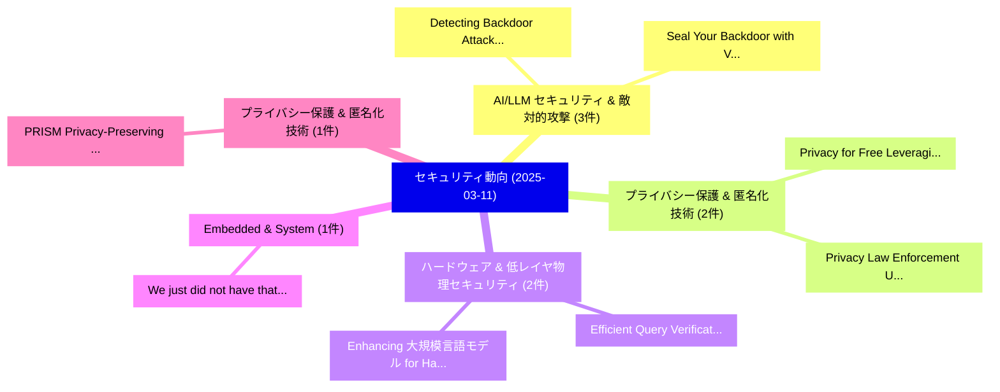

# 📅 02_daily: 日次エグゼクティブサマリー報告書 (2025-03-11)

**集計日時**: 2026-10-02 23:05:19 UTC  
**対象日付**: 2025-03-11  
**本日収集論文数**: 17 件  

---

## 💡 主要セキュリティ動向・脅威インサイト (Executive Insights)

本日の収集論文（計 17 件）において、以下の重点セキュリティ領域で活発な研究動向が確認されました：
- **AI/LLM セキュリティ & 敵対的攻撃** (3 件): 注目論文として 「Detecting Backdoor Attacks in ...」、「Seal Your Backdoor with Variat...」 等が発表され、実務防御および攻撃検証の進展が見られます。
- **プライバシー保護 & 匿名化技術** (2 件): 注目論文として 「Privacy for Free: Leveraging L...」、「Privacy Law Enforcement Under ...」 等が発表され、実務防御および攻撃検証の進展が見られます。
- **ハードウェア & 低レイヤ物理セキュリティ** (2 件): 注目論文として 「Efficient Query Verification f...」、「Enhancing 大規模言語モデル for Hardwar...」 等が発表され、実務防御および攻撃検証の進展が見られます。
- **Embedded & System** (1 件): 注目論文として 「"We just did not have that on ...」 等が発表され、実務防御および攻撃検証の進展が見られます。
- **プライバシー保護 & 匿名化技術** (1 件): 注目論文として 「PRISM: Privacy-Preserving Impr...」 等が発表され、実務防御および攻撃検証の進展が見られます。

### 🗺️ 技術・脅威トピックマインドマップ

---

## 📌 日次セキュリティ論文一覧 (日本語表形式)

| No | arXiv ID | 論文タイトル (日本語訳) | 重要キーワード | 構造化エグゼクティブ要約 (背景・提案・影響) | 脅威分類 | 詳細リンク |
|---|---|---|---|---|---|---|
| 1 | `2503.07978v2` | [Detecting Backdoor Attacks in 連合学習 via Direction Alignment Inspection](../../okf/papers/2025-03-11/2503.07978.md) | `Detecting Backdoor Attacks`, `Direction Alignment Inspection`, `Federated Learning` | 【提案】概要 (Overview & Key Finding) 本論文「Detecting Backdoor Attacks in 連合学習 via Direction Alignm...。実証評価により経営層・セキュリティ管理者向け推奨アクション (E... | `cs.CR` | [arXiv](https://arxiv.org/abs/2503.07978v2) &#124; [OKF](../../okf/papers/2025-03-11/2503.07978.md) |
| 2 | `2503.08053v2` | ["We just did not have that on the embedded system": Insights and Challenges for Microcontroller Systems from the Embedded CTF Competitionsのセキュリティ強化](../../okf/papers/2025-03-11/2503.08053.md) | `Securing Microcontroller Systems`, `Microcontroller Systems`, `Zheyuan Ma` | 【提案】背景とセキュリティ上の課題 (Background & Problem) 本研究はサイバー脅威環境におけるセキュリティ構造・脆弱性の検証を目的としています。(主要検出項目: ...。実証評価により経営層・セキュリティ管理者向け推奨アクション (E... | `cs.CR` | [arXiv](https://arxiv.org/abs/2503.08053v2) &#124; [OKF](../../okf/papers/2025-03-11/2503.08053.md) |
| 3 | `2503.08085v3` | [PRISM: Privacy-Preserving Improved Stochastic Masking for Federated Generative Models（セキュリティ分析論文）](../../okf/papers/2025-03-11/2503.08085.md) | `Preserving Improved Stochastic Masking`, `Federated Generative Models`, `Privacy-Preserving Improved` | 【提案】概要 (Overview & Key Finding) 本論文「PRISM: Privacy-Preserving Improved Stochastic Masking f...。実証評価により経営層・セキュリティ管理者向け推奨アクション (E... | `cs.CR` | [arXiv](https://arxiv.org/abs/2503.08085v3) &#124; [OKF](../../okf/papers/2025-03-11/2503.08085.md) |
| 4 | `2503.08256v1` | [SoK: A cloudy view on trust relationships of CVMs -- How Confidential Virtual Machines are falling short in Public Cloud（セキュリティ分析論文）](../../okf/papers/2025-03-11/2503.08256.md) | `Public Cloud`, `Jana Eisoldt`, `Anna Galanou` | 【提案】概要 (Overview & Key Finding) 本論文「SoK: A cloudy view on trust relationships of CVMs -- Ho...。実証評価により経営層・セキュリティ管理者向け推奨アクション (E... | `cs.CR` | [arXiv](https://arxiv.org/abs/2503.08256v1) &#124; [OKF](../../okf/papers/2025-03-11/2503.08256.md) |
| 5 | `2503.08284v2` | [Neural cyberattacks applied to the vision under realistic visual stimuli（セキュリティ分析論文）](../../okf/papers/2025-03-11/2503.08284.md) | `Victoria Magdalena`, `Alberto Huertas`, `Raw Meta` | 【提案】概要 (Overview & Key Finding) 本論文「Neural cyberattacks applied to the vision under realist...。実証評価により経営層・セキュリティ管理者向け推奨アクション (E... | `cs.CR` | [arXiv](https://arxiv.org/abs/2503.08284v2) &#124; [OKF](../../okf/papers/2025-03-11/2503.08284.md) |
| 6 | `2503.08293v1` | [A systematic literature review of unsupervised learning algorithms for anomalous traffic detection based on flows（セキュリティ分析論文）](../../okf/papers/2025-03-11/2503.08293.md) | `Alberto Miguel`, `Gonzalo Esteban`, `Manuel Guerrero` | 【提案】概要 (Overview & Key Finding) 本論文「A systematic literature review of unsupervised learning...。実証評価により経営層・セキュリティ管理者向け推奨アクション (E... | `cs.CR` | [arXiv](https://arxiv.org/abs/2503.08293v1) &#124; [OKF](../../okf/papers/2025-03-11/2503.08293.md) |
| 7 | `2503.08297v1` | [Privacy for Free: Leveraging Local Differential Privacy Perturbed Data from Multiple Services（セキュリティ分析論文）](../../okf/papers/2025-03-11/2503.08297.md) | `Leveraging Local Differential Privacy Perturbed Data`, `Multiple Services`, `Leveraging Local Differentia` | 【提案】概要 (Overview & Key Finding) 本論文「Privacy for Free: Leveraging Local 差分プライバシー Perturbed D...。実証評価により経営層・セキュリティ管理者向け推奨アクション (E... | `cs.CR` | [arXiv](https://arxiv.org/abs/2503.08297v1) &#124; [OKF](../../okf/papers/2025-03-11/2503.08297.md) |
| 8 | `2503.08359v1` | [Efficient Query Verification for Blockchain Superlight Clients Using SNARKs（セキュリティ分析論文）](../../okf/papers/2025-03-11/2503.08359.md) | `Blockchain Superlight Clients Using`, `Efficient Query Verification`, `Stefano De Angelis` | 【提案】概要 (Overview & Key Finding) 本論文「Efficient Query Verification for Blockchain Superlight ...。実証評価により経営層・セキュリティ管理者向け推奨アクション (E... | `cs.CR` | [arXiv](https://arxiv.org/abs/2503.08359v1) &#124; [OKF](../../okf/papers/2025-03-11/2503.08359.md) |
| 9 | `2503.08403v1` | [A Practically Scalable Approach to the Closest Vector Problem for Sieving via QAOA with Fixed Angles（セキュリティ分析論文）](../../okf/papers/2025-03-11/2503.08403.md) | `Closest Vector Problem`, `Fixed Angles`, `Ben Priestley` | 【提案】概要 (Overview & Key Finding) 本論文「A Practically Scalable Approach to the Closest Vector P...。実証評価により経営層・セキュリティ管理者向け推奨アクション (E... | `cs.CR` | [arXiv](https://arxiv.org/abs/2503.08403v1) &#124; [OKF](../../okf/papers/2025-03-11/2503.08403.md) |
| 10 | `2503.08568v1` | [Privacy Law Enforcement Under Centralized Governance: A Qualitative Four Years' Special Privacy Rectification Campaignsの分析](../../okf/papers/2025-03-11/2503.08568.md) | `Special Privacy Rectification Campaigns`, `Qualitative Four Years`, `Special Privacy Rectification` | 【提案】概要 (Overview & Key Finding) 本論文「Privacy Law Enforcement Under Centralized Governance: A...。実証評価により経営層・セキュリティ管理者向け推奨アクション (E... | `cs.CR` | [arXiv](https://arxiv.org/abs/2503.08568v1) &#124; [OKF](../../okf/papers/2025-03-11/2503.08568.md) |
| 11 | `2503.08607v2` | [A Fair and Lightweight Consensus Algorithm for IoT（セキュリティ分析論文）](../../okf/papers/2025-03-11/2503.08607.md) | `Lightweight Consensus Algorithm`, `Sokratis Vavilis`, `Harris Niavis` | 【提案】概要 (Overview & Key Finding) 本論文「A Fair and Lightweight Consensus Algorithm for IoT（セキュリ...。実証評価により経営層・セキュリティ管理者向け推奨アクション (E... | `cs.CR` | [arXiv](https://arxiv.org/abs/2503.08607v2) &#124; [OKF](../../okf/papers/2025-03-11/2503.08607.md) |
| 12 | `2503.08632v2` | [Secret-Key Generation from Private Identifiers under Channel Uncertainty（セキュリティ分析論文）](../../okf/papers/2025-03-11/2503.08632.md) | `Key Generation`, `Private Identifiers`, `Channel Uncertainty` | 【提案】概要 (Overview & Key Finding) 本論文「Secret-Key Generation from Private Identifiers under Ch...。実証評価により経営層・セキュリティ管理者向け推奨アクション (E... | `cs.CR` | [arXiv](https://arxiv.org/abs/2503.08632v2) &#124; [OKF](../../okf/papers/2025-03-11/2503.08632.md) |
| 13 | `2503.08734v1` | [Zero-to-One IDV: A Conceptual Model for AI-Powered Identity Verification（セキュリティ分析論文）](../../okf/papers/2025-03-11/2503.08734.md) | `Powered Identity Verification`, `Conceptual Model`, `AI-Powered Identity` | 【提案】概要 (Overview & Key Finding) 本論文「Zero-to-One IDV: A Conceptual Model for AI-Powered Iden...。実証評価により経営層・セキュリティ管理者向け推奨アクション (E... | `cs.CR` | [arXiv](https://arxiv.org/abs/2503.08734v1) &#124; [OKF](../../okf/papers/2025-03-11/2503.08734.md) |
| 14 | `2503.08829v3` | [Seal Your Backdoor with Variational Defense（セキュリティ分析論文）](../../okf/papers/2025-03-11/2503.08829.md) | `Variational Defense`, `Raw Meta`, `Executive Summary` | 【提案】概要 (Overview & Key Finding) 本論文「Seal Your Backdoor with Variational Defense（セキュリティ分析論文）...。実証評価により経営層・セキュリティ管理者向け推奨アクション (E... | `cs.CR` | [arXiv](https://arxiv.org/abs/2503.08829v3) &#124; [OKF](../../okf/papers/2025-03-11/2503.08829.md) |
| 15 | `2503.08908v1` | [Interpreting the Repeated Token Phenomenon in 大規模言語モデル](../../okf/papers/2025-03-11/2503.08908.md) | `Repeated Token Phenomenon`, `Large Language Models`, `Itay Yona` | 【提案】概要 (Overview & Key Finding) 本論文「Interpreting the Repeated Token Phenomenon in 大規模言語モデル」...。実証評価により経営層・セキュリティ管理者向け推奨アクション (E... | `cs.CR` | [arXiv](https://arxiv.org/abs/2503.08908v1) &#124; [OKF](../../okf/papers/2025-03-11/2503.08908.md) |
| 16 | `2503.08923v1` | [Enhancing 大規模言語モデル for Hardware Verification: A Novel SystemVerilog Assertion Dataset](../../okf/papers/2025-03-11/2503.08923.md) | `Hardware Verification`, `Assertion Dataset`, `Enhancing Large Language Models` | 【提案】概要 (Overview & Key Finding) 本論文「Enhancing 大規模言語モデル for Hardware Verification: A Novel S...。実証評価により経営層・セキュリティ管理者向け推奨アクション (E... | `cs.CR` | [arXiv](https://arxiv.org/abs/2503.08923v1) &#124; [OKF](../../okf/papers/2025-03-11/2503.08923.md) |
| 17 | `2503.08956v1` | [Leaky Batteries: A Novel Set of Side-Channel Attacks on Electric Vehicles（セキュリティ分析論文）](../../okf/papers/2025-03-11/2503.08956.md) | `Leaky Batteries`, `Channel Attacks`, `Electric Vehicles` | 【提案】概要 (Overview & Key Finding) 本論文「Leaky Batteries: A Novel Set of サイドチャネル攻撃 Attacks on El...。実証評価により経営層・セキュリティ管理者向け推奨アクション (E... | `cs.CR` | [arXiv](https://arxiv.org/abs/2503.08956v1) &#124; [OKF](../../okf/papers/2025-03-11/2503.08956.md) |

