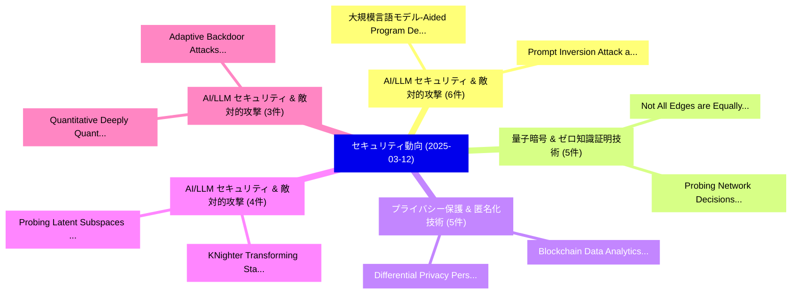

# 📅 02_daily: 日次エグゼクティブサマリー報告書 (2025-03-12)

**集計日時**: 2026-10-02 23:05:19 UTC  
**対象日付**: 2025-03-12  
**本日収集論文数**: 42 件  

---

## 💡 主要セキュリティ動向・脅威インサイト (Executive Insights)

本日の収集論文（計 42 件）において、以下の重点セキュリティ領域で活発な研究動向が確認されました：
- **AI/LLM セキュリティ & 敵対的攻撃** (6 件): 注目論文として 「大規模言語モデル-Aided Program Debloat...」、「Prompt Inversion Attack agains...」 等が発表され、実務防御および攻撃検証の進展が見られます。
- **量子暗号 & ゼロ知識証明技術** (5 件): 注目論文として 「Not All Edges are Equally Robu...」、「Probing Network Decisions: Cap...」 等が発表され、実務防御および攻撃検証の進展が見られます。
- **プライバシー保護 & 匿名化技術** (5 件): 注目論文として 「Blockchain Data Analytics: Rev...」、「Differential Privacy Personali...」 等が発表され、実務防御および攻撃検証の進展が見られます。
- **AI/LLM セキュリティ & 敵対的攻撃** (4 件): 注目論文として 「KNighter: Transforming Static ...」、「Probing Latent Subspaces in LL...」 等が発表され、実務防御および攻撃検証の進展が見られます。
- **AI/LLM セキュリティ & 敵対的攻撃** (3 件): 注目論文として 「Quantitative Deeply Quantized ...」、「Adaptive Backdoor Attacks with...」 等が発表され、実務防御および攻撃検証の進展が見られます。

### 🗺️ 技術・脅威トピックマインドマップ

---

## 📌 日次セキュリティ論文一覧 (日本語表形式)

| No | arXiv ID | 論文タイトル (日本語訳) | 重要キーワード | 構造化エグゼクティブ要約 (背景・提案・影響) | 脅威分類 | 詳細リンク |
|---|---|---|---|---|---|---|
| 1 | `2503.08968v1` | [CIPHERMATCH: Accelerating Homomorphic Encryption-Based String Matching via Memory-Efficient Data Packing and In-Flash Processing（セキュリティ分析論文）](../../okf/papers/2025-03-12/2503.08968.md) | `Accelerating Homomorphic Encryption`, `Based String Matching`, `Efficient Data Packing` | 【提案】概要 (Overview & Key Finding) 本論文「CIPHERMATCH: Accelerating 準同型暗号-Based String Matching v...。実証評価により経営層・セキュリティ管理者向け推奨アクション (E... | `cs.CR` | [arXiv](https://arxiv.org/abs/2503.08968v1) &#124; [OKF](../../okf/papers/2025-03-12/2503.08968.md) |
| 2 | `2503.08969v1` | [大規模言語モデル-Aided Program Debloating](../../okf/papers/2025-03-12/2503.08969.md) | `Aided Program Debloating`, `Large Language Models`, `Models-Aided Program` | 【提案】概要 (Overview & Key Finding) 本論文「大規模言語モデル-Aided Program Debloating」（原題: Large Language M...。実証評価により経営層・セキュリティ管理者向け推奨アクション (E... | `cs.CR` | [arXiv](https://arxiv.org/abs/2503.08969v1) &#124; [OKF](../../okf/papers/2025-03-12/2503.08969.md) |
| 3 | `2503.08973v1` | [Quantitative Deeply Quantized Tiny Neural Networks Robust to Adversarial Attacksの分析](../../okf/papers/2025-03-12/2503.08973.md) | `Quantitative Deeply Quantized Tiny Neural Networks Robust`, `Deeply Quantized Tiny Neural Networks Robust`, `Adversarial Attacks` | 【提案】概要 (Overview & Key Finding) 本論文「Quantitative Deeply Quantized Tiny Neural Networks Robu...。実証評価により経営層・セキュリティ管理者向け推奨アクション (E... | `cs.CR` | [arXiv](https://arxiv.org/abs/2503.08973v1) &#124; [OKF](../../okf/papers/2025-03-12/2503.08973.md) |
| 4 | `2503.08976v3` | [Not All Edges are Equally Robust: Evaluating the Robustness of Ranking-Based 連合学習](../../okf/papers/2025-03-12/2503.08976.md) | `Equally Robust`, `Based Federated Learning`, `Ranking-Based Federated` | 【提案】背景とセキュリティ上の課題 (Background & Problem) 本研究はサイバー脅威環境におけるセキュリティ構造・脆弱性の検証を目的としています。(主要検出項目: ...。実証評価により概要 (Overview & Key Findin... | `cs.CR` | [arXiv](https://arxiv.org/abs/2503.08976v3) &#124; [OKF](../../okf/papers/2025-03-12/2503.08976.md) |
| 5 | `2503.08990v2` | [Effective and Efficient Jailbreaks of Black-Box LLMs with Cross-Behavior Attacks（セキュリティ分析論文）](../../okf/papers/2025-03-12/2503.08990.md) | `Efficient Jailbreaks`, `Behavior Attacks`, `Black-Box LLMs` | 【提案】概要 (Overview & Key Finding) 本論文「Effective and Efficient ジェイルブレイクs of Black-Box LLMs wit...。実証評価により経営層・セキュリティ管理者向け推奨アクション (E... | `cs.CR` | [arXiv](https://arxiv.org/abs/2503.08990v2) &#124; [OKF](../../okf/papers/2025-03-12/2503.08990.md) |
| 6 | `2503.09002v3` | [KNighter: Transforming Static Analysis with LLM-Synthesized Checkers（セキュリティ分析論文）](../../okf/papers/2025-03-12/2503.09002.md) | `Synthesized Checkers`, `LLM-Synthesized Checkers`, `Chenyuan Yang` | 【提案】概要 (Overview & Key Finding) 本論文「KNighter: Transforming Static Analysis with LLM-Synthes...。実証評価により経営層・セキュリティ管理者向け推奨アクション (E... | `cs.CR` | [arXiv](https://arxiv.org/abs/2503.09002v3) &#124; [OKF](../../okf/papers/2025-03-12/2503.09002.md) |
| 7 | `2503.09022v3` | [Prompt Inversion Attack against Collaborative Inference of 大規模言語モデル](../../okf/papers/2025-03-12/2503.09022.md) | `Prompt Inversion Attack`, `Collaborative Inference`, `Large Language Models` | 【提案】概要 (Overview & Key Finding) 本論文「Prompt Inversion Attack against Collaborative Inference...。実証評価により経営層・セキュリティ管理者向け推奨アクション (E... | `cs.CR` | [arXiv](https://arxiv.org/abs/2503.09022v3) &#124; [OKF](../../okf/papers/2025-03-12/2503.09022.md) |
| 8 | `2503.09038v1` | [Image Encryption Using DNA Encoding, Snake Permutation and Chaotic Substitution Techniques（セキュリティ分析論文）](../../okf/papers/2025-03-12/2503.09038.md) | `Image Encryption Using`, `Chaotic Substitution Techniques`, `Snake Permutation` | 【提案】概要 (Overview & Key Finding) 本論文「Image Encryption Using DNA Encoding, Snake Permutation ...。実証評価により経営層・セキュリティ管理者向け推奨アクション (E... | `cs.CR` | [arXiv](https://arxiv.org/abs/2503.09038v1) &#124; [OKF](../../okf/papers/2025-03-12/2503.09038.md) |
| 9 | `2503.09041v1` | [A Hybrid Neural Network with Smart Skip Connections for High-Precision, Low-Latency EMG-Based Hand Gesture Recognition（セキュリティ分析論文）](../../okf/papers/2025-03-12/2503.09041.md) | `Based Hand Gesture Recognition`, `Hybrid Neural Network`, `Smart Skip Connections` | 【提案】概要 (Overview & Key Finding) 本論文「A Hybrid Neural Network with Smart Skip Connections for...。実証評価により経営層・セキュリティ管理者向け推奨アクション (E... | `cs.CR` | [arXiv](https://arxiv.org/abs/2503.09041v1) &#124; [OKF](../../okf/papers/2025-03-12/2503.09041.md) |
| 10 | `2503.09047v1` | [Performance Evaluation of Threshold Signing Schemes in Cryptography（セキュリティ分析論文）](../../okf/papers/2025-03-12/2503.09047.md) | `Threshold Signing Schemes`, `Imdad Ullah Khan`, `Sana Ullah Jan` | 【提案】概要 (Overview & Key Finding) 本論文「Performance Evaluation of Threshold Signing Schemes in ...。実証評価により経営層・セキュリティ管理者向け推奨アクション (E... | `cs.CR` | [arXiv](https://arxiv.org/abs/2503.09047v1) &#124; [OKF](../../okf/papers/2025-03-12/2503.09047.md) |
| 11 | `2503.09049v1` | [Adaptive Backdoor Attacks with Reasonable Constraints on Graph Neural Networks（セキュリティ分析論文）](../../okf/papers/2025-03-12/2503.09049.md) | `Adaptive Backdoor Attacks`, `Graph Neural Networks`, `Reasonable Constraints` | 【提案】概要 (Overview & Key Finding) 本論文「Adaptive Backdoor Attacks with Reasonable Constraints o...。実証評価により経営層・セキュリティ管理者向け推奨アクション (E... | `cs.CR` | [arXiv](https://arxiv.org/abs/2503.09049v1) &#124; [OKF](../../okf/papers/2025-03-12/2503.09049.md) |
| 12 | `2503.09066v2` | [Probing Latent Subspaces in LLM for AI Security: Identifying and Manipulating Adversarial States（セキュリティ分析論文）](../../okf/papers/2025-03-12/2503.09066.md) | `Probing Latent Subspaces`, `Manipulating Adversarial States`, `Xin Wei Chia` | 【提案】概要 (Overview & Key Finding) 本論文「Probing Latent Subspaces in LLM for AI Security: Identi...。実証評価により経営層・セキュリティ管理者向け推奨アクション (E... | `cs.CR` | [arXiv](https://arxiv.org/abs/2503.09066v2) &#124; [OKF](../../okf/papers/2025-03-12/2503.09066.md) |
| 13 | `2503.09068v1` | [Probing Network Decisions: Capturing Uncertainties and Unveiling Vulnerabilities Without Label Information（セキュリティ分析論文）](../../okf/papers/2025-03-12/2503.09068.md) | `Unveiling Vulnerabilities Without Label Information`, `Probing Network Decisions`, `Capturing Uncertainties` | 【提案】背景とセキュリティ上の課題 (Background & Problem) 本研究はサイバー脅威環境におけるセキュリティ構造・脆弱性の検証を目的としています。(主要検出項目: ...。実証評価により経営層・セキュリティ管理者向け推奨アクション (E... | `cs.CR` | [arXiv](https://arxiv.org/abs/2503.09068v1) &#124; [OKF](../../okf/papers/2025-03-12/2503.09068.md) |
| 14 | `2503.09095v2` | [Backdooring CLIP through Concept Confusion（セキュリティ分析論文）](../../okf/papers/2025-03-12/2503.09095.md) | `Concept Confusion`, `Lijie Hu`, `Junchi Liao` | 【提案】概要 (Overview & Key Finding) 本論文「Backdooring CLIP through Concept Confusion（セキュリティ分析論文）」...。実証評価により経営層・セキュリティ管理者向け推奨アクション (E... | `cs.CR` | [arXiv](https://arxiv.org/abs/2503.09095v2) &#124; [OKF](../../okf/papers/2025-03-12/2503.09095.md) |
| 15 | `2503.09099v2` | [Simulation of Two-Qubit Grover Algorithm in MBQC with Universal Blind Quantum Computation（セキュリティ分析論文）](../../okf/papers/2025-03-12/2503.09099.md) | `Universal Blind Quantum Computation`, `Qubit Grover Algorithm`, `Two-Qubit Grover` | 【提案】概要 (Overview & Key Finding) 本論文「Simulation of Two-Qubit Grover Algorithm in MBQC with U...。実証評価により経営層・セキュリティ管理者向け推奨アクション (E... | `cs.CR` | [arXiv](https://arxiv.org/abs/2503.09099v2) &#124; [OKF](../../okf/papers/2025-03-12/2503.09099.md) |
| 16 | `2503.09165v2` | [Blockchain Data Analytics: Review and Challenges（セキュリティ分析論文）](../../okf/papers/2025-03-12/2503.09165.md) | `Blockchain Data Analytics`, `Rischan Mafrur`, `Raw Meta` | 【提案】概要 (Overview & Key Finding) 本論文「Blockchain Data Analytics: Review and Challenges（セキュリティ...。実証評価により経営層・セキュリティ管理者向け推奨アクション (E... | `cs.CR` | [arXiv](https://arxiv.org/abs/2503.09165v2) &#124; [OKF](../../okf/papers/2025-03-12/2503.09165.md) |
| 17 | `2503.09184v2` | [Exploiting Unstructured Sparsity in Fully Homomorphic Encrypted DNNs（セキュリティ分析論文）](../../okf/papers/2025-03-12/2503.09184.md) | `Exploiting Unstructured Sparsity`, `Fully Homomorphic Encrypted`, `Fully Homomorphic Encrypte` | 【提案】概要 (Overview & Key Finding) 本論文「Exploiting Unstructured Sparsity in Fully Homomorphic E...。実証評価により経営層・セキュリティ管理者向け推奨アクション (E... | `cs.CR` | [arXiv](https://arxiv.org/abs/2503.09184v2) &#124; [OKF](../../okf/papers/2025-03-12/2503.09184.md) |
| 18 | `2503.09192v2` | [Differential Privacy Personalized 連合学習 Based on Dynamically Sparsified Client Updates](../../okf/papers/2025-03-12/2503.09192.md) | `Dynamically Sparsified Client Updates`, `Differential Privacy Personalized Federated Learning Based`, `Differential Privacy Personalized` | 【提案】概要 (Overview & Key Finding) 本論文「差分プライバシー Personalized 連合学習 Based on Dynamically Sparsif...。実証評価により経営層・セキュリティ管理者向け推奨アクション (E... | `cs.CR` | [arXiv](https://arxiv.org/abs/2503.09192v2) &#124; [OKF](../../okf/papers/2025-03-12/2503.09192.md) |
| 19 | `2503.09291v2` | [Prompt Inference Attack on Distributed Large Language Model Inference Frameworks（セキュリティ分析論文）](../../okf/papers/2025-03-12/2503.09291.md) | `Distributed Large Language Model Inference Frameworks`, `Prompt Inference Attack`, `Xinjian Luo` | 【提案】概要 (Overview & Key Finding) 本論文「Prompt Inference Attack on Distributed Large Language M...。実証評価により経営層・セキュリティ管理者向け推奨アクション (E... | `cs.CR` | [arXiv](https://arxiv.org/abs/2503.09291v2) &#124; [OKF](../../okf/papers/2025-03-12/2503.09291.md) |
| 20 | `2503.09302v1` | [Detecting and Preventing Data Poisoning Attacks on AI Models（セキュリティ分析論文）](../../okf/papers/2025-03-12/2503.09302.md) | `Preventing Data Poisoning Attacks`, `Pradipta Sarkar`, `Raw Meta` | 【提案】概要 (Overview & Key Finding) 本論文「Detecting and Preventing Data Poisoning Attacks on AI M...。実証評価によりNwajana - **公。 | `cs.CR` | [arXiv](https://arxiv.org/abs/2503.09302v1) &#124; [OKF](../../okf/papers/2025-03-12/2503.09302.md) |
| 21 | `2503.09317v2` | [RaceTEE: Enabling Interoperability of Confidential Smart Contracts（セキュリティ分析論文）](../../okf/papers/2025-03-12/2503.09317.md) | `Confidential Smart Contracts`, `Enabling Interoperability`, `Keyu Zhang` | 【提案】概要 (Overview & Key Finding) 本論文「RaceTEE: Enabling Interoperability of Confidential スマート...。実証評価により経営層・セキュリティ管理者向け推奨アクション (E... | `cs.CR` | [arXiv](https://arxiv.org/abs/2503.09317v2) &#124; [OKF](../../okf/papers/2025-03-12/2503.09317.md) |
| 22 | `2503.09327v1` | [Heuristic-Based Address Clustering in Cardano Blockchain（セキュリティ分析論文）](../../okf/papers/2025-03-12/2503.09327.md) | `Based Address Clustering`, `Cardano Blockchain`, `Heuristic-Based Address` | 【提案】概要 (Overview & Key Finding) 本論文「Heuristic-Based Address Clustering in Cardano Blockchai...。実証評価によりTessone - **公開日時**: `2025... | `cs.CR` | [arXiv](https://arxiv.org/abs/2503.09327v1) &#124; [OKF](../../okf/papers/2025-03-12/2503.09327.md) |
| 23 | `2503.09334v3` | [CyberLLMInstruct: A Pseudo-malicious Dataset Revealing Safety-performance Trade-offs in Cyber Security LLM Fine-tuning（セキュリティ分析論文）](../../okf/papers/2025-03-12/2503.09334.md) | `Dataset Revealing Safety`, `Cyber Security`, `Pseudo-malicious Dataset` | 【提案】概要 (Overview & Key Finding) 本論文「CyberLLMInstruct: A Pseudo-malicious Dataset Revealing ...。実証評価により経営層・セキュリティ管理者向け推奨アクション (E... | `cs.CR` | [arXiv](https://arxiv.org/abs/2503.09334v3) &#124; [OKF](../../okf/papers/2025-03-12/2503.09334.md) |
| 24 | `2503.09365v1` | [Membership Inference Attacks fueled by Few-Short Learning to detect privacy leakage tackling data integrity（セキュリティ分析論文）](../../okf/papers/2025-03-12/2503.09365.md) | `Membership Inference Attacks`, `Short Learning`, `Few-Short Learning` | 【提案】概要 (Overview & Key Finding) 本論文「Membership Inference Attacks fueled by Few-Short Learni...。実証評価により経営層・セキュリティ管理者向け推奨アクション (E... | `cs.CR` | [arXiv](https://arxiv.org/abs/2503.09365v1) &#124; [OKF](../../okf/papers/2025-03-12/2503.09365.md) |
| 25 | `2503.09375v1` | [Quantum Computing and サイバーセキュリティ Education: A Novel Curriculum for Enhancing Graduate STEM Learning](../../okf/papers/2025-03-12/2503.09375.md) | `Quantum Computing`, `Enhancing Graduate`, `Cybersecurity Education` | 【提案】概要 (Overview & Key Finding) 本論文「量子 Computing and サイバーセキュリティ Education: A Novel Curricul...。実証評価により経営層・セキュリティ管理者向け推奨アクション (E... | `cs.CR` | [arXiv](https://arxiv.org/abs/2503.09375v1) &#124; [OKF](../../okf/papers/2025-03-12/2503.09375.md) |
| 26 | `2503.09381v2` | [Faithful and Privacy-Preserving Implementation of Average Consensus（セキュリティ分析論文）](../../okf/papers/2025-03-12/2503.09381.md) | `Preserving Implementation`, `Average Consensus`, `Privacy-Preserving Implementation` | 【提案】概要 (Overview & Key Finding) 本論文「Faithful and Privacy-Preserving Implementation of Avera...。実証評価により経営層・セキュリティ管理者向け推奨アクション (E... | `cs.CR` | [arXiv](https://arxiv.org/abs/2503.09381v2) &#124; [OKF](../../okf/papers/2025-03-12/2503.09381.md) |
| 27 | `2503.09414v1` | [Mitigating Membership Inference Vulnerability in Personalized 連合学習](../../okf/papers/2025-03-12/2503.09414.md) | `Mitigating Membership Inference Vulnerability`, `Personalized Federated Learning`, `Kangsoo Jung` | 【提案】概要 (Overview & Key Finding) 本論文「Mitigating Membership Inference 脆弱性 in Personalized 連合学...。実証評価により経営層・セキュリティ管理者向け推奨アクション (E... | `cs.CR` | [arXiv](https://arxiv.org/abs/2503.09414v1) &#124; [OKF](../../okf/papers/2025-03-12/2503.09414.md) |
| 28 | `2503.09433v2` | [CASTLE: Benchmarking Dataset for Static Code Analyzers and LLMs CWE Detectionに向けて](../../okf/papers/2025-03-12/2503.09433.md) | `Static Code Analyzers`, `Benchmarking Dataset`, `Mohamed Amine Ferrag` | 【提案】概要 (Overview & Key Finding) 本論文「CASTLE: Benchmarking Dataset for Static Code Analyzers ...。実証評価により経営層・セキュリティ管理者向け推奨アクション (E... | `cs.CR` | [arXiv](https://arxiv.org/abs/2503.09433v2) &#124; [OKF](../../okf/papers/2025-03-12/2503.09433.md) |
| 29 | `2503.09446v3` | [Sparse Autoencoder as a Zero-Shot Classifier for Concept Erasing in Text-to-Image Diffusion Models（セキュリティ分析論文）](../../okf/papers/2025-03-12/2503.09446.md) | `Image Diffusion Models`, `Sparse Autoencoder`, `Shot Classifier` | 【提案】概要 (Overview & Key Finding) 本論文「Sparse Autoencoder as a Zero-Shot Classifier for Concep...。実証評価により経営層・セキュリティ管理者向け推奨アクション (E... | `cs.CR` | [arXiv](https://arxiv.org/abs/2503.09446v3) &#124; [OKF](../../okf/papers/2025-03-12/2503.09446.md) |
| 30 | `2503.09460v2` | [Automatic Association of Cloud Security Controls and Quantifiable Metrics for Certification（セキュリティ分析論文）](../../okf/papers/2025-03-12/2503.09460.md) | `Cloud Security Controls`, `Automatic Association`, `Quantifiable Metrics` | 【提案】概要 (Overview & Key Finding) 本論文「Automatic Association of Cloud Security Controls and Qu...。実証評価により経営層・セキュリティ管理者向け推奨アクション (E... | `cs.CR` | [arXiv](https://arxiv.org/abs/2503.09460v2) &#124; [OKF](../../okf/papers/2025-03-12/2503.09460.md) |
| 31 | `2503.09513v1` | [RESTRAIN: Reinforcement Learning-Based Secure Framework for Trigger-Action IoT Environment（セキュリティ分析論文）](../../okf/papers/2025-03-12/2503.09513.md) | `Reinforcement Learning`, `Learning-Based Secure`, `Trigger-Action IoT` | 【提案】概要 (Overview & Key Finding) 本論文「RESTRAIN: Reinforcement Learning-Based Secure Framework...。実証評価により経営層・セキュリティ管理者向け推奨アクション (E... | `cs.CR` | [arXiv](https://arxiv.org/abs/2503.09513v1) &#124; [OKF](../../okf/papers/2025-03-12/2503.09513.md) |
| 32 | `2503.09538v2` | [Differentially Private Equilibrium Finding in Polymatrix Games（セキュリティ分析論文）](../../okf/papers/2025-03-12/2503.09538.md) | `Differentially Private Equilibrium Finding`, `Polymatrix Games`, `Mingyang Liu` | 【提案】概要 (Overview & Key Finding) 本論文「Differentially Private Equilibrium Finding in Polymatri...。実証評価により経営層・セキュリティ管理者向け推奨アクション (E... | `cs.CR` | [arXiv](https://arxiv.org/abs/2503.09538v2) &#124; [OKF](../../okf/papers/2025-03-12/2503.09538.md) |
| 33 | `2503.09586v1` | [Auspex: Building Threat Modeling Tradecraft into an Artificial Intelligence-based Copilot（セキュリティ分析論文）](../../okf/papers/2025-03-12/2503.09586.md) | `Building Threat Modeling Tradecraft`, `Artificial Intelligence`, `Intelligence-based Copilot` | 【提案】概要 (Overview & Key Finding) 本論文「Auspex: Building 脅威 Modeling Tradecraft into an Artific...。実証評価により経営層・セキュリティ管理者向け推奨アクション (E... | `cs.CR` | [arXiv](https://arxiv.org/abs/2503.09586v1) &#124; [OKF](../../okf/papers/2025-03-12/2503.09586.md) |
| 34 | `2503.09666v1` | [Blockchain-Enabled Management Framework for Federated Coalition Networks（セキュリティ分析論文）](../../okf/papers/2025-03-12/2503.09666.md) | `Federated Coalition Networks`, `Blockchain-Enabled Management`, `Victor Monzon Baeza` | 【提案】概要 (Overview & Key Finding) 本論文「Blockchain-Enabled Management Framework for Federated C...。実証評価により経営層・セキュリティ管理者向け推奨アクション (E... | `cs.CR` | [arXiv](https://arxiv.org/abs/2503.09666v1) &#124; [OKF](../../okf/papers/2025-03-12/2503.09666.md) |
| 35 | `2503.09669v1` | [Silent Branding Attack: Trigger-free Data Poisoning Attack on Text-to-Image Diffusion Models（セキュリティ分析論文）](../../okf/papers/2025-03-12/2503.09669.md) | `Silent Branding Attack`, `Data Poisoning Attack`, `Image Diffusion Models` | 【提案】概要 (Overview & Key Finding) 本論文「Silent Branding Attack: Trigger-free Data Poisoning Att...。実証評価により経営層・セキュリティ管理者向け推奨アクション (E... | `cs.CR` | [arXiv](https://arxiv.org/abs/2503.09669v1) &#124; [OKF](../../okf/papers/2025-03-12/2503.09669.md) |
| 36 | `2503.09712v3` | [Revisiting Backdoor Attacks on Time Series Classification in the Frequency Domain（セキュリティ分析論文）](../../okf/papers/2025-03-12/2503.09712.md) | `Revisiting Backdoor Attacks`, `Time Series Classification`, `Frequency Domain` | 【提案】概要 (Overview & Key Finding) 本論文「Revisiting Backdoor Attacks on Time Series Classificati...。実証評価により経営層・セキュリティ管理者向け推奨アクション (E... | `cs.CR` | [arXiv](https://arxiv.org/abs/2503.09712v3) &#124; [OKF](../../okf/papers/2025-03-12/2503.09712.md) |
| 37 | `2503.09726v1` | [How Feasible is Augmenting Fake Nodes with Learnable Features as a Counter-strategy against Link Stealing Attacks?（セキュリティ分析論文）](../../okf/papers/2025-03-12/2503.09726.md) | `Augmenting Fake Nodes`, `Link Stealing Attacks`, `Learnable Features` | 【提案】### (日本語題名: How Feasible is Augmenting Fake Nodes with Learnable Features as a Counter-...。実証評価により経営層・セキュリティ管理者向け推奨アクション (E... | `cs.CR` | [arXiv](https://arxiv.org/abs/2503.09726v1) &#124; [OKF](../../okf/papers/2025-03-12/2503.09726.md) |
| 38 | `2503.09727v1` | [All Your Knowledge Belongs to Us: Stealing Knowledge Graphs via Reasoning APIs（セキュリティ分析論文）](../../okf/papers/2025-03-12/2503.09727.md) | `Stealing Knowledge Graphs`, `Zhaohan Xi`, `Raw Meta` | 【提案】概要 (Overview & Key Finding) 本論文「All Your Knowledge Belongs to Us: Stealing Knowledge Gr...。実証評価により経営層・セキュリティ管理者向け推奨アクション (E... | `cs.CR` | [arXiv](https://arxiv.org/abs/2503.09727v1) &#124; [OKF](../../okf/papers/2025-03-12/2503.09727.md) |
| 39 | `2503.09735v1` | [Enhancing Adversarial Example Detection Through Model Explanation（セキュリティ分析論文）](../../okf/papers/2025-03-12/2503.09735.md) | `Qian Ma`, `Ziping Ye`, `Raw Meta` | 【提案】概要 (Overview & Key Finding) 本論文「Enhancing 敵対的サンプル Detection Through Model Explanation（セ...。実証評価により経営層・セキュリティ管理者向け推奨アクション (E... | `cs.CR` | [arXiv](https://arxiv.org/abs/2503.09735v1) &#124; [OKF](../../okf/papers/2025-03-12/2503.09735.md) |
| 40 | `2503.09823v2` | [Data Traceability for Privacy Alignment（セキュリティ分析論文）](../../okf/papers/2025-03-12/2503.09823.md) | `Data Traceability`, `Privacy Alignment`, `Kevin Liao` | 【提案】概要 (Overview & Key Finding) 本論文「Data Traceability for Privacy Alignment（セキュリティ分析論文）」（原題...。実証評価により経営層・セキュリティ管理者向け推奨アクション (E... | `cs.CR` | [arXiv](https://arxiv.org/abs/2503.09823v2) &#124; [OKF](../../okf/papers/2025-03-12/2503.09823.md) |
| 41 | `2503.10690v1` | [Battling Misinformation: An Empirical Study on Adversarial Factuality in Open-Source 大規模言語モデル](../../okf/papers/2025-03-12/2503.10690.md) | `Battling Misinformation`, `Adversarial Factuality`, `Source Large Language Models` | 【提案】概要 (Overview & Key Finding) 本論文「Battling Misinformation: An Empirical Study on Adversar...。実証評価により経営層・セキュリティ管理者向け推奨アクション (E... | `cs.CR` | [arXiv](https://arxiv.org/abs/2503.10690v1) &#124; [OKF](../../okf/papers/2025-03-12/2503.10690.md) |
| 42 | `2504.16088v1` | [Paths Not Taken: A Secure Computing Tutorial（セキュリティ分析論文）](../../okf/papers/2025-03-12/2504.16088.md) | `Secure Computing Tutorial`, `William Earl Boebert`, `Raw Meta` | 【提案】背景とセキュリティ上の課題 (Background & Problem) 本研究はサイバー脅威環境におけるセキュリティ構造・脆弱性の検証を目的としています。(主要検出項目: ...。実証評価により経営層・セキュリティ管理者向け推奨アクション (E... | `cs.CR` | [arXiv](https://arxiv.org/abs/2504.16088v1) &#124; [OKF](../../okf/papers/2025-03-12/2504.16088.md) |

