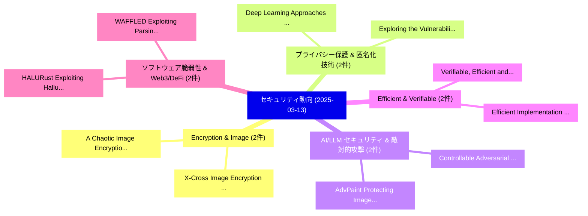

# 📅 02_daily: 日次エグゼクティブサマリー報告書 (2025-03-13)

**集計日時**: 2026-10-02 23:05:19 UTC  
**対象日付**: 2025-03-13  
**本日収集論文数**: 25 件  

---

## 💡 主要セキュリティ動向・脅威インサイト (Executive Insights)

本日の収集論文（計 25 件）において、以下の重点セキュリティ領域で活発な研究動向が確認されました：
- **Encryption & Image** (2 件): 注目論文として 「A Chaotic Image Encryption Sch...」、「X-Cross: Image Encryption Feat...」 等が発表され、実務防御および攻撃検証の進展が見られます。
- **プライバシー保護 & 匿名化技術** (2 件): 注目論文として 「Deep Learning Approaches for A...」、「Exploring the Vulnerabilities ...」 等が発表され、実務防御および攻撃検証の進展が見られます。
- **AI/LLM セキュリティ & 敵対的攻撃** (2 件): 注目論文として 「AdvPaint: Protecting Images fr...」、「Controllable Adversarial Makeu...」 等が発表され、実務防御および攻撃検証の進展が見られます。
- **Efficient & Verifiable** (2 件): 注目論文として 「Verifiable, Efficient and Conf...」、「Efficient Implementation of CR...」 等が発表され、実務防御および攻撃検証の進展が見られます。
- **ソフトウェア脆弱性 & Web3/DeFi** (2 件): 注目論文として 「HALURust: Exploiting Hallucina...」、「WAFFLED: Exploiting Parsing Di...」 等が発表され、実務防御および攻撃検証の進展が見られます。

### 🗺️ 技術・脅威トピックマインドマップ

---

## 📌 日次セキュリティ論文一覧 (日本語表形式)

| No | arXiv ID | 論文タイトル (日本語訳) | 重要キーワード | 構造化エグゼクティブ要約 (背景・提案・影響) | 脅威分類 | 詳細リンク |
|---|---|---|---|---|---|---|
| 1 | `2503.09939v1` | [A Chaotic Image Encryption Scheme Using Novel Geometric Block Permutation and Dynamic Substitution（セキュリティ分析論文）](../../okf/papers/2025-03-13/2503.09939.md) | `Dynamic Substitution`, `Muhammad Abdullah Hussain Khan`, `Mujeeb Ur Rehman` | 【提案】概要 (Overview & Key Finding) 本論文「A Chaotic Image Encryption Scheme Using Novel Geometric...。実証評価により経営層・セキュリティ管理者向け推奨アクション (E... | `cs.CR` | [arXiv](https://arxiv.org/abs/2503.09939v1) &#124; [OKF](../../okf/papers/2025-03-13/2503.09939.md) |
| 2 | `2503.09953v1` | [X-Cross: Image Encryption Featuring Novel Dual-Layer Block Permutation and Dynamic Substitution Techniques（セキュリティ分析論文）](../../okf/papers/2025-03-13/2503.09953.md) | `Layer Block Permutation`, `Dynamic Substitution Techniques`, `Dual-Layer Block` | 【提案】概要 (Overview & Key Finding) 本論文「X-Cross: Image Encryption Featuring Novel Dual-Layer Bl...。実証評価により経営層・セキュリティ管理者向け推奨アクション (E... | `cs.CR` | [arXiv](https://arxiv.org/abs/2503.09953v1) &#124; [OKF](../../okf/papers/2025-03-13/2503.09953.md) |
| 3 | `2503.09964v1` | [ExtremeAIGC: LMM Vulnerability to AI-Generated Extremist Contentのベンチマーク評価](../../okf/papers/2025-03-13/2503.09964.md) | `AI-Generated Extremist`, `Generated Extremist Content`, `Generated Extremist` | 【提案】概要 (Overview & Key Finding) 本論文「ExtremeAIGC: LMM 脆弱性 to AI-Generated Extremist Contentの...。実証評価により経営層・セキュリティ管理者向け推奨アクション (E... | `cs.CR` | [arXiv](https://arxiv.org/abs/2503.09964v1) &#124; [OKF](../../okf/papers/2025-03-13/2503.09964.md) |
| 4 | `2503.10058v1` | [Deep Learning Approaches for Anti-Money Laundering on Mobile Transactions: Review, Framework, and Directions（セキュリティ分析論文）](../../okf/papers/2025-03-13/2503.10058.md) | `Deep Learning Approaches`, `Money Laundering`, `Mobile Transactions` | 【提案】概要 (Overview & Key Finding) 本論文「Deep Learning Approaches for Anti-Money Laundering on M...。実証評価により経営層・セキュリティ管理者向け推奨アクション (E... | `cs.CR` | [arXiv](https://arxiv.org/abs/2503.10058v1) &#124; [OKF](../../okf/papers/2025-03-13/2503.10058.md) |
| 5 | `2503.10063v2` | [Provably Secure Covert Messaging Using Image-based Diffusion Processes（セキュリティ分析論文）](../../okf/papers/2025-03-13/2503.10063.md) | `Provably Secure Covert Messaging Using Image`, `Diffusion Processes`, `Image-based Diffusion` | 【提案】概要 (Overview & Key Finding) 本論文「Provably Secure Covert Messaging Using Image-based Diff...。実証評価によりBauer, Wenxuan Bao, Vince... | `cs.CR` | [arXiv](https://arxiv.org/abs/2503.10063v2) &#124; [OKF](../../okf/papers/2025-03-13/2503.10063.md) |
| 6 | `2503.10074v2` | [Demoting Security via Exploitation of Cache Demote Operation in Intel's Latest ISA Extension（セキュリティ分析論文）](../../okf/papers/2025-03-13/2503.10074.md) | `Cache Demote Operation`, `Demoting Security`, `Cache Demote Operati` | 【提案】概要 (Overview & Key Finding) 本論文「Demoting Security via Exploitation of Cache Demote Oper...。実証評価により経営層・セキュリティ管理者向け推奨アクション (E... | `cs.CR` | [arXiv](https://arxiv.org/abs/2503.10074v2) &#124; [OKF](../../okf/papers/2025-03-13/2503.10074.md) |
| 7 | `2503.10081v1` | [AdvPaint: Protecting Images from Inpainting Manipulation via Adversarial Attention Disruption（セキュリティ分析論文）](../../okf/papers/2025-03-13/2503.10081.md) | `Adversarial Attention Disruption`, `Protecting Images`, `Inpainting Manipulation` | 【提案】概要 (Overview & Key Finding) 本論文「AdvPaint: Protecting Images from Inpainting Manipulatio...。実証評価により経営層・セキュリティ管理者向け推奨アクション (E... | `cs.CR` | [arXiv](https://arxiv.org/abs/2503.10081v1) &#124; [OKF](../../okf/papers/2025-03-13/2503.10081.md) |
| 8 | `2503.10171v1` | [Verifiable, Efficient and Confidentiality-Preserving Graph Search with Transparency（セキュリティ分析論文）](../../okf/papers/2025-03-13/2503.10171.md) | `Preserving Graph Search`, `Confidentiality-Preserving Graph`, `Qiuhao Wang` | 【提案】概要 (Overview & Key Finding) 本論文「Verifiable, Efficient and Confidentiality-Preserving Gr...。実証評価により経営層・セキュリティ管理者向け推奨アクション (E... | `cs.CR` | [arXiv](https://arxiv.org/abs/2503.10171v1) &#124; [OKF](../../okf/papers/2025-03-13/2503.10171.md) |
| 9 | `2503.10185v2` | [Optimal Reward Allocation via Proportional Splitting（セキュリティ分析論文）](../../okf/papers/2025-03-13/2503.10185.md) | `Optimal Reward Allocation`, `Proportional Splitting`, `Lukas Aumayr` | 【提案】概要 (Overview & Key Finding) 本論文「Optimal Reward Allocation via Proportional Splitting（セキ...。実証評価により経営層・セキュリティ管理者向け推奨アクション (E... | `cs.CR` | [arXiv](https://arxiv.org/abs/2503.10185v2) &#124; [OKF](../../okf/papers/2025-03-13/2503.10185.md) |
| 10 | `2503.10207v1` | [Efficient Implementation of CRYSTALS-KYBER Key Encapsulation Mechanism on ESP32（セキュリティ分析論文）](../../okf/papers/2025-03-13/2503.10207.md) | `Key Encapsulation Mechanism`, `Efficient Implementation`, `CRYSTALS-KYBER Key` | 【提案】概要 (Overview & Key Finding) 本論文「Efficient Implementation of CRYSTALS-KYBER Key Encapsul...。実証評価により経営層・セキュリティ管理者向け推奨アクション (E... | `cs.CR` | [arXiv](https://arxiv.org/abs/2503.10207v1) &#124; [OKF](../../okf/papers/2025-03-13/2503.10207.md) |
| 11 | `2503.10218v1` | [Moss: Proxy Model-based Full-Weight Aggregation in 連合学習 with Heterogeneous Models](../../okf/papers/2025-03-13/2503.10218.md) | `Proxy Model`, `Weight Aggregation`, `Heterogeneous Models` | 【提案】概要 (Overview & Key Finding) 本論文「Moss: Proxy Model-based Full-Weight Aggregation in 連合学習...。実証評価により経営層・セキュリティ管理者向け推奨アクション (E... | `cs.CR` | [arXiv](https://arxiv.org/abs/2503.10218v1) &#124; [OKF](../../okf/papers/2025-03-13/2503.10218.md) |
| 12 | `2503.10238v1` | [Post Quantum Migration of Tor（セキュリティ分析論文）](../../okf/papers/2025-03-13/2503.10238.md) | `Post Quantum Migration`, `Denis Berger`, `Mouad Lemoudden` | 【提案】概要 (Overview & Key Finding) 本論文「Post 量子 Migration of Tor（セキュリティ分析論文）」（原題: Post 量子 Migra...。実証評価により経営層・セキュリティ管理者向け推奨アクション (E... | `cs.CR` | [arXiv](https://arxiv.org/abs/2503.10238v1) &#124; [OKF](../../okf/papers/2025-03-13/2503.10238.md) |
| 13 | `2503.10239v1` | [I Can Tell Your Secrets: Inferring Privacy Attributes from Mini-app Interaction History in Super-apps（セキュリティ分析論文）](../../okf/papers/2025-03-13/2503.10239.md) | `Inferring Privacy Attributes`, `Interaction History`, `Mini-app Interaction` | 【提案】概要 (Overview & Key Finding) 本論文「I Can Tell Your Secrets: Inferring Privacy Attributes f...。実証評価により経営層・セキュリティ管理者向け推奨アクション (E... | `cs.CR` | [arXiv](https://arxiv.org/abs/2503.10239v1) &#124; [OKF](../../okf/papers/2025-03-13/2503.10239.md) |
| 14 | `2503.10255v1` | [An Open-RAN Testbed for Detecting and Mitigating Radio-Access Anomalies（セキュリティ分析論文）](../../okf/papers/2025-03-13/2503.10255.md) | `Mitigating Radio`, `Access Anomalies`, `Open-RAN Testbed` | 【提案】概要 (Overview & Key Finding) 本論文「An Open-RAN Testbed for Detecting and Mitigating Radio-...。実証評価により経営層・セキュリティ管理者向け推奨アクション (E... | `cs.CR` | [arXiv](https://arxiv.org/abs/2503.10255v1) &#124; [OKF](../../okf/papers/2025-03-13/2503.10255.md) |
| 15 | `2503.10269v1` | [Targeted Data Poisoning for Black-Box Audio Datasets Ownership Verification（セキュリティ分析論文）](../../okf/papers/2025-03-13/2503.10269.md) | `Box Audio Datasets Ownership Verification`, `Targeted Data Poisoning`, `Black-Box Audio` | 【提案】概要 (Overview & Key Finding) 本論文「Targeted Data Poisoning for Black-Box Audio Datasets Ow...。実証評価により経営層・セキュリティ管理者向け推奨アクション (E... | `cs.CR` | [arXiv](https://arxiv.org/abs/2503.10269v1) &#124; [OKF](../../okf/papers/2025-03-13/2503.10269.md) |
| 16 | `2503.10320v1` | [Combinatorial Designs and Cellular Automata: A Survey（セキュリティ分析論文）](../../okf/papers/2025-03-13/2503.10320.md) | `Combinatorial Designs`, `Cellular Automata`, `Luca Manzoni` | 【提案】概要 (Overview & Key Finding) 本論文「Combinatorial Designs and Cellular Automata: A Survey（セ...。実証評価により経営層・セキュリティ管理者向け推奨アクション (E... | `cs.CR` | [arXiv](https://arxiv.org/abs/2503.10320v1) &#124; [OKF](../../okf/papers/2025-03-13/2503.10320.md) |
| 17 | `2503.10411v2` | [Decentralized Fair Exchange with Advertising（セキュリティ分析論文）](../../okf/papers/2025-03-13/2503.10411.md) | `Decentralized Fair Exchange`, `Pierpaolo Della Monica`, `Ivan Visconti` | 【提案】概要 (Overview & Key Finding) 本論文「Decentralized Fair Exchange with Advertising（セキュリティ分析論文...。実証評価により経営層・セキュリティ管理者向け推奨アクション (E... | `cs.CR` | [arXiv](https://arxiv.org/abs/2503.10411v2) &#124; [OKF](../../okf/papers/2025-03-13/2503.10411.md) |
| 18 | `2503.10549v3` | [Controllable Adversarial Makeup for Privacy via Text-Guided Diffusion（セキュリティ分析論文）](../../okf/papers/2025-03-13/2503.10549.md) | `Controllable Adversarial Makeup`, `Guided Diffusion`, `Text-Guided Diffusion` | 【提案】概要 (Overview & Key Finding) 本論文「Controllable Adversarial Makeup for Privacy via Text-Gu...。実証評価により経営層・セキュリティ管理者向け推奨アクション (E... | `cs.CR` | [arXiv](https://arxiv.org/abs/2503.10549v3) &#124; [OKF](../../okf/papers/2025-03-13/2503.10549.md) |
| 19 | `2503.10619v5` | [Tempest: Autonomous Multi-Turn Jailbreaking of 大規模言語モデル with Tree Search](../../okf/papers/2025-03-13/2503.10619.md) | `Autonomous Multi`, `Turn Jailbreaking`, `Tree Search` | 【提案】概要 (Overview & Key Finding) 本論文「Tempest: Autonomous Multi-Turn ジェイルブレイクing of 大規模言語モデル ...。実証評価により経営層・セキュリティ管理者向け推奨アクション (E... | `cs.CR` | [arXiv](https://arxiv.org/abs/2503.10619v5) &#124; [OKF](../../okf/papers/2025-03-13/2503.10619.md) |
| 20 | `2503.10793v1` | [HALURust: Exploiting Hallucinations of 大規模言語モデル to Detect Vulnerabilities in Rust](../../okf/papers/2025-03-13/2503.10793.md) | `Exploiting Hallucinations`, `Detect Vulnerabilities`, `Large Language Models` | 【提案】概要 (Overview & Key Finding) 本論文「HALURust: Exploiting Hallucinations of 大規模言語モデル to Dete...。実証評価により経営層・セキュリティ管理者向け推奨アクション (E... | `cs.CR` | [arXiv](https://arxiv.org/abs/2503.10793v1) &#124; [OKF](../../okf/papers/2025-03-13/2503.10793.md) |
| 21 | `2503.10809v3` | [MIP against Agent: Malicious Image Patches Hijacking Multimodal OS Agents（セキュリティ分析論文）](../../okf/papers/2025-03-13/2503.10809.md) | `Malicious Image Patches Hijacking Multimodal`, `Lukas Aichberger`, `Alasdair Paren` | 【提案】概要 (Overview & Key Finding) 本論文「MIP against Agent: Malicious Image Patches Hijacking Mu...。実証評価により経営層・セキュリティ管理者向け推奨アクション (E... | `cs.CR` | [arXiv](https://arxiv.org/abs/2503.10809v3) &#124; [OKF](../../okf/papers/2025-03-13/2503.10809.md) |
| 22 | `2503.10846v4` | [WAFFLED: Exploiting Parsing Discrepancies to Bypass Web Application Firewalls（セキュリティ分析論文）](../../okf/papers/2025-03-13/2503.10846.md) | `Bypass Web Application Firewalls`, `Exploiting Parsing Discrepancies`, `Seyed Ali Akhavani` | 【提案】概要 (Overview & Key Finding) 本論文「WAFFLED: Exploiting Parsing Discrepancies to Bypass Web...。実証評価により経営層・セキュリティ管理者向け推奨アクション (E... | `cs.CR` | [arXiv](https://arxiv.org/abs/2503.10846v4) &#124; [OKF](../../okf/papers/2025-03-13/2503.10846.md) |
| 23 | `2503.10944v1` | [Phishsense-1B: A Technical Perspective on an AI-Powered Phishing Detection Model（セキュリティ分析論文）](../../okf/papers/2025-03-13/2503.10944.md) | `Powered Phishing Detection Model`, `Technical Perspective`, `AI-Powered Phishing` | 【提案】概要 (Overview & Key Finding) 本論文「Phishsense-1B: A Technical Perspective on an AI-Powered...。実証評価により経営層・セキュリティ管理者向け推奨アクション (E... | `cs.CR` | [arXiv](https://arxiv.org/abs/2503.10944v1) &#124; [OKF](../../okf/papers/2025-03-13/2503.10944.md) |
| 24 | `2503.10945v3` | [Gaussian DP for Reporting Differential Privacy Guarantees in Machine Learning（セキュリティ分析論文）](../../okf/papers/2025-03-13/2503.10945.md) | `Reporting Differential Privacy Guarantees`, `Machine Learning`, `Juan Felipe Gomez` | 【提案】概要 (Overview & Key Finding) 本論文「Gaussian DP for Reporting 差分プライバシー Guarantees in Machin...。実証評価により経営層・セキュリティ管理者向け推奨アクション (E... | `cs.CR` | [arXiv](https://arxiv.org/abs/2503.10945v3) &#124; [OKF](../../okf/papers/2025-03-13/2503.10945.md) |
| 25 | `2503.11514v2` | [Exploring the Vulnerabilities of 連合学習: A Deep Dive into Gradient Inversion Attacks](../../okf/papers/2025-03-13/2503.11514.md) | `Gradient Inversion Attacks`, `Deep Dive`, `Federated Learning` | 【提案】概要 (Overview & Key Finding) 本論文「Exploring the Vulnerabilities of 連合学習: A Deep Dive into...。実証評価により経営層・セキュリティ管理者向け推奨アクション (E... | `cs.CR` | [arXiv](https://arxiv.org/abs/2503.11514v2) &#124; [OKF](../../okf/papers/2025-03-13/2503.11514.md) |

