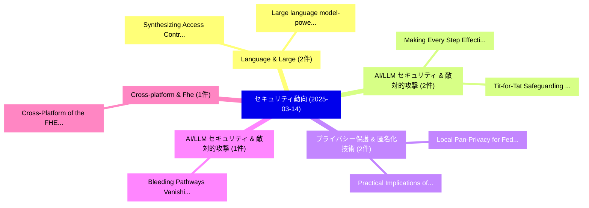

# 📅 02_daily: 日次エグゼクティブサマリー報告書 (2025-03-14)

**集計日時**: 2026-10-02 23:05:20 UTC  
**対象日付**: 2025-03-14  
**本日収集論文数**: 17 件  

---

## 💡 主要セキュリティ動向・脅威インサイト (Executive Insights)

本日の収集論文（計 17 件）において、以下の重点セキュリティ領域で活発な研究動向が確認されました：
- **Language & Large** (2 件): 注目論文として 「Synthesizing Access Control Po...」、「Large language model-powered A...」 等が発表され、実務防御および攻撃検証の進展が見られます。
- **AI/LLM セキュリティ & 敵対的攻撃** (2 件): 注目論文として 「Tit-for-Tat: Safeguarding Larg...」、「Making Every Step Effective: J...」 等が発表され、実務防御および攻撃検証の進展が見られます。
- **プライバシー保護 & 匿名化技術** (2 件): 注目論文として 「Local Pan-Privacy for Federate...」、「Practical Implications of Impl...」 等が発表され、実務防御および攻撃検証の進展が見られます。
- **AI/LLM セキュリティ & 敵対的攻撃** (1 件): 注目論文として 「Bleeding Pathways: Vanishing D...」 等が発表され、実務防御および攻撃検証の進展が見られます。
- **Cross-platform & Fhe** (1 件): 注目論文として 「Cross-Platform of the FHE Libr...」 等が発表され、実務防御および攻撃検証の進展が見られます。

### 🗺️ 技術・脅威トピックマインドマップ

---

## 📌 日次セキュリティ論文一覧 (日本語表形式)

| No | arXiv ID | 論文タイトル (日本語訳) | 重要キーワード | 構造化エグゼクティブ要約 (背景・提案・影響) | 脅威分類 | 詳細リンク |
|---|---|---|---|---|---|---|
| 1 | `2503.11185v2` | [Bleeding Pathways: Vanishing Discriminability in LLM Hidden States Fuels Jailbreak Attacks（セキュリティ分析論文）](../../okf/papers/2025-03-14/2503.11185.md) | `Hidden States Fuels Jailbreak Attacks`, `Bleeding Pathways`, `Vanishing Discriminability` | 【提案】概要 (Overview & Key Finding) 本論文「Bleeding Pathways: Vanishing Discriminability in LLM Hi...。実証評価により経営層・セキュリティ管理者向け推奨アクション (E... | `cs.CR` | [arXiv](https://arxiv.org/abs/2503.11185v2) &#124; [OKF](../../okf/papers/2025-03-14/2503.11185.md) |
| 2 | `2503.11216v2` | [Cross-Platform of the FHE Libraries: Novel Insights into SEAL and Openfheのベンチマーク評価](../../okf/papers/2025-03-14/2503.11216.md) | `Platform Benchmarking`, `Cross-Platform Benchmarking`, `Sana Ullah Jan` | 【提案】概要 (Overview & Key Finding) 本論文「Cross-Platform of the FHE Libraries: Novel Insights int...。実証評価により経営層・セキュリティ管理者向け推奨アクション (E... | `cs.CR` | [arXiv](https://arxiv.org/abs/2503.11216v2) &#124; [OKF](../../okf/papers/2025-03-14/2503.11216.md) |
| 3 | `2503.11404v1` | [A Correct Usage of Cryptography in Semantic Watermarks for Diffusion Modelsに向けて](../../okf/papers/2025-03-14/2503.11404.md) | `Correct Usage`, `Semantic Watermarks`, `Diffusion Models` | 【提案】概要 (Overview & Key Finding) 本論文「A Correct Usage of 暗号技術 in Semantic Watermarks for Diff...。実証評価により経営層・セキュリティ管理者向け推奨アクション (E... | `cs.CR` | [arXiv](https://arxiv.org/abs/2503.11404v1) &#124; [OKF](../../okf/papers/2025-03-14/2503.11404.md) |
| 4 | `2503.11508v1` | [Leveraging Angle of Arrival Estimation against Impersonation Attacks in Physical Layer Authentication（セキュリティ分析論文）](../../okf/papers/2025-03-14/2503.11508.md) | `Physical Layer Authentication`, `Leveraging Angle`, `Arrival Estimation` | 【提案】概要 (Overview & Key Finding) 本論文「Leveraging Angle of Arrival Estimation against Imperson...。実証評価により経営層・セキュリティ管理者向け推奨アクション (E... | `cs.CR` | [arXiv](https://arxiv.org/abs/2503.11508v1) &#124; [OKF](../../okf/papers/2025-03-14/2503.11508.md) |
| 5 | `2503.11573v1` | [Synthesizing Access Control Policies using 大規模言語モデル](../../okf/papers/2025-03-14/2503.11573.md) | `Synthesizing Access Control Policies`, `Large Language Models`, `Adarsh Vatsa` | 【提案】概要 (Overview & Key Finding) 本論文「Synthesizing アクセス制御 Policies using 大規模言語モデル」（原題: Synthe...。実証評価により経営層・セキュリティ管理者向け推奨アクション (E... | `cs.CR` | [arXiv](https://arxiv.org/abs/2503.11573v1) &#124; [OKF](../../okf/papers/2025-03-14/2503.11573.md) |
| 6 | `2503.11619v1` | [Tit-for-Tat: Safeguarding Large Vision-Language Models Against Jailbreak Attacks via Adversarial Defense（セキュリティ分析論文）](../../okf/papers/2025-03-14/2503.11619.md) | `Safeguarding Large Vision`, `Adversarial Defense`, `Vision-Language Models` | 【提案】概要 (Overview & Key Finding) 本論文「Tit-for-Tat: Safeguarding Large Vision-Language Models ...。実証評価により経営層・セキュリティ管理者向け推奨アクション (E... | `cs.CR` | [arXiv](https://arxiv.org/abs/2503.11619v1) &#124; [OKF](../../okf/papers/2025-03-14/2503.11619.md) |
| 7 | `2503.11634v2` | [Translating Between the Common Haar Random State Model and the Unitary Model（セキュリティ分析論文）](../../okf/papers/2025-03-14/2503.11634.md) | `Common Haar Random State Model`, `Unitary Model`, `Eli Goldin` | 【提案】概要 (Overview & Key Finding) 本論文「Translating Between the Common Haar Random State Model ...。実証評価により経営層・セキュリティ管理者向け推奨アクション (E... | `cs.CR` | [arXiv](https://arxiv.org/abs/2503.11634v2) &#124; [OKF](../../okf/papers/2025-03-14/2503.11634.md) |
| 8 | `2503.11750v1` | [Making Every Step Effective: Jailbreaking Large Vision-Language Models Through Hierarchical KV Equalization（セキュリティ分析論文）](../../okf/papers/2025-03-14/2503.11750.md) | `Making Every Step Effective`, `Jailbreaking Large Vision`, `Vision-Language Models` | 【提案】概要 (Overview & Key Finding) 本論文「Making Every Step Effective: ジェイルブレイクing Large Vision-L...。実証評価により経営層・セキュリティ管理者向け推奨アクション (E... | `cs.CR` | [arXiv](https://arxiv.org/abs/2503.11750v1) &#124; [OKF](../../okf/papers/2025-03-14/2503.11750.md) |
| 9 | `2503.11777v1` | [Enhancing Resiliency of Sketch-based Security via LSB Sharing-based Dynamic Late Merging（セキュリティ分析論文）](../../okf/papers/2025-03-14/2503.11777.md) | `Dynamic Late Merging`, `Enhancing Resiliency`, `Sketch-based Security` | 【提案】概要 (Overview & Key Finding) 本論文「Enhancing Resiliency of Sketch-based Security via LSB S...。実証評価により経営層・セキュリティ管理者向け推奨アクション (E... | `cs.CR` | [arXiv](https://arxiv.org/abs/2503.11777v1) &#124; [OKF](../../okf/papers/2025-03-14/2503.11777.md) |
| 10 | `2503.11841v1` | [Trust Under Siege: Label Spoofing Attacks against Machine Learning for Android マルウェア検出](../../okf/papers/2025-03-14/2503.11841.md) | `Label Spoofing Attacks`, `Machine Learning`, `Android Malware Detection` | 【提案】概要 (Overview & Key Finding) 本論文「Trust Under Siege: Label Spoofing Attacks against Machi...。実証評価により経営層・セキュリティ管理者向け推奨アクション (E... | `cs.CR` | [arXiv](https://arxiv.org/abs/2503.11841v1) &#124; [OKF](../../okf/papers/2025-03-14/2503.11841.md) |
| 11 | `2503.11850v1` | [Local Pan-Privacy for Federated Analytics（セキュリティ分析論文）](../../okf/papers/2025-03-14/2503.11850.md) | `Local Pan`, `Federated Analytics`, `Vitaly Feldman` | 【提案】概要 (Overview & Key Finding) 本論文「Local Pan-Privacy for Federated Analytics（セキュリティ分析論文）」（...。実証評価によりRothblum, Kunal Talwar - ... | `cs.CR` | [arXiv](https://arxiv.org/abs/2503.11850v1) &#124; [OKF](../../okf/papers/2025-03-14/2503.11850.md) |
| 12 | `2503.11897v2` | [PREAMBLE: Private and Efficient Aggregation via Block Sparse Vectors（セキュリティ分析論文）](../../okf/papers/2025-03-14/2503.11897.md) | `Block Sparse Vectors`, `Efficient Aggregation`, `Hilal Asi` | 【提案】概要 (Overview & Key Finding) 本論文「PREAMBLE: Private and Efficient Aggregation via Block S...。実証評価によりRothblum, Kuna。 | `cs.CR` | [arXiv](https://arxiv.org/abs/2503.11897v2) &#124; [OKF](../../okf/papers/2025-03-14/2503.11897.md) |
| 13 | `2503.11913v1` | [Implementation of classical client universal blind quantum computation with 8-state RSP in current architecture（セキュリティ分析論文）](../../okf/papers/2025-03-14/2503.11913.md) | `8-state RSP`, `Venkat Chandra Gunja`, `Aman Gupta` | 【提案】概要 (Overview & Key Finding) 本論文「Implementation of classical client universal blind 量子 c...。実証評価により経営層・セキュリティ管理者向け推奨アクション (E... | `cs.CR` | [arXiv](https://arxiv.org/abs/2503.11913v1) &#124; [OKF](../../okf/papers/2025-03-14/2503.11913.md) |
| 14 | `2503.11917v3` | [A Framework for Evaluating Emerging Cyberattack Capabilities of AI（セキュリティ分析論文）](../../okf/papers/2025-03-14/2503.11917.md) | `Evaluating Emerging Cyberattack Capabilities`, `Raluca Ada Popa`, `Mikel Rodriguez` | 【提案】概要 (Overview & Key Finding) 本論文「A Framework for Evaluating Emerging Cyberattack Capabil...。実証評価により経営層・セキュリティ管理者向け推奨アクション (E... | `cs.CR` | [arXiv](https://arxiv.org/abs/2503.11917v3) &#124; [OKF](../../okf/papers/2025-03-14/2503.11917.md) |
| 15 | `2503.11920v1` | [Practical Implications of Implementing Local Differential Privacy for Smart grids（セキュリティ分析論文）](../../okf/papers/2025-03-14/2503.11920.md) | `Implementing Local Differential Privacy`, `Practical Implications`, `Mubashir Husain Rehmani` | 【提案】概要 (Overview & Key Finding) 本論文「Practical Implications of Implementing Local 差分プライバシー f...。実証評価により経営層・セキュリティ管理者向け推奨アクション (E... | `cs.CR` | [arXiv](https://arxiv.org/abs/2503.11920v1) &#124; [OKF](../../okf/papers/2025-03-14/2503.11920.md) |
| 16 | `2503.15542v1` | [Identifying Likely-Reputable Blockchain Projects on Ethereum（セキュリティ分析論文）](../../okf/papers/2025-03-14/2503.15542.md) | `Reputable Blockchain Projects`, `Identifying Likely`, `Likely-Reputable Blockchain` | 【提案】概要 (Overview & Key Finding) 本論文「Identifying Likely-Reputable Blockchain Projects on Eth...。実証評価により経営層・セキュリティ管理者向け推奨アクション (E... | `cs.CR` | [arXiv](https://arxiv.org/abs/2503.15542v1) &#124; [OKF](../../okf/papers/2025-03-14/2503.15542.md) |
| 17 | `2503.17378v2` | [Large language model-powered AI systems achieve self-replication with no human intervention（セキュリティ分析論文）](../../okf/papers/2025-03-14/2503.17378.md) | `model-powered AI`, `Xudong Pan`, `Jiarun Dai` | 【提案】概要 (Overview & Key Finding) 本論文「Large language model-powered AI systems achieve self-re...。実証評価により# Large language model-po... | `cs.CR` | [arXiv](https://arxiv.org/abs/2503.17378v2) &#124; [OKF](../../okf/papers/2025-03-14/2503.17378.md) |

