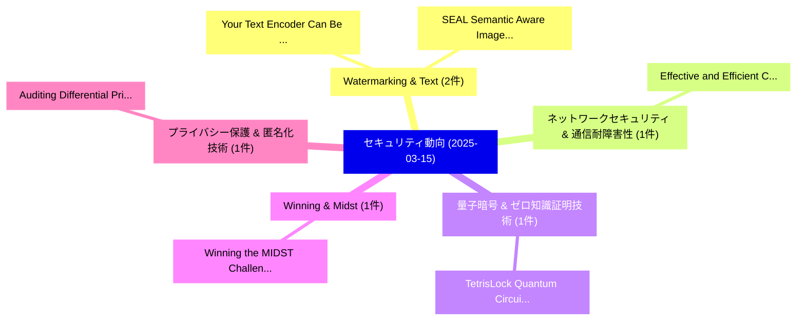

# 📅 02_daily: 日次エグゼクティブサマリー報告書 (2025-03-15)

**集計日時**: 2026-10-02 23:05:20 UTC  
**対象日付**: 2025-03-15  
**本日収集論文数**: 13 件  

---

## 💡 主要セキュリティ動向・脅威インサイト (Executive Insights)

本日の収集論文（計 13 件）において、以下の重点セキュリティ領域で活発な研究動向が確認されました：
- **Watermarking & Text** (2 件): 注目論文として 「Your Text Encoder Can Be An Ob...」、「SEAL: Semantic Aware Image Wat...」 等が発表され、実務防御および攻撃検証の進展が見られます。
- **ネットワークセキュリティ & 通信耐障害性** (1 件): 注目論文として 「Effective and Efficient Cross-...」 等が発表され、実務防御および攻撃検証の進展が見られます。
- **量子暗号 & ゼロ知識証明技術** (1 件): 注目論文として 「TetrisLock: Quantum Circuit Sp...」 等が発表され、実務防御および攻撃検証の進展が見られます。
- **Winning & Midst** (1 件): 注目論文として 「Winning the MIDST Challenge: N...」 等が発表され、実務防御および攻撃検証の進展が見られます。
- **プライバシー保護 & 匿名化技術** (1 件): 注目論文として 「Auditing Differential Privacy ...」 等が発表され、実務防御および攻撃検証の進展が見られます。

### 🗺️ 技術・脅威トピックマインドマップ

---

## 📌 日次セキュリティ論文一覧 (日本語表形式)

| No | arXiv ID | 論文タイトル (日本語訳) | 重要キーワード | 構造化エグゼクティブ要約 (背景・提案・影響) | 脅威分類 | 詳細リンク |
|---|---|---|---|---|---|---|
| 1 | `2503.11945v1` | [Your Text Encoder Can Be An Object-Level Watermarking Controller（セキュリティ分析論文）](../../okf/papers/2025-03-15/2503.11945.md) | `Level Watermarking Controller`, `Object-Level Watermarking`, `Naresh Kumar Devulapally` | 【提案】概要 (Overview & Key Finding) 本論文「Your Text Encoder Can Be An Object-Level Watermarking C...。実証評価により経営層・セキュリティ管理者向け推奨アクション (E... | `cs.CR` | [arXiv](https://arxiv.org/abs/2503.11945v1) &#124; [OKF](../../okf/papers/2025-03-15/2503.11945.md) |
| 2 | `2503.11963v4` | [Effective and Efficient Cross-City Traffic Knowledge Transfer: A Privacy-Preserving Perspective（セキュリティ分析論文）](../../okf/papers/2025-03-15/2503.11963.md) | `City Traffic Knowledge Transfer`, `Efficient Cross`, `Preserving Perspective` | 【提案】概要 (Overview & Key Finding) 本論文「Effective and Efficient Cross-City Traffic Knowledge Tr...。実証評価により経営層・セキュリティ管理者向け推奨アクション (E... | `cs.CR` | [arXiv](https://arxiv.org/abs/2503.11963v4) &#124; [OKF](../../okf/papers/2025-03-15/2503.11963.md) |
| 3 | `2503.11982v1` | [TetrisLock: Quantum Circuit Split Compilation with Interlocking Patterns（セキュリティ分析論文）](../../okf/papers/2025-03-15/2503.11982.md) | `Quantum Circuit Split Compilation`, `Interlocking Patterns`, `Qian Wang` | 【提案】概要 (Overview & Key Finding) 本論文「TetrisLock: 量子 Circuit Split Compilation with Interlock...。実証評価により経営層・セキュリティ管理者向け推奨アクション (E... | `cs.CR` | [arXiv](https://arxiv.org/abs/2503.11982v1) &#124; [OKF](../../okf/papers/2025-03-15/2503.11982.md) |
| 4 | `2503.12008v1` | [Winning the MIDST Challenge: New Membership Inference Attacks on Diffusion Models for Tabular Data Synthesis（セキュリティ分析論文）](../../okf/papers/2025-03-15/2503.12008.md) | `New Membership Inference Attacks`, `Tabular Data Synthesis`, `Diffusion Models` | 【提案】概要 (Overview & Key Finding) 本論文「Winning the MIDST Challenge: New Membership Inference A...。実証評価により経営層・セキュリティ管理者向け推奨アクション (E... | `cs.CR` | [arXiv](https://arxiv.org/abs/2503.12008v1) &#124; [OKF](../../okf/papers/2025-03-15/2503.12008.md) |
| 5 | `2503.12045v2` | [Auditing Differential Privacy in the Black-Box Setting（セキュリティ分析論文）](../../okf/papers/2025-03-15/2503.12045.md) | `Auditing Differential Privacy`, `Box Setting`, `Black-Box Setting` | 【提案】概要 (Overview & Key Finding) 本論文「Auditing 差分プライバシー in the Black-Box Setting（セキュリティ分析論文）」...。実証評価により経営層・セキュリティ管理者向け推奨アクション (E... | `cs.CR` | [arXiv](https://arxiv.org/abs/2503.12045v2) &#124; [OKF](../../okf/papers/2025-03-15/2503.12045.md) |
| 6 | `2503.12058v1` | [Revisiting Training-Inference Trigger Intensity in Backdoor Attacks（セキュリティ分析論文）](../../okf/papers/2025-03-15/2503.12058.md) | `Inference Trigger Intensity`, `Revisiting Training`, `Backdoor Attacks` | 【提案】概要 (Overview & Key Finding) 本論文「Revisiting Training-Inference Trigger Intensity in Back...。実証評価により経営層・セキュリティ管理者向け推奨アクション (E... | `cs.CR` | [arXiv](https://arxiv.org/abs/2503.12058v1) &#124; [OKF](../../okf/papers/2025-03-15/2503.12058.md) |
| 7 | `2503.12172v4` | [SEAL: Semantic Aware Image Watermarking（セキュリティ分析論文）](../../okf/papers/2025-03-15/2503.12172.md) | `Semantic Aware Image Watermarking`, `Kasra Arabi`, `Teal Witter` | 【提案】概要 (Overview & Key Finding) 本論文「SEAL: Semantic Aware Image Watermarking（セキュリティ分析論文）」（原題...。実証評価によりTeal Witter, Chinmay Hegd... | `cs.CR` | [arXiv](https://arxiv.org/abs/2503.12172v4) &#124; [OKF](../../okf/papers/2025-03-15/2503.12172.md) |
| 8 | `2503.12188v2` | [Multi-Agent Systems Execute Arbitrary Malicious Code（セキュリティ分析論文）](../../okf/papers/2025-03-15/2503.12188.md) | `Agent Systems Execute Arbitrary Malicious Code`, `Multi-Agent Systems`, `Harold Triedman` | 【提案】概要 (Overview & Key Finding) 本論文「Multi-Agent Systems Execute Arbitrary Malicious Code（セキ...。実証評価により経営層・セキュリティ管理者向け推奨アクション (E... | `cs.CR` | [arXiv](https://arxiv.org/abs/2503.12188v2) &#124; [OKF](../../okf/papers/2025-03-15/2503.12188.md) |
| 9 | `2503.12192v2` | [Closing the Chain: How to reduce your risk of being SolarWinds, Log4j, or XZ Utils（セキュリティ分析論文）](../../okf/papers/2025-03-15/2503.12192.md) | `Md Nazmul Haque`, `Sivana Hamer`, `Jacob Bowen` | 【提案】概要 (Overview & Key Finding) 本論文「Closing the Chain: How to reduce your risk of being Sol...。実証評価により経営層・セキュリティ管理者向け推奨アクション (E... | `cs.CR` | [arXiv](https://arxiv.org/abs/2503.12192v2) &#124; [OKF](../../okf/papers/2025-03-15/2503.12192.md) |
| 10 | `2503.12217v1` | [TFHE-Coder: Evaluating LLM-agentic Fully Homomorphic Encryption Code Generation（セキュリティ分析論文）](../../okf/papers/2025-03-15/2503.12217.md) | `Fully Homomorphic Encryption Code Generation`, `LLM-agentic Fully`, `Mayank Kumar` | 【提案】概要 (Overview & Key Finding) 本論文「TFHE-Coder: Evaluating LLM-agentic Fully 準同型暗号 Code Gen...。実証評価により経営層・セキュリティ管理者向け推奨アクション (E... | `cs.CR` | [arXiv](https://arxiv.org/abs/2503.12217v1) &#124; [OKF](../../okf/papers/2025-03-15/2503.12217.md) |
| 11 | `2503.12220v2` | [PA-CFL: Privacy-Adaptive Clustered 連合学習 for Transformer-Based Sales Forecasting on Heterogeneous Retail Data](../../okf/papers/2025-03-15/2503.12220.md) | `Based Sales Forecasting`, `Heterogeneous Retail Data`, `Privacy-Adaptive Clustered` | 【提案】概要 (Overview & Key Finding) 本論文「PA-CFL: Privacy-Adaptive Clustered 連合学習 for Transformer...。実証評価により経営層・セキュリティ管理者向け推奨アクション (E... | `cs.CR` | [arXiv](https://arxiv.org/abs/2503.12220v2) &#124; [OKF](../../okf/papers/2025-03-15/2503.12220.md) |
| 12 | `2503.12226v1` | [Research on Large Language Model Cross-Cloud Privacy Protection and Collaborative Training based on 連合学習](../../okf/papers/2025-03-15/2503.12226.md) | `Large Language Model Cross`, `Cloud Privacy Protection`, `Cross-Cloud Privacy` | 【提案】概要 (Overview & Key Finding) 本論文「Research on Large Language Model Cross-Cloud Privacy Pr...。実証評価により経営層・セキュリティ管理者向け推奨アクション (E... | `cs.CR` | [arXiv](https://arxiv.org/abs/2503.12226v1) &#124; [OKF](../../okf/papers/2025-03-15/2503.12226.md) |
| 13 | `2503.12248v1` | [Electromagnetic Side-Channel PRESENT Lightweight Cipherの分析](../../okf/papers/2025-03-15/2503.12248.md) | `Electromagnetic Side`, `Lightweight Cipher`, `Owen Lo` | 【提案】概要 (Overview & Key Finding) 本論文「Electromagnetic サイドチャネル攻撃 PRESENT Lightweight Cipherの分析...。実証評価により経営層・セキュリティ管理者向け推奨アクション (E... | `cs.CR` | [arXiv](https://arxiv.org/abs/2503.12248v1) &#124; [OKF](../../okf/papers/2025-03-15/2503.12248.md) |

