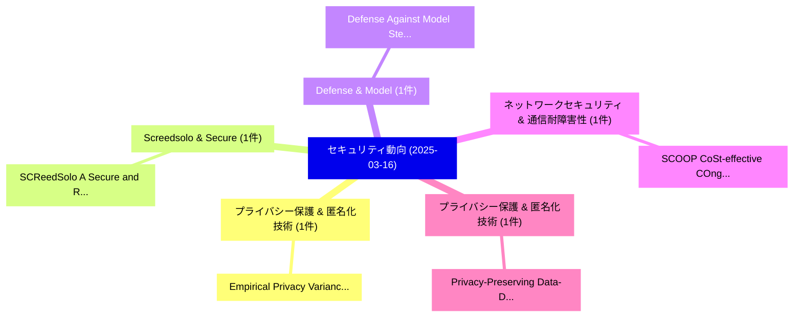

# 📅 02_daily: 日次エグゼクティブサマリー報告書 (2025-03-16)

**集計日時**: 2026-10-02 23:05:20 UTC  
**対象日付**: 2025-03-16  
**本日収集論文数**: 5 件  

---

## 💡 主要セキュリティ動向・脅威インサイト (Executive Insights)

本日の収集論文（計 5 件）において、以下の重点セキュリティ領域で活発な研究動向が確認されました：
- **プライバシー保護 & 匿名化技術** (1 件): 注目論文として 「Empirical Privacy Variance（セキュ...」 等が発表され、実務防御および攻撃検証の進展が見られます。
- **Screedsolo & Secure** (1 件): 注目論文として 「SCReedSolo: A Secure and Robus...」 等が発表され、実務防御および攻撃検証の進展が見られます。
- **Defense & Model** (1 件): 注目論文として 「Defense Against Model Stealing...」 等が発表され、実務防御および攻撃検証の進展が見られます。
- **ネットワークセキュリティ & 通信耐障害性** (1 件): 注目論文として 「SCOOP: CoSt-effective COngesti...」 等が発表され、実務防御および攻撃検証の進展が見られます。
- **プライバシー保護 & 匿名化技術** (1 件): 注目論文として 「Privacy-Preserving Data-Driven...」 等が発表され、実務防御および攻撃検証の進展が見られます。

### 🗺️ 技術・脅威トピックマインドマップ

---

## 📌 日次セキュリティ論文一覧 (日本語表形式)

| No | arXiv ID | 論文タイトル (日本語訳) | 重要キーワード | 構造化エグゼクティブ要約 (背景・提案・影響) | 脅威分類 | 詳細リンク |
|---|---|---|---|---|---|---|
| 1 | `2503.12314v2` | [Empirical Privacy Variance（セキュリティ分析論文）](../../okf/papers/2025-03-16/2503.12314.md) | `Empirical Privacy Variance`, `Yuzheng Hu`, `Fan Wu` | 【提案】概要 (Overview & Key Finding) 本論文「Empirical Privacy Variance（セキュリティ分析論文）」（原題: Empirical P...。実証評価により経営層・セキュリティ管理者向け推奨アクション (E... | `cs.CR` | [arXiv](https://arxiv.org/abs/2503.12314v2) &#124; [OKF](../../okf/papers/2025-03-16/2503.12314.md) |
| 2 | `2503.12368v3` | [SCReedSolo: A Secure and Robust LSB Image Steganography Framework with Randomized Symmetric Encryption and Reed-Solomon Coding（セキュリティ分析論文）](../../okf/papers/2025-03-16/2503.12368.md) | `Randomized Symmetric Encryption`, `Solomon Coding`, `Reed-Solomon Coding` | 【提案】概要 (Overview & Key Finding) 本論文「SCReedSolo: A Secure and Robust LSB Image Steganography...。実証評価により経営層・セキュリティ管理者向け推奨アクション (E... | `cs.CR` | [arXiv](https://arxiv.org/abs/2503.12368v3) &#124; [OKF](../../okf/papers/2025-03-16/2503.12368.md) |
| 3 | `2503.12497v1` | [Defense Against Model Stealing Based on Account-Aware Distribution Discrepancy（セキュリティ分析論文）](../../okf/papers/2025-03-16/2503.12497.md) | `Aware Distribution Discrepancy`, `Account-Aware Distribution`, `Ping Mei` | 【提案】概要 (Overview & Key Finding) 本論文「Defense Against Model Stealing Based on Account-Aware D...。実証評価により経営層・セキュリティ管理者向け推奨アクション (E... | `cs.CR` | [arXiv](https://arxiv.org/abs/2503.12497v1) &#124; [OKF](../../okf/papers/2025-03-16/2503.12497.md) |
| 4 | `2503.12625v2` | [SCOOP: CoSt-effective COngestiOn Attacks in Payment Channel Networks（セキュリティ分析論文）](../../okf/papers/2025-03-16/2503.12625.md) | `Payment Channel Networks`, `CoSt-effective COngestiOn`, `Mohammed Ababneh` | 【提案】概要 (Overview & Key Finding) 本論文「SCOOP: CoSt-effective COngestiOn Attacks in Payment Cha...。実証評価により経営層・セキュリティ管理者向け推奨アクション (E... | `cs.CR` | [arXiv](https://arxiv.org/abs/2503.12625v2) &#124; [OKF](../../okf/papers/2025-03-16/2503.12625.md) |
| 5 | `2503.13550v1` | [Privacy-Preserving Data-Driven Education: The Potential of Federated Learningに向けて](../../okf/papers/2025-03-16/2503.13550.md) | `Preserving Data`, `Driven Education`, `Privacy-Preserving Data` | 【提案】概要 (Overview & Key Finding) 本論文「Privacy-Preserving Data-Driven Education: The Potential...。実証評価により経営層・セキュリティ管理者向け推奨アクション (E... | `cs.CR` | [arXiv](https://arxiv.org/abs/2503.13550v1) &#124; [OKF](../../okf/papers/2025-03-16/2503.13550.md) |

