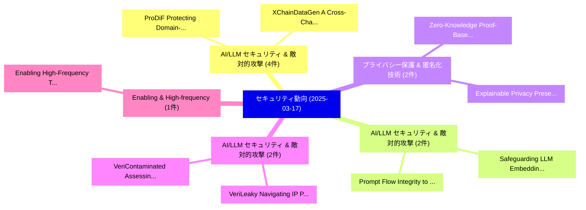

# 📅 02_daily: 日次エグゼクティブサマリー報告書 (2025-03-17)

**集計日時**: 2026-10-02 23:05:20 UTC  
**対象日付**: 2025-03-17  
**本日収集論文数**: 17 件  

---

## 💡 主要セキュリティ動向・脅威インサイト (Executive Insights)

本日の収集論文（計 17 件）において、以下の重点セキュリティ領域で活発な研究動向が確認されました：
- **AI/LLM セキュリティ & 敵対的攻撃** (4 件): 注目論文として 「ProDiF: Protecting Domain-Inva...」、「XChainDataGen: A Cross-Chain D...」 等が発表され、実務防御および攻撃検証の進展が見られます。
- **AI/LLM セキュリティ & 敵対的攻撃** (2 件): 注目論文として 「Safeguarding LLM Embeddings in...」、「Prompt Flow Integrity to Preve...」 等が発表され、実務防御および攻撃検証の進展が見られます。
- **プライバシー保護 & 匿名化技術** (2 件): 注目論文として 「Explainable Privacy Preservati...」、「Zero-Knowledge Proof-Based Con...」 等が発表され、実務防御および攻撃検証の進展が見られます。
- **AI/LLM セキュリティ & 敵対的攻撃** (2 件): 注目論文として 「VeriLeaky: Navigating IP Prote...」、「VeriContaminated: Assessing LL...」 等が発表され、実務防御および攻撃検証の進展が見られます。
- **Enabling & High-frequency** (1 件): 注目論文として 「Enabling High-Frequency Tradin...」 等が発表され、実務防御および攻撃検証の進展が見られます。

### 🗺️ 技術・脅威トピックマインドマップ

---

## 📌 日次セキュリティ論文一覧 (日本語表形式)

| No | arXiv ID | 論文タイトル (日本語訳) | 重要キーワード | 構造化エグゼクティブ要約 (背景・提案・影響) | 脅威分類 | 詳細リンク |
|---|---|---|---|---|---|---|
| 1 | `2503.12719v1` | [Enabling High-Frequency Trading with Near-Instant, Trustless Cross-Chain Transactions via Pre-Signing Adaptor Signatures（セキュリティ分析論文）](../../okf/papers/2025-03-17/2503.12719.md) | `Signing Adaptor Signatures`, `Enabling High`, `Frequency Trading` | 【提案】概要 (Overview & Key Finding) 本論文「Enabling High-Frequency Trading with Near-Instant, Trus...。実証評価により経営層・セキュリティ管理者向け推奨アクション (E... | `cs.CR` | [arXiv](https://arxiv.org/abs/2503.12719v1) &#124; [OKF](../../okf/papers/2025-03-17/2503.12719.md) |
| 2 | `2503.12801v1` | [BLIA: Detect model memorization in binary classification model through passive Label Inference attack（セキュリティ分析論文）](../../okf/papers/2025-03-17/2503.12801.md) | `Label Inference`, `Mohammad Wahiduzzaman Khan`, `Sheng Chen` | 【提案】概要 (Overview & Key Finding) 本論文「BLIA: Detect model memorization in binary classificatio...。実証評価により経営層・セキュリティ管理者向け推奨アクション (E... | `cs.CR` | [arXiv](https://arxiv.org/abs/2503.12801v1) &#124; [OKF](../../okf/papers/2025-03-17/2503.12801.md) |
| 3 | `2503.12896v1` | [Safeguarding LLM Embeddings in End-Cloud Collaboration via Entropy-Driven Perturbation（セキュリティ分析論文）](../../okf/papers/2025-03-17/2503.12896.md) | `Cloud Collaboration`, `Driven Perturbation`, `End-Cloud Collaboration` | 【提案】概要 (Overview & Key Finding) 本論文「Safeguarding LLM Embeddings in End-Cloud Collaboration ...。実証評価により経営層・セキュリティ管理者向け推奨アクション (E... | `cs.CR` | [arXiv](https://arxiv.org/abs/2503.12896v1) &#124; [OKF](../../okf/papers/2025-03-17/2503.12896.md) |
| 4 | `2503.12931v2` | [MirrorShield: Universal Defense Against Jailbreaks via Entropy-Guided Mirror Craftingに向けて](../../okf/papers/2025-03-17/2503.12931.md) | `Entropy-Guided Mirror`, `Guided Mirror`, `Guided Mirror Crafting` | 【提案】概要 (Overview & Key Finding) 本論文「MirrorShield: Universal Defense Against ジェイルブレイクs via E...。実証評価により経営層・セキュリティ管理者向け推奨アクション (E... | `cs.CR` | [arXiv](https://arxiv.org/abs/2503.12931v2) &#124; [OKF](../../okf/papers/2025-03-17/2503.12931.md) |
| 5 | `2503.12952v2` | [Performance Analysis and Industry Deployment of Post-Quantum Cryptography Algorithms（セキュリティ分析論文）](../../okf/papers/2025-03-17/2503.12952.md) | `Quantum Cryptography Algorithms`, `Industry Deployment`, `Post-Quantum Cryptography` | 【提案】概要 (Overview & Key Finding) 本論文「Performance Analysis and Industry Deployment of ポスト量子暗号...。実証評価により経営層・セキュリティ管理者向け推奨アクション (E... | `cs.CR` | [arXiv](https://arxiv.org/abs/2503.12952v2) &#124; [OKF](../../okf/papers/2025-03-17/2503.12952.md) |
| 6 | `2503.12958v2` | [Explainable Privacy Preservation in Federated Learning via Shapley Value-Guided Noise Injectionに向けて](../../okf/papers/2025-03-17/2503.12958.md) | `Federated Learning`, `Shapley Value`, `Value-Guided Noise` | 【提案】概要 (Overview & Key Finding) 本論文「Explainable Privacy Preservation in Federated Learning ...。実証評価により経営層・セキュリティ管理者向け推奨アクション (E... | `cs.CR` | [arXiv](https://arxiv.org/abs/2503.12958v2) &#124; [OKF](../../okf/papers/2025-03-17/2503.12958.md) |
| 7 | `2503.13052v1` | [Bitcoin Battle: Burning Bitcoin for Geopolitical Fun and Profit（セキュリティ分析論文）](../../okf/papers/2025-03-17/2503.13052.md) | `Bitcoin Battle`, `Burning Bitcoin`, `Geopolitical Fun` | 【提案】概要 (Overview & Key Finding) 本論文「Bitcoin Battle: Burning Bitcoin for Geopolitical Fun an...。実証評価により経営層・セキュリティ管理者向け推奨アクション (E... | `cs.CR` | [arXiv](https://arxiv.org/abs/2503.13052v1) &#124; [OKF](../../okf/papers/2025-03-17/2503.13052.md) |
| 8 | `2503.13116v4` | [VeriLeaky: Navigating IP Protection vs Utility in Fine-Tuning for LLM-Driven Verilog Coding（セキュリティ分析論文）](../../okf/papers/2025-03-17/2503.13116.md) | `Driven Verilog Coding`, `LLM-Driven Verilog`, `Prithwish Basu Roy` | 【提案】概要 (Overview & Key Finding) 本論文「VeriLeaky: Navigating IP Protection vs Utility in Fine-...。実証評価により経営層・セキュリティ管理者向け推奨アクション (E... | `cs.CR` | [arXiv](https://arxiv.org/abs/2503.13116v4) &#124; [OKF](../../okf/papers/2025-03-17/2503.13116.md) |
| 9 | `2503.13224v1` | [ProDiF: Protecting Domain-Invariant Features to Secure Pre-Trained Models Against Extraction（セキュリティ分析論文）](../../okf/papers/2025-03-17/2503.13224.md) | `Protecting Domain`, `Invariant Features`, `Secure Pre` | 【提案】概要 (Overview & Key Finding) 本論文「ProDiF: Protecting Domain-Invariant Features to Secure ...。実証評価により経営層・セキュリティ管理者向け推奨アクション (E... | `cs.CR` | [arXiv](https://arxiv.org/abs/2503.13224v1) &#124; [OKF](../../okf/papers/2025-03-17/2503.13224.md) |
| 10 | `2503.13255v1` | [Zero-Knowledge Proof-Based Consensus for Blockchain-Secured 連合学習](../../okf/papers/2025-03-17/2503.13255.md) | `Knowledge Proof`, `Based Consensus`, `Zero-Knowledge Proof` | 【提案】概要 (Overview & Key Finding) 本論文「ゼロ知識証明-Based Consensus for Blockchain-Secured 連合学習」（原題:...。実証評価により経営層・セキュリティ管理者向け推奨アクション (E... | `cs.CR` | [arXiv](https://arxiv.org/abs/2503.13255v1) &#124; [OKF](../../okf/papers/2025-03-17/2503.13255.md) |
| 11 | `2503.13419v1` | [Virtual Reality Experiences: Unveiling and Tackling Cybersickness Attacks with Explainable AIのセキュリティ強化](../../okf/papers/2025-03-17/2503.13419.md) | `Tackling Cybersickness Attacks`, `Virtual Reality Experiences`, `Securing Virtual Reality Experiences` | 【提案】概要 (Overview & Key Finding) 本論文「Virtual Reality Experiences: Unveiling and Tackling Cyb...。実証評価により経営層・セキュリティ管理者向け推奨アクション (E... | `cs.CR` | [arXiv](https://arxiv.org/abs/2503.13419v1) &#124; [OKF](../../okf/papers/2025-03-17/2503.13419.md) |
| 12 | `2503.13572v3` | [VeriContaminated: Assessing LLM-Driven Verilog Coding for Data Contamination（セキュリティ分析論文）](../../okf/papers/2025-03-17/2503.13572.md) | `Driven Verilog Coding`, `Data Contamination`, `LLM-Driven Verilog` | 【提案】概要 (Overview & Key Finding) 本論文「VeriContaminated: Assessing LLM-Driven Verilog Coding f...。実証評価により経営層・セキュリティ管理者向け推奨アクション (E... | `cs.CR` | [arXiv](https://arxiv.org/abs/2503.13572v3) &#124; [OKF](../../okf/papers/2025-03-17/2503.13572.md) |
| 13 | `2503.13637v1` | [XChainDataGen: A Cross-Chain Dataset Generation Framework（セキュリティ分析論文）](../../okf/papers/2025-03-17/2503.13637.md) | `Cross-Chain Dataset`, `Miguel Correia`, `Luyao Zhang` | 【提案】概要 (Overview & Key Finding) 本論文「XChainDataGen: A Cross-Chain Dataset Generation Framewo...。実証評価により経営層・セキュリティ管理者向け推奨アクション (E... | `cs.CR` | [arXiv](https://arxiv.org/abs/2503.13637v1) &#124; [OKF](../../okf/papers/2025-03-17/2503.13637.md) |
| 14 | `2503.13654v2` | [SOSecure: Safer Code Generation with RAG and StackOverflow Discussions（セキュリティ分析論文）](../../okf/papers/2025-03-17/2503.13654.md) | `Safer Code Generation`, `Manisha Mukherjee`, `Raw Meta` | 【提案】概要 (Overview & Key Finding) 本論文「SOSecure: Safer Code Generation with RAG and StackOverf...。実証評価により経営層・セキュリティ管理者向け推奨アクション (E... | `cs.CR` | [arXiv](https://arxiv.org/abs/2503.13654v2) &#124; [OKF](../../okf/papers/2025-03-17/2503.13654.md) |
| 15 | `2503.15546v1` | [Enforcing サイバーセキュリティ Constraints for LLM-driven Robot Agents for Online Transactions](../../okf/papers/2025-03-17/2503.15546.md) | `Robot Agents`, `Online Transactions`, `LLM-driven Robot` | 【提案】概要 (Overview & Key Finding) 本論文「Enforcing サイバーセキュリティ Constraints for LLM-driven Robot A...。実証評価により経営層・セキュリティ管理者向け推奨アクション (E... | `cs.CR` | [arXiv](https://arxiv.org/abs/2503.15546v1) &#124; [OKF](../../okf/papers/2025-03-17/2503.15546.md) |
| 16 | `2503.15547v2` | [Prompt Flow Integrity to Prevent Privilege Escalation in LLMエージェント](../../okf/papers/2025-03-17/2503.15547.md) | `Prompt Flow Integrity`, `Prevent Privilege Escalation`, `Juhee Kim` | 【提案】概要 (Overview & Key Finding) 本論文「Prompt Flow Integrity to Prevent 権限昇格 in LLMエージェント」（原題:...。実証評価により経営層・セキュリティ管理者向け推奨アクション (E... | `cs.CR` | [arXiv](https://arxiv.org/abs/2503.15547v2) &#124; [OKF](../../okf/papers/2025-03-17/2503.15547.md) |
| 17 | `2503.15548v1` | [Privacy-Aware RAG: Secure and Isolated Knowledge Retrieval（セキュリティ分析論文）](../../okf/papers/2025-03-17/2503.15548.md) | `Isolated Knowledge Retrieval`, `Privacy-Aware RAG`, `Pengcheng Zhou` | 【提案】概要 (Overview & Key Finding) 本論文「Privacy-Aware RAG: Secure and Isolated Knowledge Retrie...。実証評価により経営層・セキュリティ管理者向け推奨アクション (E... | `cs.CR` | [arXiv](https://arxiv.org/abs/2503.15548v1) &#124; [OKF](../../okf/papers/2025-03-17/2503.15548.md) |

