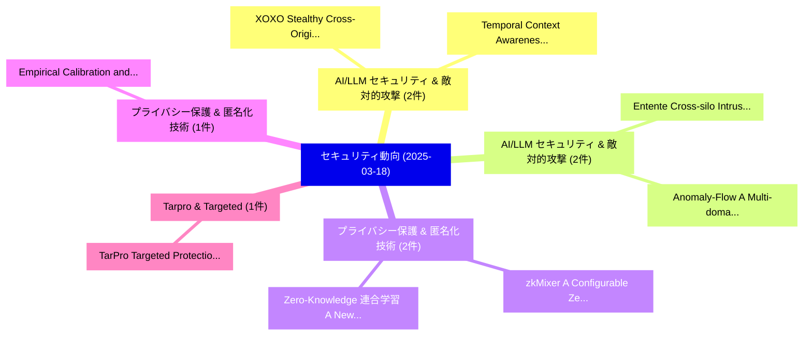

# 📅 02_daily: 日次エグゼクティブサマリー報告書 (2025-03-18)

**集計日時**: 2026-10-02 23:05:20 UTC  
**対象日付**: 2025-03-18  
**本日収集論文数**: 19 件  

---

## 💡 主要セキュリティ動向・脅威インサイト (Executive Insights)

本日の収集論文（計 19 件）において、以下の重点セキュリティ領域で活発な研究動向が確認されました：
- **AI/LLM セキュリティ & 敵対的攻撃** (2 件): 注目論文として 「XOXO: Stealthy Cross-Origin Co...」、「Temporal Context Awareness: A ...」 等が発表され、実務防御および攻撃検証の進展が見られます。
- **AI/LLM セキュリティ & 敵対的攻撃** (2 件): 注目論文として 「Entente: Cross-silo Intrusion ...」、「Anomaly-Flow: A Multi-domain F...」 等が発表され、実務防御および攻撃検証の進展が見られます。
- **プライバシー保護 & 匿名化技術** (2 件): 注目論文として 「zkMixer: A Configurable Zero-K...」、「Zero-Knowledge 連合学習: A New Tru...」 等が発表され、実務防御および攻撃検証の進展が見られます。
- **プライバシー保護 & 匿名化技術** (1 件): 注目論文として 「Empirical Calibration and Metr...」 等が発表され、実務防御および攻撃検証の進展が見られます。
- **Tarpro & Targeted** (1 件): 注目論文として 「TarPro: Targeted Protection ag...」 等が発表され、実務防御および攻撃検証の進展が見られます。

### 🗺️ 技術・脅威トピックマインドマップ

---

## 📌 日次セキュリティ論文一覧 (日本語表形式)

| No | arXiv ID | 論文タイトル (日本語訳) | 重要キーワード | 構造化エグゼクティブ要約 (背景・提案・影響) | 脅威分類 | 詳細リンク |
|---|---|---|---|---|---|---|
| 1 | `2503.13872v1` | [Empirical Calibration and Metric Differential Privacy in Language Models（セキュリティ分析論文）](../../okf/papers/2025-03-18/2503.13872.md) | `Metric Differential Privacy`, `Empirical Calibration`, `Language Models` | 【提案】概要 (Overview & Key Finding) 本論文「Empirical Calibration and Metric 差分プライバシー in Language M...。実証評価により経営層・セキュリティ管理者向け推奨アクション (E... | `cs.CR` | [arXiv](https://arxiv.org/abs/2503.13872v1) &#124; [OKF](../../okf/papers/2025-03-18/2503.13872.md) |
| 2 | `2503.13994v1` | [TarPro: Targeted Protection against Malicious Image Editing（セキュリティ分析論文）](../../okf/papers/2025-03-18/2503.13994.md) | `Malicious Image Editing`, `Targeted Protection`, `Kaixin Shen` | 【提案】概要 (Overview & Key Finding) 本論文「TarPro: Targeted Protection against Malicious Image Edi...。実証評価により経営層・セキュリティ管理者向け推奨アクション (E... | `cs.CR` | [arXiv](https://arxiv.org/abs/2503.13994v1) &#124; [OKF](../../okf/papers/2025-03-18/2503.13994.md) |
| 3 | `2503.14006v2` | [Automated Insulin Delivery Systems: A Review of Security Threats and Protective Strategiesのセキュリティ強化](../../okf/papers/2025-03-18/2503.14006.md) | `Security Threats`, `Securing Automated Insulin Delivery Systems`, `Automated Insulin Delivery Systems` | 【提案】概要 (Overview & Key Finding) 本論文「Automated Insulin Delivery Systems: A Review of Securit...。実証評価により経営層・セキュリティ管理者向け推奨アクション (E... | `cs.CR` | [arXiv](https://arxiv.org/abs/2503.14006v2) &#124; [OKF](../../okf/papers/2025-03-18/2503.14006.md) |
| 4 | `2503.14279v1` | [Anti-Tamper Radio meets Reconfigurable Intelligent Surface for System-Level Tamper Detection（セキュリティ分析論文）](../../okf/papers/2025-03-18/2503.14279.md) | `Reconfigurable Intelligent Surface`, `Level Tamper Detection`, `Tamper Radio` | 【提案】概要 (Overview & Key Finding) 本論文「Anti-Tamper Radio meets Reconfigurable Intelligent Surf...。実証評価により経営層・セキュリティ管理者向け推奨アクション (E... | `cs.CR` | [arXiv](https://arxiv.org/abs/2503.14279v1) &#124; [OKF](../../okf/papers/2025-03-18/2503.14279.md) |
| 5 | `2503.14281v4` | [XOXO: Stealthy Cross-Origin Context Poisoning Attacks against AI Coding Assistants（セキュリティ分析論文）](../../okf/papers/2025-03-18/2503.14281.md) | `Origin Context Poisoning Attacks`, `Stealthy Cross`, `Coding Assistants` | 【提案】概要 (Overview & Key Finding) 本論文「XOXO: Stealthy Cross-Origin Context Poisoning Attacks a...。実証評価により経営層・セキュリティ管理者向け推奨アクション (E... | `cs.CR` | [arXiv](https://arxiv.org/abs/2503.14281v4) &#124; [OKF](../../okf/papers/2025-03-18/2503.14281.md) |
| 6 | `2503.14284v2` | [Entente: Cross-silo Intrusion Detection on Network Log Graphs with 連合学習](../../okf/papers/2025-03-18/2503.14284.md) | `Network Log Graphs`, `Intrusion Detection`, `Cross-silo Intrusion` | 【提案】概要 (Overview & Key Finding) 本論文「Entente: Cross-silo Intrusion Detection on Network Log ...。実証評価により経営層・セキュリティ管理者向け推奨アクション (E... | `cs.CR` | [arXiv](https://arxiv.org/abs/2503.14284v2) &#124; [OKF](../../okf/papers/2025-03-18/2503.14284.md) |
| 7 | `2503.14388v3` | [Vexed by VEX tools: Consistency evaluation of container vulnerability scanners（セキュリティ分析論文）](../../okf/papers/2025-03-18/2503.14388.md) | `Yekatierina Churakova`, `Mathias Ekstedt`, `Larissa Schmid` | 【提案】概要 (Overview & Key Finding) 本論文「Vexed by VEX tools: Consistency evaluation of container...。実証評価により経営層・セキュリティ管理者向け推奨アクション (E... | `cs.CR` | [arXiv](https://arxiv.org/abs/2503.14388v3) &#124; [OKF](../../okf/papers/2025-03-18/2503.14388.md) |
| 8 | `2503.14462v3` | [Blockchain with proof of quantum work（セキュリティ分析論文）](../../okf/papers/2025-03-18/2503.14462.md) | `Jack Raymond`, `Daniel Kinn`, `Gunnar Miller` | 【提案】概要 (Overview & Key Finding) 本論文「Blockchain with proof of 量子 work（セキュリティ分析論文）」（原題: Block...。実証評価によりKing, Samuel Kortas - **公... | `cs.CR` | [arXiv](https://arxiv.org/abs/2503.14462v3) &#124; [OKF](../../okf/papers/2025-03-18/2503.14462.md) |
| 9 | `2503.14611v1` | [Transparent Attested DNS for Confidential Computing Services（セキュリティ分析論文）](../../okf/papers/2025-03-18/2503.14611.md) | `Confidential Computing Services`, `Transparent Attested`, `Antoine Delignat` | 【提案】概要 (Overview & Key Finding) 本論文「Transparent Attested DNS for Confidential Computing Ser...。実証評価により経営層・セキュリティ管理者向け推奨アクション (E... | `cs.CR` | [arXiv](https://arxiv.org/abs/2503.14611v1) &#124; [OKF](../../okf/papers/2025-03-18/2503.14611.md) |
| 10 | `2503.14618v1` | [Anomaly-Flow: A Multi-domain Federated Generative Adversarial Network for Distributed Denial-of-Service Detection（セキュリティ分析論文）](../../okf/papers/2025-03-18/2503.14618.md) | `Federated Generative Adversarial Network`, `Distributed Denial`, `Service Detection` | 【提案】概要 (Overview & Key Finding) 本論文「Anomaly-Flow: A Multi-domain Federated Generative Adver...。実証評価により経営層・セキュリティ管理者向け推奨アクション (E... | `cs.CR` | [arXiv](https://arxiv.org/abs/2503.14618v1) &#124; [OKF](../../okf/papers/2025-03-18/2503.14618.md) |
| 11 | `2503.14681v3` | [DPImageBench: A Unified Benchmark for Differentially Private Image Synthesis（セキュリティ分析論文）](../../okf/papers/2025-03-18/2503.14681.md) | `Differentially Private Image Synthesis`, `Unified Benchmark`, `Chen Gong` | 【提案】概要 (Overview & Key Finding) 本論文「DPImageBench: A Unified Benchmark for Differentially Pr...。実証評価により経営層・セキュリティ管理者向け推奨アクション (E... | `cs.CR` | [arXiv](https://arxiv.org/abs/2503.14681v3) &#124; [OKF](../../okf/papers/2025-03-18/2503.14681.md) |
| 12 | `2503.14682v2` | [Dual-Source SPIR over a noiseless MAC without Data Replication or Shared Randomness（セキュリティ分析論文）](../../okf/papers/2025-03-18/2503.14682.md) | `Data Replication`, `Shared Randomness`, `Dual-Source SPIR` | 【提案】背景とセキュリティ上の課題 (Background & Problem) 本研究はサイバー脅威環境におけるセキュリティ構造・脆弱性の検証を目的としています。(主要検出項目: ...。実証評価により経営層・セキュリティ管理者向け推奨アクション (E... | `cs.CR` | [arXiv](https://arxiv.org/abs/2503.14682v2) &#124; [OKF](../../okf/papers/2025-03-18/2503.14682.md) |
| 13 | `2503.14709v1` | [Better Private Distribution Testing by Leveraging Unverified Auxiliary Data（セキュリティ分析論文）](../../okf/papers/2025-03-18/2503.14709.md) | `Better Private Distribution Testing`, `Leveraging Unverified Auxiliary Data`, `Maryam Aliakbarpour` | 【提案】概要 (Overview & Key Finding) 本論文「Better Private Distribution Testing by Leveraging Unver...。実証評価により経営層・セキュリティ管理者向け推奨アクション (E... | `cs.CR` | [arXiv](https://arxiv.org/abs/2503.14709v1) &#124; [OKF](../../okf/papers/2025-03-18/2503.14709.md) |
| 14 | `2503.14729v2` | [zkMixer: A Configurable Zero-Knowledge Mixer with Anti-Money Laundering Consensus Protocols（セキュリティ分析論文）](../../okf/papers/2025-03-18/2503.14729.md) | `Money Laundering Consensus Protocols`, `Configurable Zero`, `Knowledge Mixer` | 【提案】概要 (Overview & Key Finding) 本論文「zkMixer: A Configurable Zero-Knowledge Mixer with Anti-...。実証評価により経営層・セキュリティ管理者向け推奨アクション (E... | `cs.CR` | [arXiv](https://arxiv.org/abs/2503.14729v2) &#124; [OKF](../../okf/papers/2025-03-18/2503.14729.md) |
| 15 | `2503.15550v3` | [Zero-Knowledge 連合学習: A New Trustworthy and Privacy-Preserving Distributed Learning Paradigm](../../okf/papers/2025-03-18/2503.15550.md) | `Preserving Distributed Learning Paradigm`, `New Trustworthy`, `Privacy-Preserving Distributed` | 【提案】概要 (Overview & Key Finding) 本論文「Zero-Knowledge 連合学習: A New Trustworthy and Privacy-Pres...。実証評価により経営層・セキュリティ管理者向け推奨アクション (E... | `cs.CR` | [arXiv](https://arxiv.org/abs/2503.15550v3) &#124; [OKF](../../okf/papers/2025-03-18/2503.15550.md) |
| 16 | `2503.15551v2` | [Efficient but Vulnerable: and Defending LLM Batch Prompting Attackのベンチマーク評価](../../okf/papers/2025-03-18/2503.15551.md) | `Batch Prompting Attack`, `Batch Prompting`, `Murong Yue` | 【提案】概要 (Overview & Key Finding) 本論文「Efficient but Vulnerable: and Defending LLM Batch Promp...。実証評価により経営層・セキュリティ管理者向け推奨アクション (E... | `cs.CR` | [arXiv](https://arxiv.org/abs/2503.15551v2) &#124; [OKF](../../okf/papers/2025-03-18/2503.15551.md) |
| 17 | `2503.15552v2` | [Personalized Attacks of Social Engineering in Multi-turn Conversations: LLMエージェント for Simulation and Detection](../../okf/papers/2025-03-18/2503.15552.md) | `Personalized Attacks`, `Social Engineering`, `Multi-turn Conversations` | 【提案】概要 (Overview & Key Finding) 本論文「Personalized Attacks of Social Engineering in Multi-tur...。実証評価により経営層・セキュリティ管理者向け推奨アクション (E... | `cs.CR` | [arXiv](https://arxiv.org/abs/2503.15552v2) &#124; [OKF](../../okf/papers/2025-03-18/2503.15552.md) |
| 18 | `2503.15554v2` | [Rethinking the Evaluation of Secure Code Generation（セキュリティ分析論文）](../../okf/papers/2025-03-18/2503.15554.md) | `Secure Code Generation`, `Chieh Dai`, `Jun Xu` | 【提案】概要 (Overview & Key Finding) 本論文「Rethinking the Evaluation of Secure Code Generation（セキュ...。実証評価により経営層・セキュリティ管理者向け推奨アクション (E... | `cs.CR` | [arXiv](https://arxiv.org/abs/2503.15554v2) &#124; [OKF](../../okf/papers/2025-03-18/2503.15554.md) |
| 19 | `2503.15560v1` | [Temporal Context Awareness: A Defense Framework Against Multi-turn Manipulation Attacks on 大規模言語モデル](../../okf/papers/2025-03-18/2503.15560.md) | `Temporal Context Awareness`, `Manipulation Attacks`, `Multi-turn Manipulation` | 【提案】概要 (Overview & Key Finding) 本論文「Temporal Context Awareness: A Defense Framework Against...。実証評価により経営層・セキュリティ管理者向け推奨アクション (E... | `cs.CR` | [arXiv](https://arxiv.org/abs/2503.15560v1) &#124; [OKF](../../okf/papers/2025-03-18/2503.15560.md) |

