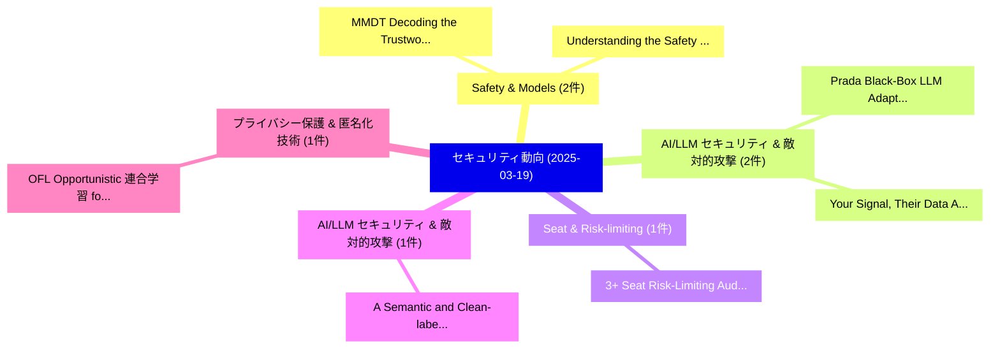

# 📅 02_daily: 日次エグゼクティブサマリー報告書 (2025-03-19)

**集計日時**: 2026-10-02 23:05:20 UTC  
**対象日付**: 2025-03-19  
**本日収集論文数**: 15 件  

---

## 💡 主要セキュリティ動向・脅威インサイト (Executive Insights)

本日の収集論文（計 15 件）において、以下の重点セキュリティ領域で活発な研究動向が確認されました：
- **Safety & Models** (2 件): 注目論文として 「MMDT: Decoding the Trustworthi...」、「Understanding the Safety Bound...」 等が発表され、実務防御および攻撃検証の進展が見られます。
- **AI/LLM セキュリティ & 敵対的攻撃** (2 件): 注目論文として 「Prada: Black-Box LLM Adaptatio...」、「Your Signal, Their Data: An Em...」 等が発表され、実務防御および攻撃検証の進展が見られます。
- **Seat & Risk-limiting** (1 件): 注目論文として 「3+ Seat Risk-Limiting Audits f...」 等が発表され、実務防御および攻撃検証の進展が見られます。
- **AI/LLM セキュリティ & 敵対的攻撃** (1 件): 注目論文として 「A Semantic and Clean-label Bac...」 等が発表され、実務防御および攻撃検証の進展が見られます。
- **プライバシー保護 & 匿名化技術** (1 件): 注目論文として 「OFL: Opportunistic 連合学習 for Re...」 等が発表され、実務防御および攻撃検証の進展が見られます。

### 🗺️ 技術・脅威トピックマインドマップ

---

## 📌 日次セキュリティ論文一覧 (日本語表形式)

| No | arXiv ID | 論文タイトル (日本語訳) | 重要キーワード | 構造化エグゼクティブ要約 (背景・提案・影響) | 脅威分類 | 詳細リンク |
|---|---|---|---|---|---|---|
| 1 | `2503.14803v1` | [3+ Seat Risk-Limiting Audits for Single Transferable Vote Elections（セキュリティ分析論文）](../../okf/papers/2025-03-19/2503.14803.md) | `Single Transferable Vote Elections`, `Seat Risk`, `Limiting Audits` | 【提案】概要 (Overview & Key Finding) 本論文「3+ Seat Risk-Limiting Audits for Single Transferable Vo...。実証評価によりStuckey, Vanessa Teague, ... | `cs.CR` | [arXiv](https://arxiv.org/abs/2503.14803v1) &#124; [OKF](../../okf/papers/2025-03-19/2503.14803.md) |
| 2 | `2503.14827v1` | [MMDT: Decoding the Trustworthiness and Safety of Multimodal Foundation Models（セキュリティ分析論文）](../../okf/papers/2025-03-19/2503.14827.md) | `Multimodal Foundation Models`, `Jeffrey Ziwei Tan`, `Chejian Xu` | 【提案】概要 (Overview & Key Finding) 本論文「MMDT: Decoding the Trustworthiness and Safety of Multim...。実証評価により経営層・セキュリティ管理者向け推奨アクション (E... | `cs.CR` | [arXiv](https://arxiv.org/abs/2503.14827v1) &#124; [OKF](../../okf/papers/2025-03-19/2503.14827.md) |
| 3 | `2503.14922v1` | [A Semantic and Clean-label Backdoor Attack against Graph Convolutional Networks（セキュリティ分析論文）](../../okf/papers/2025-03-19/2503.14922.md) | `Graph Convolutional Networks`, `Backdoor Attack`, `Clean-label Backdoor` | 【提案】概要 (Overview & Key Finding) 本論文「A Semantic and Clean-label Backdoor Attack against Grap...。実証評価により経営層・セキュリティ管理者向け推奨アクション (E... | `cs.CR` | [arXiv](https://arxiv.org/abs/2503.14922v1) &#124; [OKF](../../okf/papers/2025-03-19/2503.14922.md) |
| 4 | `2503.14932v1` | [Prada: Black-Box LLM Adaptation with Private Data on Resource-Constrained Devices（セキュリティ分析論文）](../../okf/papers/2025-03-19/2503.14932.md) | `Black-Box LLM`, `Private Data`, `Constrained Devices` | 【提案】概要 (Overview & Key Finding) 本論文「Prada: Black-Box LLM Adaptation with Private Data on Re...。実証評価により経営層・セキュリティ管理者向け推奨アクション (E... | `cs.CR` | [arXiv](https://arxiv.org/abs/2503.14932v1) &#124; [OKF](../../okf/papers/2025-03-19/2503.14932.md) |
| 5 | `2503.15015v1` | [OFL: Opportunistic 連合学習 for Resource-Heterogeneous and Privacy-Aware Devices](../../okf/papers/2025-03-19/2503.15015.md) | `Aware Devices`, `Privacy-Aware Devices`, `Opportunistic Federated Learning` | 【提案】概要 (Overview & Key Finding) 本論文「OFL: Opportunistic 連合学習 for Resource-Heterogeneous and ...。実証評価により経営層・セキュリティ管理者向け推奨アクション (E... | `cs.CR` | [arXiv](https://arxiv.org/abs/2503.15015v1) &#124; [OKF](../../okf/papers/2025-03-19/2503.15015.md) |
| 6 | `2503.15065v2` | [A Comprehensive Quantification of Inconsistencies in Memory Dumps（セキュリティ分析論文）](../../okf/papers/2025-03-19/2503.15065.md) | `Comprehensive Quantification`, `Memory Dumps`, `Andrea Oliveri` | 【提案】概要 (Overview & Key Finding) 本論文「A Comprehensive Quantification of Inconsistencies in Me...。実証評価により経営層・セキュリティ管理者向け推奨アクション (E... | `cs.CR` | [arXiv](https://arxiv.org/abs/2503.15065v2) &#124; [OKF](../../okf/papers/2025-03-19/2503.15065.md) |
| 7 | `2503.15092v1` | [Understanding the Safety Boundaries of DeepSeek Models: Evaluation and Findingsに向けて](../../okf/papers/2025-03-19/2503.15092.md) | `Safety Boundaries`, `Towards Understanding`, `Zonghao Ying` | 【提案】概要 (Overview & Key Finding) 本論文「Understanding the Safety Boundaries of DeepSeek Models:...。実証評価により経営層・セキュリティ管理者向け推奨アクション (E... | `cs.CR` | [arXiv](https://arxiv.org/abs/2503.15092v1) &#124; [OKF](../../okf/papers/2025-03-19/2503.15092.md) |
| 8 | `2503.15238v1` | [Your Signal, Their Data: An Empirical Privacy Wireless-scanning SDKs in Androidの分析](../../okf/papers/2025-03-19/2503.15238.md) | `Wireless-scanning SDKs`, `Aniketh Girish`, `Joel Reardon` | 【提案】概要 (Overview & Key Finding) 本論文「Your Signal, Their Data: An Empirical Privacy Wireless-...。実証評価により経営層・セキュリティ管理者向け推奨アクション (E... | `cs.CR` | [arXiv](https://arxiv.org/abs/2503.15238v1) &#124; [OKF](../../okf/papers/2025-03-19/2503.15238.md) |
| 9 | `2503.15380v1` | [ChonkyBFT: Consensus Protocol of ZKsync（セキュリティ分析論文）](../../okf/papers/2025-03-19/2503.15380.md) | `Consensus Protocol`, `Denis Kolegov`, `Igor Konnov` | 【提案】概要 (Overview & Key Finding) 本論文「ChonkyBFT: Consensus Protocol of ZKsync（セキュリティ分析論文）」（原題...。実証評価により経営層・セキュリティ管理者向け推奨アクション (E... | `cs.CR` | [arXiv](https://arxiv.org/abs/2503.15380v1) &#124; [OKF](../../okf/papers/2025-03-19/2503.15380.md) |
| 10 | `2503.15404v1` | [Improving Adversarial Transferability on Vision Transformers via Forward Propagation Refinement（セキュリティ分析論文）](../../okf/papers/2025-03-19/2503.15404.md) | `Improving Adversarial Transferability`, `Forward Propagation Refinement`, `Vision Transformers` | 【提案】概要 (Overview & Key Finding) 本論文「Improving Adversarial Transferability on Vision Transfo...。実証評価により経営層・セキュリティ管理者向け推奨アクション (E... | `cs.CR` | [arXiv](https://arxiv.org/abs/2503.15404v1) &#124; [OKF](../../okf/papers/2025-03-19/2503.15404.md) |
| 11 | `2503.15428v3` | [Division polynomials for arbitrary isogenies（セキュリティ分析論文）](../../okf/papers/2025-03-19/2503.15428.md) | `Raw Meta`, `Executive Summary`, `Key Finding` | 【提案】概要 (Overview & Key Finding) 本論文「Division polynomials for arbitrary isogenies（セキュリティ分析論文...。実証評価によりStange - **公開日時**: `2025-... | `cs.CR` | [arXiv](https://arxiv.org/abs/2503.15428v3) &#124; [OKF](../../okf/papers/2025-03-19/2503.15428.md) |
| 12 | `2503.15648v1` | [Cancelable Biometric Template Generation Using Random Feature Vector Transformations（セキュリティ分析論文）](../../okf/papers/2025-03-19/2503.15648.md) | `Cancelable Biometric Template Generation Using Random Feature Vector Transformations`, `Ragendhu Sp`, `Tony Thomas` | 【提案】概要 (Overview & Key Finding) 本論文「Cancelable Biometric Template Generation Using Random F...。実証評価により経営層・セキュリティ管理者向け推奨アクション (E... | `cs.CR` | [arXiv](https://arxiv.org/abs/2503.15648v1) &#124; [OKF](../../okf/papers/2025-03-19/2503.15648.md) |
| 13 | `2503.15654v2` | [Acurast: Decentralized Serverless Cloud（セキュリティ分析論文）](../../okf/papers/2025-03-19/2503.15654.md) | `Decentralized Serverless Cloud`, `Alessandro De Carli`, `Christian Killer` | 【提案】概要 (Overview & Key Finding) 本論文「Acurast: Decentralized Serverless Cloud（セキュリティ分析論文）」（原題...。実証評価により経営層・セキュリティ管理者向け推奨アクション (E... | `cs.CR` | [arXiv](https://arxiv.org/abs/2503.15654v2) &#124; [OKF](../../okf/papers/2025-03-19/2503.15654.md) |
| 14 | `2503.15678v1` | [Cyber Threats in Financial Transactions -- Addressing the Dual Challenge of AI and Quantum Computing（セキュリティ分析論文）](../../okf/papers/2025-03-19/2503.15678.md) | `Cyber Threats`, `Financial Transactions`, `Dual Challenge` | 【提案】概要 (Overview & Key Finding) 本論文「Cyber Threats in Financial Transactions -- Addressing t...。実証評価により経営層・セキュリティ管理者向け推奨アクション (E... | `cs.CR` | [arXiv](https://arxiv.org/abs/2503.15678v1) &#124; [OKF](../../okf/papers/2025-03-19/2503.15678.md) |
| 15 | `2503.15730v1` | [サイバーセキュリティ in Vehicle-to-Grid (V2G) Systems: A Systematic Review](../../okf/papers/2025-03-19/2503.15730.md) | `Systematic Review`, `Sandipan Patra`, `Glory Okwata` | 【提案】概要 (Overview & Key Finding) 本論文「サイバーセキュリティ in Vehicle-to-Grid (V2G) Systems: A Systemat...。実証評価により経営層・セキュリティ管理者向け推奨アクション (E... | `cs.CR` | [arXiv](https://arxiv.org/abs/2503.15730v1) &#124; [OKF](../../okf/papers/2025-03-19/2503.15730.md) |

