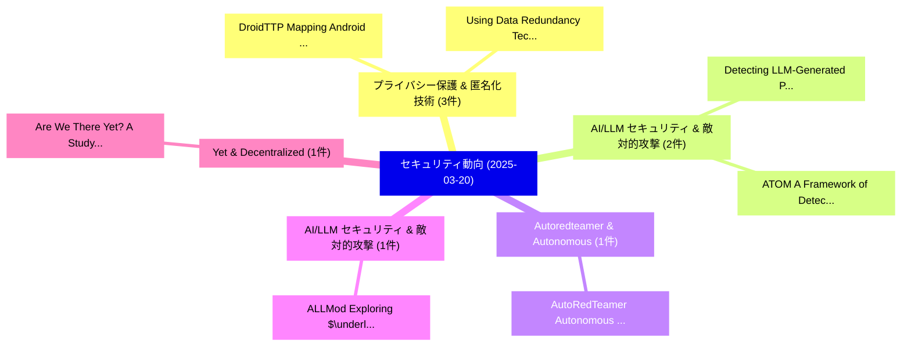

# 📅 02_daily: 日次エグゼクティブサマリー報告書 (2025-03-20)

**集計日時**: 2026-10-02 23:05:20 UTC  
**対象日付**: 2025-03-20  
**本日収集論文数**: 26 件  

---

## 💡 主要セキュリティ動向・脅威インサイト (Executive Insights)

本日の収集論文（計 26 件）において、以下の重点セキュリティ領域で活発な研究動向が確認されました：
- **プライバシー保護 & 匿名化技術** (3 件): 注目論文として 「DroidTTP: Mapping Android Appl...」、「Using Data Redundancy Techniqu...」 等が発表され、実務防御および攻撃検証の進展が見られます。
- **AI/LLM セキュリティ & 敵対的攻撃** (2 件): 注目論文として 「Detecting LLM-Generated Peer R...」、「ATOM: A Framework of Detecting...」 等が発表され、実務防御および攻撃検証の進展が見られます。
- **Autoredteamer & Autonomous** (1 件): 注目論文として 「AutoRedTeamer: Autonomous Red ...」 等が発表され、実務防御および攻撃検証の進展が見られます。
- **AI/LLM セキュリティ & 敵対的攻撃** (1 件): 注目論文として 「ALLMod: Exploring $\underline{...」 等が発表され、実務防御および攻撃検証の進展が見られます。
- **Yet & Decentralized** (1 件): 注目論文として 「Are We There Yet? A Study of D...」 等が発表され、実務防御および攻撃検証の進展が見られます。

### 🗺️ 技術・脅威トピックマインドマップ

---

## 📌 日次セキュリティ論文一覧 (日本語表形式)

| No | arXiv ID | 論文タイトル (日本語訳) | 重要キーワード | 構造化エグゼクティブ要約 (背景・提案・影響) | 脅威分類 | 詳細リンク |
|---|---|---|---|---|---|---|
| 1 | `2503.15754v1` | [AutoRedTeamer: Autonomous Red Teaming with Lifelong Attack Integration（セキュリティ分析論文）](../../okf/papers/2025-03-20/2503.15754.md) | `Autonomous Red Teaming`, `Lifelong Attack Integration`, `Andy Zhou` | 【提案】概要 (Overview & Key Finding) 本論文「AutoRedTeamer: Autonomous Red Teaming with Lifelong Att...。実証評価により経営層・セキュリティ管理者向け推奨アクション (E... | `cs.CR` | [arXiv](https://arxiv.org/abs/2503.15754v1) &#124; [OKF](../../okf/papers/2025-03-20/2503.15754.md) |
| 2 | `2503.15772v2` | [Detecting LLM-Generated Peer Reviews（セキュリティ分析論文）](../../okf/papers/2025-03-20/2503.15772.md) | `Generated Peer Reviews`, `LLM-Generated Peer`, `Vishisht Rao` | 【提案】概要 (Overview & Key Finding) 本論文「Detecting LLM-Generated Peer Reviews（セキュリティ分析論文）」（原題: D...。実証評価によりShah - **公開日時**: `2025-03... | `cs.CR` | [arXiv](https://arxiv.org/abs/2503.15772v2) &#124; [OKF](../../okf/papers/2025-03-20/2503.15772.md) |
| 3 | `2503.15866v1` | [DroidTTP: Mapping Android Applications with TTP for Cyber Threat Intelligence（セキュリティ分析論文）](../../okf/papers/2025-03-20/2503.15866.md) | `Mapping Android Applications`, `Cyber Threat Intelligence`, `Rafidha Rehiman` | 【提案】概要 (Overview & Key Finding) 本論文「DroidTTP: Mapping Android Applications with TTP for Cyb...。実証評価により経営層・セキュリティ管理者向け推奨アクション (E... | `cs.CR` | [arXiv](https://arxiv.org/abs/2503.15866v1) &#124; [OKF](../../okf/papers/2025-03-20/2503.15866.md) |
| 4 | `2503.15881v1` | [Using Data Redundancy Techniques to Detect and Correct Errors in Logical Data（セキュリティ分析論文）](../../okf/papers/2025-03-20/2503.15881.md) | `Using Data Redundancy Techniques`, `Correct Errors`, `Logical Data` | 【提案】概要 (Overview & Key Finding) 本論文「Using Data Redundancy Techniques to Detect and Correct ...。実証評価により経営層・セキュリティ管理者向け推奨アクション (E... | `cs.CR` | [arXiv](https://arxiv.org/abs/2503.15881v1) &#124; [OKF](../../okf/papers/2025-03-20/2503.15881.md) |
| 5 | `2503.15916v2` | [ALLMod: Exploring $\underline{\mathbf{A}}$rea-Efficiency of $\underline{\mathbf{L}}$UT-based $\underline{\mathbf{L}}$arge Number $\underline{\mathbf{Mod}}$ular Reduction via Hybrid Workloads（セキュリティ分析論文）](../../okf/papers/2025-03-20/2503.15916.md) | `Hybrid Workloads`, `Fangxin Liu`, `Haomin Li` | 【提案】概要 (Overview & Key Finding) 本論文「ALLMod: Exploring $\underline{\mathbf{A}}$rea-Efficienc...。実証評価によりセキュリティ影響と実験結果 (Results & ... | `cs.CR` | [arXiv](https://arxiv.org/abs/2503.15916v2) &#124; [OKF](../../okf/papers/2025-03-20/2503.15916.md) |
| 6 | `2503.15964v1` | [Are We There Yet? A Study of Decentralized Identity Applications（セキュリティ分析論文）](../../okf/papers/2025-03-20/2503.15964.md) | `Decentralized Identity Applications`, `Daria Schumm`, `Burkhard Stiller` | 【提案】A Study of Decentralized Identity Applications ### (日本語題名: Are We There Yet?。実証評価によりMüller, Burkhard Stiller - **公開日時。 | `cs.CR` | [arXiv](https://arxiv.org/abs/2503.15964v1) &#124; [OKF](../../okf/papers/2025-03-20/2503.15964.md) |
| 7 | `2503.15968v1` | [Digital Asset Data Lakehouse. The concept based on a blockchain research center（セキュリティ分析論文）](../../okf/papers/2025-03-20/2503.15968.md) | `Digital Asset Data Lakehouse`, `Raul Cristian Bag`, `Raw Meta` | 【提案】The concept based on a blockchain research center ### (日本語題名: Digital Asset Data Lakeho...。実証評価により経営層・セキュリティ管理者向け推奨アクション (E... | `cs.CR` | [arXiv](https://arxiv.org/abs/2503.15968v1) &#124; [OKF](../../okf/papers/2025-03-20/2503.15968.md) |
| 8 | `2503.16023v1` | [BadToken: Token-level Backdoor Attacks to Multi-modal 大規模言語モデル](../../okf/papers/2025-03-20/2503.16023.md) | `Backdoor Attacks`, `Token-level Backdoor`, `Large Language Models` | 【提案】概要 (Overview & Key Finding) 本論文「BadToken: Token-level Backdoor Attacks to Multi-modal 大...。実証評価により経営層・セキュリティ管理者向け推奨アクション (E... | `cs.CR` | [arXiv](https://arxiv.org/abs/2503.16023v1) &#124; [OKF](../../okf/papers/2025-03-20/2503.16023.md) |
| 9 | `2503.16047v2` | [Temporal-Spatial Attention Network (TSAN) for DoS Attack Detection in Network Traffic（セキュリティ分析論文）](../../okf/papers/2025-03-20/2503.16047.md) | `Spatial Attention Network`, `Attack Detection`, `Network Traffic` | 【提案】概要 (Overview & Key Finding) 本論文「Temporal-Spatial Attention Network (TSAN) for DoS Attac...。実証評価により経営層・セキュリティ管理者向け推奨アクション (E... | `cs.CR` | [arXiv](https://arxiv.org/abs/2503.16047v2) &#124; [OKF](../../okf/papers/2025-03-20/2503.16047.md) |
| 10 | `2503.16080v2` | [Fast Homomorphic Linear Algebra with BLAS（セキュリティ分析論文）](../../okf/papers/2025-03-20/2503.16080.md) | `Fast Homomorphic Linear Algebra`, `Jung Hee Cheon`, `Jai Hyun Park` | 【提案】概要 (Overview & Key Finding) 本論文「Fast Homomorphic Linear Algebra with BLAS（セキュリティ分析論文）」（...。実証評価により経営層・セキュリティ管理者向け推奨アクション (E... | `cs.CR` | [arXiv](https://arxiv.org/abs/2503.16080v2) &#124; [OKF](../../okf/papers/2025-03-20/2503.16080.md) |
| 11 | `2503.16104v2` | [Doing More With Less: Mismatch-Based Risk-Limiting Audits（セキュリティ分析論文）](../../okf/papers/2025-03-20/2503.16104.md) | `Based Risk`, `Limiting Audits`, `Mismatch-Based Risk` | 【提案】概要 (Overview & Key Finding) 本論文「Doing More With Less: Mismatch-Based Risk-Limiting Audi...。実証評価によりTeague, Damjan Vukcevic -... | `cs.CR` | [arXiv](https://arxiv.org/abs/2503.16104v2) &#124; [OKF](../../okf/papers/2025-03-20/2503.16104.md) |
| 12 | `2503.16233v2` | [Empirical Analysis of Privacy-Fairness-Accuracy Trade-offs in Federated Learning: A Step Responsible AIに向けて](../../okf/papers/2025-03-20/2503.16233.md) | `Accuracy Trade`, `Federated Learning`, `Step Towards Responsible` | 【提案】概要 (Overview & Key Finding) 本論文「Empirical Analysis of Privacy-Fairness-Accuracy Trade-o...。実証評価により経営層・セキュリティ管理者向け推奨アクション (E... | `cs.CR` | [arXiv](https://arxiv.org/abs/2503.16233v2) &#124; [OKF](../../okf/papers/2025-03-20/2503.16233.md) |
| 13 | `2503.16248v3` | [Real AI Agents with Fake Memories: Fatal Context Manipulation Attacks on Web3 Agents（セキュリティ分析論文）](../../okf/papers/2025-03-20/2503.16248.md) | `Fatal Context Manipulation Attacks`, `Fake Memories`, `Web3 Agents` | 【提案】概要 (Overview & Key Finding) 本論文「Real AI Agents with Fake Memories: Fatal Context Manipu...。実証評価により経営層・セキュリティ管理者向け推奨アクション (E... | `cs.CR` | [arXiv](https://arxiv.org/abs/2503.16248v3) &#124; [OKF](../../okf/papers/2025-03-20/2503.16248.md) |
| 14 | `2503.16266v1` | [From Head to Tail: Efficient Black-box Model Inversion Attack via Long-tailed Learning（セキュリティ分析論文）](../../okf/papers/2025-03-20/2503.16266.md) | `Model Inversion Attack`, `Efficient Black`, `Black-box Model` | 【提案】概要 (Overview & Key Finding) 本論文「From Head to Tail: Efficient Black-box モデル反転攻撃 Attack v...。実証評価により経営層・セキュリティ管理者向け推奨アクション (E... | `cs.CR` | [arXiv](https://arxiv.org/abs/2503.16266v1) &#124; [OKF](../../okf/papers/2025-03-20/2503.16266.md) |
| 15 | `2503.16283v1` | [Investigating The Implications of Cyberattacks Against Precision Agricultural Equipment（セキュリティ分析論文）](../../okf/papers/2025-03-20/2503.16283.md) | `Mark Freyhof`, `George Grispos`, `William Mahoney` | 【提案】概要 (Overview & Key Finding) 本論文「Investigating The Implications of Cyberattacks Against ...。実証評価により経営層・セキュリティ管理者向け推奨アクション (E... | `cs.CR` | [arXiv](https://arxiv.org/abs/2503.16283v1) &#124; [OKF](../../okf/papers/2025-03-20/2503.16283.md) |
| 16 | `2503.16287v1` | [Satellite Communications: Real-Time Video Encryption Scheme on Satellite Payloadsのセキュリティ強化](../../okf/papers/2025-03-20/2503.16287.md) | `Time Video Encryption Scheme`, `Real-Time Video`, `Securing Satellite Communications` | 【提案】概要 (Overview & Key Finding) 本論文「Satellite Communications: Real-Time Video Encryption Sc...。実証評価により経営層・セキュリティ管理者向け推奨アクション (E... | `cs.CR` | [arXiv](https://arxiv.org/abs/2503.16287v1) &#124; [OKF](../../okf/papers/2025-03-20/2503.16287.md) |
| 17 | `2503.16292v1` | [Cultivating サイバーセキュリティ: Designing a サイバーセキュリティ Curriculum for the Food and Agriculture Sector](../../okf/papers/2025-03-20/2503.16292.md) | `Agriculture Sector`, `Cultivating Cybersecurity`, `Cybersecurity Curriculum` | 【提案】概要 (Overview & Key Finding) 本論文「Cultivating サイバーセキュリティ: Designing a サイバーセキュリティ Curricul...。実証評価により経営層・セキュリティ管理者向け推奨アクション (E... | `cs.CR` | [arXiv](https://arxiv.org/abs/2503.16292v1) &#124; [OKF](../../okf/papers/2025-03-20/2503.16292.md) |
| 18 | `2503.16392v2` | [Graph of Effort: Quantifying Risk of AI Usage for Vulnerability Assessment（セキュリティ分析論文）](../../okf/papers/2025-03-20/2503.16392.md) | `Quantifying Risk`, `Vulnerability Assessment`, `Anket Mehra` | 【提案】概要 (Overview & Key Finding) 本論文「Graph of Effort: Quantifying Risk of AI Usage for 脆弱性 A...。実証評価により経営層・セキュリティ管理者向け推奨アクション (E... | `cs.CR` | [arXiv](https://arxiv.org/abs/2503.16392v2) &#124; [OKF](../../okf/papers/2025-03-20/2503.16392.md) |
| 19 | `2503.16586v2` | [Big Help or Big Brother? Auditing Tracking, Profiling, and Personalization in Generative AI Assistants（セキュリティ分析論文）](../../okf/papers/2025-03-20/2503.16586.md) | `Big Help`, `Big Brother`, `Auditing Tracking` | 【提案】Auditing Tracking, Profiling, and Personalization in Generative AI Assistants ### (日本語題...。実証評価により経営層・セキュリティ管理者向け推奨アクション (E... | `cs.CR` | [arXiv](https://arxiv.org/abs/2503.16586v2) &#124; [OKF](../../okf/papers/2025-03-20/2503.16586.md) |
| 20 | `2503.16612v1` | [SoK: Trusted Execution in SoC-FPGAs（セキュリティ分析論文）](../../okf/papers/2025-03-20/2503.16612.md) | `Trusted Execution`, `Tristan Running Crane`, `Ann Marie Reinhold` | 【提案】概要 (Overview & Key Finding) 本論文「SoK: Trusted Execution in SoC-FPGAs（セキュリティ分析論文）」（原題: So...。実証評価により経営層・セキュリティ管理者向け推奨アクション (E... | `cs.CR` | [arXiv](https://arxiv.org/abs/2503.16612v1) &#124; [OKF](../../okf/papers/2025-03-20/2503.16612.md) |
| 21 | `2503.16640v2` | [Visualizing Privacy-Relevant Data Flows in Android Applications（セキュリティ分析論文）](../../okf/papers/2025-03-20/2503.16640.md) | `Relevant Data Flows`, `Visualizing Privacy`, `Android Applications` | 【提案】概要 (Overview & Key Finding) 本論文「Visualizing Privacy-Relevant Data Flows in Android Appl...。実証評価により経営層・セキュリティ管理者向け推奨アクション (E... | `cs.CR` | [arXiv](https://arxiv.org/abs/2503.16640v2) &#124; [OKF](../../okf/papers/2025-03-20/2503.16640.md) |
| 22 | `2503.16693v1` | [ATOM: A Framework of Detecting Query-Based Model Extraction Attacks for Graph Neural Networks（セキュリティ分析論文）](../../okf/papers/2025-03-20/2503.16693.md) | `Based Model Extraction Attacks`, `Graph Neural Networks`, `Detecting Query` | 【提案】概要 (Overview & Key Finding) 本論文「ATOM: A Framework of Detecting Query-Based Model Extrac...。実証評価により経営層・セキュリティ管理者向け推奨アクション (E... | `cs.CR` | [arXiv](https://arxiv.org/abs/2503.16693v1) &#124; [OKF](../../okf/papers/2025-03-20/2503.16693.md) |
| 23 | `2503.16719v2` | [Practical Acoustic Eavesdropping On Typed Passphrases（セキュリティ分析論文）](../../okf/papers/2025-03-20/2503.16719.md) | `Raw Meta`, `Executive Summary`, `Key Finding` | 【提案】概要 (Overview & Key Finding) 本論文「Practical Acoustic Eavesdropping On Typed Passphrases（セ...。実証評価により経営層・セキュリティ管理者向け推奨アクション (E... | `cs.CR` | [arXiv](https://arxiv.org/abs/2503.16719v2) &#124; [OKF](../../okf/papers/2025-03-20/2503.16719.md) |
| 24 | `2503.16749v2` | [Revisiting DRAM Read Disturbance: Identifying Inconsistencies Between Experimental Characterization and Device-Level Studies（セキュリティ分析論文）](../../okf/papers/2025-03-20/2503.16749.md) | `Read Disturbance`, `Level Studies`, `Device-Level Studies` | 【提案】概要 (Overview & Key Finding) 本論文「Revisiting DRAM Read Disturbance: Identifying Inconsist...。実証評価により経営層・セキュリティ管理者向け推奨アクション (E... | `cs.CR` | [arXiv](https://arxiv.org/abs/2503.16749v2) &#124; [OKF](../../okf/papers/2025-03-20/2503.16749.md) |
| 25 | `2504.16089v1` | [Carbyne: An Ultra-Lightweight DoS-Resilient Mempool for Bitcoin（セキュリティ分析論文）](../../okf/papers/2025-03-20/2504.16089.md) | `Resilient Mempool`, `Ultra-Lightweight DoS`, `Hina Binte Haq` | 【提案】概要 (Overview & Key Finding) 本論文「Carbyne: An Ultra-Lightweight DoS-Resilient Mempool for...。実証評価により経営層・セキュリティ管理者向け推奨アクション (E... | `cs.CR` | [arXiv](https://arxiv.org/abs/2504.16089v1) &#124; [OKF](../../okf/papers/2025-03-20/2504.16089.md) |
| 26 | `2506.15043v1` | [Advanced Prediction of Hypersonic Missile Trajectories with CNN-LSTM-GRU Architectures（セキュリティ分析論文）](../../okf/papers/2025-03-20/2506.15043.md) | `Hypersonic Missile Trajectories`, `Advanced Prediction`, `Amir Hossein Baradaran` | 【提案】概要 (Overview & Key Finding) 本論文「Advanced Prediction of Hypersonic Missile Trajectories ...。実証評価により経営層・セキュリティ管理者向け推奨アクション (E... | `cs.CR` | [arXiv](https://arxiv.org/abs/2506.15043v1) &#124; [OKF](../../okf/papers/2025-03-20/2506.15043.md) |

