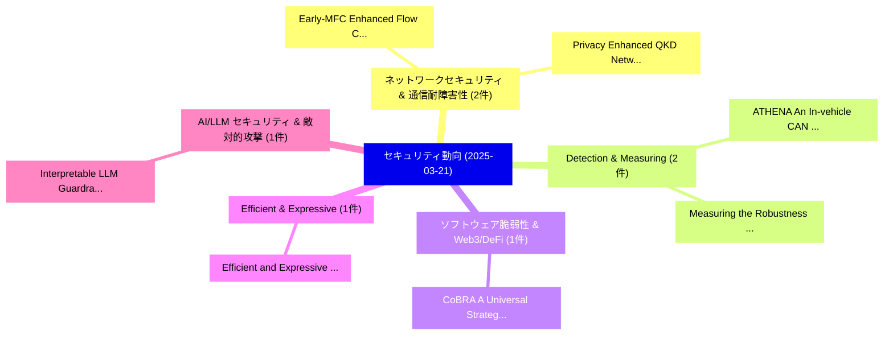

# 📅 02_daily: 日次エグゼクティブサマリー報告書 (2025-03-21)

**集計日時**: 2026-10-02 23:05:20 UTC  
**対象日付**: 2025-03-21  
**本日収集論文数**: 24 件  

---

## 💡 主要セキュリティ動向・脅威インサイト (Executive Insights)

本日の収集論文（計 24 件）において、以下の重点セキュリティ領域で活発な研究動向が確認されました：
- **ネットワークセキュリティ & 通信耐障害性** (2 件): 注目論文として 「Early-MFC: Enhanced Flow Corre...」、「Privacy Enhanced QKD Networks:...」 等が発表され、実務防御および攻撃検証の進展が見られます。
- **Detection & Measuring** (2 件): 注目論文として 「ATHENA: An In-vehicle CAN Intr...」、「Measuring the Robustness of Au...」 等が発表され、実務防御および攻撃検証の進展が見られます。
- **ソフトウェア脆弱性 & Web3/DeFi** (1 件): 注目論文として 「CoBRA: A Universal Strategypro...」 等が発表され、実務防御および攻撃検証の進展が見られます。
- **Efficient & Expressive** (1 件): 注目論文として 「Efficient and Expressive Publi...」 等が発表され、実務防御および攻撃検証の進展が見られます。
- **AI/LLM セキュリティ & 敵対的攻撃** (1 件): 注目論文として 「Interpretable LLM Guardrails v...」 等が発表され、実務防御および攻撃検証の進展が見られます。

### 🗺️ 技術・脅威トピックマインドマップ

---

## 📌 日次セキュリティ論文一覧 (日本語表形式)

| No | arXiv ID | 論文タイトル (日本語訳) | 重要キーワード | 構造化エグゼクティブ要約 (背景・提案・影響) | 脅威分類 | 詳細リンク |
|---|---|---|---|---|---|---|
| 1 | `2503.16783v5` | [CoBRA: A Universal Strategyproof Confirmation Protocol for Quorum-based Proof-of-Stake Blockchains（セキュリティ分析論文）](../../okf/papers/2025-03-21/2503.16783.md) | `Universal Strategyproof Confirmation Protocol`, `Quorum-based Proof`, `Stake Blockchains` | 【提案】概要 (Overview & Key Finding) 本論文「CoBRA: A Universal Strategyproof Confirmation Protocol ...。実証評価により経営層・セキュリティ管理者向け推奨アクション (E... | `cs.CR` | [arXiv](https://arxiv.org/abs/2503.16783v5) &#124; [OKF](../../okf/papers/2025-03-21/2503.16783.md) |
| 2 | `2503.16828v1` | [Efficient and Expressive Public Key Authenticated Encryption with Keyword Search in Multi-user Scenarios（セキュリティ分析論文）](../../okf/papers/2025-03-21/2503.16828.md) | `Expressive Public Key Authenticated Encryption`, `Keyword Search`, `Multi-user Scenarios` | 【提案】概要 (Overview & Key Finding) 本論文「Efficient and Expressive Public Key Authenticated Encry...。実証評価により経営層・セキュリティ管理者向け推奨アクション (E... | `cs.CR` | [arXiv](https://arxiv.org/abs/2503.16828v1) &#124; [OKF](../../okf/papers/2025-03-21/2503.16828.md) |
| 3 | `2503.16847v1` | [Early-MFC: Enhanced Flow Correlation Attacks on Tor via Multi-view Triplet Networks with Early Network Traffic（セキュリティ分析論文）](../../okf/papers/2025-03-21/2503.16847.md) | `Enhanced Flow Correlation Attacks`, `Early Network Traffic`, `Triplet Networks` | 【提案】概要 (Overview & Key Finding) 本論文「Early-MFC: Enhanced Flow Correlation Attacks on Tor via...。実証評価により経営層・セキュリティ管理者向け推奨アクション (E... | `cs.CR` | [arXiv](https://arxiv.org/abs/2503.16847v1) &#124; [OKF](../../okf/papers/2025-03-21/2503.16847.md) |
| 4 | `2503.16851v2` | [Interpretable LLM Guardrails via Sparse Representation Steering（セキュリティ分析論文）](../../okf/papers/2025-03-21/2503.16851.md) | `Sparse Representation Steering`, `Zhibo Wang`, `Huiyu Xu` | 【提案】概要 (Overview & Key Finding) 本論文「Interpretable LLM Guardrails via Sparse Representation ...。実証評価により経営層・セキュリティ管理者向け推奨アクション (E... | `cs.CR` | [arXiv](https://arxiv.org/abs/2503.16851v2) &#124; [OKF](../../okf/papers/2025-03-21/2503.16851.md) |
| 5 | `2503.16950v1` | [CleanStack: A New Dual-Stack for Defending Against Stack-Based Memory Corruption Attacks（セキュリティ分析論文）](../../okf/papers/2025-03-21/2503.16950.md) | `Based Memory Corruption Attacks`, `New Dual`, `Stack-Based Memory` | 【提案】概要 (Overview & Key Finding) 本論文「CleanStack: A New Dual-Stack for Defending Against Stac...。実証評価により経営層・セキュリティ管理者向け推奨アクション (E... | `cs.CR` | [arXiv](https://arxiv.org/abs/2503.16950v1) &#124; [OKF](../../okf/papers/2025-03-21/2503.16950.md) |
| 6 | `2503.16972v2` | [Governance of Ledger-Anchored Decentralized Identifiers（セキュリティ分析論文）](../../okf/papers/2025-03-21/2503.16972.md) | `Anchored Decentralized Identifiers`, `Ledger-Anchored Decentralized`, `Sandro Rodriguez Garzon` | 【提案】概要 (Overview & Key Finding) 本論文「Governance of Ledger-Anchored Decentralized Identifiers...。実証評価により経営層・セキュリティ管理者向け推奨アクション (E... | `cs.CR` | [arXiv](https://arxiv.org/abs/2503.16972v2) &#124; [OKF](../../okf/papers/2025-03-21/2503.16972.md) |
| 7 | `2503.16984v1` | [EVSOAR: Security Orchestration, Automation and Response via EV Charging Stations（セキュリティ分析論文）](../../okf/papers/2025-03-21/2503.16984.md) | `Security Orchestration`, `Charging Stations`, `Tadeu Freitas` | 【提案】概要 (Overview & Key Finding) 本論文「EVSOAR: Security Orchestration, Automation and Response...。実証評価により経営層・セキュリティ管理者向け推奨アクション (E... | `cs.CR` | [arXiv](https://arxiv.org/abs/2503.16984v1) &#124; [OKF](../../okf/papers/2025-03-21/2503.16984.md) |
| 8 | `2503.16992v1` | [Friend or Foe? Navigating and Re-configuring "Snipers' Alley"（セキュリティ分析論文）](../../okf/papers/2025-03-21/2503.16992.md) | `Lizzie Coles`, `Clara Crivellaro`, `Raw Meta` | 【提案】Navigating and Re-configuring "Snipers' Alley" ### (日本語題名: Friend or Foe?。実証評価により経営層・セキュリティ管理者向け推奨アクション (Executive Recommen... | `cs.CR` | [arXiv](https://arxiv.org/abs/2503.16992v1) &#124; [OKF](../../okf/papers/2025-03-21/2503.16992.md) |
| 9 | `2503.17011v1` | [Privacy Enhanced QKD Networks: Zero Trust Relay Architecture based on Homomorphic Encryption（セキュリティ分析論文）](../../okf/papers/2025-03-21/2503.17011.md) | `Zero Trust Relay Architecture`, `Privacy Enhanced`, `Homomorphic Encryption` | 【提案】概要 (Overview & Key Finding) 本論文「Privacy Enhanced QKD Networks: ゼロトラスト Relay Architectur...。実証評価により経営層・セキュリティ管理者向け推奨アクション (E... | `cs.CR` | [arXiv](https://arxiv.org/abs/2503.17011v1) &#124; [OKF](../../okf/papers/2025-03-21/2503.17011.md) |
| 10 | `2503.17067v1` | [ATHENA: An In-vehicle CAN Intrusion Detection Framework Based on Physical Characteristics of Vehicle Systems（セキュリティ分析論文）](../../okf/papers/2025-03-21/2503.17067.md) | `In-vehicle CAN`, `Physical Characteristics`, `Vehicle Systems` | 【提案】概要 (Overview & Key Finding) 本論文「ATHENA: An In-vehicle CAN Intrusion Detection Framework...。実証評価により経営層・セキュリティ管理者向け推奨アクション (E... | `cs.CR` | [arXiv](https://arxiv.org/abs/2503.17067v1) &#124; [OKF](../../okf/papers/2025-03-21/2503.17067.md) |
| 11 | `2503.17132v3` | [Temporal-Guided Spiking Neural Networks for Event-Based Human Action Recognition（セキュリティ分析論文）](../../okf/papers/2025-03-21/2503.17132.md) | `Guided Spiking Neural Networks`, `Based Human Action Recognition`, `Temporal-Guided Spiking` | 【提案】概要 (Overview & Key Finding) 本論文「Temporal-Guided Spiking Neural Networks for Event-Based...。実証評価により経営層・セキュリティ管理者向け推奨アクション (E... | `cs.CR` | [arXiv](https://arxiv.org/abs/2503.17132v3) &#124; [OKF](../../okf/papers/2025-03-21/2503.17132.md) |
| 12 | `2503.17137v1` | [Semigroup-homomorphic Signature（セキュリティ分析論文）](../../okf/papers/2025-03-21/2503.17137.md) | `Semigroup-homomorphic Signature`, `Heng Guo`, `Kun Tian` | 【提案】概要 (Overview & Key Finding) 本論文「Semigroup-homomorphic Signature（セキュリティ分析論文）」（原題: Semigr...。実証評価により経営層・セキュリティ管理者向け推奨アクション (E... | `cs.CR` | [arXiv](https://arxiv.org/abs/2503.17137v1) &#124; [OKF](../../okf/papers/2025-03-21/2503.17137.md) |
| 13 | `2503.17198v1` | [Jailbreaking the Non-Transferable Barrier via Test-Time Data Disguising（セキュリティ分析論文）](../../okf/papers/2025-03-21/2503.17198.md) | `Time Data Disguising`, `Transferable Barrier`, `Non-Transferable Barrier` | 【提案】概要 (Overview & Key Finding) 本論文「ジェイルブレイクing the Non-Transferable Barrier via Test-Time ...。実証評価により経営層・セキュリティ管理者向け推奨アクション (E... | `cs.CR` | [arXiv](https://arxiv.org/abs/2503.17198v1) &#124; [OKF](../../okf/papers/2025-03-21/2503.17198.md) |
| 14 | `2503.17219v1` | [Cyber Campaign Fractals -- Geometric Hierarchical Cyber Attack Taxonomiesの分析](../../okf/papers/2025-03-21/2503.17219.md) | `Cyber Campaign Fractals`, `Hierarchical Cyber Attack Taxonomies`, `Geometric Hierarchical Cyber Attack` | 【提案】概要 (Overview & Key Finding) 本論文「Cyber Campaign Fractals -- Geometric Hierarchical Cyber...。実証評価により経営層・セキュリティ管理者向け推奨アクション (E... | `cs.CR` | [arXiv](https://arxiv.org/abs/2503.17219v1) &#124; [OKF](../../okf/papers/2025-03-21/2503.17219.md) |
| 15 | `2503.17252v1` | [On Privately Estimating a Single Parameter（セキュリティ分析論文）](../../okf/papers/2025-03-21/2503.17252.md) | `Single Parameter`, `Hilal Asi`, `Kunal Talwar` | 【提案】概要 (Overview & Key Finding) 本論文「On Privately Estimating a Single Parameter（セキュリティ分析論文）」...。実証評価によりDuchi, Kunal Talwar - **公... | `cs.CR` | [arXiv](https://arxiv.org/abs/2503.17252v1) &#124; [OKF](../../okf/papers/2025-03-21/2503.17252.md) |
| 16 | `2503.17298v2` | [UAV Resilience Against Stealthy Attacks（セキュリティ分析論文）](../../okf/papers/2025-03-21/2503.17298.md) | `Arthur Amorim`, `Max Taylor`, `Trevor Kann` | 【提案】概要 (Overview & Key Finding) 本論文「UAV Resilience Against Stealthy Attacks（セキュリティ分析論文）」（原題...。実証評価によりHarrison, Lance Joneckis ... | `cs.CR` | [arXiv](https://arxiv.org/abs/2503.17298v2) &#124; [OKF](../../okf/papers/2025-03-21/2503.17298.md) |
| 17 | `2503.17302v1` | [Bugdar: AI-Augmented Secure Code Review for GitHub Pull Requests（セキュリティ分析論文）](../../okf/papers/2025-03-21/2503.17302.md) | `Augmented Secure Code Review`, `Pull Requests`, `AI-Augmented Secure` | 【提案】概要 (Overview & Key Finding) 本論文「Bugdar: AI-Augmented Secure Code Review for GitHub Pull...。実証評価により経営層・セキュリティ管理者向け推奨アクション (E... | `cs.CR` | [arXiv](https://arxiv.org/abs/2503.17302v1) &#124; [OKF](../../okf/papers/2025-03-21/2503.17302.md) |
| 18 | `2503.17332v4` | [CVE-Bench: A Benchmark for AI Agents' Ability to Exploit Real-World Web Application Vulnerabilities（セキュリティ分析論文）](../../okf/papers/2025-03-21/2503.17332.md) | `World Web Application Vulnerabilities`, `Exploit Real`, `Real-World Web` | 【提案】概要 (Overview & Key Finding) 本論文「CVE-Bench: A Benchmark for AI Agents' Ability to エクスプロイ...。実証評価により経営層・セキュリティ管理者向け推奨アクション (E... | `cs.CR` | [arXiv](https://arxiv.org/abs/2503.17332v4) &#124; [OKF](../../okf/papers/2025-03-21/2503.17332.md) |
| 19 | `2503.17426v2` | [Enhanced Smart Contract Reputability Analysis using Multimodal Data Fusion on Ethereum（セキュリティ分析論文）](../../okf/papers/2025-03-21/2503.17426.md) | `Multimodal Data Fusion`, `Cyrus Malik`, `Josef Bajada` | 【提案】概要 (Overview & Key Finding) 本論文「Enhanced スマートコントラクト Reputability Analysis using Multimo...。実証評価により経営層・セキュリティ管理者向け推奨アクション (E... | `cs.CR` | [arXiv](https://arxiv.org/abs/2503.17426v2) &#124; [OKF](../../okf/papers/2025-03-21/2503.17426.md) |
| 20 | `2503.17514v2` | [Language Models May Verbatim Complete Text They Were Not Explicitly Trained On（セキュリティ分析論文）](../../okf/papers/2025-03-21/2503.17514.md) | `Ken Ziyu Liu`, `Matthew Jagielski`, `Peter Kairouz` | 【提案】背景とセキュリティ上の課題 (Background & Problem) 本研究はサイバー脅威環境におけるセキュリティ構造・脆弱性の検証を目的としています。(主要検出項目: ...。実証評価により経営層・セキュリティ管理者向け推奨アクション (E... | `cs.CR` | [arXiv](https://arxiv.org/abs/2503.17514v2) &#124; [OKF](../../okf/papers/2025-03-21/2503.17514.md) |
| 21 | `2503.17537v1` | [Understanding the Changing Landscape of Automotive Software Vulnerabilities: Insights from a Seven-Year Analysis（セキュリティ分析論文）](../../okf/papers/2025-03-21/2503.17537.md) | `Automotive Software Vulnerabilities`, `Changing Landscape`, `Automotive Software Vulnerabiliti` | 【提案】概要 (Overview & Key Finding) 本論文「Understanding the Changing Landscape of Automotive Soft...。実証評価により経営層・セキュリティ管理者向け推奨アクション (E... | `cs.CR` | [arXiv](https://arxiv.org/abs/2503.17537v1) &#124; [OKF](../../okf/papers/2025-03-21/2503.17537.md) |
| 22 | `2503.17577v2` | [Measuring the Robustness of Audio Deepfake Detection under Real-World Corruption（セキュリティ分析論文）](../../okf/papers/2025-03-21/2503.17577.md) | `Audio Deepfake Detection`, `World Corruption`, `Real-World Corruption` | 【提案】概要 (Overview & Key Finding) 本論文「Measuring the Robustness of Audio Deepfake Detection un...。実証評価により経営層・セキュリティ管理者向け推奨アクション (E... | `cs.CR` | [arXiv](https://arxiv.org/abs/2503.17577v2) &#124; [OKF](../../okf/papers/2025-03-21/2503.17577.md) |
| 23 | `2503.20794v2` | [Can Zero-Shot Commercial APIs Deliver Regulatory-Grade Clinical Text DeIdentification?（セキュリティ分析論文）](../../okf/papers/2025-03-21/2503.20794.md) | `Grade Clinical Text`, `Can Zero`, `Shot Commercial` | 【提案】### (日本語題名: Can Zero-Shot Commercial APIs Deliver Regulatory-Grade Clinical Text DeIden...。実証評価により経営層・セキュリティ管理者向け推奨アクション (E... | `cs.CR` | [arXiv](https://arxiv.org/abs/2503.20794v2) &#124; [OKF](../../okf/papers/2025-03-21/2503.20794.md) |
| 24 | `2503.22709v1` | [Analyzing Performance Bottlenecks in Zero-Knowledge Proof Based Rollups on Ethereum（セキュリティ分析論文）](../../okf/papers/2025-03-21/2503.22709.md) | `Knowledge Proof Based Rollups`, `Analyzing Performance Bottlenecks`, `Zero-Knowledge Proof` | 【提案】概要 (Overview & Key Finding) 本論文「Analyzing Performance Bottlenecks in ゼロ知識証明 Based Rollu...。実証評価により経営層・セキュリティ管理者向け推奨アクション (E... | `cs.CR` | [arXiv](https://arxiv.org/abs/2503.22709v1) &#124; [OKF](../../okf/papers/2025-03-21/2503.22709.md) |

