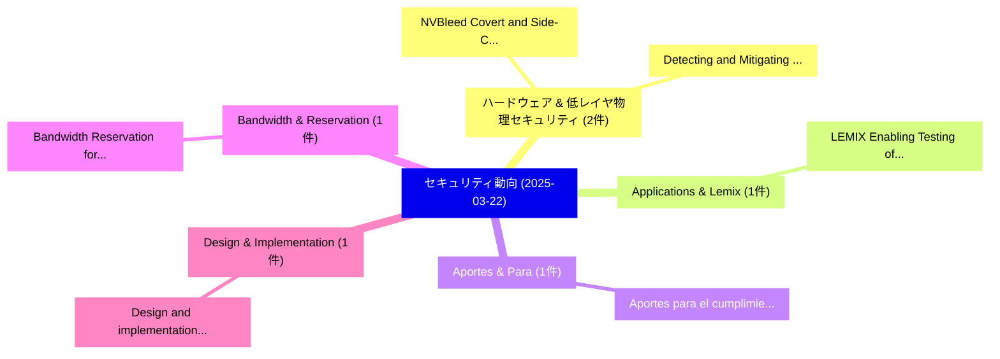

# 📅 02_daily: 日次エグゼクティブサマリー報告書 (2025-03-22)

**集計日時**: 2026-10-02 23:05:20 UTC  
**対象日付**: 2025-03-22  
**本日収集論文数**: 11 件  

---

## 💡 主要セキュリティ動向・脅威インサイト (Executive Insights)

本日の収集論文（計 11 件）において、以下の重点セキュリティ領域で活発な研究動向が確認されました：
- **ハードウェア & 低レイヤ物理セキュリティ** (2 件): 注目論文として 「NVBleed: Covert and Side-Chann...」、「Detecting and Mitigating DDoS ...」 等が発表され、実務防御および攻撃検証の進展が見られます。
- **Applications & Lemix** (1 件): 注目論文として 「LEMIX: Enabling Testing of Emb...」 等が発表され、実務防御および攻撃検証の進展が見られます。
- **Aportes & Para** (1 件): 注目論文として 「Aportes para el cumplimiento d...」 等が発表され、実務防御および攻撃検証の進展が見られます。
- **Bandwidth & Reservation** (1 件): 注目論文として 「Bandwidth Reservation for Time...」 等が発表され、実務防御および攻撃検証の進展が見られます。
- **Design & Implementation** (1 件): 注目論文として 「Design and implementation of a...」 等が発表され、実務防御および攻撃検証の進展が見られます。

### 🗺️ 技術・脅威トピックマインドマップ

---

## 📌 日次セキュリティ論文一覧 (日本語表形式)

| No | arXiv ID | 論文タイトル (日本語訳) | 重要キーワード | 構造化エグゼクティブ要約 (背景・提案・影響) | 脅威分類 | 詳細リンク |
|---|---|---|---|---|---|---|
| 1 | `2503.17588v2` | [LEMIX: Enabling Testing of Embedded Applications as Linux Applications (Extended Report)（セキュリティ分析論文）](../../okf/papers/2025-03-22/2503.17588.md) | `Enabling Testing`, `Embedded Applications`, `Linux Applications` | 【提案】概要 (Overview & Key Finding) 本論文「LEMIX: Enabling Testing of Embedded Applications as Lin...。実証評価により経営層・セキュリティ管理者向け推奨アクション (E... | `cs.CR` | [arXiv](https://arxiv.org/abs/2503.17588v2) &#124; [OKF](../../okf/papers/2025-03-22/2503.17588.md) |
| 2 | `2503.17730v1` | [Aportes para el cumplimiento del Reglamento (UE) 2024/1689 en robótica y sistemas autónomos（セキュリティ分析論文）](../../okf/papers/2025-03-22/2503.17730.md) | `Yoana Pita Lorenzo`, `Jose Miguel Guerrero`, `Raw Meta` | 【提案】概要 (Overview & Key Finding) 本論文「Aportes para el cumplimiento del Reglamento (UE) 2024/1...。実証評価により経営層・セキュリティ管理者向け推奨アクション (E... | `cs.CR` | [arXiv](https://arxiv.org/abs/2503.17730v1) &#124; [OKF](../../okf/papers/2025-03-22/2503.17730.md) |
| 3 | `2503.17756v1` | [Bandwidth Reservation for Time-Critical Vehicular Applications: A Multi-Operator Environment（セキュリティ分析論文）](../../okf/papers/2025-03-22/2503.17756.md) | `Critical Vehicular Applications`, `Bandwidth Reservation`, `Operator Environment` | 【提案】概要 (Overview & Key Finding) 本論文「Bandwidth Reservation for Time-Critical Vehicular Appli...。実証評価により経営層・セキュリティ管理者向け推奨アクション (E... | `cs.CR` | [arXiv](https://arxiv.org/abs/2503.17756v1) &#124; [OKF](../../okf/papers/2025-03-22/2503.17756.md) |
| 4 | `2503.17767v1` | [Design and implementation of a novel cryptographically secure pseudorandom number generator（セキュリティ分析論文）](../../okf/papers/2025-03-22/2503.17767.md) | `Juan Di Mauro`, `Eduardo Salazar`, `Raw Meta` | 【提案】概要 (Overview & Key Finding) 本論文「Design and implementation of a novel cryptographically ...。実証評価により経営層・セキュリティ管理者向け推奨アクション (E... | `cs.CR` | [arXiv](https://arxiv.org/abs/2503.17767v1) &#124; [OKF](../../okf/papers/2025-03-22/2503.17767.md) |
| 5 | `2503.17813v1` | [Connectedness: a dimension of security bug severity assessment for measuring uncertainty（セキュリティ分析論文）](../../okf/papers/2025-03-22/2503.17813.md) | `Shue Long Chan`, `Raw Meta`, `Executive Summary` | 【提案】概要 (Overview & Key Finding) 本論文「Connectedness: a dimension of security bug severity ass...。実証評価により経営層・セキュリティ管理者向け推奨アクション (E... | `cs.CR` | [arXiv](https://arxiv.org/abs/2503.17813v1) &#124; [OKF](../../okf/papers/2025-03-22/2503.17813.md) |
| 6 | `2503.17830v4` | [Classifying Implementations of Cryptographic Primitives and Protocols that Use Post-Quantum Algorithms（セキュリティ分析論文）](../../okf/papers/2025-03-22/2503.17830.md) | `Classifying Implementations`, `Cryptographic Primitives`, `Use Post` | 【提案】概要 (Overview & Key Finding) 本論文「Classifying Implementations of Cryptographic Primitives...。実証評価により経営層・セキュリティ管理者向け推奨アクション (E... | `cs.CR` | [arXiv](https://arxiv.org/abs/2503.17830v4) &#124; [OKF](../../okf/papers/2025-03-22/2503.17830.md) |
| 7 | `2503.17844v1` | [Privacy-Preserving Hamming Distance Computation with Property-Preserving Hashing（セキュリティ分析論文）](../../okf/papers/2025-03-22/2503.17844.md) | `Preserving Hamming Distance Computation`, `Preserving Hashing`, `Privacy-Preserving Hamming` | 【提案】概要 (Overview & Key Finding) 本論文「Privacy-Preserving Hamming Distance Computation with Pr...。実証評価により経営層・セキュリティ管理者向け推奨アクション (E... | `cs.CR` | [arXiv](https://arxiv.org/abs/2503.17844v1) &#124; [OKF](../../okf/papers/2025-03-22/2503.17844.md) |
| 8 | `2503.17847v1` | [NVBleed: Covert and Side-Channel Attacks on NVIDIA Multi-GPU Interconnect（セキュリティ分析論文）](../../okf/papers/2025-03-22/2503.17847.md) | `Channel Attacks`, `Side-Channel Attacks`, `Multi-GPU Interconnect` | 【提案】概要 (Overview & Key Finding) 本論文「NVBleed: Covert and サイドチャネル攻撃 Attacks on NVIDIA Multi-G...。実証評価により経営層・セキュリティ管理者向け推奨アクション (E... | `cs.CR` | [arXiv](https://arxiv.org/abs/2503.17847v1) &#124; [OKF](../../okf/papers/2025-03-22/2503.17847.md) |
| 9 | `2503.17867v3` | [Detecting and Mitigating DDoS Attacks with AI: A Survey（セキュリティ分析論文）](../../okf/papers/2025-03-22/2503.17867.md) | `Alexandru Apostu`, `Silviu Gheorghe`, `Nicolae Cleju` | 【提案】概要 (Overview & Key Finding) 本論文「Detecting and Mitigating DDoS Attacks with AI: A Survey...。実証評価により経営層・セキュリティ管理者向け推奨アクション (E... | `cs.CR` | [arXiv](https://arxiv.org/abs/2503.17867v3) &#124; [OKF](../../okf/papers/2025-03-22/2503.17867.md) |
| 10 | `2503.17873v1` | [A Distributed Blockchain-based Access Control for the Internet of Things（セキュリティ分析論文）](../../okf/papers/2025-03-22/2503.17873.md) | `Distributed Blockchain`, `Access Control`, `Blockchain-based Access` | 【提案】概要 (Overview & Key Finding) 本論文「A Distributed Blockchain-based アクセス制御 for the Internet ...。実証評価により経営層・セキュリティ管理者向け推奨アクション (E... | `cs.CR` | [arXiv](https://arxiv.org/abs/2503.17873v1) &#124; [OKF](../../okf/papers/2025-03-22/2503.17873.md) |
| 11 | `2503.20796v1` | [EXPLICATE: Enhancing Phishing Detection through Explainable AI and LLM-Powered Interpretability（セキュリティ分析論文）](../../okf/papers/2025-03-22/2503.20796.md) | `Enhancing Phishing Detection`, `Powered Interpretability`, `LLM-Powered Interpretability` | 【提案】概要 (Overview & Key Finding) 本論文「EXPLICATE: Enhancing Phishing Detection through Explain...。実証評価により経営層・セキュリティ管理者向け推奨アクション (E... | `cs.CR` | [arXiv](https://arxiv.org/abs/2503.20796v1) &#124; [OKF](../../okf/papers/2025-03-22/2503.20796.md) |

