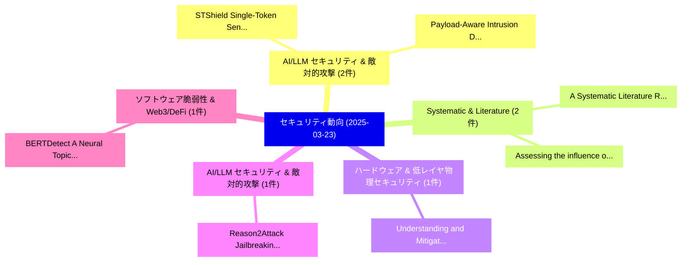

# 📅 02_daily: 日次エグゼクティブサマリー報告書 (2025-03-23)

**集計日時**: 2026-10-02 23:05:20 UTC  
**対象日付**: 2025-03-23  
**本日収集論文数**: 8 件  

---

## 💡 主要セキュリティ動向・脅威インサイト (Executive Insights)

本日の収集論文（計 8 件）において、以下の重点セキュリティ領域で活発な研究動向が確認されました：
- **AI/LLM セキュリティ & 敵対的攻撃** (2 件): 注目論文として 「STShield: Single-Token Sentine...」、「Payload-Aware Intrusion Detect...」 等が発表され、実務防御および攻撃検証の進展が見られます。
- **Systematic & Literature** (2 件): 注目論文として 「A Systematic Literature Review...」、「Assessing the influence of サイバ...」 等が発表され、実務防御および攻撃検証の進展が見られます。
- **ハードウェア & 低レイヤ物理セキュリティ** (1 件): 注目論文として 「Understanding and Mitigating C...」 等が発表され、実務防御および攻撃検証の進展が見られます。
- **AI/LLM セキュリティ & 敵対的攻撃** (1 件): 注目論文として 「Reason2Attack: Jailbreaking Te...」 等が発表され、実務防御および攻撃検証の進展が見られます。
- **ソフトウェア脆弱性 & Web3/DeFi** (1 件): 注目論文として 「BERTDetect: A Neural Topic Mod...」 等が発表され、実務防御および攻撃検証の進展が見られます。

### 🗺️ 技術・脅威トピックマインドマップ

---

## 📌 日次セキュリティ論文一覧 (日本語表形式)

| No | arXiv ID | 論文タイトル (日本語訳) | 重要キーワード | 構造化エグゼクティブ要約 (背景・提案・影響) | 脅威分類 | 詳細リンク |
|---|---|---|---|---|---|---|
| 1 | `2503.17891v3` | [Understanding and Mitigating Covert Channel and Side Channel Vulnerabilities Introduced by RowHammer Defenses（セキュリティ分析論文）](../../okf/papers/2025-03-23/2503.17891.md) | `Side Channel Vulnerabilities Introduced`, `Mitigating Covert Channel`, `Ataberk Olgun` | 【提案】概要 (Overview & Key Finding) 本論文「Understanding and Mitigating Covert Channel and Side Ch...。実証評価により経営層・セキュリティ管理者向け推奨アクション (E... | `cs.CR` | [arXiv](https://arxiv.org/abs/2503.17891v3) &#124; [OKF](../../okf/papers/2025-03-23/2503.17891.md) |
| 2 | `2503.17932v1` | [STShield: Single-Token Sentinel for Real-Time Jailbreak Detection in 大規模言語モデル](../../okf/papers/2025-03-23/2503.17932.md) | `Time Jailbreak Detection`, `Token Sentinel`, `Single-Token Sentinel` | 【提案】概要 (Overview & Key Finding) 本論文「STShield: Single-Token Sentinel for Real-Time ジェイルブレイク ...。実証評価により経営層・セキュリティ管理者向け推奨アクション (E... | `cs.CR` | [arXiv](https://arxiv.org/abs/2503.17932v1) &#124; [OKF](../../okf/papers/2025-03-23/2503.17932.md) |
| 3 | `2503.17987v3` | [Reason2Attack: Jailbreaking Text-to-Image Models via LLM Reasoning（セキュリティ分析論文）](../../okf/papers/2025-03-23/2503.17987.md) | `Jailbreaking Text`, `Image Models`, `Chenyu Zhang` | 【提案】概要 (Overview & Key Finding) 本論文「Reason2Attack: ジェイルブレイクing Text-to-Image Models via LLM...。実証評価により経営層・セキュリティ管理者向け推奨アクション (E... | `cs.CR` | [arXiv](https://arxiv.org/abs/2503.17987v3) &#124; [OKF](../../okf/papers/2025-03-23/2503.17987.md) |
| 4 | `2503.18043v1` | [BERTDetect: A Neural Topic Modelling Approach for Android マルウェア検出](../../okf/papers/2025-03-23/2503.18043.md) | `Android Malware Detection`, `Nishavi Ranaweera`, `Jiarui Xu` | 【提案】概要 (Overview & Key Finding) 本論文「BERTDetect: A Neural Topic Modelling Approach for Andro...。実証評価により経営層・セキュリティ管理者向け推奨アクション (E... | `cs.CR` | [arXiv](https://arxiv.org/abs/2503.18043v1) &#124; [OKF](../../okf/papers/2025-03-23/2503.18043.md) |
| 5 | `2503.18081v1` | [Model-Guardian: Protecting against Data-Free Model Stealing Using Gradient Representations and Deceptive Predictions（セキュリティ分析論文）](../../okf/papers/2025-03-23/2503.18081.md) | `Free Model Stealing Using Gradient Representations`, `Deceptive Predictions`, `Data-Free Model` | 【提案】概要 (Overview & Key Finding) 本論文「Model-Guardian: Protecting against Data-Free Model Stea...。実証評価により経営層・セキュリティ管理者向け推奨アクション (E... | `cs.CR` | [arXiv](https://arxiv.org/abs/2503.18081v1) &#124; [OKF](../../okf/papers/2025-03-23/2503.18081.md) |
| 6 | `2503.18173v3` | [A Systematic Literature Review of Cyber Security Monitoring in Maritime（セキュリティ分析論文）](../../okf/papers/2025-03-23/2503.18173.md) | `Systematic Literature Review`, `Cyber Security Monitoring`, `Muaan Ur Rehman` | 【提案】概要 (Overview & Key Finding) 本論文「A Systematic Literature Review of Cyber Security Monito...。実証評価により経営層・セキュリティ管理者向け推奨アクション (E... | `cs.CR` | [arXiv](https://arxiv.org/abs/2503.18173v3) &#124; [OKF](../../okf/papers/2025-03-23/2503.18173.md) |
| 7 | `2503.20798v1` | [Payload-Aware Intrusion Detection with CMAE and 大規模言語モデル](../../okf/papers/2025-03-23/2503.20798.md) | `Aware Intrusion Detection`, `Payload-Aware Intrusion`, `Large Language Models` | 【提案】概要 (Overview & Key Finding) 本論文「Payload-Aware Intrusion Detection with CMAE and 大規模言語モデ...。実証評価により経営層・セキュリティ管理者向け推奨アクション (E... | `cs.CR` | [arXiv](https://arxiv.org/abs/2503.20798v1) &#124; [OKF](../../okf/papers/2025-03-23/2503.20798.md) |
| 8 | `2503.22710v1` | [Assessing the influence of サイバーセキュリティ threats and risks on the adoption and growth of digital banking: a systematic literature review](../../okf/papers/2025-03-23/2503.22710.md) | `Md Zahin Hossain George`, `Mosa Sumaiya Khatun Munira`, `Md Tarek Hasan` | 【提案】概要 (Overview & Key Finding) 本論文「Assessing the influence of サイバーセキュリティ threats and risks...。実証評価により経営層・セキュリティ管理者向け推奨アクション (E... | `cs.CR` | [arXiv](https://arxiv.org/abs/2503.22710v1) &#124; [OKF](../../okf/papers/2025-03-23/2503.22710.md) |

