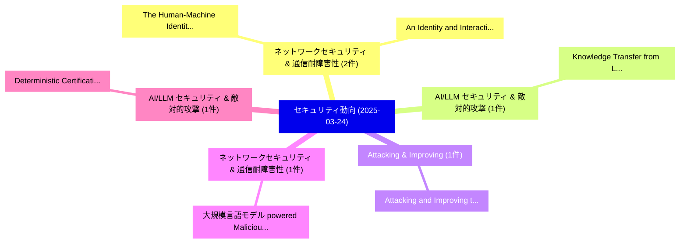

# 📅 02_daily: 日次エグゼクティブサマリー報告書 (2025-03-24)

**集計日時**: 2026-10-02 23:05:20 UTC  
**対象日付**: 2025-03-24  
**本日収集論文数**: 25 件  

---

## 💡 主要セキュリティ動向・脅威インサイト (Executive Insights)

本日の収集論文（計 25 件）において、以下の重点セキュリティ領域で活発な研究動向が確認されました：
- **ネットワークセキュリティ & 通信耐障害性** (2 件): 注目論文として 「The Human-Machine Identity Blu...」、「An Identity and Interaction Ba...」 等が発表され、実務防御および攻撃検証の進展が見られます。
- **AI/LLM セキュリティ & 敵対的攻撃** (1 件): 注目論文として 「Knowledge Transfer from LLMs t...」 等が発表され、実務防御および攻撃検証の進展が見られます。
- **Attacking & Improving** (1 件): 注目論文として 「Attacking and Improving the To...」 等が発表され、実務防御および攻撃検証の進展が見られます。
- **ネットワークセキュリティ & 通信耐障害性** (1 件): 注目論文として 「大規模言語モデル powered Malicious Tra...」 等が発表され、実務防御および攻撃検証の進展が見られます。
- **AI/LLM セキュリティ & 敵対的攻撃** (1 件): 注目論文として 「Deterministic Certification of...」 等が発表され、実務防御および攻撃検証の進展が見られます。

### 🗺️ 技術・脅威トピックマインドマップ

---

## 📌 日次セキュリティ論文一覧 (日本語表形式)

| No | arXiv ID | 論文タイトル (日本語訳) | 重要キーワード | 構造化エグゼクティブ要約 (背景・提案・影響) | 脅威分類 | 詳細リンク |
|---|---|---|---|---|---|---|
| 1 | `2503.18255v1` | [The Human-Machine Identity Blur: A Unified Framework for サイバーセキュリティ Risk Management in 2025](../../okf/papers/2025-03-24/2503.18255.md) | `Machine Identity Blur`, `Human-Machine Identity`, `Cybersecurity Risk Management` | 【提案】概要 (Overview & Key Finding) 本論文「The Human-Machine Identity Blur: A Unified Framework fo...。実証評価により経営層・セキュリティ管理者向け推奨アクション (E... | `cs.CR` | [arXiv](https://arxiv.org/abs/2503.18255v1) &#124; [OKF](../../okf/papers/2025-03-24/2503.18255.md) |
| 2 | `2503.18316v2` | [Knowledge Transfer from LLMs to Provenance Analysis: A Semantic-Augmented Method for APT Detection（セキュリティ分析論文）](../../okf/papers/2025-03-24/2503.18316.md) | `Knowledge Transfer`, `Yung Ryn Choe`, `Fei Zuo` | 【提案】概要 (Overview & Key Finding) 本論文「Knowledge Transfer from LLMs to Provenance Analysis: A ...。実証評価により経営層・セキュリティ管理者向け推奨アクション (E... | `cs.CR` | [arXiv](https://arxiv.org/abs/2503.18316v2) &#124; [OKF](../../okf/papers/2025-03-24/2503.18316.md) |
| 3 | `2503.18345v1` | [Attacking and Improving the Tor Directory Protocol（セキュリティ分析論文）](../../okf/papers/2025-03-24/2503.18345.md) | `Tor Directory Protocol`, `Zhongtang Luo`, `Adithya Bhat` | 【提案】概要 (Overview & Key Finding) 本論文「Attacking and Improving the Tor Directory Protocol（セキュリ...。実証評価により経営層・セキュリティ管理者向け推奨アクション (E... | `cs.CR` | [arXiv](https://arxiv.org/abs/2503.18345v1) &#124; [OKF](../../okf/papers/2025-03-24/2503.18345.md) |
| 4 | `2503.18487v2` | [大規模言語モデル powered Malicious Traffic Detection: Architecture, Opportunities and Case Study](../../okf/papers/2025-03-24/2503.18487.md) | `Malicious Traffic Detection`, `Large Language Models`, `Xinggong Zhang` | 【提案】概要 (Overview & Key Finding) 本論文「大規模言語モデル powered Malicious Traffic Detection: Architect...。実証評価により経営層・セキュリティ管理者向け推奨アクション (E... | `cs.CR` | [arXiv](https://arxiv.org/abs/2503.18487v2) &#124; [OKF](../../okf/papers/2025-03-24/2503.18487.md) |
| 5 | `2503.18503v1` | [Deterministic Certification of Graph Neural Networks against Graph Poisoning Attacks with Arbitrary Perturbations（セキュリティ分析論文）](../../okf/papers/2025-03-24/2503.18503.md) | `Graph Neural Networks`, `Graph Poisoning Attacks`, `Deterministic Certification` | 【提案】概要 (Overview & Key Finding) 本論文「Deterministic Certification of Graph Neural Networks ag...。実証評価により経営層・セキュリティ管理者向け推奨アクション (E... | `cs.CR` | [arXiv](https://arxiv.org/abs/2503.18503v1) &#124; [OKF](../../okf/papers/2025-03-24/2503.18503.md) |
| 6 | `2503.18542v1` | [An Identity and Interaction Based Network Forensic Analysis（セキュリティ分析論文）](../../okf/papers/2025-03-24/2503.18542.md) | `Nathan Clarke`, `Gaseb Alotibi`, `Dany Joy` | 【提案】概要 (Overview & Key Finding) 本論文「An Identity and Interaction Based Network Forensic Anal...。実証評価により経営層・セキュリティ管理者向け推奨アクション (E... | `cs.CR` | [arXiv](https://arxiv.org/abs/2503.18542v1) &#124; [OKF](../../okf/papers/2025-03-24/2503.18542.md) |
| 7 | `2503.18550v1` | [The (Un)suitability of Passwords and Password Managers in Virtual Reality（セキュリティ分析論文）](../../okf/papers/2025-03-24/2503.18550.md) | `Password Managers`, `Virtual Reality`, `Patricia Arias Cabarcos` | 【提案】概要 (Overview & Key Finding) 本論文「The (Un)suitability of Passwords and Password Managers ...。実証評価により経営層・セキュリティ管理者向け推奨アクション (E... | `cs.CR` | [arXiv](https://arxiv.org/abs/2503.18550v1) &#124; [OKF](../../okf/papers/2025-03-24/2503.18550.md) |
| 8 | `2503.18687v2` | [EVOLVE: a Value-Added Services Platform for Electric Vehicle Charging Stations（セキュリティ分析論文）](../../okf/papers/2025-03-24/2503.18687.md) | `Electric Vehicle Charging Stations`, `Added Services Platform`, `Value-Added Services` | 【提案】概要 (Overview & Key Finding) 本論文「EVOLVE: a Value-Added Services Platform for Electric Ve...。実証評価により経営層・セキュリティ管理者向け推奨アクション (E... | `cs.CR` | [arXiv](https://arxiv.org/abs/2503.18687v2) &#124; [OKF](../../okf/papers/2025-03-24/2503.18687.md) |
| 9 | `2503.18721v3` | [Differentially Private Joint Independence Test（セキュリティ分析論文）](../../okf/papers/2025-03-24/2503.18721.md) | `Differentially Private Joint Independence Test`, `Xingwei Liu`, `Yuexin Chen` | 【提案】概要 (Overview & Key Finding) 本論文「Differentially Private Joint Independence Test（セキュリティ分析...。実証評価により経営層・セキュリティ管理者向け推奨アクション (E... | `cs.CR` | [arXiv](https://arxiv.org/abs/2503.18721v3) &#124; [OKF](../../okf/papers/2025-03-24/2503.18721.md) |
| 10 | `2503.18813v2` | [Defeating Prompt Injections by Design（セキュリティ分析論文）](../../okf/papers/2025-03-24/2503.18813.md) | `Defeating Prompt Injections`, `Edoardo Debenedetti`, `Ilia Shumailov` | 【提案】概要 (Overview & Key Finding) 本論文「Defeating プロンプトインジェクションs by Design（セキュリティ分析論文）」（原題: Def...。実証評価により経営層・セキュリティ管理者向け推奨アクション (E... | `cs.CR` | [arXiv](https://arxiv.org/abs/2503.18813v2) &#124; [OKF](../../okf/papers/2025-03-24/2503.18813.md) |
| 11 | `2503.18857v1` | [Secure Edge Computing Reference Architecture for Data-driven Structural Health Monitoring: Lessons Learned from Implementation and Benchmarking（セキュリティ分析論文）](../../okf/papers/2025-03-24/2503.18857.md) | `Secure Edge Computing Reference Architecture`, `Structural Health Monitoring`, `Lessons Learned` | 【提案】概要 (Overview & Key Finding) 本論文「Secure Edge Computing Reference Architecture for Data-d...。実証評価により経営層・セキュリティ管理者向け推奨アクション (E... | `cs.CR` | [arXiv](https://arxiv.org/abs/2503.18857v1) &#124; [OKF](../../okf/papers/2025-03-24/2503.18857.md) |
| 12 | `2503.18859v1` | [An End-to-End GSM/SMS Encrypted Approach for Smartphone Employing Advanced Encryption Standard(AES)（セキュリティ分析論文）](../../okf/papers/2025-03-24/2503.18859.md) | `Smartphone Employing Advanced Encryption Standard`, `Salaki Reynaldo Joshua`, `Wasim Abbas` | 【提案】概要 (Overview & Key Finding) 本論文「An End-to-End GSM/SMS Encrypted Approach for Smartphone...。実証評価により経営層・セキュリティ管理者向け推奨アクション (E... | `cs.CR` | [arXiv](https://arxiv.org/abs/2503.18859v1) &#124; [OKF](../../okf/papers/2025-03-24/2503.18859.md) |
| 13 | `2503.18890v4` | [Public-Key Quantum Money and Fast Real Transforms（セキュリティ分析論文）](../../okf/papers/2025-03-24/2503.18890.md) | `Key Quantum Money`, `Fast Real Transforms`, `Public-Key Quantum` | 【提案】概要 (Overview & Key Finding) 本論文「Public-Key 量子 Money and Fast Real Transforms（セキュリティ分析論文...。実証評価により経営層・セキュリティ管理者向け推奨アクション (E... | `cs.CR` | [arXiv](https://arxiv.org/abs/2503.18890v4) &#124; [OKF](../../okf/papers/2025-03-24/2503.18890.md) |
| 14 | `2503.18899v1` | [Statistical Proof of Execution (SPEX)（セキュリティ分析論文）](../../okf/papers/2025-03-24/2503.18899.md) | `Statistical Proof`, `Michele Dallachiesa`, `Antonio Pitasi` | 【提案】概要 (Overview & Key Finding) 本論文「Statistical Proof of Execution (SPEX)（セキュリティ分析論文）」（原題: ...。実証評価により経営層・セキュリティ管理者向け推奨アクション (E... | `cs.CR` | [arXiv](https://arxiv.org/abs/2503.18899v1) &#124; [OKF](../../okf/papers/2025-03-24/2503.18899.md) |
| 15 | `2503.19030v1` | [strideSEA: A STRIDE-centric Security Evaluation Approach（セキュリティ分析論文）](../../okf/papers/2025-03-24/2503.19030.md) | `STRIDE-centric Security`, `Alvi Jawad`, `Jason Jaskolka` | 【提案】概要 (Overview & Key Finding) 本論文「strideSEA: A STRIDE-centric Security Evaluation Approac...。実証評価により経営層・セキュリティ管理者向け推奨アクション (E... | `cs.CR` | [arXiv](https://arxiv.org/abs/2503.19030v1) &#124; [OKF](../../okf/papers/2025-03-24/2503.19030.md) |
| 16 | `2503.19058v1` | [Coding Malware in Fancy Programming Languages for Fun and Profit（セキュリティ分析論文）](../../okf/papers/2025-03-24/2503.19058.md) | `Fancy Programming Languages`, `Coding Malware`, `Theodoros Apostolopoulos` | 【提案】概要 (Overview & Key Finding) 本論文「Coding マルウェア in Fancy Programming Languages for Fun and...。実証評価により経営層・セキュリティ管理者向け推奨アクション (E... | `cs.CR` | [arXiv](https://arxiv.org/abs/2503.19058v1) &#124; [OKF](../../okf/papers/2025-03-24/2503.19058.md) |
| 17 | `2503.19134v1` | [MIRAGE: Multimodal Immersive Reasoning and Guided Exploration for Red-Team Jailbreak Attacks（セキュリティ分析論文）](../../okf/papers/2025-03-24/2503.19134.md) | `Multimodal Immersive Reasoning`, `Team Jailbreak Attacks`, `Guided Exploration` | 【提案】概要 (Overview & Key Finding) 本論文「MIRAGE: Multimodal Immersive Reasoning and Guided Explo...。実証評価により経営層・セキュリティ管理者向け推奨アクション (E... | `cs.CR` | [arXiv](https://arxiv.org/abs/2503.19134v1) &#124; [OKF](../../okf/papers/2025-03-24/2503.19134.md) |
| 18 | `2503.19141v1` | [Weight distribution of a class of $p$-ary codes（セキュリティ分析論文）](../../okf/papers/2025-03-24/2503.19141.md) | `Kaimin Cheng`, `Du Sheng`, `Raw Meta` | 【提案】概要 (Overview & Key Finding) 本論文「Weight distribution of a class of $p$-ary codes（セキュリティ分...。実証評価により経営層・セキュリティ管理者向け推奨アクション (E... | `cs.CR` | [arXiv](https://arxiv.org/abs/2503.19141v1) &#124; [OKF](../../okf/papers/2025-03-24/2503.19141.md) |
| 19 | `2503.19142v2` | [Activation Functions Considered Harmful: Recovering Neural Network Weights through Controlled Channels（セキュリティ分析論文）](../../okf/papers/2025-03-24/2503.19142.md) | `Activation Functions Considered Harmful`, `Recovering Neural Network Weights`, `Controlled Channels` | 【提案】概要 (Overview & Key Finding) 本論文「Activation Functions Considered Harmful: Recovering Neu...。実証評価により経営層・セキュリティ管理者向け推奨アクション (E... | `cs.CR` | [arXiv](https://arxiv.org/abs/2503.19142v2) &#124; [OKF](../../okf/papers/2025-03-24/2503.19142.md) |
| 20 | `2503.19176v2` | [SoK: How Robust is Audio Watermarking in Generative AI models?（セキュリティ分析論文）](../../okf/papers/2025-03-24/2503.19176.md) | `Audio Watermarking`, `Aaron Bien Ramos`, `Yizhu Wen` | 【提案】### (日本語題名: SoK: How Robust is Audio Watermarking in Generative AI models?（セキュリティ分析論文）)...。実証評価により経営層・セキュリティ管理者向け推奨アクション (E... | `cs.CR` | [arXiv](https://arxiv.org/abs/2503.19176v2) &#124; [OKF](../../okf/papers/2025-03-24/2503.19176.md) |
| 21 | `2503.20800v1` | [Evidencing Unauthorized Training Data from AI Generated Content using Information Isotopes（セキュリティ分析論文）](../../okf/papers/2025-03-24/2503.20800.md) | `Evidencing Unauthorized Training Data`, `Generated Content`, `Information Isotopes` | 【提案】概要 (Overview & Key Finding) 本論文「Evidencing Unauthorized Training Data from AI Generated...。実証評価により経営層・セキュリティ管理者向け推奨アクション (E... | `cs.CR` | [arXiv](https://arxiv.org/abs/2503.20800v1) &#124; [OKF](../../okf/papers/2025-03-24/2503.20800.md) |
| 22 | `2503.20802v1` | [CEFW: A Comprehensive Evaluation Framework for Watermark in 大規模言語モデル](../../okf/papers/2025-03-24/2503.20802.md) | `Large Language Models`, `Shuhao Zhang`, `Bo Cheng` | 【提案】概要 (Overview & Key Finding) 本論文「CEFW: A Comprehensive Evaluation Framework for Watermar...。実証評価により経営層・セキュリティ管理者向け推奨アクション (E... | `cs.CR` | [arXiv](https://arxiv.org/abs/2503.20802v1) &#124; [OKF](../../okf/papers/2025-03-24/2503.20802.md) |
| 23 | `2503.20803v2` | [Leveraging VAE-Derived Latent Spaces for Enhanced マルウェア検出 with Machine Learning Classifiers](../../okf/papers/2025-03-24/2503.20803.md) | `Derived Latent Spaces`, `Machine Learning Classifiers`, `VAE-Derived Latent` | 【提案】概要 (Overview & Key Finding) 本論文「Leveraging VAE-Derived Latent Spaces for Enhanced マルウェア...。実証評価により経営層・セキュリティ管理者向け推奨アクション (E... | `cs.CR` | [arXiv](https://arxiv.org/abs/2503.20803v2) &#124; [OKF](../../okf/papers/2025-03-24/2503.20803.md) |
| 24 | `2503.20804v2` | [AED: Automatic Discovery of Effective and Diverse Vulnerabilities for Autonomous Driving Policy with 大規模言語モデル](../../okf/papers/2025-03-24/2503.20804.md) | `Autonomous Driving Policy`, `Automatic Discovery`, `Diverse Vulnerabilities` | 【提案】概要 (Overview & Key Finding) 本論文「AED: Automatic Discovery of Effective and Diverse Vulne...。実証評価により経営層・セキュリティ管理者向け推奨アクション (E... | `cs.CR` | [arXiv](https://arxiv.org/abs/2503.20804v2) &#124; [OKF](../../okf/papers/2025-03-24/2503.20804.md) |
| 25 | `2503.20806v1` | [SCVI: Bridging Social and Cyber Dimensions for Comprehensive Vulnerability Assessment（セキュリティ分析論文）](../../okf/papers/2025-03-24/2503.20806.md) | `Comprehensive Vulnerability Assessment`, `Bridging Social`, `Cyber Dimensions` | 【提案】概要 (Overview & Key Finding) 本論文「SCVI: Bridging Social and Cyber Dimensions for Comprehe...。実証評価により経営層・セキュリティ管理者向け推奨アクション (E... | `cs.CR` | [arXiv](https://arxiv.org/abs/2503.20806v1) &#124; [OKF](../../okf/papers/2025-03-24/2503.20806.md) |

