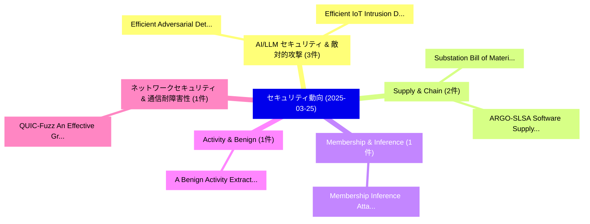

# 📅 02_daily: 日次エグゼクティブサマリー報告書 (2025-03-25)

**集計日時**: 2026-10-02 23:05:20 UTC  
**対象日付**: 2025-03-25  
**本日収集論文数**: 21 件  

---

## 💡 主要セキュリティ動向・脅威インサイト (Executive Insights)

本日の収集論文（計 21 件）において、以下の重点セキュリティ領域で活発な研究動向が確認されました：
- **AI/LLM セキュリティ & 敵対的攻撃** (3 件): 注目論文として 「Efficient Adversarial Detectio...」、「Efficient IoT Intrusion Detect...」 等が発表され、実務防御および攻撃検証の進展が見られます。
- **Supply & Chain** (2 件): 注目論文として 「Substation Bill of Materials: ...」、「ARGO-SLSA: Software Supply Cha...」 等が発表され、実務防御および攻撃検証の進展が見られます。
- **Membership & Inference** (1 件): 注目論文として 「Membership Inference Attacks o...」 等が発表され、実務防御および攻撃検証の進展が見られます。
- **Activity & Benign** (1 件): 注目論文として 「A Benign Activity Extraction M...」 等が発表され、実務防御および攻撃検証の進展が見られます。
- **ネットワークセキュリティ & 通信耐障害性** (1 件): 注目論文として 「QUIC-Fuzz: An Effective Greybo...」 等が発表され、実務防御および攻撃検証の進展が見られます。

### 🗺️ 技術・脅威トピックマインドマップ

---

## 📌 日次セキュリティ論文一覧 (日本語表形式)

| No | arXiv ID | 論文タイトル (日本語訳) | 重要キーワード | 構造化エグゼクティブ要約 (背景・提案・影響) | 脅威分類 | 詳細リンク |
|---|---|---|---|---|---|---|
| 1 | `2503.19318v1` | [Efficient Adversarial Detection Frameworks for Vehicle-to-Microgrid Services in Edge Computing（セキュリティ分析論文）](../../okf/papers/2025-03-25/2503.19318.md) | `Efficient Adversarial Detection Frameworks`, `Microgrid Services`, `Edge Computing` | 【提案】概要 (Overview & Key Finding) 本論文「Efficient Adversarial Detection Frameworks for Vehicle-...。実証評価により経営層・セキュリティ管理者向け推奨アクション (E... | `cs.CR` | [arXiv](https://arxiv.org/abs/2503.19318v1) &#124; [OKF](../../okf/papers/2025-03-25/2503.19318.md) |
| 2 | `2503.19338v3` | [Membership Inference Attacks on Large-Scale Models: A Survey（セキュリティ分析論文）](../../okf/papers/2025-03-25/2503.19338.md) | `Membership Inference Attacks`, `Scale Models`, `Large-Scale Models` | 【提案】概要 (Overview & Key Finding) 本論文「Membership Inference Attacks on Large-Scale Models: A S...。実証評価により経営層・セキュリティ管理者向け推奨アクション (E... | `cs.CR` | [arXiv](https://arxiv.org/abs/2503.19338v3) &#124; [OKF](../../okf/papers/2025-03-25/2503.19338.md) |
| 3 | `2503.19339v4` | [Efficient IoT Intrusion Detection with an Improved Attention-Based CNN-BiLSTM Architecture（セキュリティ分析論文）](../../okf/papers/2025-03-25/2503.19339.md) | `Intrusion Detection`, `Improved Attention`, `Attention-Based CNN` | 【提案】概要 (Overview & Key Finding) 本論文「Efficient IoT Intrusion Detection with an Improved Atte...。実証評価により経営層・セキュリティ管理者向け推奨アクション (E... | `cs.CR` | [arXiv](https://arxiv.org/abs/2503.19339v4) &#124; [OKF](../../okf/papers/2025-03-25/2503.19339.md) |
| 4 | `2503.19370v1` | [A Benign Activity Extraction Method for Malignant Activity Identification using Data Provenance（セキュリティ分析論文）](../../okf/papers/2025-03-25/2503.19370.md) | `Malignant Activity Identification`, `Data Provenance`, `Taishin Saito` | 【提案】概要 (Overview & Key Finding) 本論文「A Benign Activity Extraction Method for Malignant Activ...。実証評価により経営層・セキュリティ管理者向け推奨アクション (E... | `cs.CR` | [arXiv](https://arxiv.org/abs/2503.19370v1) &#124; [OKF](../../okf/papers/2025-03-25/2503.19370.md) |
| 5 | `2503.19402v1` | [QUIC-Fuzz: An Effective Greybox Fuzzer For The QUIC Protocol（セキュリティ分析論文）](../../okf/papers/2025-03-25/2503.19402.md) | `Kian Kai Ang`, `Raw Meta`, `Executive Summary` | 【提案】概要 (Overview & Key Finding) 本論文「QUIC-Fuzz: An Effective Greybox Fuzzer For The QUIC Pro...。実証評価によりRanasinghe - **公開日時**: `2... | `cs.CR` | [arXiv](https://arxiv.org/abs/2503.19402v1) &#124; [OKF](../../okf/papers/2025-03-25/2503.19402.md) |
| 6 | `2503.19499v1` | [SparSamp: Efficient Provably Secure Steganography Based on Sparse Sampling（セキュリティ分析論文）](../../okf/papers/2025-03-25/2503.19499.md) | `Efficient Provably Secure Steganography Based`, `Sparse Sampling`, `Yaofei Wang` | 【提案】概要 (Overview & Key Finding) 本論文「SparSamp: Efficient Provably Secure Steganography Based...。実証評価により経営層・セキュリティ管理者向け推奨アクション (E... | `cs.CR` | [arXiv](https://arxiv.org/abs/2503.19499v1) &#124; [OKF](../../okf/papers/2025-03-25/2503.19499.md) |
| 7 | `2503.19519v1` | [Imperceptible Adversarial Attacks for Time Series Classification with Local Perturbations and Frequency Analysisに向けて](../../okf/papers/2025-03-25/2503.19519.md) | `Time Series Classification`, `Local Perturbations`, `Imperceptible Adversarial Attacks` | 【提案】概要 (Overview & Key Finding) 本論文「Imperceptible 敵対的攻撃s for Time Series Classification wit...。実証評価により経営層・セキュリティ管理者向け推奨アクション (E... | `cs.CR` | [arXiv](https://arxiv.org/abs/2503.19519v1) &#124; [OKF](../../okf/papers/2025-03-25/2503.19519.md) |
| 8 | `2503.19531v1` | [Cryptoscope: Analyzing cryptographic usages in modern software（セキュリティ分析論文）](../../okf/papers/2025-03-25/2503.19531.md) | `Micha Moffie`, `Omer Boehm`, `Anatoly Koyfman` | 【提案】概要 (Overview & Key Finding) 本論文「Cryptoscope: Analyzing cryptographic usages in modern s...。実証評価により経営層・セキュリティ管理者向け推奨アクション (E... | `cs.CR` | [arXiv](https://arxiv.org/abs/2503.19531v1) &#124; [OKF](../../okf/papers/2025-03-25/2503.19531.md) |
| 9 | `2503.19548v3` | [On-Chain Smart Contract Dependency Risks on Ethereumの分析](../../okf/papers/2025-03-25/2503.19548.md) | `Chain Smart Contract Dependency Risks`, `Smart Contract Dependency Risks`, `On-Chain Smart` | 【提案】概要 (Overview & Key Finding) 本論文「On-Chain スマートコントラクト Dependency Risks on Ethereumの分析」（原題...。実証評価により経営層・セキュリティ管理者向け推奨アクション (E... | `cs.CR` | [arXiv](https://arxiv.org/abs/2503.19548v3) &#124; [OKF](../../okf/papers/2025-03-25/2503.19548.md) |
| 10 | `2503.19591v1` | [Boosting the Transferability of Audio Adversarial Examples with Acoustic Representation Optimization（セキュリティ分析論文）](../../okf/papers/2025-03-25/2503.19591.md) | `Audio Adversarial Examples`, `Acoustic Representation Optimization`, `Weifei Jin` | 【提案】概要 (Overview & Key Finding) 本論文「Boosting the Transferability of Audio Adversarial Examp...。実証評価により経営層・セキュリティ管理者向け推奨アクション (E... | `cs.CR` | [arXiv](https://arxiv.org/abs/2503.19591v1) &#124; [OKF](../../okf/papers/2025-03-25/2503.19591.md) |
| 11 | `2503.19609v3` | [Nanopass Back-Translation of Call-Return Trees for Mechanized Secure Compilation Proofs（セキュリティ分析論文）](../../okf/papers/2025-03-25/2503.19609.md) | `Mechanized Secure Compilation Proofs`, `Nanopass Back`, `Return Trees` | 【提案】概要 (Overview & Key Finding) 本論文「Nanopass Back-Translation of Call-Return Trees for Mech...。実証評価により経営層・セキュリティ管理者向け推奨アクション (E... | `cs.CR` | [arXiv](https://arxiv.org/abs/2503.19609v3) &#124; [OKF](../../okf/papers/2025-03-25/2503.19609.md) |
| 12 | `2503.19626v1` | [Red Teaming with Artificial Intelligence-Driven Cyberattacks: A Scoping Review（セキュリティ分析論文）](../../okf/papers/2025-03-25/2503.19626.md) | `Red Teaming`, `Artificial Intelligence`, `Driven Cyberattacks` | 【提案】概要 (Overview & Key Finding) 本論文「Red Teaming with Artificial Intelligence-Driven Cyberat...。実証評価により経営層・セキュリティ管理者向け推奨アクション (E... | `cs.CR` | [arXiv](https://arxiv.org/abs/2503.19626v1) &#124; [OKF](../../okf/papers/2025-03-25/2503.19626.md) |
| 13 | `2503.19638v1` | [Substation Bill of Materials: A Novel Approach to Managing Supply Chain Cyber-risks on IEC 61850 Digital Substations（セキュリティ分析論文）](../../okf/papers/2025-03-25/2503.19638.md) | `Managing Supply Chain Cyber`, `Substation Bill`, `Digital Substations` | 【提案】概要 (Overview & Key Finding) 本論文「Substation Bill of Materials: A Novel Approach to Manag...。実証評価により経営層・セキュリティ管理者向け推奨アクション (E... | `cs.CR` | [arXiv](https://arxiv.org/abs/2503.19638v1) &#124; [OKF](../../okf/papers/2025-03-25/2503.19638.md) |
| 14 | `2503.19768v2` | [A Managed Tokens Service for Securely Keeping and Distributing Grid Tokens（セキュリティ分析論文）](../../okf/papers/2025-03-25/2503.19768.md) | `Managed Tokens Service`, `Distributing Grid Tokens`, `Securely Keeping` | 【提案】概要 (Overview & Key Finding) 本論文「A Managed Tokens Service for Securely Keeping and Distr...。実証評価により経営層・セキュリティ管理者向け推奨アクション (E... | `cs.CR` | [arXiv](https://arxiv.org/abs/2503.19768v2) &#124; [OKF](../../okf/papers/2025-03-25/2503.19768.md) |
| 15 | `2503.19817v1` | [Bitstream Collisions in Neural Image Compression via Adversarial Perturbations（セキュリティ分析論文）](../../okf/papers/2025-03-25/2503.19817.md) | `Neural Image Compression`, `Bitstream Collisions`, `Adversarial Perturbations` | 【提案】概要 (Overview & Key Finding) 本論文「Bitstream Collisions in Neural Image Compression via Ad...。実証評価により経営層・セキュリティ管理者向け推奨アクション (E... | `cs.CR` | [arXiv](https://arxiv.org/abs/2503.19817v1) &#124; [OKF](../../okf/papers/2025-03-25/2503.19817.md) |
| 16 | `2503.19872v1` | [NickPay, an Auditable, Privacy-Preserving, Nickname-Based Payment System（セキュリティ分析論文）](../../okf/papers/2025-03-25/2503.19872.md) | `Based Payment System`, `Nickname-Based Payment`, `Guillaume Quispe` | 【提案】概要 (Overview & Key Finding) 本論文「NickPay, an Auditable, Privacy-Preserving, Nickname-Bas...。実証評価により経営層・セキュリティ管理者向け推奨アクション (E... | `cs.CR` | [arXiv](https://arxiv.org/abs/2503.19872v1) &#124; [OKF](../../okf/papers/2025-03-25/2503.19872.md) |
| 17 | `2503.19909v1` | [In the Magma chamber: Update and challenges in ground-truth vulnerabilities revival for automatic input generator comparison（セキュリティ分析論文）](../../okf/papers/2025-03-25/2503.19909.md) | `ground-truth vulnerabilities`, `Sabine Houy`, `Bruno Kreyssig` | 【提案】概要 (Overview & Key Finding) 本論文「In the Magma chamber: Update and challenges in ground-t...。実証評価により経営層・セキュリティ管理者向け推奨アクション (E... | `cs.CR` | [arXiv](https://arxiv.org/abs/2503.19909v1) &#124; [OKF](../../okf/papers/2025-03-25/2503.19909.md) |
| 18 | `2503.20079v2` | [ARGO-SLSA: Software Supply Chain Security in Argo Workflows（セキュリティ分析論文）](../../okf/papers/2025-03-25/2503.20079.md) | `Software Supply Chain Security`, `Argo Workflows`, `Mohomed Thariq` | 【提案】概要 (Overview & Key Finding) 本論文「ARGO-SLSA: Software Supply Chain Security in Argo Workf...。実証評価により経営層・セキュリティ管理者向け推奨アクション (E... | `cs.CR` | [arXiv](https://arxiv.org/abs/2503.20079v2) &#124; [OKF](../../okf/papers/2025-03-25/2503.20079.md) |
| 19 | `2503.20093v4` | [SoK: Decoding the Enigma of Encrypted Network Traffic Classifiers（セキュリティ分析論文）](../../okf/papers/2025-03-25/2503.20093.md) | `Encrypted Network Traffic Classifiers`, `Nimesha Wickramasinghe`, `Arash Shaghaghi` | 【提案】概要 (Overview & Key Finding) 本論文「SoK: Decoding the Enigma of Encrypted Network Traffic C...。実証評価により経営層・セキュリティ管理者向け推奨アクション (E... | `cs.CR` | [arXiv](https://arxiv.org/abs/2503.20093v4) &#124; [OKF](../../okf/papers/2025-03-25/2503.20093.md) |
| 20 | `2503.20821v2` | ["Hello, is this Anna?": Unpacking the Lifecycle of Pig-Butchering Scams（セキュリティ分析論文）](../../okf/papers/2025-03-25/2503.20821.md) | `Butchering Scams`, `Pig-Butchering Scams`, `Rajvardhan Oak` | 【提案】概要 (Overview & Key Finding) 本論文「"Hello, is this Anna?": Unpacking the Lifecycle of Pig-...。実証評価により経営層・セキュリティ管理者向け推奨アクション (E... | `cs.CR` | [arXiv](https://arxiv.org/abs/2503.20821v2) &#124; [OKF](../../okf/papers/2025-03-25/2503.20821.md) |
| 21 | `2503.22717v1` | [FeatherWallet: A Lightweight Mobile Cryptocurrency Wallet Using zk-SNARKs（セキュリティ分析論文）](../../okf/papers/2025-03-25/2503.22717.md) | `Lightweight Mobile Cryptocurrency Wallet Using`, `Ivan Homoliak`, `Raw Meta` | 【提案】概要 (Overview & Key Finding) 本論文「FeatherWallet: A Lightweight Mobile Cryptocurrency Wall...。実証評価により経営層・セキュリティ管理者向け推奨アクション (E... | `cs.CR` | [arXiv](https://arxiv.org/abs/2503.22717v1) &#124; [OKF](../../okf/papers/2025-03-25/2503.22717.md) |

