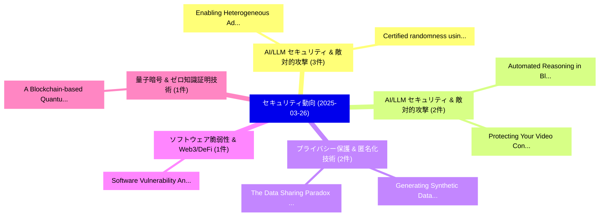

# 📅 02_daily: 日次エグゼクティブサマリー報告書 (2025-03-26)

**集計日時**: 2026-10-02 23:05:21 UTC  
**対象日付**: 2025-03-26  
**本日収集論文数**: 21 件  

---

## 💡 主要セキュリティ動向・脅威インサイト (Executive Insights)

本日の収集論文（計 21 件）において、以下の重点セキュリティ領域で活発な研究動向が確認されました：
- **AI/LLM セキュリティ & 敵対的攻撃** (3 件): 注目論文として 「Enabling Heterogeneous Adversa...」、「Certified randomness using a t...」 等が発表され、実務防御および攻撃検証の進展が見られます。
- **AI/LLM セキュリティ & 敵対的攻撃** (2 件): 注目論文として 「Automated Reasoning in Blockch...」、「Protecting Your Video Content:...」 等が発表され、実務防御および攻撃検証の進展が見られます。
- **プライバシー保護 & 匿名化技術** (2 件): 注目論文として 「Generating Synthetic Data with...」、「The Data Sharing Paradox of Sy...」 等が発表され、実務防御および攻撃検証の進展が見られます。
- **ソフトウェア脆弱性 & Web3/DeFi** (1 件): 注目論文として 「Software Vulnerability Analysi...」 等が発表され、実務防御および攻撃検証の進展が見られます。
- **量子暗号 & ゼロ知識証明技術** (1 件): 注目論文として 「A Blockchain-based Quantum Bin...」 等が発表され、実務防御および攻撃検証の進展が見られます。

### 🗺️ 技術・脅威トピックマインドマップ

---

## 📌 日次セキュリティ論文一覧 (日本語表形式)

| No | arXiv ID | 論文タイトル (日本語訳) | 重要キーワード | 構造化エグゼクティブ要約 (背景・提案・影響) | 脅威分類 | 詳細リンク |
|---|---|---|---|---|---|---|
| 1 | `2503.20244v1` | [Software Vulnerability Analysis Across Programming Language and Program Representation Landscapes: A Survey（セキュリティ分析論文）](../../okf/papers/2025-03-26/2503.20244.md) | `Program Representation Landscapes`, `Zhuoyun Qian`, `Fangtian Zhong` | 【提案】概要 (Overview & Key Finding) 本論文「Software 脆弱性 Analysis Across Programming Language and P...。実証評価により経営層・セキュリティ管理者向け推奨アクション (E... | `cs.CR` | [arXiv](https://arxiv.org/abs/2503.20244v1) &#124; [OKF](../../okf/papers/2025-03-26/2503.20244.md) |
| 2 | `2503.20247v1` | [A Blockchain-based Quantum Binary Voting for Decentralized IoT Industry 5.0に向けて](../../okf/papers/2025-03-26/2503.20247.md) | `Quantum Binary Voting`, `Blockchain-based Quantum`, `Towards Industry` | 【提案】概要 (Overview & Key Finding) 本論文「A Blockchain-based 量子 Binary Voting for Decentralized I...。実証評価により経営層・セキュリティ管理者向け推奨アクション (E... | `cs.CR` | [arXiv](https://arxiv.org/abs/2503.20247v1) &#124; [OKF](../../okf/papers/2025-03-26/2503.20247.md) |
| 3 | `2503.20257v2` | [How Secure is Forgetting? Linking Machine Unlearning to Machine Learning Attacks（セキュリティ分析論文）](../../okf/papers/2025-03-26/2503.20257.md) | `Linking Machine Unlearning`, `Machine Learning Attacks`, `Muhammed Shafi` | 【提案】Linking Machine Unlearning to Machine Learning Attacks ### (日本語題名: How Secure is Forget...。実証評価により経営層・セキュリティ管理者向け推奨アクション (E... | `cs.CR` | [arXiv](https://arxiv.org/abs/2503.20257v2) &#124; [OKF](../../okf/papers/2025-03-26/2503.20257.md) |
| 4 | `2503.20279v3` | [sudo rm -rf agentic_security（セキュリティ分析論文）](../../okf/papers/2025-03-26/2503.20279.md) | `Sejin Lee`, `Jian Kim`, `Haon Park` | 【提案】概要 (Overview & Key Finding) 本論文「sudo rm -rf agentic_security（セキュリティ分析論文）」（原題: sudo rm -...。実証評価により経営層・セキュリティ管理者向け推奨アクション (E... | `cs.CR` | [arXiv](https://arxiv.org/abs/2503.20279v3) &#124; [OKF](../../okf/papers/2025-03-26/2503.20279.md) |
| 5 | `2503.20281v1` | [Are We There Yet? Unraveling the State-of-the-Art Graph Network Intrusion Detection Systems（セキュリティ分析論文）](../../okf/papers/2025-03-26/2503.20281.md) | `Art Graph Network Intrusion Detection Systems`, `the-Art Graph`, `Wajih Ul Hassan` | 【提案】概要 (Overview & Key Finding) 本論文「Are We There Yet?。実証評価により経営層・セキュリティ管理者向け推奨アクション (Executive Recommendations) - 組織のセキュリティ設計およ... | `cs.CR` | [arXiv](https://arxiv.org/abs/2503.20281v1) &#124; [OKF](../../okf/papers/2025-03-26/2503.20281.md) |
| 6 | `2503.20310v1` | [Enabling Heterogeneous Adversarial Transferability via Feature Permutation Attacks（セキュリティ分析論文）](../../okf/papers/2025-03-26/2503.20310.md) | `Enabling Heterogeneous Adversarial Transferability`, `Feature Permutation Attacks`, `Tao Wu` | 【提案】概要 (Overview & Key Finding) 本論文「Enabling Heterogeneous Adversarial Transferability via ...。実証評価により経営層・セキュリティ管理者向け推奨アクション (E... | `cs.CR` | [arXiv](https://arxiv.org/abs/2503.20310v1) &#124; [OKF](../../okf/papers/2025-03-26/2503.20310.md) |
| 7 | `2503.20364v1` | [UnReference: the effect of spoofing on RTK reference stations for connected roversの分析](../../okf/papers/2025-03-26/2503.20364.md) | `Marco Spanghero`, `Panos Papadimitratos`, `Raw Meta` | 【提案】概要 (Overview & Key Finding) 本論文「UnReference: the effect of spoofing on RTK reference st...。実証評価により経営層・セキュリティ管理者向け推奨アクション (E... | `cs.CR` | [arXiv](https://arxiv.org/abs/2503.20364v1) &#124; [OKF](../../okf/papers/2025-03-26/2503.20364.md) |
| 8 | `2503.20365v1` | [Power Networks SCADA Communication サイバーセキュリティ, A Qiskit Implementation](../../okf/papers/2025-03-26/2503.20365.md) | `Power Networks`, `Qiskit Implementation`, `Communication Cybersecurity` | 【提案】概要 (Overview & Key Finding) 本論文「Power Networks SCADA Communication サイバーセキュリティ, A Qiskit...。実証評価により経営層・セキュリティ管理者向け推奨アクション (E... | `cs.CR` | [arXiv](https://arxiv.org/abs/2503.20365v1) &#124; [OKF](../../okf/papers/2025-03-26/2503.20365.md) |
| 9 | `2503.20461v2` | [Automated Reasoning in Blockchain: Foundations, Applications, and Frontiers（セキュリティ分析論文）](../../okf/papers/2025-03-26/2503.20461.md) | `Automated Reasoning`, `Hojer Key`, `Raw Meta` | 【提案】概要 (Overview & Key Finding) 本論文「Automated Reasoning in Blockchain: Foundations, Applica...。実証評価により経営層・セキュリティ管理者向け推奨アクション (E... | `cs.CR` | [arXiv](https://arxiv.org/abs/2503.20461v2) &#124; [OKF](../../okf/papers/2025-03-26/2503.20461.md) |
| 10 | `2503.20498v1` | [Certified randomness using a trapped-ion quantum processor（セキュリティ分析論文）](../../okf/papers/2025-03-26/2503.20498.md) | `trapped-ion quantum`, `Wen Yu Kon`, `Minzhao Liu` | 【提案】概要 (Overview & Key Finding) 本論文「Certified randomness using a trapped-ion 量子 processor（セ...。実証評価により経営層・セキュリティ管理者向け推奨アクション (E... | `cs.CR` | [arXiv](https://arxiv.org/abs/2503.20498v1) &#124; [OKF](../../okf/papers/2025-03-26/2503.20498.md) |
| 11 | `2503.20823v1` | [Playing the Fool: Jailbreaking LLMs and Multimodal LLMs with Out-of-Distribution Strategy（セキュリティ分析論文）](../../okf/papers/2025-03-26/2503.20823.md) | `Distribution Strategy`, `Joonhyun Jeong`, `Seyun Bae` | 【提案】概要 (Overview & Key Finding) 本論文「Playing the Fool: ジェイルブレイクing LLMs and Multimodal LLMs ...。実証評価により経営層・セキュリティ管理者向け推奨アクション (E... | `cs.CR` | [arXiv](https://arxiv.org/abs/2503.20823v1) &#124; [OKF](../../okf/papers/2025-03-26/2503.20823.md) |
| 12 | `2503.20831v1` | [Advancing Vulnerability Classification with BERT: A Multi-Objective Learning Model（セキュリティ分析論文）](../../okf/papers/2025-03-26/2503.20831.md) | `Advancing Vulnerability Classification`, `Objective Learning Model`, `Multi-Objective Learning` | 【提案】概要 (Overview & Key Finding) 本論文「Advancing 脆弱性 Classification with BERT: A Multi-Objecti...。実証評価により経営層・セキュリティ管理者向け推奨アクション (E... | `cs.CR` | [arXiv](https://arxiv.org/abs/2503.20831v1) &#124; [OKF](../../okf/papers/2025-03-26/2503.20831.md) |
| 13 | `2503.20846v1` | [Generating Synthetic Data with Formal Privacy Guarantees: State of the Art and the Road Ahead（セキュリティ分析論文）](../../okf/papers/2025-03-26/2503.20846.md) | `Generating Synthetic Data`, `Formal Privacy Guarantees`, `Road Ahead` | 【提案】概要 (Overview & Key Finding) 本論文「Generating Synthetic Data with Formal Privacy Guarantee...。実証評価により経営層・セキュリティ管理者向け推奨アクション (E... | `cs.CR` | [arXiv](https://arxiv.org/abs/2503.20846v1) &#124; [OKF](../../okf/papers/2025-03-26/2503.20846.md) |
| 14 | `2503.20847v1` | [The Data Sharing Paradox of Synthetic Data in Healthcare（セキュリティ分析論文）](../../okf/papers/2025-03-26/2503.20847.md) | `Synthetic Data`, `Hafiz Muhammad Waseem`, `Jim Achterberg` | 【提案】概要 (Overview & Key Finding) 本論文「The Data Sharing Paradox of Synthetic Data in Healthcar...。実証評価により経営層・セキュリティ管理者向け推奨アクション (E... | `cs.CR` | [arXiv](https://arxiv.org/abs/2503.20847v1) &#124; [OKF](../../okf/papers/2025-03-26/2503.20847.md) |
| 15 | `2503.20884v3` | [Byzantine-Robust 連合学習 Using Generative Adversarial Networks](../../okf/papers/2025-03-26/2503.20884.md) | `Robust Federated Learning Using Generative Adversarial Networks`, `Using Generative Adversarial Networks`, `Byzantine-Robust Federated` | 【提案】概要 (Overview & Key Finding) 本論文「Byzantine-Robust 連合学習 Using Generative Adversarial Netw...。実証評価によりTeixeira, Salman Toor - *... | `cs.CR` | [arXiv](https://arxiv.org/abs/2503.20884v3) &#124; [OKF](../../okf/papers/2025-03-26/2503.20884.md) |
| 16 | `2503.20932v2` | [Reflex: Faster Secure Collaborative Analytics via Controlled Intermediate Result Size Disclosure（セキュリティ分析論文）](../../okf/papers/2025-03-26/2503.20932.md) | `Faster Secure Collaborative Analytics`, `Long Gu`, `Shaza Zeitouni` | 【提案】概要 (Overview & Key Finding) 本論文「Reflex: Faster Secure Collaborative Analytics via Contr...。実証評価により経営層・セキュリティ管理者向け推奨アクション (E... | `cs.CR` | [arXiv](https://arxiv.org/abs/2503.20932v2) &#124; [OKF](../../okf/papers/2025-03-26/2503.20932.md) |
| 17 | `2503.20976v1` | [Generator Cost Coefficients Inference Attack via Exploitation of Locational Marginal Prices in Smart Grid（セキュリティ分析論文）](../../okf/papers/2025-03-26/2503.20976.md) | `Generator Cost Coefficients Inference Attack`, `Locational Marginal Prices`, `Smart Grid` | 【提案】概要 (Overview & Key Finding) 本論文「Generator Cost Coefficients Inference Attack via Exploi...。実証評価により経営層・セキュリティ管理者向け推奨アクション (E... | `cs.CR` | [arXiv](https://arxiv.org/abs/2503.20976v1) &#124; [OKF](../../okf/papers/2025-03-26/2503.20976.md) |
| 18 | `2503.20982v3` | [Permutation polynomials over finite fields from low-degree rational functions（セキュリティ分析論文）](../../okf/papers/2025-03-26/2503.20982.md) | `low-degree rational`, `Sartaj Ul Hasan`, `Kirpa Garg` | 【提案】概要 (Overview & Key Finding) 本論文「Permutation polynomials over finite fields from low-deg...。実証評価により経営層・セキュリティ管理者向け推奨アクション (E... | `cs.CR` | [arXiv](https://arxiv.org/abs/2503.20982v3) &#124; [OKF](../../okf/papers/2025-03-26/2503.20982.md) |
| 19 | `2503.21824v1` | [Protecting Your Video Content: Disrupting Automated Video-based LLM Annotations（セキュリティ分析論文）](../../okf/papers/2025-03-26/2503.21824.md) | `Disrupting Automated Video`, `Video-based LLM`, `Disrupting Automated Vi` | 【提案】概要 (Overview & Key Finding) 本論文「Protecting Your Video Content: Disrupting Automated Vid...。実証評価により経営層・セキュリティ管理者向け推奨アクション (E... | `cs.CR` | [arXiv](https://arxiv.org/abs/2503.21824v1) &#124; [OKF](../../okf/papers/2025-03-26/2503.21824.md) |
| 20 | `2503.22738v2` | [ShieldAgent: Shielding Agents via Verifiable Safety Policy Reasoning（セキュリティ分析論文）](../../okf/papers/2025-03-26/2503.22738.md) | `Verifiable Safety Policy Reasoning`, `Shielding Agents`, `Zhaorun Chen` | 【提案】概要 (Overview & Key Finding) 本論文「ShieldAgent: Shielding Agents via Verifiable Safety Pol...。実証評価により経営層・セキュリティ管理者向け推奨アクション (E... | `cs.CR` | [arXiv](https://arxiv.org/abs/2503.22738v2) &#124; [OKF](../../okf/papers/2025-03-26/2503.22738.md) |
| 21 | `2504.00012v2` | [I'm Sorry Dave: How the old world of personnel security can inform the new world of AI insider risk（セキュリティ分析論文）](../../okf/papers/2025-03-26/2504.00012.md) | `Sorry Dave`, `Paul Martin`, `Sarah Mercer` | 【提案】概要 (Overview & Key Finding) 本論文「I'm Sorry Dave: How the old world of personnel security...。実証評価により経営層・セキュリティ管理者向け推奨アクション (E... | `cs.CR` | [arXiv](https://arxiv.org/abs/2504.00012v2) &#124; [OKF](../../okf/papers/2025-03-26/2504.00012.md) |

