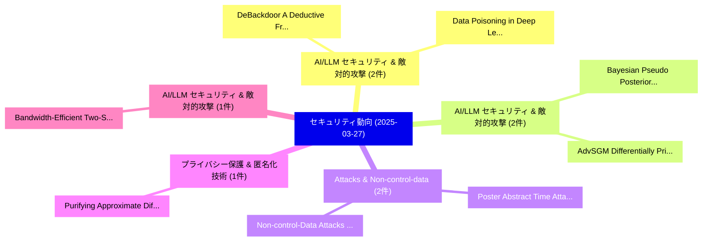

# 📅 02_daily: 日次エグゼクティブサマリー報告書 (2025-03-27)

**集計日時**: 2026-10-02 23:05:21 UTC  
**対象日付**: 2025-03-27  
**本日収集論文数**: 25 件  

---

## 💡 主要セキュリティ動向・脅威インサイト (Executive Insights)

本日の収集論文（計 25 件）において、以下の重点セキュリティ領域で活発な研究動向が確認されました：
- **AI/LLM セキュリティ & 敵対的攻撃** (2 件): 注目論文として 「DeBackdoor: A Deductive Framew...」、「Data Poisoning in Deep Learnin...」 等が発表され、実務防御および攻撃検証の進展が見られます。
- **AI/LLM セキュリティ & 敵対的攻撃** (2 件): 注目論文として 「AdvSGM: Differentially Private...」、「Bayesian Pseudo Posterior Mech...」 等が発表され、実務防御および攻撃検証の進展が見られます。
- **Attacks & Non-control-data** (2 件): 注目論文として 「Poster Abstract: Time Attacks ...」、「Non-control-Data Attacks and D...」 等が発表され、実務防御および攻撃検証の進展が見られます。
- **プライバシー保護 & 匿名化技術** (1 件): 注目論文として 「Purifying Approximate Differen...」 等が発表され、実務防御および攻撃検証の進展が見られます。
- **AI/LLM セキュリティ & 敵対的攻撃** (1 件): 注目論文として 「Bandwidth-Efficient Two-Server...」 等が発表され、実務防御および攻撃検証の進展が見られます。

### 🗺️ 技術・脅威トピックマインドマップ

---

## 📌 日次セキュリティ論文一覧 (日本語表形式)

| No | arXiv ID | 論文タイトル (日本語訳) | 重要キーワード | 構造化エグゼクティブ要約 (背景・提案・影響) | 脅威分類 | 詳細リンク |
|---|---|---|---|---|---|---|
| 1 | `2503.21071v2` | [Purifying Approximate Differential Privacy with Randomized Post-processing（セキュリティ分析論文）](../../okf/papers/2025-03-27/2503.21071.md) | `Purifying Approximate Differential Privacy`, `Randomized Post`, `Yingyu Lin` | 【提案】概要 (Overview & Key Finding) 本論文「Purifying Approximate 差分プライバシー with Randomized Post-pro...。実証評価により経営層・セキュリティ管理者向け推奨アクション (E... | `cs.CR` | [arXiv](https://arxiv.org/abs/2503.21071v2) &#124; [OKF](../../okf/papers/2025-03-27/2503.21071.md) |
| 2 | `2503.21126v2` | [Bandwidth-Efficient Two-Server ORAMs with O(1) Client Storage（セキュリティ分析論文）](../../okf/papers/2025-03-27/2503.21126.md) | `Efficient Two`, `Client Storage`, `Bandwidth-Efficient Two` | 【提案】概要 (Overview & Key Finding) 本論文「Bandwidth-Efficient Two-Server ORAMs with O(1) Client S...。実証評価により経営層・セキュリティ管理者向け推奨アクション (E... | `cs.CR` | [arXiv](https://arxiv.org/abs/2503.21126v2) &#124; [OKF](../../okf/papers/2025-03-27/2503.21126.md) |
| 3 | `2503.21145v1` | [How to Secure Existing C and C++ Software without Memory Safety（セキュリティ分析論文）](../../okf/papers/2025-03-27/2503.21145.md) | `Secure Existing`, `Memory Safety`, `Raw Meta` | 【提案】背景とセキュリティ上の課題 (Background & Problem) 本研究はサイバー脅威環境におけるセキュリティ構造・脆弱性の検証を目的としています。(主要検出項目: ...。実証評価により経営層・セキュリティ管理者向け推奨アクション (E... | `cs.CR` | [arXiv](https://arxiv.org/abs/2503.21145v1) &#124; [OKF](../../okf/papers/2025-03-27/2503.21145.md) |
| 4 | `2503.21279v3` | [Asynchronous BFT Consensus Made Wireless（セキュリティ分析論文）](../../okf/papers/2025-03-27/2503.21279.md) | `Consensus Made Wireless`, `Shuo Liu`, `Minghui Xu` | 【提案】概要 (Overview & Key Finding) 本論文「Asynchronous BFT Consensus Made Wireless（セキュリティ分析論文）」（原...。実証評価により経営層・セキュリティ管理者向け推奨アクション (E... | `cs.CR` | [arXiv](https://arxiv.org/abs/2503.21279v3) &#124; [OKF](../../okf/papers/2025-03-27/2503.21279.md) |
| 5 | `2503.21305v1` | [DeBackdoor: A Deductive Framework for Detecting Backdoor Attacks on Deep Models with Limited Data（セキュリティ分析論文）](../../okf/papers/2025-03-27/2503.21305.md) | `Detecting Backdoor Attacks`, `Deep Models`, `Limited Data` | 【提案】概要 (Overview & Key Finding) 本論文「DeBackdoor: A Deductive Framework for Detecting Backdoo...。実証評価により経営層・セキュリティ管理者向け推奨アクション (E... | `cs.CR` | [arXiv](https://arxiv.org/abs/2503.21305v1) &#124; [OKF](../../okf/papers/2025-03-27/2503.21305.md) |
| 6 | `2503.21315v1` | [Tricking Retrievers with Influential Tokens: An Efficient Black-Box Corpus Poisoning Attack（セキュリティ分析論文）](../../okf/papers/2025-03-27/2503.21315.md) | `Box Corpus Poisoning Attack`, `Tricking Retrievers`, `Influential Tokens` | 【提案】概要 (Overview & Key Finding) 本論文「Tricking Retrievers with Influential Tokens: An Efficie...。実証評価により経営層・セキュリティ管理者向け推奨アクション (E... | `cs.CR` | [arXiv](https://arxiv.org/abs/2503.21315v1) &#124; [OKF](../../okf/papers/2025-03-27/2503.21315.md) |
| 7 | `2503.21400v2` | [Lattice Based Crypto breaks in a Superposition of Spacetimes（セキュリティ分析論文）](../../okf/papers/2025-03-27/2503.21400.md) | `Lattice Based Crypto`, `Divesh Aggarwal`, `Shashwat Agrawal` | 【提案】概要 (Overview & Key Finding) 本論文「Lattice Based Crypto breaks in a Superposition of Space...。実証評価により経営層・セキュリティ管理者向け推奨アクション (E... | `cs.CR` | [arXiv](https://arxiv.org/abs/2503.21400v2) &#124; [OKF](../../okf/papers/2025-03-27/2503.21400.md) |
| 8 | `2503.21426v1` | [AdvSGM: Differentially Private Graph Learning via Adversarial Skip-gram Model（セキュリティ分析論文）](../../okf/papers/2025-03-27/2503.21426.md) | `Differentially Private Graph Learning`, `Adversarial Skip`, `Skip-gram Model` | 【提案】概要 (Overview & Key Finding) 本論文「AdvSGM: Differentially Private Graph Learning via Adver...。実証評価により経営層・セキュリティ管理者向け推奨アクション (E... | `cs.CR` | [arXiv](https://arxiv.org/abs/2503.21426v1) &#124; [OKF](../../okf/papers/2025-03-27/2503.21426.md) |
| 9 | `2503.21440v1` | [On the Maiorana-McFarland Class Extensions（セキュリティ分析論文）](../../okf/papers/2025-03-27/2503.21440.md) | `Class Extensions`, `Maiorana-McFarland Class`, `Nikolay Kolomeec` | 【提案】概要 (Overview & Key Finding) 本論文「On the Maiorana-McFarland Class Extensions（セキュリティ分析論文）」...。実証評価により経営層・セキュリティ管理者向け推奨アクション (E... | `cs.CR` | [arXiv](https://arxiv.org/abs/2503.21440v1) &#124; [OKF](../../okf/papers/2025-03-27/2503.21440.md) |
| 10 | `2503.21463v1` | [Unveiling Latent Information in Transaction Hashes: Hypergraph Learning for Ethereum Ponzi Scheme Detection（セキュリティ分析論文）](../../okf/papers/2025-03-27/2503.21463.md) | `Ethereum Ponzi Scheme Detection`, `Unveiling Latent Information`, `Transaction Hashes` | 【提案】概要 (Overview & Key Finding) 本論文「Unveiling Latent Information in Transaction Hashes: Hyp...。実証評価により経営層・セキュリティ管理者向け推奨アクション (E... | `cs.CR` | [arXiv](https://arxiv.org/abs/2503.21463v1) &#124; [OKF](../../okf/papers/2025-03-27/2503.21463.md) |
| 11 | `2503.21496v1` | [Advancing CAN Network Security through RBM-Based Synthetic Attack Data Generation for Intrusion Detection Systems（セキュリティ分析論文）](../../okf/papers/2025-03-27/2503.21496.md) | `Based Synthetic Attack Data Generation`, `Intrusion Detection Systems`, `Network Security` | 【提案】概要 (Overview & Key Finding) 本論文「Advancing CAN Network Security through RBM-Based Synthe...。実証評価により経営層・セキュリティ管理者向け推奨アクション (E... | `cs.CR` | [arXiv](https://arxiv.org/abs/2503.21496v1) &#124; [OKF](../../okf/papers/2025-03-27/2503.21496.md) |
| 12 | `2503.21528v1` | [Bayesian Pseudo Posterior Mechanism for Differentially Private Machine Learning（セキュリティ分析論文）](../../okf/papers/2025-03-27/2503.21528.md) | `Bayesian Pseudo Posterior Mechanism`, `Differentially Private Machine Learning`, `Bayesian Pseudo Poster` | 【提案】概要 (Overview & Key Finding) 本論文「Bayesian Pseudo Posterior Mechanism for Differentially ...。実証評価により経営層・セキュリティ管理者向け推奨アクション (E... | `cs.CR` | [arXiv](https://arxiv.org/abs/2503.21528v1) &#124; [OKF](../../okf/papers/2025-03-27/2503.21528.md) |
| 13 | `2503.21535v2` | [Computing Isomorphisms between Products of Supersingular Elliptic Curves（セキュリティ分析論文）](../../okf/papers/2025-03-27/2503.21535.md) | `Supersingular Elliptic Curves`, `Computing Isomorphisms`, `Pierrick Gaudry` | 【提案】概要 (Overview & Key Finding) 本論文「Computing Isomorphisms between Products of Supersingula...。実証評価により経営層・セキュリティ管理者向け推奨アクション (E... | `cs.CR` | [arXiv](https://arxiv.org/abs/2503.21535v2) &#124; [OKF](../../okf/papers/2025-03-27/2503.21535.md) |
| 14 | `2503.21598v1` | [Prompt, Divide, and Conquer: Bypassing Large Language Model Safety Filters via Segmented and Distributed Prompt Processing（セキュリティ分析論文）](../../okf/papers/2025-03-27/2503.21598.md) | `Bypassing Large Language Model Safety Filters`, `Distributed Prompt Processing`, `Ahmed Hussain` | 【提案】概要 (Overview & Key Finding) 本論文「Prompt, Divide, and Conquer: Bypassing Large Language M...。実証評価により経営層・セキュリティ管理者向け推奨アクション (E... | `cs.CR` | [arXiv](https://arxiv.org/abs/2503.21598v1) &#124; [OKF](../../okf/papers/2025-03-27/2503.21598.md) |
| 15 | `2503.21674v1` | [Intelligent IoT Attack Detection Design via ODLLM with Feature Ranking-based Knowledge Base（セキュリティ分析論文）](../../okf/papers/2025-03-27/2503.21674.md) | `Attack Detection Design`, `Feature Ranking`, `Knowledge Base` | 【提案】概要 (Overview & Key Finding) 本論文「Intelligent IoT Attack Detection Design via ODLLM with ...。実証評価により経営層・セキュリティ管理者向け推奨アクション (E... | `cs.CR` | [arXiv](https://arxiv.org/abs/2503.21674v1) &#124; [OKF](../../okf/papers/2025-03-27/2503.21674.md) |
| 16 | `2503.21705v1` | [SoK: Reproducibility for Software Packages in Scripting Language Ecosystemsに向けて](../../okf/papers/2025-03-27/2503.21705.md) | `Software Packages`, `Scripting Language Ecosystems`, `Towards Reproducibility` | 【提案】概要 (Overview & Key Finding) 本論文「SoK: Reproducibility for Software Packages in Scripting...。実証評価により経営層・セキュリティ管理者向け推奨アクション (E... | `cs.CR` | [arXiv](https://arxiv.org/abs/2503.21705v1) &#124; [OKF](../../okf/papers/2025-03-27/2503.21705.md) |
| 17 | `2503.21891v1` | [Poster Abstract: Time Attacks using Kernel Vulnerabilities（セキュリティ分析論文）](../../okf/papers/2025-03-27/2503.21891.md) | `Poster Abstract`, `Time Attacks`, `Kernel Vulnerabilities` | 【提案】概要 (Overview & Key Finding) 本論文「Poster Abstract: Time Attacks using Kernel Vulnerabilit...。実証評価により経営層・セキュリティ管理者向け推奨アクション (E... | `cs.CR` | [arXiv](https://arxiv.org/abs/2503.21891v1) &#124; [OKF](../../okf/papers/2025-03-27/2503.21891.md) |
| 18 | `2503.22010v1` | [Privacy-Preserving Revocation of Verifiable Credentials with Time-Flexibilityに向けて](../../okf/papers/2025-03-27/2503.22010.md) | `Preserving Revocation`, `Verifiable Credentials`, `Privacy-Preserving Revocation` | 【提案】概要 (Overview & Key Finding) 本論文「Privacy-Preserving Revocation of Verifiable Credentials...。実証評価により経営層・セキュリティ管理者向け推奨アクション (E... | `cs.CR` | [arXiv](https://arxiv.org/abs/2503.22010v1) &#124; [OKF](../../okf/papers/2025-03-27/2503.22010.md) |
| 19 | `2503.22016v2` | [Information Theoretic One-Time Programs from Geometrically Local $	ext{QNC}_0$ Adversaries（セキュリティ分析論文）](../../okf/papers/2025-03-27/2503.22016.md) | `Information Theoretic One`, `Time Programs`, `Geometrically Local` | 【提案】概要 (Overview & Key Finding) 本論文「Information Theoretic One-Time Programs from Geometrica...。実証評価により経営層・セキュリティ管理者向け推奨アクション (E... | `cs.CR` | [arXiv](https://arxiv.org/abs/2503.22016v2) &#124; [OKF](../../okf/papers/2025-03-27/2503.22016.md) |
| 20 | `2503.22755v2` | [Reasoning Under Threat: Symbolic and Neural Techniques for サイバーセキュリティ Verification](../../okf/papers/2025-03-27/2503.22755.md) | `Neural Techniques`, `Cybersecurity Verification`, `Sarah Veronica` | 【提案】概要 (Overview & Key Finding) 本論文「Reasoning Under 脅威: Symbolic and Neural Techniques for ...。実証評価により経営層・セキュリティ管理者向け推奨アクション (E... | `cs.CR` | [arXiv](https://arxiv.org/abs/2503.22755v2) &#124; [OKF](../../okf/papers/2025-03-27/2503.22755.md) |
| 21 | `2503.22759v1` | [Data Poisoning in Deep Learning: A Survey（セキュリティ分析論文）](../../okf/papers/2025-03-27/2503.22759.md) | `Data Poisoning`, `Deep Learning`, `Pinlong Zhao` | 【提案】概要 (Overview & Key Finding) 本論文「Data Poisoning in Deep Learning: A Survey（セキュリティ分析論文）」（...。実証評価により経営層・セキュリティ管理者向け推奨アクション (E... | `cs.CR` | [arXiv](https://arxiv.org/abs/2503.22759v1) &#124; [OKF](../../okf/papers/2025-03-27/2503.22759.md) |
| 22 | `2503.22760v1` | [Malicious and Unintentional Disclosure Risks in 大規模言語モデル for Code Generation](../../okf/papers/2025-03-27/2503.22760.md) | `Unintentional Disclosure Risks`, `Code Generation`, `Large Language Models` | 【提案】概要 (Overview & Key Finding) 本論文「Malicious and Unintentional Disclosure Risks in 大規模言語モデ...。実証評価により経営層・セキュリティ管理者向け推奨アクション (E... | `cs.CR` | [arXiv](https://arxiv.org/abs/2503.22760v1) &#124; [OKF](../../okf/papers/2025-03-27/2503.22760.md) |
| 23 | `2503.22765v1` | [Non-control-Data Attacks and Defenses: A review（セキュリティ分析論文）](../../okf/papers/2025-03-27/2503.22765.md) | `Data Attacks`, `Lei Chong`, `Raw Meta` | 【提案】概要 (Overview & Key Finding) 本論文「Non-control-Data Attacks and Defenses: A review（セキュリティ分...。実証評価により経営層・セキュリティ管理者向け推奨アクション (E... | `cs.CR` | [arXiv](https://arxiv.org/abs/2503.22765v1) &#124; [OKF](../../okf/papers/2025-03-27/2503.22765.md) |
| 24 | `2504.00018v1` | [SandboxEval: Securing Test Environment for Untrusted Codeに向けて](../../okf/papers/2025-03-27/2504.00018.md) | `Towards Securing Test Environment`, `Securing Test Environment`, `Untrusted Code` | 【提案】概要 (Overview & Key Finding) 本論文「SandboxEval: Securing Test Environment for Untrusted Co...。実証評価により経営層・セキュリティ管理者向け推奨アクション (E... | `cs.CR` | [arXiv](https://arxiv.org/abs/2504.00018v1) &#124; [OKF](../../okf/papers/2025-03-27/2504.00018.md) |
| 25 | `2504.08751v1` | [Research on the Design of a Short Video Recommendation System Based on Multimodal Information and Differential Privacy（セキュリティ分析論文）](../../okf/papers/2025-03-27/2504.08751.md) | `Short Video Recommendation System Based`, `Multimodal Information`, `Differential Privacy` | 【提案】概要 (Overview & Key Finding) 本論文「Research on the Design of a Short Video Recommendation ...。実証評価により経営層・セキュリティ管理者向け推奨アクション (E... | `cs.CR` | [arXiv](https://arxiv.org/abs/2504.08751v1) &#124; [OKF](../../okf/papers/2025-03-27/2504.08751.md) |

