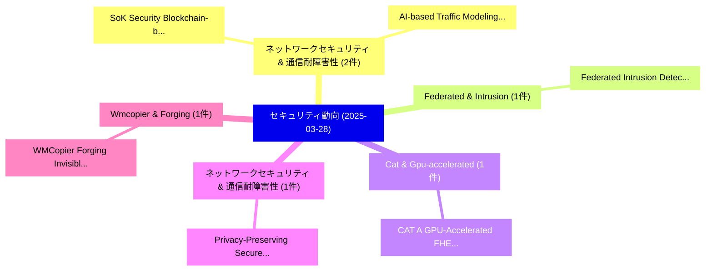

# 📅 02_daily: 日次エグゼクティブサマリー報告書 (2025-03-28)

**集計日時**: 2026-10-02 23:05:21 UTC  
**対象日付**: 2025-03-28  
**本日収集論文数**: 13 件  

---

## 💡 主要セキュリティ動向・脅威インサイト (Executive Insights)

本日の収集論文（計 13 件）において、以下の重点セキュリティ領域で活発な研究動向が確認されました：
- **ネットワークセキュリティ & 通信耐障害性** (2 件): 注目論文として 「SoK: Security Blockchain-based...」、「AI-based Traffic Modeling for ...」 等が発表され、実務防御および攻撃検証の進展が見られます。
- **Federated & Intrusion** (1 件): 注目論文として 「Federated Intrusion Detection ...」 等が発表され、実務防御および攻撃検証の進展が見られます。
- **Cat & Gpu-accelerated** (1 件): 注目論文として 「CAT: A GPU-Accelerated FHE Fra...」 等が発表され、実務防御および攻撃検証の進展が見られます。
- **ネットワークセキュリティ & 通信耐障害性** (1 件): 注目論文として 「Privacy-Preserving Secure Neig...」 等が発表され、実務防御および攻撃検証の進展が見られます。
- **Wmcopier & Forging** (1 件): 注目論文として 「WMCopier: Forging Invisible Im...」 等が発表され、実務防御および攻撃検証の進展が見られます。

### 🗺️ 技術・脅威トピックマインドマップ

---

## 📌 日次セキュリティ論文一覧 (日本語表形式)

| No | arXiv ID | 論文タイトル (日本語訳) | 重要キーワード | 構造化エグゼクティブ要約 (背景・提案・影響) | 脅威分類 | 詳細リンク |
|---|---|---|---|---|---|---|
| 1 | `2503.22065v1` | [Federated Intrusion Detection System Based on Unsupervised Machine Learning（セキュリティ分析論文）](../../okf/papers/2025-03-28/2503.22065.md) | `Federated Intrusion Detection System Based`, `Unsupervised Machine Learning`, `Rim Ben Salem` | 【提案】概要 (Overview & Key Finding) 本論文「Federated Intrusion Detection System Based on Unsupervi...。実証評価により経営層・セキュリティ管理者向け推奨アクション (E... | `cs.CR` | [arXiv](https://arxiv.org/abs/2503.22065v1) &#124; [OKF](../../okf/papers/2025-03-28/2503.22065.md) |
| 2 | `2503.22156v1` | [SoK: Security Blockchain-based Cryptocurrencyの分析](../../okf/papers/2025-03-28/2503.22156.md) | `Security Blockchain`, `Blockchain-based Cryptocurrency`, `Zekai Liu` | 【提案】概要 (Overview & Key Finding) 本論文「SoK: Security Blockchain-based Cryptocurrencyの分析」（原題: S...。実証評価により経営層・セキュリティ管理者向け推奨アクション (E... | `cs.CR` | [arXiv](https://arxiv.org/abs/2503.22156v1) &#124; [OKF](../../okf/papers/2025-03-28/2503.22156.md) |
| 3 | `2503.22161v4` | [AI-based Traffic Modeling for Network Security and Privacy: Challenges Ahead（セキュリティ分析論文）](../../okf/papers/2025-03-28/2503.22161.md) | `Traffic Modeling`, `Network Security`, `Challenges Ahead` | 【提案】概要 (Overview & Key Finding) 本論文「AI-based Traffic Modeling for Network Security and Priv...。実証評価により経営層・セキュリティ管理者向け推奨アクション (E... | `cs.CR` | [arXiv](https://arxiv.org/abs/2503.22161v4) &#124; [OKF](../../okf/papers/2025-03-28/2503.22161.md) |
| 4 | `2503.22227v1` | [CAT: A GPU-Accelerated FHE Framework with Its Application to High-Precision Private Dataset Query（セキュリティ分析論文）](../../okf/papers/2025-03-28/2503.22227.md) | `Precision Private Dataset Query`, `GPU-Accelerated FHE`, `High-Precision Private` | 【提案】概要 (Overview & Key Finding) 本論文「CAT: A GPU-Accelerated FHE Framework with Its Applicati...。実証評価により経営層・セキュリティ管理者向け推奨アクション (E... | `cs.CR` | [arXiv](https://arxiv.org/abs/2503.22227v1) &#124; [OKF](../../okf/papers/2025-03-28/2503.22227.md) |
| 5 | `2503.22232v2` | [Privacy-Preserving Secure Neighbor Discovery for Wireless Networks（セキュリティ分析論文）](../../okf/papers/2025-03-28/2503.22232.md) | `Preserving Secure Neighbor Discovery`, `Wireless Networks`, `Privacy-Preserving Secure` | 【提案】概要 (Overview & Key Finding) 本論文「Privacy-Preserving Secure Neighbor Discovery for Wirele...。実証評価により経営層・セキュリティ管理者向け推奨アクション (E... | `cs.CR` | [arXiv](https://arxiv.org/abs/2503.22232v2) &#124; [OKF](../../okf/papers/2025-03-28/2503.22232.md) |
| 6 | `2503.22330v3` | [WMCopier: Forging Invisible Image Watermarks on Arbitrary Images（セキュリティ分析論文）](../../okf/papers/2025-03-28/2503.22330.md) | `Forging Invisible Image Watermarks`, `Arbitrary Images`, `Ziping Dong` | 【提案】概要 (Overview & Key Finding) 本論文「WMCopier: Forging Invisible Image Watermarks on Arbitra...。実証評価により経営層・セキュリティ管理者向け推奨アクション (E... | `cs.CR` | [arXiv](https://arxiv.org/abs/2503.22330v3) &#124; [OKF](../../okf/papers/2025-03-28/2503.22330.md) |
| 7 | `2503.22379v1` | [Spend Your Budget Wisely: an Intelligent Distribution of the Privacy Budget in Differentially Private Text Rewritingに向けて](../../okf/papers/2025-03-28/2503.22379.md) | `Intelligent Distribution`, `Privacy Budget`, `Differentially Private Text Rewriting` | 【提案】概要 (Overview & Key Finding) 本論文「Spend Your Budget Wisely: an Intelligent Distribution o...。実証評価により経営層・セキュリティ管理者向け推奨アクション (E... | `cs.CR` | [arXiv](https://arxiv.org/abs/2503.22379v1) &#124; [OKF](../../okf/papers/2025-03-28/2503.22379.md) |
| 8 | `2503.22406v1` | [Training 大規模言語モデル for Advanced Typosquatting Detection](../../okf/papers/2025-03-28/2503.22406.md) | `Advanced Typosquatting Detection`, `Training Large Language Models`, `Jackson Welch` | 【提案】概要 (Overview & Key Finding) 本論文「Training 大規模言語モデル for Advanced Typosquatting Detection」...。実証評価により経営層・セキュリティ管理者向け推奨アクション (E... | `cs.CR` | [arXiv](https://arxiv.org/abs/2503.22406v1) &#124; [OKF](../../okf/papers/2025-03-28/2503.22406.md) |
| 9 | `2503.22413v2` | [Instance-Level Data-Use Auditing of Visual ML Models（セキュリティ分析論文）](../../okf/papers/2025-03-28/2503.22413.md) | `Level Data`, `Use Auditing`, `Instance-Level Data` | 【提案】概要 (Overview & Key Finding) 本論文「Instance-Level Data-Use Auditing of Visual ML Models（セキ...。実証評価によりReiter - **公開日時**: `2025-... | `cs.CR` | [arXiv](https://arxiv.org/abs/2503.22413v2) &#124; [OKF](../../okf/papers/2025-03-28/2503.22413.md) |
| 10 | `2503.22503v1` | [Cross-Technology Generalization in Synthesized Speech Detection: Evaluating AST Models with Modern Voice Generators（セキュリティ分析論文）](../../okf/papers/2025-03-28/2503.22503.md) | `Synthesized Speech Detection`, `Modern Voice Generators`, `Technology Generalization` | 【提案】概要 (Overview & Key Finding) 本論文「Cross-Technology Generalization in Synthesized Speech D...。実証評価により経営層・セキュリティ管理者向け推奨アクション (E... | `cs.CR` | [arXiv](https://arxiv.org/abs/2503.22503v1) &#124; [OKF](../../okf/papers/2025-03-28/2503.22503.md) |
| 11 | `2503.22573v1` | [A Framework for Cryptographic Verifiability of End-to-End AI Pipelines（セキュリティ分析論文）](../../okf/papers/2025-03-28/2503.22573.md) | `Cryptographic Verifiability`, `Kar Balan`, `Robert Learney` | 【提案】概要 (Overview & Key Finding) 本論文「A Framework for Cryptographic Verifiability of End-to-E...。実証評価により経営層・セキュリティ管理者向け推奨アクション (E... | `cs.CR` | [arXiv](https://arxiv.org/abs/2503.22573v1) &#124; [OKF](../../okf/papers/2025-03-28/2503.22573.md) |
| 12 | `2503.22612v1` | [Advancing DevSecOps in SMEs: Challenges and Best Practices for Secure CI/CD Pipelines（セキュリティ分析論文）](../../okf/papers/2025-03-28/2503.22612.md) | `Best Practices`, `Khandaker Mamun Ahmed`, `Jayaprakashreddy Cheenepalli` | 【提案】概要 (Overview & Key Finding) 本論文「Advancing DevSecOps in SMEs: Challenges and Best Practi...。実証評価により経営層・セキュリティ管理者向け推奨アクション (E... | `cs.CR` | [arXiv](https://arxiv.org/abs/2503.22612v1) &#124; [OKF](../../okf/papers/2025-03-28/2503.22612.md) |
| 13 | `2504.16091v1` | [Post-Quantum Homomorphic Encryption: A Case for Code-Based Alternatives（セキュリティ分析論文）](../../okf/papers/2025-03-28/2504.16091.md) | `Quantum Homomorphic Encryption`, `Based Alternatives`, `Post-Quantum Homomorphic` | 【提案】概要 (Overview & Key Finding) 本論文「Post-量子 準同型暗号: A Case for Code-Based Alternatives（セキュリテ...。実証評価により経営層・セキュリティ管理者向け推奨アクション (E... | `cs.CR` | [arXiv](https://arxiv.org/abs/2504.16091v1) &#124; [OKF](../../okf/papers/2025-03-28/2504.16091.md) |

