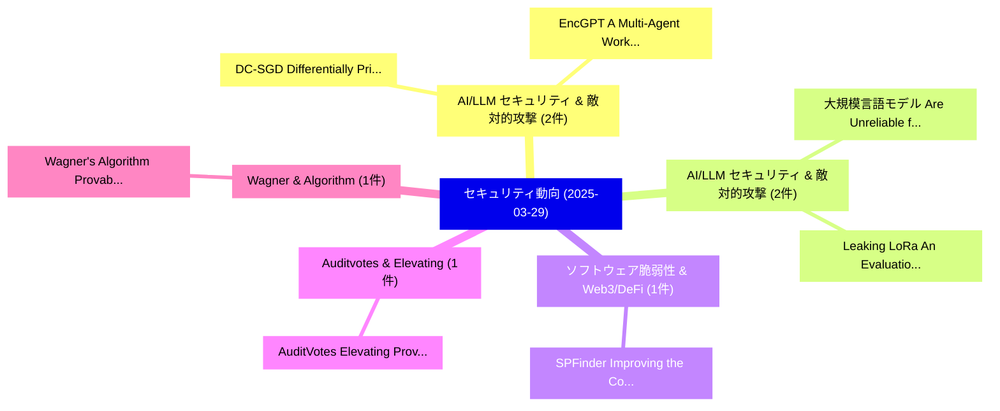

# 📅 02_daily: 日次エグゼクティブサマリー報告書 (2025-03-29)

**集計日時**: 2026-10-02 23:05:21 UTC  
**対象日付**: 2025-03-29  
**本日収集論文数**: 8 件  

---

## 💡 主要セキュリティ動向・脅威インサイト (Executive Insights)

本日の収集論文（計 8 件）において、以下の重点セキュリティ領域で活発な研究動向が確認されました：
- **AI/LLM セキュリティ & 敵対的攻撃** (2 件): 注目論文として 「DC-SGD: Differentially Private...」、「EncGPT: A Multi-Agent Workflow...」 等が発表され、実務防御および攻撃検証の進展が見られます。
- **AI/LLM セキュリティ & 敵対的攻撃** (2 件): 注目論文として 「大規模言語モデル Are Unreliable for Cy...」、「Leaking LoRa: An Evaluation of...」 等が発表され、実務防御および攻撃検証の進展が見られます。
- **ソフトウェア脆弱性 & Web3/DeFi** (1 件): 注目論文として 「SPFinder: Improving the Contex...」 等が発表され、実務防御および攻撃検証の進展が見られます。
- **Auditvotes & Elevating** (1 件): 注目論文として 「AuditVotes: Elevating Provable...」 等が発表され、実務防御および攻撃検証の進展が見られます。
- **Wagner & Algorithm** (1 件): 注目論文として 「Wagner's Algorithm Provably Ru...」 等が発表され、実務防御および攻撃検証の進展が見られます。

### 🗺️ 技術・脅威トピックマインドマップ

---

## 📌 日次セキュリティ論文一覧 (日本語表形式)

| No | arXiv ID | 論文タイトル (日本語訳) | 重要キーワード | 構造化エグゼクティブ要約 (背景・提案・影響) | 脅威分類 | 詳細リンク |
|---|---|---|---|---|---|---|
| 1 | `2503.22935v4` | [SPFinder: Improving the Context Length and Scalability for Tracing Known Vulnerability Patches（セキュリティ分析論文）](../../okf/papers/2025-03-29/2503.22935.md) | `Tracing Known Vulnerability Patches`, `Context Length`, `Tracing Known Vulnerability` | 【提案】概要 (Overview & Key Finding) 本論文「SPFinder: Improving the Context Length and Scalability ...。実証評価により経営層・セキュリティ管理者向け推奨アクション (E... | `cs.CR` | [arXiv](https://arxiv.org/abs/2503.22935v4) &#124; [OKF](../../okf/papers/2025-03-29/2503.22935.md) |
| 2 | `2503.22988v2` | [DC-SGD: Differentially Private SGD with Dynamic Clipping through Gradient Norm Distribution Estimation（セキュリティ分析論文）](../../okf/papers/2025-03-29/2503.22988.md) | `Gradient Norm Distribution Estimation`, `Differentially Private`, `Dynamic Clipping` | 【提案】概要 (Overview & Key Finding) 本論文「DC-SGD: Differentially Private SGD with Dynamic Clippin...。実証評価により経営層・セキュリティ管理者向け推奨アクション (E... | `cs.CR` | [arXiv](https://arxiv.org/abs/2503.22988v2) &#124; [OKF](../../okf/papers/2025-03-29/2503.22988.md) |
| 3 | `2503.22998v3` | [AuditVotes: Elevating Provable Defense for GNNs with Efficient Augmentation and Conditional Smoothing（セキュリティ分析論文）](../../okf/papers/2025-03-29/2503.22998.md) | `Elevating Provable Defense`, `Efficient Augmentation`, `Conditional Smoothing` | 【提案】概要 (Overview & Key Finding) 本論文「AuditVotes: Elevating Provable Defense for GNNs with Ef...。実証評価により経営層・セキュリティ管理者向け推奨アクション (E... | `cs.CR` | [arXiv](https://arxiv.org/abs/2503.22998v3) &#124; [OKF](../../okf/papers/2025-03-29/2503.22998.md) |
| 4 | `2503.23138v1` | [EncGPT: A Multi-Agent Workflow for Dynamic Encryption Algorithms（セキュリティ分析論文）](../../okf/papers/2025-03-29/2503.23138.md) | `Dynamic Encryption Algorithms`, `Agent Workflow`, `Multi-Agent Workflow` | 【提案】概要 (Overview & Key Finding) 本論文「EncGPT: A Multi-Agent Workflow for Dynamic Encryption A...。実証評価により経営層・セキュリティ管理者向け推奨アクション (E... | `cs.CR` | [arXiv](https://arxiv.org/abs/2503.23138v1) &#124; [OKF](../../okf/papers/2025-03-29/2503.23138.md) |
| 5 | `2503.23175v4` | [大規模言語モデル Are Unreliable for Cyber Threat Intelligence](../../okf/papers/2025-03-29/2503.23175.md) | `Cyber Threat Intelligence`, `Emanuele Mezzi`, `Fabio Massacci` | 【提案】概要 (Overview & Key Finding) 本論文「大規模言語モデル Are Unreliable for Cyber 脅威 Intelligence」（原題: ...。実証評価により経営層・セキュリティ管理者向け推奨アクション (E... | `cs.CR` | [arXiv](https://arxiv.org/abs/2503.23175v4) &#124; [OKF](../../okf/papers/2025-03-29/2503.23175.md) |
| 6 | `2503.23238v1` | [Wagner's Algorithm Provably Runs in Subexponential Time for SIS$^\infty$（セキュリティ分析論文）](../../okf/papers/2025-03-29/2503.23238.md) | `Algorithm Provably Runs`, `Subexponential Time`, `Lynn Engelberts` | 【提案】概要 (Overview & Key Finding) 本論文「Wagner's Algorithm Provably Runs in Subexponential Time...。実証評価により経営層・セキュリティ管理者向け推奨アクション (E... | `cs.CR` | [arXiv](https://arxiv.org/abs/2503.23238v1) &#124; [OKF](../../okf/papers/2025-03-29/2503.23238.md) |
| 7 | `2503.23250v1` | [Encrypted Prompt: LLM Applications Against Unauthorized Actionsのセキュリティ強化](../../okf/papers/2025-03-29/2503.23250.md) | `Encrypted Prompt`, `Han Chan`, `Raw Meta` | 【提案】概要 (Overview & Key Finding) 本論文「Encrypted Prompt: LLM Applications Against Unauthorized...。実証評価により経営層・セキュリティ管理者向け推奨アクション (E... | `cs.CR` | [arXiv](https://arxiv.org/abs/2503.23250v1) &#124; [OKF](../../okf/papers/2025-03-29/2503.23250.md) |
| 8 | `2504.00031v1` | [Leaking LoRa: An Evaluation of Password Leaks and Knowledge Storage in 大規模言語モデル](../../okf/papers/2025-03-29/2504.00031.md) | `Password Leaks`, `Knowledge Storage`, `Large Language Models` | 【提案】概要 (Overview & Key Finding) 本論文「Leaking LoRa: An Evaluation of Password Leaks and Knowl...。実証評価により経営層・セキュリティ管理者向け推奨アクション (E... | `cs.CR` | [arXiv](https://arxiv.org/abs/2504.00031v1) &#124; [OKF](../../okf/papers/2025-03-29/2504.00031.md) |

