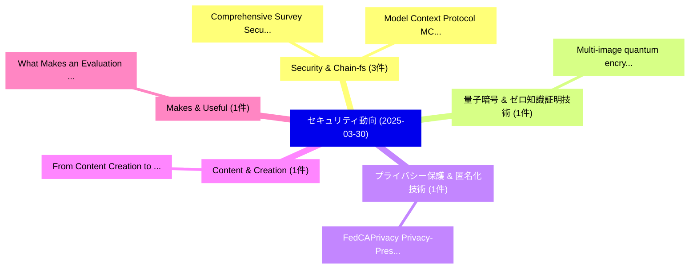

# 📅 02_daily: 日次エグゼクティブサマリー報告書 (2025-03-30)

**集計日時**: 2026-10-02 23:05:21 UTC  
**対象日付**: 2025-03-30  
**本日収集論文数**: 13 件  

---

## 💡 主要セキュリティ動向・脅威インサイト (Executive Insights)

本日の収集論文（計 13 件）において、以下の重点セキュリティ領域で活発な研究動向が確認されました：
- **Security & Chain-fs** (3 件): 注目論文として 「Comprehensive Survey Security ...」、「Model Context Protocol (MCP): ...」 等が発表され、実務防御および攻撃検証の進展が見られます。
- **量子暗号 & ゼロ知識証明技術** (1 件): 注目論文として 「Multi-image quantum encryption...」 等が発表され、実務防御および攻撃検証の進展が見られます。
- **プライバシー保護 & 匿名化技術** (1 件): 注目論文として 「FedCAPrivacy: Privacy-Preservi...」 等が発表され、実務防御および攻撃検証の進展が見られます。
- **Content & Creation** (1 件): 注目論文として 「From Content Creation to Citat...」 等が発表され、実務防御および攻撃検証の進展が見られます。
- **Makes & Useful** (1 件): 注目論文として 「What Makes an Evaluation Usefu...」 等が発表され、実務防御および攻撃検証の進展が見られます。

### 🗺️ 技術・脅威トピックマインドマップ

---

## 📌 日次セキュリティ論文一覧 (日本語表形式)

| No | arXiv ID | 論文タイトル (日本語訳) | 重要キーワード | 構造化エグゼクティブ要約 (背景・提案・影響) | 脅威分類 | 詳細リンク |
|---|---|---|---|---|---|---|
| 1 | `2503.23268v2` | [Multi-image quantum encryption scheme using blocks of bit planes and images（セキュリティ分析論文）](../../okf/papers/2025-03-30/2503.23268.md) | `Multi-image quantum`, `Claire Levaillant`, `Raw Meta` | 【提案】概要 (Overview & Key Finding) 本論文「Multi-image 量子 encryption scheme using blocks of bit pl...。実証評価により経営層・セキュリティ管理者向け推奨アクション (E... | `cs.CR` | [arXiv](https://arxiv.org/abs/2503.23268v2) &#124; [OKF](../../okf/papers/2025-03-30/2503.23268.md) |
| 2 | `2503.23277v1` | [Comprehensive Survey Security Authentication Methods for Satellite Communication Systemsに向けて](../../okf/papers/2025-03-30/2503.23277.md) | `Comprehensive Survey Security Authentication Methods`, `Security Authentication Methods`, `Satellite Communication Systems` | 【提案】概要 (Overview & Key Finding) 本論文「Comprehensive Survey Security Authentication Methods fo...。実証評価により経営層・セキュリティ管理者向け推奨アクション (E... | `cs.CR` | [arXiv](https://arxiv.org/abs/2503.23277v1) &#124; [OKF](../../okf/papers/2025-03-30/2503.23277.md) |
| 3 | `2503.23278v3` | [Model Context Protocol (MCP): Landscape, Security Threats, and Future Research Directions（セキュリティ分析論文）](../../okf/papers/2025-03-30/2503.23278.md) | `Model Context Protocol`, `Future Research Directions`, `Security Threats` | 【提案】概要 (Overview & Key Finding) 本論文「Model Context Protocol (MCP): Landscape, Security Threa...。実証評価により経営層・セキュリティ管理者向け推奨アクション (E... | `cs.CR` | [arXiv](https://arxiv.org/abs/2503.23278v3) &#124; [OKF](../../okf/papers/2025-03-30/2503.23278.md) |
| 4 | `2503.23292v1` | [FedCAPrivacy: Privacy-Preserving Heterogeneous 連合学習 with Anonymous Adaptive Clustering](../../okf/papers/2025-03-30/2503.23292.md) | `Anonymous Adaptive Clustering`, `Privacy-Preserving Heterogeneous`, `Preserving Heterogeneous Federated Learning` | 【提案】概要 (Overview & Key Finding) 本論文「FedCAPrivacy: Privacy-Preserving Heterogeneous 連合学習 wit...。実証評価により経営層・セキュリティ管理者向け推奨アクション (E... | `cs.CR` | [arXiv](https://arxiv.org/abs/2503.23292v1) &#124; [OKF](../../okf/papers/2025-03-30/2503.23292.md) |
| 5 | `2503.23414v1` | [From Content Creation to Citation Inflation: A GenAI Case Study（セキュリティ分析論文）](../../okf/papers/2025-03-30/2503.23414.md) | `Citation Inflation`, `Raw Meta`, `Executive Summary` | 【提案】概要 (Overview & Key Finding) 本論文「From Content Creation to Citation Inflation: A GenAI Ca...。実証評価によりMitchell - **公開日時**: `202... | `cs.CR` | [arXiv](https://arxiv.org/abs/2503.23414v1) &#124; [OKF](../../okf/papers/2025-03-30/2503.23414.md) |
| 6 | `2503.23424v1` | [What Makes an Evaluation Useful? Common Pitfalls and Best Practices（セキュリティ分析論文）](../../okf/papers/2025-03-30/2503.23424.md) | `Common Pitfalls`, `Best Practices`, `Gil Gekker` | 【提案】Common Pitfalls and Best Practices ### (日本語題名: What Makes an Evaluation Useful?。実証評価により経営層・セキュリティ管理者向け推奨アクション (Executive Re... | `cs.CR` | [arXiv](https://arxiv.org/abs/2503.23424v1) &#124; [OKF](../../okf/papers/2025-03-30/2503.23424.md) |
| 7 | `2503.23444v1` | [The Processing goes far beyond "the app" -- Privacy issues of decentralized Digital Contact Tracing using the example of the German Corona-Warn-App (CWA)（セキュリティ分析論文）](../../okf/papers/2025-03-30/2503.23444.md) | `Digital Contact Tracing`, `German Corona`, `Rainer Rehak` | 【提案】概要 (Overview & Key Finding) 本論文「The Processing goes far beyond "the app" -- Privacy iss...。実証評価により経営層・セキュリティ管理者向け推奨アクション (E... | `cs.CR` | [arXiv](https://arxiv.org/abs/2503.23444v1) &#124; [OKF](../../okf/papers/2025-03-30/2503.23444.md) |
| 8 | `2503.23510v1` | [Demystifying Private Transactions and Their Impact in PoW and PoS Ethereum（セキュリティ分析論文）](../../okf/papers/2025-03-30/2503.23510.md) | `Demystifying Private Transactions`, `Xingyu Lyu`, `Mengya Zhang` | 【提案】概要 (Overview & Key Finding) 本論文「Demystifying Private Transactions and Their Impact in P...。実証評価により経営層・セキュリティ管理者向け推奨アクション (E... | `cs.CR` | [arXiv](https://arxiv.org/abs/2503.23510v1) &#124; [OKF](../../okf/papers/2025-03-30/2503.23510.md) |
| 9 | `2503.23511v1` | [Buffer is All You Need: Defending 連合学習 against Backdoor Attacks under Non-iids via Buffering](../../okf/papers/2025-03-30/2503.23511.md) | `Backdoor Attacks`, `Non-iids via`, `Defending Federated Learning` | 【提案】概要 (Overview & Key Finding) 本論文「Buffer is All You Need: Defending 連合学習 against Backdoor...。実証評価により経営層・セキュリティ管理者向け推奨アクション (E... | `cs.CR` | [arXiv](https://arxiv.org/abs/2503.23511v1) &#124; [OKF](../../okf/papers/2025-03-30/2503.23511.md) |
| 10 | `2503.23533v1` | [To See or Not to See: A Privacy Threat Model for Digital Forensics in Crime Investigation（セキュリティ分析論文）](../../okf/papers/2025-03-30/2503.23533.md) | `Privacy Threat Model`, `Digital Forensics`, `Crime Investigation` | 【提案】背景とセキュリティ上の課題 (Background & Problem) 本研究はサイバー脅威環境におけるセキュリティ構造・脆弱性の検証を目的としています。(主要検出項目: ...。実証評価により経営層・セキュリティ管理者向け推奨アクション (E... | `cs.CR` | [arXiv](https://arxiv.org/abs/2503.23533v1) &#124; [OKF](../../okf/papers/2025-03-30/2503.23533.md) |
| 11 | `2503.23627v1` | [Security Chain-FS serviceの分析](../../okf/papers/2025-03-30/2503.23627.md) | `Security Chain`, `Chain-FS service`, `Vanessa Teague` | 【提案】概要 (Overview & Key Finding) 本論文「Security Chain-FS serviceの分析」（原題: Security Analysis of ...。実証評価により経営層・セキュリティ管理者向け推奨アクション (E... | `cs.CR` | [arXiv](https://arxiv.org/abs/2503.23627v1) &#124; [OKF](../../okf/papers/2025-03-30/2503.23627.md) |
| 12 | `2504.00035v4` | [Protecting Creative Writing Copyright against AI Imitation via Implicit Watermarking（セキュリティ分析論文）](../../okf/papers/2025-03-30/2504.00035.md) | `Protecting Creative Writing Copyright`, `Implicit Watermarking`, `Ziwei Zhang` | 【提案】概要 (Overview & Key Finding) 本論文「Protecting Creative Writing Copyright against AI Imitat...。実証評価により経営層・セキュリティ管理者向け推奨アクション (E... | `cs.CR` | [arXiv](https://arxiv.org/abs/2504.00035v4) &#124; [OKF](../../okf/papers/2025-03-30/2504.00035.md) |
| 13 | `2504.00041v2` | [Imbalanced malware classification: an approach based on dynamic classifier selection（セキュリティ分析論文）](../../okf/papers/2025-03-30/2504.00041.md) | `Raw Meta`, `Executive Summary`, `Key Finding` | 【提案】概要 (Overview & Key Finding) 本論文「Imbalanced マルウェア classification: an approach based on d...。実証評価により経営層・セキュリティ管理者向け推奨アクション (E... | `cs.CR` | [arXiv](https://arxiv.org/abs/2504.00041v2) &#124; [OKF](../../okf/papers/2025-03-30/2504.00041.md) |

